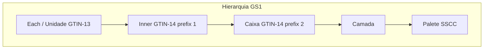
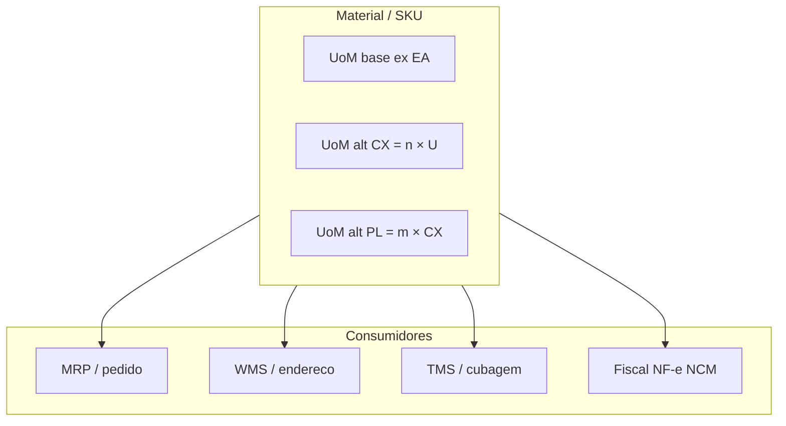
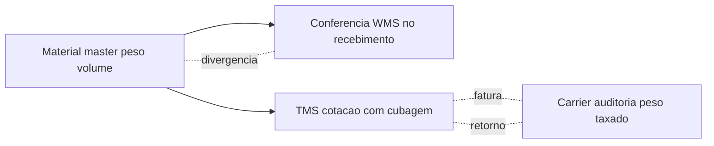

# Material, unidade, conversão e embalagem — onde o cubo mata o orçamento

O **material** (SKU) não é só descrição comercial: é um **pacote de decisões** que viaja por compras, estoque, armazém, transporte e fiscalidade. Ele carrega **UoM** base, **hierarquia** de embalagem (unidade → caixa → camada → palete), **peso**, **volume**, classes fiscais (NCM/CEST no Brasil), e frequentemente regras de **lote**, **série** ou **validade**. Um erro de **fator de conversão** ou de **embalagem padrão de expedição** corrói **MRP**, **WMS** e **cotação de frete** ao mesmo tempo — porque todos leem o mesmo objeto com interpretações diferentes.

Esta aula trata o **material master** como o **contrato de conversão** entre dimensões físicas, fiscais e comerciais — e mostra **onde** ele costuma sangrar dinheiro silenciosamente.

---

## Objetivos e resultado de aprendizagem

- Explicar **UoM base**, **alternativa** e **fator** e por que fatores implícitos são dívida técnica.
- Relacionar **cubagem** com **peso taxado** e com decisões de TMS.
- Calcular **quebra** de pedido em múltiplos de embalagem e discutir política comercial *vs.* operação.
- Listar **cinco** pontos de reconciliação física–cadastro para SKU de alto custo de frete.
- Identificar **campos críticos** do material master em SAP (`MARA`/`MARC`/`MARD`/`MARM`) e em ERPs nacionais (Totvs, Sankhya, Senior).
- Decidir entre **SKU único multi-UoM** *vs.* **SKUs derivados por canal**.

**Duração sugerida:** 60–90 minutos (inclui exercício numérico e leitura de um SKU real da sua empresa).  
**Pré-requisitos:** [aula 01 — master data na cadeia](aula-01-master-data-na-cadeia.md).

---

## Mapa do conteúdo

1. Gancho — «vendemos ao quilo, faturamos ao metro».
2. Conceito-núcleo — UoM base/alternativa/fator e hierarquia GS1.
3. Modelo de dados — campos críticos por «vista» (SAP e equivalentes).
4. Diagrama — fluxo de cubagem do master ao TMS.
5. Aprofundamentos — variantes (lote, série, validade, batch-managed).
6. Integrações — `MATMAS`, `WPDWGR`, eventos de mudança.
7. Trade-offs — multi-UoM vs. SKU derivado; padronização vs. flexibilidade.
8. Mini-laboratório TechLar — recálculo de cubagem.
9. KPIs, glossário, exercícios.

---

## Gancho — «vendemos ao quilo, faturamos ao metro»

Fornecedor B2B da **TechLar** negociou **rolo** de cabo; o cadastro tinha **metro** como UoM de venda sem fator estável (o metro linear mudava com tensão de bobinamento). O **ATP** prometeu o impossível; o **picking** quebrou em caixa parcial; o fiscal questionou conversão. A lição operacional: **UoM** não é etiqueta bonita — é **contrato de conversão** com exceções documentadas e, quando necessário, **SKU derivado** (rolo de 100 m *vs.* metro avulso).

**Analogia da receita:** trocar colher de sopa por colher de chá **sem número** não é «criatividade culinária»; é risco de sabor e de **custo** (e de briga na cozinha).

**Analogia da farmácia:** comprimido tem **bula** com dose; embalagem tem **GTIN** próprio (caixa de 30, frasco de 100, blister de 10). Vender «1 comprimido» quando o estoque está em **caixa selada** exige decisão clara — quebrar a caixa, recusar o pedido, ou criar SKU derivado.

---

## Conceito-núcleo — base, alternativa e fatores

- **UoM base:** unidade em que o estoque é **contabilizado** internamente (peça, kg, saco, rolo). É a «moeda interna» do saldo. Em SAP, vive em `MARA-MEINS`.
- **UoM alternativa:** como o cliente **compra** ou o fornecedor **entrega** (caixa, palete, rolo). Em SAP, lista em `MARM` (UoMs alternativas com fatores).
- **Fator:** quantas **bases** existem por **alternativa** — **nunca** implícito «na cabeça do expedidor». Em `MARM-UMREZ`/`UMREN` (numerador/denominador).

**Hierarquia de embalagem** (GS1) responde: «quantas unidades num nível, e qual GTIN/etiqueta em cada nível?». Erro comum: cadastrar só o **nível retail** quando o canal B2B expede **camada** ou **palete**.

**Legenda:** cada sistema pode «preferir» um nível; se o TMS lê volume do **nível errado**, o dinheiro sai pelo frete.

---

## Modelo de dados — campos críticos do material master

### SAP (MM)

| Tabela / View | Granularidade | Campos críticos para logística |
|---------------|---------------|-------------------------------|
| `MARA` (geral) | Cliente / global | `MATNR` (id), `MEINS` (UoM base), `MTART` (tipo), `MATKL` (grupo), `BRGEW`/`NTGEW` (peso bruto/líquido), `VOLUM` (volume), `BSTME` (UoM compras) |
| `MARC` (centro) | Por *plant* | `WERKS`, `EKGRP` (grupo de compras), `MMSTA` (status), `DISMM` (tipo MRP), `BESKZ` (procurement type), `PLIFZ` (lead time planejado) |
| `MARD` (depósito) | Por *plant* + storage location | `LGORT`, `LABST` (saldo livre), `INSME` (em quality), `EINME` (em recebimento), `SPEME` (bloqueado) |
| `MARM` (UoM) | Por material | `MEINH` (UoM alt), `UMREZ`/`UMREN` (fator), `EAN11`/`NUMTP` (GTIN por nível) |
| `MAKT` | Descrições | `SPRAS` (idioma), `MAKTX` |
| `MBEW` | Valorização | `BWKEY`, `STPRS`/`VERPR` (preço padrão/médio) |
| `MCH1`/`MCHA` | Lotes | `CHARG`, `VFDAT` (validade), `HSDAT` (fabricação) |

**Vistas funcionais (`MM01`/`MM02`/`MM03`):** *Basic Data 1/2*, *Sales*, *Purchasing*, *MRP 1–4*, *Plant Stock*, *Warehouse Management*, *Quality*, *Accounting*, *Costing*. Cada vista «desbloqueia» campos por área — material sem vista *Sales* **não vende**, sem *Purchasing* **não compra**, sem *Warehouse* **não entra em WM/EWM**.

### Equivalentes em ERPs nacionais

| ERP | Tabela / objeto principal | Observação |
|-----|---------------------------|------------|
| **Totvs Protheus** | `SB1` (cadastro produto), `SB2` (saldo por filial), `SB5` (informações complementares), `SBM` (grupos) | UoM em `SB1_UM`/`SB1_SEGUM` |
| **Sankhya** | `TGFPRO` (produto), `TGFEST` (estoque), `TGFVOA` (volume) | Forte uso de parâmetros por empresa |
| **Senior** | `E075PRO`, `E075UNM` | UoM com `FATCON` |
| **Oracle EBS / Cloud SCM** | `MTL_SYSTEM_ITEMS_B`, `MTL_UOM_CONVERSIONS` | Item em multi-org |

---

## Cubagem, peso taxado e «SKU financeiro»

Em transporte rodoviário e aéreo, o **peso taxado** segue a lógica:

\[
\text{peso taxado} = \max\big(\text{peso real},\ \text{volume}_{m^3} \times k\big)
\]

onde **k** varia por modal e tabela (rodoviário fracionado BR ≈ 300 kg/m³ é comum; aéreo internacional IATA ≈ 167 kg/m³; cada transportadora pode ter o **seu** *k*). **Não** é consultoria fiscal — é alerta de **sensibilidade**: cubo errado em SKU leve e volumoso (ex.: travesseiro, caixa de isopor, painel) destrói margem.

**Consenso de mercado:** SKU com alto custo de frete merece **amostragem física** periódica (balança + fita métrica ou cubometro) e **foto** da embalagem real — não só planilha do fornecedor.

**Analogia da mudança de casa:** você orçamentou caixas pelo **número**; o caminhão cobrou pelo **espaço ocupado**. Quem só contou caixas sem **volume** levou susto na portaria.

---

## Aprofundamentos — variantes que mudam regra

### Material gerenciado por lote (*batch-managed*)

Em SAP, ativado em `MARC-XCHPF`. Lotes vivem em `MCHA`/`MCH1`; saldo por lote em `MCHB` (WM) ou no estoque por bin (EWM). Implicações:
- **Picking** segue **estratégia** (FIFO em `MARC-VRBMT`, FEFO via `VFDAT`).
- **Bloqueio** por lote (`MCHA-CLEAR` = `S`) impede *goods issue*.
- **Recall** depende de rastreio íntegro: lote + serial + cliente final.

### Material com número de série

Ativado em `MARC-SERAIL` (perfil de serial). Cada unidade tem **identidade**; útil em eletrônicos, equipamentos, ativos. Custo: cada movimento exige *serial scan*.

### Material com validade

`MARA-IPRKZ` indica controle. **FEFO** vira default; WMS precisa ler `VFDAT` em cada `MCHA`. Em farma/alimentos: shelf-life mínimo no recebimento (ex.: 80% restante) é regra contratual.

### Material consignado, *subcontracting*, terceiros

Tipos de movimento e estoques especiais (`K` consignado vendor, `O` material fornecido, `E` cliente especial) — não confundir com estoque próprio em painéis.

### S/4HANA — simplificações

- `MATDOC` substitui `MKPF`+`MSEG` para documentos de material em S/4 (menos JOINs).
- `MARC` ainda existe; `MARD` continua mas saldo agregado pode vir de `MATDOC` na *fly*.
- **Material sem MM-IM** não existe; até **EWM nativo** registra movimento que reflete em `MATDOC`.

---

## Integrações — distribuição do material

| Padrão | Para quê | Exemplo |
|--------|----------|---------|
| `MATMAS` (IDoc) | Distribuir material entre sistemas SAP / parceiros | `MATMAS05` em ECC, `MATMAS06`+ em S/4 |
| `ARTMAS` (IDoc) | Material de varejo (SAP for Retail) | Inclui hierarquia de variantes |
| API REST `/material/v1` | Apps satélite, app mobile | Em S/4 via OData/SAP API Hub |
| Eventos (Kafka / Event Mesh) | Notificar mudança a múltiplos consumidores | Tópico `material.master.changed` |
| EDI PRICAT (EANCOM) | Catálogo de fornecedor para varejista | Comum em supermercado/farma BR |
| GDSN (GS1) | Sincronização global de cadastro de produto | Indústria de bens de consumo |

**Dica de idempotência:** chave de versionamento `MATNR` + `MATMAS`-`OBJ_VER` (ou hash do payload) evita reprocessar a mesma mudança em *retry* de fila.

---

## Trade-offs — padronizar *vs.* flexibilizar

| Estratégia | Ganho | Custo | Quando faz sentido |
|------------|-------|-------|--------------------|
| Poucos SKUs com muitas UoM | Catálogo simples | Fatores complexos, mais erros humanos | Alta variedade de canal, mas mesma física |
| SKUs derivados por canal (B2B *vs.* B2C) | Conversão explícita, fiscal limpo | Mais manutenção de cadastro, *master sprawl* | Quando física diverge entre canais (palete vs. unidade) |
| Embalagem única «média» | Menos SKU | Cubagem mentirosa em picos | Apenas em SKU baixo giro, baixo frete |
| **SKU + variant** (cores/tamanhos) | Hierarquia limpa | Configuração SAP por *grouping* | Moda, eletrônicos com SKU base |

**Hipótese pedagógica:** o meio-termo saudável costuma ser **poucos fatores bem governados** + **SKU derivado** quando a física diverge demais entre canais.

---

## Mini-laboratório — TechLar e o cabo HDMI

**Cenário:** SKU `TL-7842` (cabo HDMI 2m), atual `MARM`:
- UoM base: `EA` (peça).
- Alt 1: `CX` (caixa) com fator 24 → `UMREZ=24, UMREN=1`.
- Alt 2: `PL` (palete) com fator 1.152 → `UMREZ=1152, UMREN=1` (= 48 caixas × 24 EA).

Pesos `MARA`: `BRGEW = 0.180 kg` (peso bruto por EA), `VOLUM = 0.0008 m³` por EA.

### Passo 1 — caixa e palete

- Caixa: peso bruto teórico `≈ 24 × 0.180 = 4.32 kg`; volume `≈ 24 × 0.0008 = 0.0192 m³`.
- Palete (sem tara): peso `≈ 207 kg`; volume `≈ 0.92 m³`. **Atenção:** tara de palete (≈ 22 kg) e *stretch film* não estão no master — TMS subestima.

### Passo 2 — peso taxado

Carrier rodoviário fracionado com `k = 300 kg/m³`:
- 1 caixa: `max(4.32 ; 0.0192 × 300) = max(4.32 ; 5.76) = 5.76 kg taxados`. **Cubagem manda.**

### Passo 3 — pedido de 580 unidades

\(580 = 24 \times 24 + 4\) → **24 caixas + 4 unidades soltas**.

Se o WMS só movimenta **palete inteiro** de expedição B2B: força **múltiplo mínimo**, **quebra de palete** com regra escrita ou **SKU derivado «caixa»** — senão nasce picking de «fantasma» e sobra física mal endereçada.

### Passo 4 — efeito de NF-e

NF-e (BR) carrega `qCom`, `uCom`, `qTrib`, `uTrib` (quantidade comercial e tributável com UoM cada). Se conversão `EA → CX` for inconsistente entre ERP e XML, a SEFAZ pode aceitar mas o cliente **rejeita** na portaria (validador de NF-e por NCM). Master sem `MARM` correto = NF-e rejeitada na operação.

---

## Erros comuns e armadilhas

- Duas UoM «iguais» com nomes diferentes (`CX` *vs.* `CAIXA`) — integrações duplicam linhas.
- Embalagem de **varejo** cadastrada como padrão **B2B** — onda explode e doca vira gargalo.
- Ignorar **tara** de palete, insertos e **envelope** de proteção — o TMS subestima peso.
- Atualizar **descrição comercial** sem atualizar **ficha logística** — marketing feliz, operação furiosa.
- **Arredondamento** de fator (3 casas *vs.* 6) em integração — diferença pequena vira divergência mensal enorme em alto giro.
- Em SAP, criar material sem vista **Warehouse Management** → EWM/WM não enxerga; *put-away* falha sem mensagem clara.
- NCM/CEST desatualizados após **Reforma Tributária** (BR) — gatilho de divergência fiscal recorrente.
- GTIN de caixa esquecido → leitor de loja escaneia EA solta dentro da caixa; checkout zoa.

---

## KPIs técnicos e de negócio

| KPI | Pergunta | Dono | Fonte | Cadência | Playbook se ruim |
|-----|----------|------|-------|----------|------------------|
| **Divergência peso master vs. WMS top 20 SKU frete** | Cubo do master é fiel? | Steward de material | WMS conferência + `MARA-BRGEW` | Mensal | Aferição física + foto + atualização com vigência |
| **% linhas com quebra de embalagem na expedição** | Política comercial respeita múltiplo? | Comercial + WMS | WMS (eventos de *break-pack*) | Semanal | Revisar regra de UoM por canal; SKU derivado |
| **Incidentes de ATP fantasma após mudança de embalagem** | Vigência foi respeitada? | Custodian + Steward | ERP (logs ATP) + MDM | Por evento | Rollback + RCA + comunicação a canais |
| **% materiais sem vista WMS/Warehouse** | Quantos «órfãos» do armazém? | Steward de material | SAP `MARC` x `LAGP` (presença) | Mensal | Bloquear criação sem vista mínima |
| **NF-e rejeitadas por divergência de UoM/NCM** | Master alinhado ao fiscal? | Fiscal + Steward | NF-e (rejection log) | Semanal | Sincronizar `MARM` + classificação NCM |
| **Tempo de publicação de mudança de embalagem ponta a ponta** | PIM → ERP → WMS → TMS em quanto? | Custodian | Log de IDoc/eventos | Por mudança | SLA por etapa, alerta se > 48h |

---

## Ferramentas e tecnologias relevantes

| Categoria | Ferramentas | Quando usar |
|-----------|-------------|-------------|
| Aferição física | Cubometro a laser/visão (CubiScan, Sick), balança certificada | SKU top de frete; recebimento de fornecedor crítico |
| PIM | Akeneo, Salsify, Stibo PIM | Enriquecimento de produto multi-canal |
| Padrões | GS1 (GTIN-13/14, SSCC, GDSN) | Identificação consistente entre parceiros |
| Distribuição | IDoc `MATMAS`, EDI `PRICAT`, eventos | Sincronizar mudança a sistemas e parceiros |
| Validação fiscal BR | Sintegra, validadores de NF-e (Tecnospeed, Migrate) | Antes de emitir nota |

---

## Glossário rápido

- **UoM:** *Unit of Measure* (unidade de medida).
- **GTIN:** *Global Trade Item Number* (código GS1, ex-EAN).
- **SSCC:** *Serial Shipping Container Code* (etiqueta de palete GS1).
- **NCM:** Nomenclatura Comum do Mercosul.
- **CEST:** Código Especificador da Substituição Tributária (BR).
- **`MARA`/`MARC`/`MARD`/`MARM`:** tabelas-chave do material em SAP.
- **`MM01`/`MM02`/`MM03`:** transações SAP de criar/alterar/exibir material.
- **`MMSTA`:** status do material no centro (bloqueio).
- **PRICAT:** mensagem EDI EANCOM de catálogo de produto.
- **GDSN:** *Global Data Sync Network* (GS1).

---

## Aplicação — exercícios

**Ex. 1 (numérico, 10 min):** SKU com **24** unidades por caixa e **48** caixas por palete.
1. Pedido de **580** unidades: quantas **caixas inteiras** e **unidades soltas**?
2. Se o WMS só movimenta **palete inteiro** de expedição B2B, qual é o **efeito colateral** em estoque residual e na **política comercial**?

**Ex. 2 (15 min):** escolha **um** SKU top de frete da sua empresa. Liste **cinco** pontos de reconciliação entre master e mundo físico (peso bruto, volume, cubagem por nível, GTIN por nível, lote/serial/validade).

**Ex. 3 (10 min):** desenhe o **fluxo de mudança** de uma embalagem nova: quem propõe, quem aprova, qual `valid_from`, quais sistemas precisam saber, qual rollback.

**Gabarito Ex. 1:** \(580 = 24 \times 24 + 4\) → **24 caixas + 4 unidades soltas**. Palete inteiro força múltiplo mínimo, quebra de palete com regra escrita ou SKU derivado de caixa.

---

## Pergunta de reflexão

Qual conversão hoje só está na **cabeça** do fornecedor — e qual seria o preço de um erro (R$ ou OTIF) se ele saísse de férias amanhã?

---

## Fechamento — três takeaways

1. Material bem cadastrado é **infraestrutura invisível**; mal cadastrado é **incêndio recorrente** em três telas ao mesmo tempo.
2. Cubagem errada não é «detalhe de transporte»; é **distorção de concorrência** entre rotas e modais.
3. Fatores implícitos são **dívida**; a conta chega em **Black Friday** ou no **fechamento** com o transportador — e em NF-e rejeitada.

---

## Referências

1. **GS1** — identificação e embalagens (hierarquia, GTIN, SSCC): https://www.gs1.org/standards
2. **SAP Help Portal** — *Material Master*: https://help.sap.com/docs/SAP_S4HANA_ON-PREMISE
3. **MAGAL & WORD** — *Integrated Business Processes with ERP Systems* (Wiley) — capítulos de MM.
4. **CHOPRA & MEINDL** — *Supply Chain Management*. Pearson.
5. **BOWERSOX et al.** — *Supply Chain Logistics Management*. McGraw-Hill (dimensão física).
6. **IATA** — *TACT Rules* (cubagem aérea).
7. **Receita Federal BR** — Manual NF-e: https://www.nfe.fazenda.gov.br/

---

## Pontes para outras trilhas

- **Dados** → [do problema ao dataset](../../trilha-dados-analytics-logistica/modulo-01-data-analytics-para-logistica/aula-01-do-problema-ao-dataset.md): *grain* e chaves canônicas.
- **Fundamentos** → [fretes e contratos](../../trilha-fundamentos-e-estrategia/modulo-04-custos-logisticos-performance/aula-02-fretes-contratos-negociacao.md): cubagem como variável de tabela.
- Próxima aula → [parceiros, localizações e governança](aula-03-parceiros-localizacoes-governanca.md).
