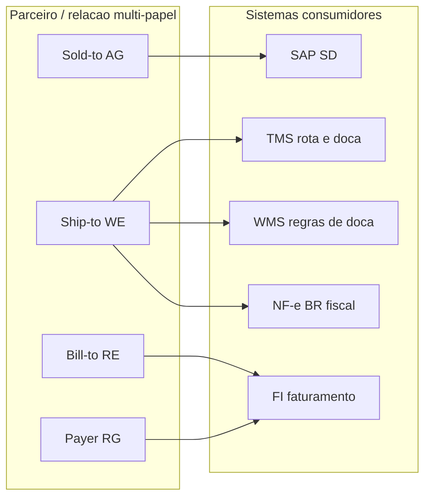
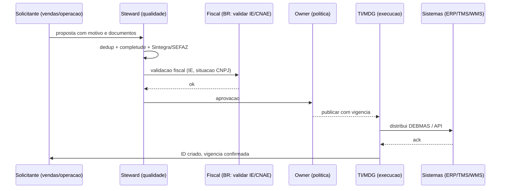

# Parceiros, localizações e governança — ship-to errado não se resolve com mais caminhões

**Cliente** não é só «nome fantasia»: na prática B2B existe **sold-to** (quem negocia), **ship-to** (onde entrega), **bill-to** (quem paga/fatura), **payer** e, em alguns casos, **consignee** em importação. Cada papel carrega **restrições**: janela de recebimento, tipo de veículo, necessidade de agendamento, doca com *dock high*, exigência de paleteira, restrição de empilhamento, fuso horário e contato de emergência na portaria.

**Fornecedor** traz **lead time mestre**, **MOQ**, **Incoterm** de compra e, muitas vezes, **origem** para *compliance*. **Transportadora** liga-se a **tabela de frete**, SLAs e documentação (no Brasil: ANTT/RNTRC, seguros RCTR-C, certificações). Sem **governança** de alteração, cada promoção vira **mutirão** de cadastro na véspera — e o TMS vira roleta.

---

## Objetivos e resultado de aprendizagem

- Diferenciar **sold-to / ship-to / bill-to / payer / consignee** e mapear no SAP SD (`KNVP`) ou em ERPs nacionais.
- Desenhar um **fluxo mínimo** de aprovação de mudança mestre com homologação e vigência.
- Escrever um **checklist** de abertura de ship-to que cubra dado, processo e comunicação a sistemas.
- Relacionar **lead time mestre** com promessa ao cliente e com limites do MRP.
- Conhecer **Business Partner** em S/4HANA e o impacto da migração ECC→S/4 em parceiros.

**Duração sugerida:** 60–90 minutos.  
**Pré-requisitos:** [aula 01 — master data na cadeia](aula-01-master-data-na-cadeia.md).

---

## Mapa do conteúdo

1. Gancho — entrega no endereço antigo após fusão.
2. Conceito-núcleo — papéis, *partner functions* e contrato de dados.
3. Modelo de dados — `KNA1`/`KNVV`/`KNVP`/`LFA1` (ECC) vs. BP (`BUT000`/`BUT020`).
4. Fluxo de aprovação com vigência (RACI).
5. Aprofundamentos — Stibo MDM, MDG-BP, Reltio C360.
6. Integrações — `DEBMAS`, `CREMAS`, EDI 832/845.
7. Trade-offs — dedup automático vs. manual; regional vs. global.
8. Caso prático — abertura de ship-to BR.
9. KPIs, glossário, exercícios.

---

## Gancho — a entrega no endereço antigo após fusão

Duas filiais da **TechLar** fundiram-se; o **ship-to** antigo continuou ativo **dois dias** como padrão em lista de entrega de um contrato corporativo. O **OTIF** caiu; a culpa foi parar no motorista; o TMS mostrou rota correta para o endereço **cadastrado**. O dado mestre é **infraestrutura de promessa** ao cliente — e promessa errada não se corrige com mais frota.

**Analogia do GPS:** você digitou o destino antigo; o motorista seguiu a navegação **certa** para o lugar **errado**.

**Analogia do banco:** transferência para conta antiga sem `valid_to`. O dinheiro saiu da sua conta, foi para a conta correta no banco — só que essa «correta» é a que **não existe mais** no mundo real.

---

## Conceito-núcleo — parceiro como contrato de dados

Um cadastro de parceiro robusto responde, no mínimo:

1. **Quem** é a parte legal (ID fiscal — CNPJ/CPF no BR, EIN nos EUA, VAT na UE)?
2. **Onde** a operação física acontece (ship-to canônico)?
3. **Como** a entrega é aceita (janela, equipamentos, restrições)?
4. **Quando** a configuração muda (vigência, motivo, aprovador)?
5. **Com qual chave** isso integra a OMS/ERP/TMS (mapa de IDs)?

### Papéis (*partner functions*) em SAP SD

| Função | Sigla SD | O que representa |
|--------|----------|------------------|
| Sold-to party | `AG` (`SP` em inglês) | Quem coloca o pedido (negocia) |
| Ship-to party | `WE` (`SH`) | Endereço/local de entrega |
| Bill-to party | `RE` (`BP`) | Quem recebe a fatura |
| Payer | `RG` (`PY`) | Quem efetivamente paga |
| Forwarding agent | `SP` (`CR`) | Transportadora associada |
| Carrier | `LF` (papel em LFA1) | Para parceiros transportadores no MM |

Em SAP, vivem em `KNVP` (cliente-partner) ou `LFB1`/`WYT3` (vendor partner).

**Legenda:** erros frequentes nascem na **ponte** entre papéis — ex.: faturar no sold-to mas entregar no ship-to sem atualizar lista de preço regional, ou emitir NF-e com ship-to com **IE** suspensa na SEFAZ.

---

## Modelo de dados — clientes/fornecedores

### SAP ECC

| Tabela | Conteúdo | Campos críticos |
|--------|----------|-----------------|
| `KNA1` | Cliente — geral | `KUNNR`, `NAME1`, `STRAS`, `ORT01`, `LAND1`, `STCD1` (CNPJ no BR via *industry-specific*) |
| `KNB1` | Cliente — empresa (FI) | `BUKRS`, `AKONT` (conta razão), termos pagamento |
| `KNVV` | Cliente — área de vendas | `VKORG`, `VTWEG`, `SPART`, `KKBER` (controle crédito), `INCO1` (Incoterm) |
| `KNVP` | Partner functions | `KUNN2` (id parceiro), `PARVW` (função) |
| `LFA1` | Fornecedor — geral | `LIFNR`, `NAME1`, `STCD1` |
| `LFM1` | Fornecedor — organização compras | `EKORG`, `WAERS`, `INCO1`, `BSTAE` (confirmation control) |
| `T001W` | Centros / plantas | `WERKS`, `NAME1`, `ADRNR` |

### SAP S/4HANA — Business Partner (BP)

Em **S/4HANA**, cliente e fornecedor convergem em **BP** (`BUT000`). Cada BP recebe **roles**:
- `FLCU00` (Customer — geral)
- `FLCU01` (Customer — área de vendas)
- `FLVN00` (Vendor — geral)
- `FLVN01` (Vendor — organização compras)

Endereços vivem em `BUT020` ↔ `ADRC`. Migração ECC→S/4 obriga **CVI** (*Customer Vendor Integration*) para sincronizar histórico.

### Equivalentes em ERPs nacionais

| ERP | Cliente | Fornecedor |
|-----|---------|------------|
| **Totvs Protheus** | `SA1` (analítico de clientes) | `SA2` |
| **Sankhya** | `TGFPAR` (parceiro com tipos) | `TGFPAR` (mesmo cadastro, papéis diferentes) |
| **Senior** | `E085CLI` | `E085FOR` |
| **Oracle Cloud SCM** | `HZ_PARTIES` + `HZ_CUST_ACCOUNTS` | `POZ_SUPPLIERS_V` |

---

## Fluxo mínimo de aprovação de alteração

**Legenda:** «Sintegra» (BR) consulta situação cadastral fiscal; em S/4 com nota fiscal eletrônica, BP sem IE válida **bloqueia** emissão.

---

## Lead time mestre — média bonita *vs.* cauda

**Lead time mestre** alimenta **MRP** (`MARC-PLIFZ` para planned delivery time, `MARC-WEBAZ` para GR processing time, `LFM1-PLIFZ` por fornecedor) e **promessas de venda**. Se ele for uma **média** sem cauda em rotas voláteis, o sistema **mente** com precisão estatística.

**Regra prática (consenso de mercado):** quando a variância for alta, **segmentar** por origem, modal ou temporada — e medir **P50/P90** (ver trilha Dados — lead time e variabilidade). Logística deve discutir **serviço** com o mesmo vocabulário de percentil que finanças usa para risco.

---

## Aprofundamentos — MDM de parceiros

| Ferramenta / abordagem | Pontos fortes | Limitações |
|-------------------------|----------------|------------|
| **SAP MDG-BP / MDG-S** | Nativo SAP, fluxo de aprovação com workflow BRF+ | Pesado, requer expertise SAP |
| **Stibo Customer MDM** | Multi-domínio (cliente + produto + fornecedor) | TCO alto |
| **Reltio C360** | SaaS, *match-merge* com ML, APIs modernas | Licenciamento por registro |
| **Informatica Customer 360** | Stack tradicional robusta | Implantação longa |
| **Salesforce Customer 360** | Forte para CRM-driven; nem tanto para fornecedor | Vendor lock-in |

**Match-merge:** algoritmos comparam nome + endereço + doc fiscal com **score** (Jaro-Winkler para nome, normalização de endereço com Loqate/Google Places). Threshold > 0.95 → merge automático; entre 0.80–0.95 → fila para steward.

---

## Integrações — distribuição de parceiros

| Padrão | Para quê | Comentário |
|--------|----------|------------|
| `DEBMAS` (IDoc) | Customer master | Versões `DEBMAS06`+ em S/4 |
| `CREMAS` (IDoc) | Vendor master | Equivalente para fornecedores |
| `BPMAS` (IDoc) | Business Partner em S/4 | Replicar BP entre instâncias |
| `ADRMAS` | Endereços | Atualização incremental |
| EDI X12 832 / EANCOM PRICAT | Catálogo de cliente | Comum em supermercado |
| EDI X12 845 / EANCOM PRICELIST | Tabela de preços por cliente | B2B |
| API `/customers/v1` (OData/REST) | App satélite, marketplace | S/4 via SAP API Hub |
| Eventos | `customer.changed`, `customer.merged` | Para BI e *downstream* |

---

## Trade-offs — globalização vs. local

| Dilema | Opção A | Opção B | Critério |
|--------|---------|---------|----------|
| Modelo de cliente | Global único (multi-país) | Local por país | Multinacional → global; nacional → local |
| Endereço | Estrutura livre | Estrutura GLN/GS1 | Indústria GS1 (CPG) → GLN; outros → flexível |
| Dedup | Automático com ML | Manual com workflow | Volume alto → automático com revisão; volume baixo → manual |
| Sincronização | Push (eventos) | Pull (consulta) | Ship-to crítico → push; histórico → pull |

---

## Caso prático — abertura de ship-to BR para a TechLar

**Cenário:** novo CD de cliente B2B em Cajamar (SP), CNPJ existente com nova IE filial.

**Pacote mínimo de abertura:**

1. **Documentação:** cartão CNPJ atualizado, comprovante de IE no Sintegra, contrato social/procuração, foto da fachada/doca.
2. **Validação fiscal:** consulta SEFAZ-SP da IE; verificar CNAE compatível com operação; verificar regime tributário (Simples / Lucro Real / Presumido).
3. **Dados operacionais:** janela de recebimento (dias × horas), tipo de doca (*dock high* / nivelada), exigência de agendamento, sistema de agendamento (qual portal?), tempo médio de descarga, exigência de paleteira, restrição de empilhamento (max 2 paletes), HACCP/cadeia fria se aplicável.
4. **Contato:** responsável da doca (nome, telefone, e-mail, fuso), contato de emergência 24/7, transportadora preferida do cliente (se houver).
5. **TMS:** restrição de veículo (truck / toco / carreta), restrição de cidade (Cajamar tem zona com restrição de horário?), `lane` cadastrada com tarifa.
6. **WMS:** se cross-dock no CD do cliente, código de cliente alinhado em etiqueta SSCC.
7. **Vigência:** `valid_from = D+5` (tempo para comunicar transportadoras e clonar regras de SLA).
8. **Comunicação:** matriz de stakeholders (operações, comercial, customer service, transportadoras).

**Pegadinha BR — Substituição Tributária:** ship-to em estado diferente do bill-to pode mudar **alíquota interestadual** e **ICMS-ST**. Master sem alinhamento com fiscal → NF-e emitida com tributação errada → cliente devolve.

---

## Erros comuns e armadilhas

- «Endereço igual» com **CNPJ** diferente — risco fiscal e de nota.
- Múltiplos **IDs** de parceiro sem **mapa** canônico — duplicidade de cliente «fantasma».
- Alteração em produção **sem** rollback — vigência mal comunicada.
- Governança só em **e-mail** — não audita quem aprovou o quê.
- Lead time mestre **copiado** do contrato sem **realidade** operacional (janela real de fornecedor).
- Em S/4, criar BP sem **role** correspondente → pedido SD/MM falha sem mensagem clara.
- Migração ECC→S/4 sem CVI ativa → BP nasce, mas histórico de cliente não migra.
- IE de cliente não revalidada → SEFAZ rejeita NF-e em produção, picking volta.

---

## KPIs técnicos e de negócio

| KPI | Pergunta | Dono | Fonte | Cadência | Playbook se ruim |
|-----|----------|------|-------|----------|------------------|
| **% entregas com correção manual de endereço** | Ship-to está confiável? | Steward de cliente | TMS (override log) | Semanal | Onboarding revisado; chamada com cliente top 10 erros |
| **Tempo médio proposta → publicação ship-to** | Governança é ágil? | Custodian | MDG/MDM workflow | Mensal | Identificar etapa gargalo; SLA por etapa |
| **OTIF reincidente em clientes < 90 dias** | Onboarding novo cliente está bom? | Comercial + Operação | ERP + TMS | Mensal | Checklist obrigatório; QBR de onboarding |
| **NF-e rejeitadas por dado de parceiro (IE/CNPJ)** | Master fiscal alinhado? | Fiscal + Steward | NF-e log | Diário | Validação automática Sintegra antes de gravar BP |
| **Duplicidade ativa de clientes/fornecedores** | Quantos «gêmeos» vivos? | Steward | MDG/MDM regras | Mensal | Merge governado |
| **Lead time mestre vs. realizado (P90 — gap)** | Promessa é factível? | Planejamento | MRP + recebimento | Mensal | Recalibrar `MARC-PLIFZ` por fornecedor |

---

## Ferramentas e tecnologias relevantes

| Categoria | Ferramentas | Quando usar |
|-----------|-------------|-------------|
| MDG-BP / MDM | SAP MDG, Stibo, Reltio, Informatica | Multi-canal, multi-país, multi-ERP |
| Validação fiscal BR | Sintegra, Receita Federal API, Sefaz Virtual | Antes de criar/alterar BP com IE |
| Endereçamento | Loqate, Google Places, Correios CEP API | Normalizar e enriquecer endereço |
| Workflow | SAP Workflow / BRF+, ServiceNow, Jira | Aprovação de mudança com trilha |
| Catálogo de dados | Collibra, Alation | Documentar owner e lineage |

---

## Glossário rápido

- **Sold-to / Ship-to / Bill-to / Payer:** papéis comerciais de um cliente.
- **Partner function (`PARVW`):** código SAP que liga cliente a um papel.
- **BP (Business Partner):** entidade unificada cliente+fornecedor em S/4HANA.
- **CVI:** *Customer Vendor Integration* (sincronização BP↔KNA1/LFA1).
- **MDG-BP / MDG-S:** módulo SAP Master Data Governance para BP / Supplier.
- **GLN:** *Global Location Number* (GS1) para identificar locais de parceiros.
- **IE:** Inscrição Estadual (BR).
- **Sintegra:** sistema BR de informações fiscais entre estados.
- **`KNA1`/`KNVV`/`KNVP`:** tabelas-chave cliente em SAP ECC.
- **`LFA1`/`LFM1`:** tabelas-chave fornecedor em SAP ECC.

---

## Aplicação — exercícios

**Ex. 1 (15 min):** escreva um **checklist de 15 itens** para abrir um **novo ship-to** B2B na sua empresa. Inclua dado fiscal, operacional, contato, comunicação a sistemas e plano de comunicação a transportadoras.

**Ex. 2 (10 min):** escolha **três** clientes top em volume. Para cada um, identifique se hoje há **dono nomeado** do master e qual foi o **último incidente** rastreado a master desse cliente.

**Ex. 3 (15 min):** desenhe a **transição ECC→S/4 BP** para um cliente que é também fornecedor (devolução de palete, bonificação). Que dados precisam ser conciliados? Qual o risco se CVI não estiver ativa?

**Gabarito Ex. 1 (15 itens exemplo):** endereço completo e válido; CEP; país/estado; fuso; horário de recebimento; contato doca; regras de agendamento; CNPJ + IE validada na SEFAZ; transportadora preferencial e exceções; tipo de veículo; restrição de empilhamento; necessidade de paleteira; coordenadas se entrega rural; instruções de segurança; mapa de IDs entre ERP/TMS; plano de comunicação a **todos** os sistemas que imprimem etiqueta; vigência (`valid_from`); plano de rollback.

---

## Pergunta de reflexão

Qual alteração de cadastro exige hoje **seis e-mails** em vez de um fluxo com aprovador e evidência — e quem se beneficia desse caos?

---

## Fechamento — três takeaways

1. Governança de mestres é **menos sexy** que *dashboard* — e evita **dez** *dashboards* de incêndio.
2. Ship-to é **interface** entre promessa comercial e mundo físico; erro ali não se trata com pressão em cima do motorista.
3. Lead time mestre mentiroso é **MRP** e **S&OP** discutindo fantasia.

---

## Referências

1. **CSCMP** — glossário (*shipper*, *consignee*, etc.): https://cscmp.org/
2. **ICC** — Incoterms® 2020: https://iccwbo.org/business-solutions/incoterms-rules/incoterms-2020/
3. **DAMA International** — *DMBOK 2* (Data Governance, ciclo de vida).
4. **SAP Help Portal** — *Business Partner* em S/4HANA: https://help.sap.com/docs/SAP_S4HANA_ON-PREMISE
5. **Receita Federal BR** — Sintegra: https://www.sintegra.gov.br/
6. **GS1** — GLN: https://www.gs1.org/standards/id-keys/gln
7. MAGAL & WORD — *Integrated Business Processes with ERP Systems*. Wiley.

---

## Pontes para outras trilhas

- **Dados** → [lead time e variabilidade](../../trilha-dados-analytics-logistica/modulo-04-indicadores-logisticos-kpis/aula-02-lead-time-variabilidade-logistica.md).
- **Fundamentos** → [nível de serviço e KPIs](../../trilha-fundamentos-e-estrategia/modulo-04-custos-logisticos-performance/aula-03-nivel-servico-kpis-logisticos.md).
- Próximo módulo → [ERP — documentos e estados do pedido](../modulo-02-erp-aplicado-supply-chain/aula-01-documentos-estados-pedido.md).
