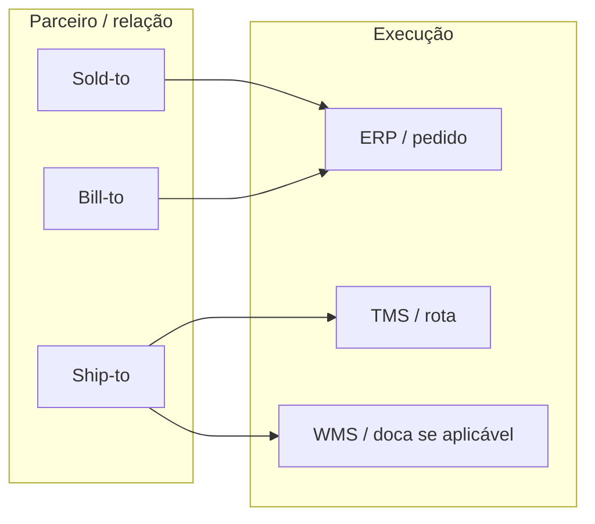
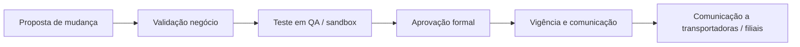

# Parceiros, localizações e governança — ship-to errado não se resolve com mais caminhões

**Cliente** não é só «nome fantasia»: na prática B2B existe **sold-to** (quem negocia), **ship-to** (onde entrega), **bill-to** (quem paga/fatura), **payer** e, em alguns casos, **consignee** em importação. Cada papel carrega **restrições**: janela de recebimento, tipo de veículo, necessidade de agendamento, doca com *dock high*, exigência de paleteira, restrição de empilhamento, fuso horário e contato de emergência na portaria.

**Fornecedor** traz **lead time mestre**, **MOQ**, **Incoterm** de compra e, muitas vezes, **origem** para compliance. **Transportadora** liga-se a **tabela de frete**, SLAs e documentação (ANTT, seguros, certificações — variam por país e operação). Sem **governança** de alteração, cada promoção vira **mutirão** de cadastro na véspera — e o TMS vira roleta.

---

## Objetivos e resultado de aprendizagem

**Ao final desta aula**, você será capaz de:

- Diferenciar **sold-to / ship-to / bill-to** e explicar por que CNPJ «igual» com endereços diferentes ainda é risco.
- Desenhar um **fluxo mínimo** de aprovação de mudança mestre com homologação e vigência.
- Escrever um **checklist** de abertura de ship-to que cubra dado, processo e comunicação a sistemas.
- Relacionar **lead time mestre** com promessa ao cliente e com limites do MRP.

**Duração sugerida:** 60–90 minutos.

---

## Gancho — a entrega no endereço antigo após fusão

Duas filiais da **TechLar** fundiram-se; o **ship-to** antigo continuou ativo **dois dias** como padrão em lista de entrega de um contrato corporativo. O **OTIF** caiu; a culpa foi parar no motorista; o TMS mostrou rota correta para o endereço **cadastrado**. O dado mestre é **infraestrutura de promessa** ao cliente — e promessa errada não se corrige com mais frota.

**Analogia do GPS:** você digitou o destino antigo; o motorista seguiu a navegação **certa** para o lugar **errado**.

---

## Conceito núcleo — parceiro como contrato de dados

Um cadastro de parceiro robusto responde, no mínimo:

1. **Quem** é a parte legal (ID fiscal quando aplicável)?
2. **Onde** a operação física acontece (ship-to canônico)?
3. **Como** a entrega é aceita (janela, equipamentos, restrições)?
4. **Quando** a configuração muda (vigência, motivo, aprovador)?
5. **Com qual chave** isso integra a OMS/ERP/TMS (mapa de IDs)?

**Legenda:** erros frequentes nascem na **ponte** entre papéis — ex.: faturar no sold-to mas entregar no ship-to sem atualizar lista de preço regional.

---

## Fluxo mínimo de aprovação de alteração

**Legenda:** «QA» pode ser ambiente de homologação, *sandbox* contratual ou roteiro de teste com **pedido piloto**; o que não pode existir é mudança em produção **sem** plano de rollback.

---

## Lead time mestre — média bonita *vs.* cauda

**Lead time mestre** alimenta **MRP**, **DPS** e promessas. Se ele for uma **média** sem cauda em rotas voláteis, o sistema **mente** com precisão estatística.

**Regra prática (consenso de mercado):** quando a variância for alta, **segmentar** por origem, modal ou temporada — e medir **P50/P90** (ver trilha Dados — lead time e variabilidade). Logística deve discutir **serviço** com o mesmo vocabulário de percentil que finanças usa para risco.

---

## Aplicação — exercício

Escreva um **checklist de 10 itens** para abrir um **novo ship-to**. Depois, estenda para **15** adicionando itens «chato» que evitam incidente noturno (fusos, contatos, restrições).

**Gabarito pedagógico (15 itens exemplo):** endereço completo e válido; CEP; país/estado; fuso; horário de recebimento; contato doca; regras de agendamento; ID fiscal se aplicável; transportadora preferencial e exceções; tipo de veículo; restrição de empilhamento; necessidade de paleteira; coordenadas se entrega rural; instruções de segurança; mapa de IDs entre ERP/TMS; plano de comunicação a **todos** os sistemas que imprimem etiqueta.

---

## Erros comuns e armadilhas

- «Endereço igual» com **CNPJ** diferente — risco fiscal e de nota.
- Múltiplos **IDs** de parceiro sem **mapa** canônico — duplicidade de cliente «fantasma».
- Alteração em produção **sem** rollback — vigência mal comunicada.
- Governança só em **e-mail** — não audita quem aprovou o quê.
- Lead time mestre **copiado** do contrato sem **realidade** operacional (janela real de fornecedor).

---

## KPIs e decisão

- **% de entregas** com correção manual de endereço após criação do pedido.
- **Tempo médio** de ciclo «proposta → publicação» para mudança de ship-to.
- **Reincidência** de OTIF em clientes recém-cadastrados (90 primeiros dias).

---

## Fechamento — três takeaways

1. Governança de mestres é **menos sexy** que *dashboard* — e evita **dez** *dashboards* de incêndio.
2. Ship-to é **interface** entre promessa comercial e mundo físico; erro ali não se trata com pressão em cima do motorista.
3. Lead time mestre mentiroso é **MRP** e **S&OP** discutindo fantasia.

**Pergunta de reflexão:** qual alteração de cadastro exige hoje **seis e-mails** em vez de um fluxo com aprovador e evidência?

---

## Referências

1. CSCMP — glossário (*shipper*, *consignee*, etc.): https://cscmp.org/CSCMP/cscmp/educate/scm_definitions_and_glossary_of_terms.aspx  
2. ICC — Incoterms (compras internacionais): https://iccwbo.org/business-solutions/incoterms-rules/  
3. DAMA — *Data Governance* (RACI, qualidade, ciclo de vida).  
4. Trilha Dados — [lead time e variabilidade](../../trilha-dados-analytics-logistica/modulo-04-indicadores-logisticos-kpis/aula-02-lead-time-variabilidade-logistica.md).
