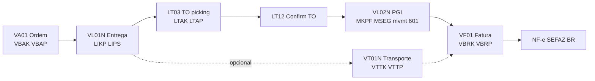
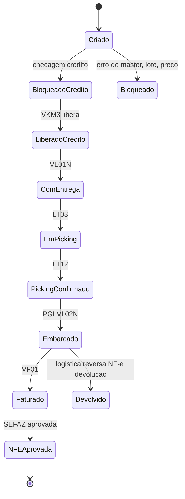
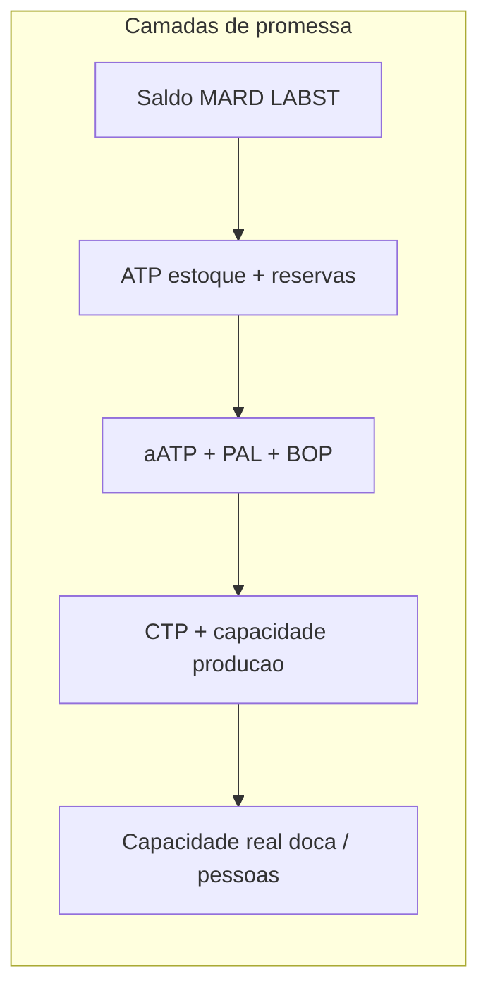
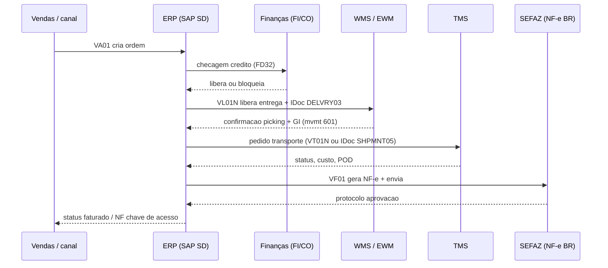

# Documentos e estados do pedido — da intenção à fatura sem saltar elos

No **ERP**, o pedido de cliente **não** é um único registro eterno: decompõe-se em **documentos** (ordem de venda, remessa/entrega, fatura, nota de crédito, devolução) e **estados** (criado, liberado por crédito, bloqueado, em picking, embarcado, faturado, contestado). Quem só vê «linha verde na tela» ignora que **cada estado** tem pré-condição — e que **integração** pode atrasar o que o físico já fez. Para logística, o ERP é menos «tela de pedido» e mais **máquina de estados** que coordena **reserva**, **liberação**, **baixa** e **reconhecimento de receita** (este último com forte interface com finanças).

Em SAP, esse encadeamento materializa-se em **document flow** (`VBFA`): a ordem `VBAK`/`VBAP` gera entrega `LIKP`/`LIPS`, que gera transporte `VTTK`/`VTTP`, que gera fatura `VBRK`/`VBRP`. Em ERPs nacionais (Totvs, Sankhya, Senior), os nomes mudam — a coreografia é a mesma.

---

## Objetivos e resultado de aprendizagem

- Narrar o caminho típico **ordem → entrega → execução física → fatura** em linguagem agnóstica e em SAP (com t-codes/tabelas).
- Explicar por que **estado** é contrato de leitura entre **pessoas**, **ERP**, **WMS** e **canais**.
- Posicionar **ATP** clássico, **aATP** (S/4HANA) e **CTP** e citar um exemplo em que ATP «verde» falha na doca.
- Identificar **cinco** bloqueios recorrentes e qual documento eles travam.
- Mapear **`VBFA`** (document flow) e ler um caso real ponta a ponta.

**Duração sugerida:** 60–90 minutos.  
**Pré-requisitos:** módulo 1 desta trilha (master data).

---

## Mapa do conteúdo

1. Gancho — separado no WMS, pendente no ERP.
2. Conceito — documentos como capítulos.
3. Modelo de dados — `VBAK`/`VBAP`/`LIKP`/`LIPS`/`VTTK`/`VTTP`/`VBRK`/`VBRP`/`VBFA` + t-codes.
4. Diagrama — máquina de estados e *sequence* SD↔WMS↔TMS.
5. ATP / aATP / CTP — promessa com limites.
6. Aprofundamentos — ERPs nacionais (Totvs, Sankhya); ECC vs. S/4.
7. Integrações — IDoc `ORDERS05`, `DESADV`, `INVOIC02`.
8. Caso prático — pedido B2B com NF-e e CT-e.
9. Erros, KPIs, glossário, exercícios.

---

## Gancho — separado no WMS, pendente no ERP

A **TechLar** embarcou às 18h; o **evento** integrou ao ERP às 02h por fila noturna. O cliente viu «em preparação» enquanto o caminhão já ia na estrada. O **estado** atrasado virou **chamado** no SAC, **multa** B2B e **retrabalho** de comissionamento. **Estado** é **contrato de leitura** entre sistemas e pessoas — e contrato desatualizado custa caro.

**Analogia do teatro:** o ator já saiu do palco (físico embarcado), mas a **luz do prompt** (ERP) ainda marca cena 1 — o público (cliente) acredita na luz, não no bastidor.

**Analogia do cartório:** o casamento aconteceu na praia (físico); o registro só será assinado segunda-feira no cartório (ERP). Para o estado, o casal ainda está solteiro — o que pode dar problema em hospital, herança, plano de saúde.

---

## Mapa do conteúdo — documentos como «capítulos»

1. **Ordem de venda** captura intenção comercial (preço, quantidade, condição).
2. **Entrega/remessa** traduz o que **sai** fisicamente (data, local, lote, transporte).
3. **Transporte** (opcional como documento próprio) registra carga consolidada.
4. **Faturação** formaliza o **direito de cobrança** (com regras fiscais e de reconhecimento). No BR, gera **NF-e**.
5. **Pós-venda** (devolução, nota de crédito, NF-e de devolução) precisa **encadear** estoque e financeiro.

Cada capítulo tem **transições válidas**; pular capítulo sem regra é convite a **ajuste manual** eterno.

---

## Modelo de dados — SAP SD ponta a ponta

| Etapa | T-code típico | Tabela cabeçalho | Tabela item | Status (campo) |
|-------|---------------|------------------|-------------|----------------|
| Cotação | `VA21` / `VA22` / `VA23` | `VBAK` (TIPO=`B`) | `VBAP` | `VBUK`/`VBUP` |
| Ordem de venda | `VA01` / `VA02` / `VA03` | `VBAK` (TIPO=`C`) | `VBAP` | `VBUK`/`VBUP` |
| Liberação crédito | `VKM3` (lista bloqueio) | `VBAK-KKBLO`, `VBUK-CMGST` | — | `CMGST` |
| Entrega outbound | `VL01N` / `VL02N` / `VL03N` (criar individual); `VL10A`/`VL10C` (em massa) | `LIKP` | `LIPS` | `VBUK-WBSTK` (picking), `KOSTK` (confirmation), `LFSTK` (delivery) |
| Picking (TO) | `LT03` (criar TO), `LT12` (confirmar) — WM clássico | `LTAK` | `LTAP` | — |
| Goods Issue (GI) | `VL02N` (botão Post GI) | `MKPF`/`MSEG` (mvmt 601) | — | `LIKP-WBSTK` = `C` |
| Transporte | `VT01N` / `VT02N` | `VTTK` | `VTTP` | `VBUK` |
| Faturação | `VF01` / `VF02` / `VF03` (`VF04` lista) | `VBRK` | `VBRP` | `VBRK-RFBSK` (transferência FI) |
| Document flow | `VA03` → menu *Display Document Flow* | `VBFA` (relação predecessor/sucessor) | — | — |

**`VBFA` em uma linha:** «documento X, item Y → gerou documento X', item Y', com qtd Q transferida». É o **rastro genealógico** do pedido.

---

## Máquina de estados simplificada (genérica)

**Legenda:** **bloqueio** é um estado **primeiro-cidadão**, não «bug». No SAP: `VBUK-LIFSK` (bloqueio entrega), `CMGST` (bloqueio crédito), `KOSTK` (bloqueio quantidade), `FAKSK` (bloqueio fatura).

---

## ATP / aATP / CTP — promessa com limites

**ATP** (*available-to-promise*) responde «**quanto** posso prometer com estoque e regras atuais?». Considera saldo (`MARC`+`MARD`), reservas, bloqueios de qualidade e políticas de alocação por canal.

**aATP** (*advanced ATP*, S/4HANA) substitui o GATP do SAP APO em S/4. Adiciona:
- **PAL** (*Product Allocation*) — quotas por canal/cliente.
- **BOP** (*Backorder Processing*) — repromessa diária com prioridades.
- **RBA** (*Rule-Based ATP*) — substituição de produto/centro.

**CTP** (*capable-to-promise*) acrescenta **capacidade** — linha, **doca**, turno, terceirizado com limite contratual.

**Erro clássico:** ATP «verde» com **doca** saturada ou **onda** congelada — a promessa **financeira** existe, a promessa **física** não.

**Legenda:** quanto mais à direita, mais «terra»; integrações frequentemente param no ATP e esquecem doca/onda.

---

## Sequência — quem espera o quê

---

## Aprofundamentos — ERPs nacionais e variações

| ERP | Equivalente «ordem» | Equivalente «entrega/picking» | Equivalente «NF» |
|-----|---------------------|-------------------------------|------------------|
| **Totvs Protheus** | `SC5`/`SC6` (Pedido OMSA001) | `SC9` (liberação) + integração WMS via `SDW` | `SF2` (NF saída) |
| **Sankhya** | `TGFCAB`/`TGFITE` (nota de venda) | Mesmo objeto com tipo de operação (TOP) | Mesmo `TGFCAB` com finalidade «NF saída» |
| **Senior Gestão Empresarial** | `E140NFV` | `E141IPV` | Mesmo objeto |
| **Oracle EBS / Cloud SCM** | `OE_ORDER_HEADERS_ALL` | `WSH_DELIVERIES`/`WSH_DELIVERY_DETAILS` | `RA_CUSTOMER_TRX_ALL` (AR Invoice) |

**ECC vs. S/4 (resumo):**
- `MKPF`+`MSEG` → `MATDOC` (S/4): material document agora «estende-se» numa só tabela.
- GATP (APO) → aATP (nativo S/4).
- Customer/Vendor → BP (`BUT000`).
- `BSEG`+`BKPF` para FI persistem; *Universal Journal* `ACDOCA` consolida.

---

## Integrações — IDocs e EDI clássicos

| IDoc / EDI | Para quê | Estrutura/segmentos-chave |
|------------|----------|----------------------------|
| `ORDERS05` (IDoc) | Ordem de venda recebida via EDI | Cabeçalho `E1EDK*`, item `E1EDP*` |
| `ORDRSP05` | Confirmação de ordem ao cliente | — |
| `DELFOR02` | *Delivery schedule* (forecast) | Comum em automotivo (JIT) |
| `DESADV01` (IDoc) / EDI X12 856 (ASN) | Aviso prévio de embarque | `E1EDL20` (delivery), `E1EDL24` (item) |
| `SHPMNT05` | Transporte / shipment | Para integração TMS externo |
| `INVOIC02` (IDoc) / EDI X12 810 | Fatura outbound/inbound | Inclui condições, impostos, referência ao DESADV |
| `WMSCID` / `WMTOID` | Confirmação WMS → ERP | Picking / GI |
| API REST `Sales Order V2` (S/4 OData) | Apps modernos | `/sap/opu/odata/sap/API_SALES_ORDER_SRV` |

**No Brasil:** muitas operações ainda usam **EDI Proceda** (.txt posicional), **NeoGrid** como middleware, ou **VAN** dedicada. Evolução para **EDI Web/API** com **NeoGrid Sync**, **Tradecloud**, **Mercado Eletrônico**.

---

## Caso prático — TechLar B2B com NF-e e CT-e

**Cenário:** cliente pede 24 caixas do SKU `TL-7842`.

| Passo | Sistema | Documento | Objeto BR |
|-------|---------|-----------|-----------|
| 1. EDI ORDERS05 do cliente | SAP SD | `VBAK`/`VBAP` (`VA01`) | — |
| 2. Liberação crédito | SAP FI/SD | `CMGST` → C | — |
| 3. Cria entrega | SAP SD | `LIKP`/`LIPS` (`VL01N`) | — |
| 4. WMS recebe outbound | EWM/Manhattan | task / wave | — |
| 5. Picking confirmado | EWM | confirmation | — |
| 6. Post Goods Issue | SAP MM | `MSEG` mvmt 601 | — |
| 7. Cria fatura | SAP SD-BIL | `VBRK`/`VBRP` (`VF01`) | NF-e modelo 55 |
| 8. Envia NF-e à SEFAZ | NF-e middleware (Tecnospeed/Migrate) | XML (`<NFe>`) | Aut/Reject SEFAZ |
| 9. Transportadora emite CT-e | TMS / transportadora | `<CTe>` modelo 57 | Acompanha carga |
| 10. MDF-e (manifesto) | TMS / motorista | `<MDFe>` modelo 58 | Documenta a viagem |
| 11. Carga sai do CD | TMS | shipment ID | DACTE impresso |
| 12. POD eletrônico | TMS | event POD | Imagem assinada |
| 13. Reconhecimento receita | SAP FI | `BKPF`/`BSEG` ou `ACDOCA` (S/4) | — |

**Pegadinha BR:** se a **NF-e for cancelada** após GI, é preciso **estornar** o movimento 602 (devolução) e **reabrir** entrega. Sem fluxo definido, vira ajuste manual.

---

## Aplicação — exercício

Para **um** pedido real ou fictício, liste **cinco** documentos ou objetos de sistema na ordem **ideal** e marque onde o **bloqueio** mais comum ocorre na sua empresa.

**Gabarito pedagógico:** ordem típica `VBAK→LIKP→VTTK→VBRK` (com WMS confirmando entre `LIKP` e GI). Bloqueios: **crédito** (`CMGST`), **estoque** (insuficiente, sem batch liberado), **lote bloqueado** (`MCHA-CLEAR=S`), **preço inválido** (sem condição PR00 ativa), **duplicidade de integração** (mesmo IDoc reprocessado), **divergência fiscal** (NF-e rejeitada por NCM/CFOP).

---

## Erros comuns e armadilhas

- Misturar **data do pedido** (`VBAK-AUDAT`), **data prometida** ao cliente (`VBAP-EDATU` por *schedule line*) e **data de remessa** (`LIKP-WADAT`).
- Cancelar só no **front** sem **encadear** devolução de estoque reservado (`VBBE`).
- «Reabrir» entrega faturada sem **fluxo** de estorno definido — nasce ajuste «creativo».
- Tratar **status de canal** (marketplace) como **status legal** de faturação.
- Não ter **dicionário interno** do que significa «liberado» para cada área (vendas? finanças? operações?).
- Em S/4, ignorar `ACDOCA` quando o time de FI ainda raciocina em `BSEG`.
- IDoc `INVOIC02` sem **ack** confirmado → fatura emitida sem reconhecer receita; descobre-se no fechamento.

---

## KPIs técnicos e de negócio

| KPI | Pergunta | Dono | Fonte | Cadência | Playbook se ruim |
|-----|----------|------|-------|----------|------------------|
| **Lead time de estado «liberado→embarcado»** | Onde o pedido «mora» mais tempo? | Operação | `VBFA` + timestamps | Semanal | Gargalo Pareto: WMS? doca? agendamento cliente? |
| **% pedidos com retrabalho de documento pré-fatura** | Master/setup ruim? | Comercial + Steward | ERP (cancelamento + reentrada) | Semanal | RCA por motivo |
| **% divergência status físico (WMS) vs. financeiro (ERP)** | Integração saudável? | TI + Operação | WMS log + `MKPF` | Diário | Monitor lag IDoc; SLO < 30 min |
| **% pedidos com bloqueio de crédito > 24h** | Finanças responde rápido? | Financeiro | `VBUK-CMGST` | Semanal | Definir SLA; auto-release com regras |
| **Lag p95 GI físico → atualização SD** | Mensagem WMS→ERP sob controle? | TI | timestamps WMS + `MKPF-CPUDT/CPUTM` | Diário | Painel IDoc + DLQ saudável |
| **% NF-e rejeitadas pela SEFAZ** | Master fiscal alinhado? | Fiscal + Steward | NF-e log | Diário | Pareto causa: NCM, IE, CFOP, CST |

---

## Ferramentas e tecnologias relevantes

| Categoria | Ferramentas | Quando usar |
|-----------|-------------|-------------|
| ERP | SAP S/4HANA, SAP ECC, Oracle Cloud SCM, Totvs Protheus, Sankhya, Senior | Núcleo transacional |
| Middleware EDI | NeoGrid, Tradecloud, Tecnospeed, Mercado Eletrônico, IBM Sterling | Conversão EDI ↔ ERP |
| iPaaS | SAP CPI/Integration Suite, Mulesoft, Boomi, Azure Integration Services | Integrações modernas |
| NF-e BR | Tecnospeed, Migrate, NDD, eFatura | Emissão e contingência |
| Monitoramento IDoc | SAP `WE02`/`WE05`/`BD87`, ALE Audit | Operação SAP |

---

## Glossário rápido

- **`VA01`/`VL01N`/`VF01`:** criar ordem / criar entrega / criar fatura (SAP SD).
- **`VBAK`/`VBAP`:** cabeçalho/item ordem.
- **`LIKP`/`LIPS`:** cabeçalho/item entrega.
- **`VTTK`/`VTTP`:** cabeçalho/item shipment SAP.
- **`VBRK`/`VBRP`:** cabeçalho/item fatura.
- **`VBFA`:** *document flow* (predecessor/sucessor).
- **`MKPF`/`MSEG`:** documentos de material (cabeçalho/item).
- **`MATDOC`:** consolidação dos dois acima em S/4.
- **GI / PGI:** *Goods Issue* / *Post Goods Issue* (movimento 601).
- **ATP / aATP / CTP:** *available* / *advanced ATP* / *capable-to-promise*.
- **NF-e (mod. 55):** Nota Fiscal Eletrônica BR (mercadoria).
- **CT-e (mod. 57):** Conhecimento de Transporte Eletrônico.
- **MDF-e (mod. 58):** Manifesto Eletrônico de Documentos Fiscais.
- **CFOP:** Código Fiscal de Operações e Prestações.
- **NCM/CEST:** classificação fiscal de mercadoria.

---

## Pergunta de reflexão

Qual transição de estado hoje **ninguém** desenhou mas todos sofrem — e quanto custa em **horas-pessoa** por mês?

---

## Fechamento — três takeaways

1. ERP é **coreografia** de documentos; sem mapa de estados (`VBFA` ou equivalente), cada área dança fora do tempo.
2. ATP sem **CTP/capacidade real** é promessa **meia**; cliente B2B sente a metade que faltou.
3. Integração atrasada não é «detalhe de TI»; é **experiência** e, muitas vezes, **multa contratual**.

---

## Referências

1. **SAP Help Portal** — *Sales and Distribution*: https://help.sap.com/docs/SAP_S4HANA_ON-PREMISE
2. **MAGAL & WORD** — *Integrated Business Processes with ERP Systems*. Wiley.
3. **ASCM** — CPIM body of knowledge: https://www.ascm.org/learning-development/certifications-credentials/cpim/
4. **Receita Federal BR** — Manual NF-e/CT-e/MDF-e: https://www.nfe.fazenda.gov.br/
5. CHOPRA & MEINDL — *Supply Chain Management*. Pearson.
6. BOWERSOX et al. — *Supply Chain Logistics Management*. McGraw-Hill.
7. **Gartner** — *Magic Quadrant for Cloud ERP for Service-Centric Enterprises* (anual).

---

## Pontes para outras trilhas

- **Fundamentos** → [fluxos físicos e de informação](../../trilha-fundamentos-e-estrategia/modulo-01-fundamentos-logistica-empresarial/aula-02-fluxos-fisicos-informacao.md).
- **Dados** → [OTIF e fill rate](../../trilha-dados-analytics-logistica/modulo-04-indicadores-logisticos-kpis/aula-01-otif-fill-rate-contrato-interno.md).
- Próxima aula → [estoque e movimentos](aula-02-stock-movimentos.md).
