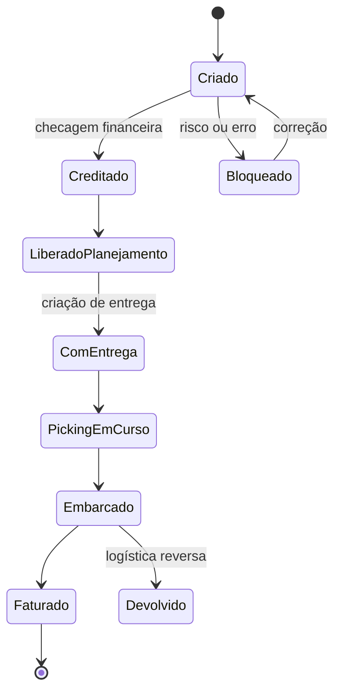
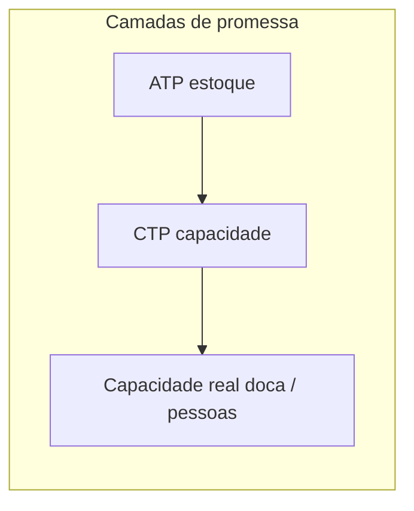
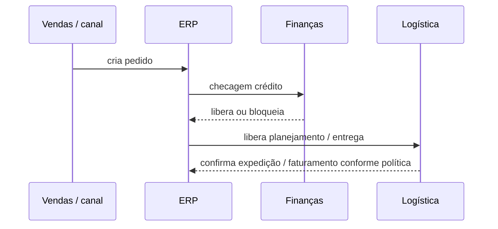

# Documentos e estados do pedido — da intenção à fatura sem saltar elos

No **ERP**, o pedido de cliente **não** é um único registro eterno: decompõe-se em **documentos** (ordem, remessa/entrega, fatura, nota de crédito) e **estados** (criado, liberado, bloqueado, faturado). Quem só vê «linha verde na tela» ignora que **cada estado** tem pré-condição — e que **integração** pode atrasar o que o físico já fez. Para logística, o ERP é menos «tela de pedido» e mais **máquina de estados** que coordena **reserva**, **liberação**, **baixa** e **reconhecimento de receita** (este último com forte interface com finanças).

---

## Objetivos e resultado de aprendizagem

**Ao final desta aula**, você será capaz de:

- Narrar o caminho típico **ordem → entrega → execução física → fatura** em linguagem agnóstica de fornecedor.
- Explicar por que **estado** é contrato de leitura entre **pessoas**, **ERP**, **WMS** e **canais**.
- Posicionar **ATP** e **CTP** e citar um exemplo em que ATP «verde» falha na doca.
- Identificar **cinco** bloqueios recorrentes e qual documento eles travam.

**Duração sugerida:** 60–90 minutos.

---

## Gancho — separado no WMS, pendente no ERP

A **TechLar** embarcou às 18h; o **evento** integrou ao ERP às 02h por fila noturna. O cliente viu «em preparação» enquanto o caminhão já ia na estrada. O **estado** atrasado virou **chamado** no SAC, **multa** B2B e **retrabalho** de comissionamento. **Estado** é **contrato de leitura** entre sistemas e pessoas — e contrato desatualizado custa caro.

**Analogia do teatro:** o ator já saiu do palco (físico embarcado), mas a **luz do prompt** (ERP) ainda marca cena 1 — o público (cliente) acredita na luz, não no bastidor.

---

## Mapa do conteúdo — documentos como «capítulos»

1. **Ordem** captura intenção comercial (preço, quantidade, condição).
2. **Entrega/remessa** traduz o que **sai** fisicamente (data, local, lote, transporte).
3. **Faturação** formaliza o **direito de cobrança** (com regras fiscais e de reconhecimento).
4. **Pós-venda** (devolução, nota de crédito) precisa **encadear** estoque e financeiro.

Cada capítulo tem **transições válidas**; pular capítulo sem regra é convite a **ajuste manual** eterno.

---

## Máquina de estados simplificada

**Legenda:** nomes genéricos; o seu ERP pode usar outros termos. O ponto pedagógico é: **bloqueio** é um estado **primeiro-cidadão**, não «bug».

---

## ATP / CTP em alto nível — promessa com limites

**ATP** (*available-to-promise*) responde «**quanto** posso prometer com estoque e regras atuais?». Ele costuma considerar saldo, reservas, bloqueios de qualidade e políticas de alocação por canal.

**CTP** (*capable-to-promise*) acrescenta **capacidade** — linha, **doca**, turno, terceirizado com limite contratual.

**Erro clássico:** ATP «verde» com **doca** saturada ou **onda** congelada — a promessa **financeira** existe, a promessa **física** não.

**Legenda:** quanto mais à direita, mais «terra»; integrações frequentemente param no ATP e esquecem doca.

---

## Sequência — quem espera o quê

**Legenda:** na vida real há **OMS**, **marketplace** e **WMS** no meio; o diagrama é núcleo conceitual.

---

## Aplicação — exercício

Para **um** pedido real ou fictício, liste **cinco** documentos ou objetos de sistema na ordem **ideal** e marque onde o **bloqueio** mais comum ocorre na sua empresa.

**Gabarito pedagógico:** ordem típica ordem → entrega → picking/transporte → fatura; bloqueios: **crédito**, **estoque**, **lote bloqueado**, **preço inválido**, **duplicidade de integração**, **divergência fiscal**.

---

## Erros comuns e armadilhas

- Misturar **data do pedido** com **data prometida** ao cliente e com **data de remessa**.
- Cancelar só no **front** sem **encadear** devolução de estoque reservado.
- «Reabrir» entrega faturada sem **fluxo** de estorno definido — nasce ajuste «creativo».
- Tratar **status de canal** como **status legal** de faturação.
- Não ter **dicionário interno** do que significa «liberado» para cada área.

---

## KPIs e decisão

- **Lead time de estado**: tempo entre «liberado» e «embarcado» — mede gargalo logístico, não só ERP.
- **Taxa de pedidos com retrabalho de documento** antes da expedição.
- **% pedidos** com divergência entre **status físico** (WMS/TMS) e **status financeiro** (ERP).

---

## Fechamento — três takeaways

1. ERP é **coreografia** de documentos; sem mapa de estados, cada área dança fora do tempo.
2. ATP sem **CTP** é promessa **meia**; cliente B2B sente a metade que faltou.
3. Integração atrasada não é «detalhe de TI»; é **experiência** e, muitas vezes, **multa**.

**Pergunta de reflexão:** qual transição de estado hoje **ninguém** desenhou mas todos sofrem?

---

## Referências

1. ASCM — CPIM (planejamento e execução): https://www.ascm.org/learning-development/certifications-credentials/cpim/  
2. CHOPRA, S.; MEINDL, P. *Supply Chain Management*. Pearson.  
3. Trilha Fundamentos — [fluxos físicos e de informação](../../trilha-fundamentos-e-estrategia/modulo-01-fundamentos-logistica-empresarial/aula-02-fluxos-fisicos-informacao.md).  
4. BOWERSOX, D. J.; et al. *Supply Chain Logistics Management*. McGraw-Hill.
