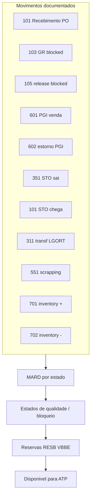
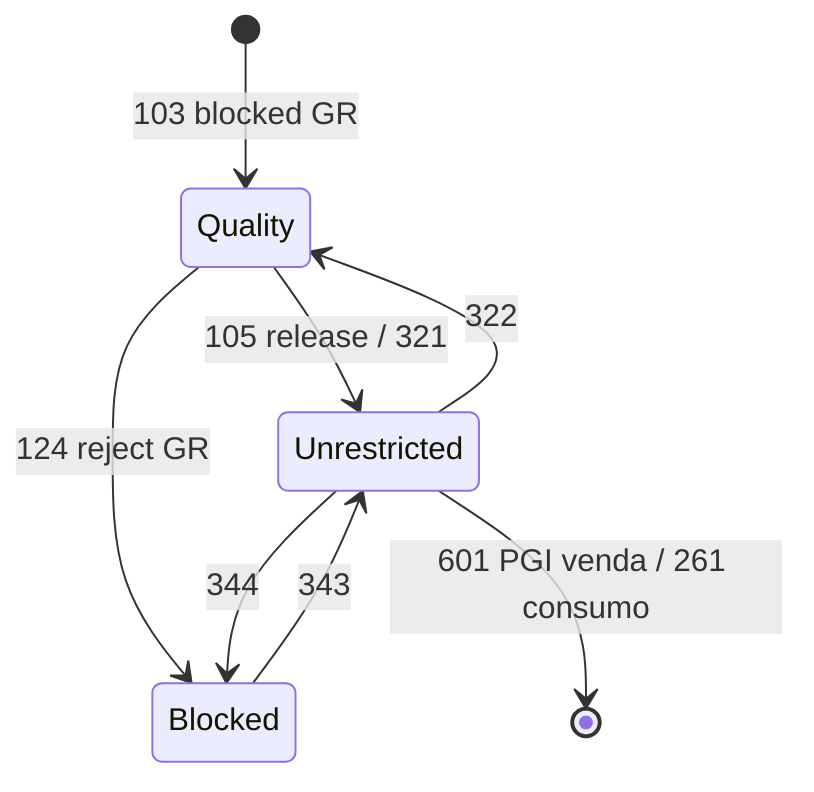

# Estoque e movimentos — quando o saldo «bate» mas o disponível não entrega

**Estoque** no ERP é **conta** regulada por **movimentos** (recebimento, saída por venda, transferência, ajuste, desmontagem). O saldo «contábil» pode **bater** com o inventário anual e, ainda assim, o **disponível para ATP** falhar — porque **reservas**, **bloqueios**, **qualidade** e **transitório** mudam o que é **promissível**.

Para logística, a pergunta certa não é «qual o saldo?», e sim «**qual saldo para qual decisão?**». Em SAP, isso vive numa coreografia entre `MARD` (saldo por *plant*+`LGORT`), `MCHB` (por lote), reservas (`RESB`), documentos de material (`MKPF`/`MSEG` em ECC, `MATDOC` em S/4) e tipos de movimento (`BWART`).

---

## Objetivos e resultado de aprendizagem

- Explicar diferença entre **saldo contábil**, **disponível**, **reservado** e **bloqueado**.
- Mapear **tipos de movimento SAP** (`BWART`) críticos: 101, 102, 103, 105, 122, 161, 309, 311, 351, 411-K, 601, 641, 643, 647, 901.
- Relacionar **valorização** (custo médio em `MBEW-VERPR`, padrão `STPRS`) com decisões de obsolescência e *write-off*.
- Calcular disponível em cenário com reserva, bloqueio e em trânsito.
- Conhecer t-codes de consulta: `MMBE`, `MB52`, `MB51`, `MB5B`, `MB5T`, `MB5L`.

**Duração sugerida:** 60–90 minutos.  
**Pré-requisitos:** [aula 01 — documentos e estados do pedido](aula-01-documentos-estados-pedido.md).

---

## Mapa do conteúdo

1. Gancho — lote em quarentena visível para o comercial.
2. Conceito — saldo, disponível, reservado, bloqueado.
3. Modelo de dados — `MARD`/`MCHB`/`MSKA`/`MSPR`/`MKPF`/`MSEG`.
4. Tipos de movimento (`BWART`) — tabela completa anotada.
5. Estados de qualidade — *unrestricted*, *quality*, *blocked*, *consignment*.
6. Valorização — médio, padrão, FIFO/LIFO; impacto BR.
7. Aprofundamentos — S/4 `MATDOC`; ERPs nacionais.
8. Caso prático — reconciliação WMS×ERP.
9. Erros, KPIs, glossário, exercícios.

---

## Gancho — lote em quarentena visível para o comercial

Lote chegou **fisicamente**; QC ainda não liberou. O **ATP** vendeu o mesmo lote para outro canal B2C com promessa agressiva. A **TechLar** aprendeu caro que **estado de qualidade** precisa nascer **antes** da promessa — senão o sistema transforma **não conformidade** em **não cumprimento** com cliente.

**Analogia do hospital:** o exame chegou ao laboratório (`MIGO` movimento 103, *blocked GR*); ainda **não está liberado** (movimento 105 ou rejeitado 124); o médico não pode dizer «curado» só porque o envelope está na mesa.

**Analogia do banco:** TED já saiu da sua conta (`MSEG` debitado), mas o crédito no destinatário ainda não compensou. Saldo «em trânsito» não é «disponível para sacar».

---

## Conceito-núcleo — saldo, disponível, reservado, bloqueado

| Categoria | Descrição | Onde mora em SAP |
|-----------|-----------|------------------|
| **Saldo total** | Soma física do que está no centro/depósito | `MARC-LABST` (centro agregado), `MARD-LABST` por LGORT |
| **Disponível (livre / *unrestricted*)** | Pronto para venda | `MARD-LABST` (deduz reservas para ATP) |
| **Em quality / inspeção** | Recebido mas não liberado | `MARD-INSME`, `MCHB-INSME` |
| **Bloqueado** | Não vendável (qualidade, financeiro, fiscal) | `MARD-SPEME` |
| **Em recebimento (*GR blocked*)** | Movimento 103 aguardando 105 | `MARD-EINME` |
| **Reservado** | Comprometido para ordem (venda, produção) | `RESB`, `VBBE` (por entrega) |
| **Em trânsito** | Transferência STO 351/641 entre centros | `MSEG` mvmt 351 → `MSEG` mvmt 101 destino |
| **Consignado vendor** | Estoque do fornecedor no seu CD (`K`) | `MKOL` |
| **Consignado cliente** | Seu estoque no cliente (`W`) | `MSKU` |
| **Subcontratação (`O`)** | Material entregue ao terceiro para serviço | `MSLB` |
| **Devolução / *blocked stock returns*** | Recebido em devolução (`A`/`B`) | `MARD-RETME` |

---

## Modelo de dados — saldos e documentos

| Tabela | Granularidade | Conteúdo |
|--------|---------------|----------|
| `MARD` | Material × Plant × Storage Location | Saldos por estado (LABST, INSME, SPEME, EINME, RETME) |
| `MCHB` | Material × Plant × Sloc × Lote | Saldos por lote |
| `MSKA` | Sales Order Stock | Estoque dedicado a ordem (E) |
| `MSPR` | Project Stock | Para projetos |
| `MKOL` | Consignação vendor | `K` |
| `MSKU` | Consignação cliente | `W` |
| `MSLB` | Subcontracting | `O` |
| `MKPF` | Cabeçalho material doc (ECC) | `MBLNR`, `MJAHR`, `BLDAT`, `BUDAT`, `USNAM` |
| `MSEG` | Item material doc (ECC) | `BWART`, `MATNR`, `WERKS`, `LGORT`, `MENGE`, `DMBTR` |
| `MATDOC` | Consolidação em S/4 | Substitui MKPF+MSEG |
| `RESB` | Reservas | Por componente de ordem (PP) ou manual |
| `VBBE` | Reservas SD por entrega | — |
| `T156` | Catálogo de `BWART` | — |

---

## Tipos de movimento (`BWART`) — os essenciais

| `BWART` | Nome | Quando ocorre |
|---------|------|---------------|
| **101** | GR para PO em estoque livre | `MIGO` recebimento padrão |
| **102** | Estorno do 101 | Devolução parcial ao fornecedor sem PO de devolução |
| **103** | GR para PO em *blocked stock* | Recebido mas pendente conferência |
| **105** | Liberação de 103 → livre | Após conferência OK |
| **122** | Devolução ao fornecedor | Com nota de débito |
| **123** | Estorno de 122 | — |
| **161** | GR de PO de devolução (cliente devolveu, voltamos para PO) | — |
| **261** | GI para ordem produção | Consumo de componente |
| **309** | Transferência entre materiais (mesmo centro) | Mudança de SKU |
| **311** | Transferência entre `LGORT` no mesmo centro | Movimento interno |
| **313/315** | *Stock-in-transit* dentro do centro | Two-step transfer |
| **321** | Quality → Unrestricted | Liberação QC |
| **322** | Unrestricted → Quality | Bloqueio QC após o fato |
| **331/332** | Unrestricted → Sample / estorno | Amostra destrutiva |
| **343/344** | Blocked → Unrestricted / estorno | Liberação manual |
| **351** | GI para STO (transferência entre centros) | Sai da origem para *in-transit* |
| **101 destino** | GR no destino do STO | — |
| **411-K** | Consignação K → estoque próprio | Quando «assume» o consignado |
| **601** | GI para entrega de venda | PGI no `VL02N` |
| **602** | Estorno do 601 | NF-e cancelada após GI |
| **641** | STO em uma etapa (one-step) | Move imediato origem→destino |
| **643** | STO cross-company com fatura | Entre empresas |
| **647** | STO one-step cross-company | — |
| **551** | Sucateamento (*scrapping*) | Write-off |
| **701/702** | Diferença de inventário (+/−) | Cíclico ou anual |
| **901** | GI de devolução / cliente | Customizável |

**Legenda:** todo movimento gera **document number** (`MBLNR`) — auditoria viável; sem `BWART` correto, ajuste vira «caixa-preta».

---

## Estados de qualidade e segregação

**Hipótese pedagógica:** se o WMS enxerga **endereço** e o ERP enxerga **valor agregado**, a reconciliação precisa de **cadastro** e de **motivo** — não só contagem.

---

## Valorização — o que logística precisa saber

| Modelo | Como funciona | Onde mora em SAP |
|--------|---------------|-------------------|
| **Custo médio (V)** | Recalcula a cada GR/IR | `MBEW-VERPR` |
| **Custo padrão (S)** | Fixo no período; diferenças vão para variance | `MBEW-STPRS` |
| **FIFO / LIFO** | Por camadas de aquisição | Função separada (`OMWE`, balanço FIFO) |
| **Material Ledger (S/4 obrigatório)** | Multi-currency, custo real periódico | `CKMLHD`, `CKMLPP` |

Logística sente **custo** de **write-off** quando SKU morre na prateleira (mvmt 551), mas a **forma** do lanço depende da política contábil. Em S/4, **Material Ledger é obrigatório** — fechamento periódico (`CKMLCP`) revisa custo médio com base nos consumos reais.

**Mensagem útil:** movimento **sempre** deixa rastro (`MSEG`/`MATDOC`); **ajuste** não é «apagar número» — é **declaração** com consequência fiscal/contábil. No BR, ajuste de inventário pode gerar **NF-e de regularização** dependendo do regime.

---

## Aprofundamentos — ECC vs. S/4 e ERPs nacionais

### S/4HANA simplificações

- `MKPF`+`MSEG` consolidados em `MATDOC` (menos JOINs, leitura mais rápida).
- `MARD-LABST` continua mas em algumas situações é **agregado on-the-fly** de `MATDOC`.
- Material Ledger sempre ativo.
- aATP nativo substitui APO GATP.

### ERPs nacionais

| ERP | Tabela saldo | Documento movimento | Tipos de movimento |
|-----|--------------|---------------------|--------------------|
| **Totvs Protheus** | `SB2` (saldo por filial), `SBF` (por endereço se WMS) | `SD3` (movimento interno), `SD1` (entrada), `SD2` (saída) | TM (tipo de movimento) configurável |
| **Sankhya** | `TGFEST` | `TGFITE` × `TGFCAB` (com TOP) | TOP define impacto |
| **Senior** | `E660ESM` | `E660MES` | TGN (tipo de movimento) |
| **Oracle EBS** | `MTL_ONHAND_QUANTITIES_DETAIL` | `MTL_MATERIAL_TRANSACTIONS` | Transaction Type |

---

## Caso prático — reconciliação WMS × ERP

**Cenário:** SKU `TL-7842`, plant `BR01`, LGORT `0001`. WMS Manhattan diz **2.150** EA. SAP `MMBE` mostra:

- `LABST` (livre): 1.800
- `INSME` (quality): 200
- `SPEME` (blocked): 50
- `EINME` (em GR pendente 103): 100
- Total `MARD`: 2.150 ✓

**Mas:** vendas tentam vender 1.900 EA → ATP responde **disponível: 1.800** → frustração comercial.

**Diagnóstico:**
- 200 em quality (lote chegou, QC pendente — `321` faltando).
- 50 blocked (motivo? consultar `MSEG` últimas linhas com `BWART=344`).
- 100 em 103 (GR feito sem 105 — fornecedor enviou docs?).

**Ações:**
1. QC: rodar inspeção pendente, mvmt 321 → libera 200.
2. Fiscal: investigar bloqueio, mvmt 343 se OK → libera 50.
3. Recebimento: completar 105 dos 100 EA pendentes.
4. Comunicar comercial: re-promessa em 24h.

---

## Aplicação — exercício

**Cenário:** estoque **100** unidades; **30** reservadas para pedido A; **10** bloqueadas por lote; **5** em transferência para outro CD ainda **não recebidas** no destino.

1. Qual o **disponível para novo ATP** na origem (conceitualmente)?
2. Se o WMS mostrar **105** no endereço, qual **hipótese** você investigaria primeiro?
3. Em SAP, qual t-code você usaria para ver o **detalhe por lote** (`MCHB`)?

**Gabarito:** disponível ≈ \(100 - 30 - 10 = 60\) (as **5** em trânsito dependem de como o ERP trata **estoque em transferência** — conceitualmente **não** devem aparecer como disponíveis no destino até recebimento). Risco: **dessincronia** WMS–ERP, **dupla contagem** de palete parcial ou **movimento pendente** de confirmação. T-code: `MB52` (saldo por material), `MMBE` (visão 360°), `MB51` (lista de movimentos), `MB58` (consignação cliente).

---

## Erros comuns e armadilhas

- Movimento **sem texto** (`MSEG-SGTXT`) → auditoria impossível.
- Transferência (351) **pendente** no meio do **mês fechado** — estoque em limbo (use `MB5T` para listar *in-transit*).
- Confundir **estoque em trânsito** com **disponível** no CD destino.
- Tratar **consignação** como estoque próprio no mesmo painel sem legenda (`MB54`/`MB58`).
- Resolver divergência **só** no WMS sem corrigir **documento** no ERP.
- Em S/4, ainda raciocinar em `MKPF`+`MSEG` quando `MATDOC` é a fonte.
- Movimento 561 (entrada inicial de estoque) usado como muleta de ajuste — mata histórico.
- Lote sem `VFDAT` cadastrado → FEFO impossível, FIFO vira LIFO de fato.

---

## KPIs técnicos e de negócio

| KPI | Pergunta | Dono | Fonte | Cadência | Playbook se ruim |
|-----|----------|------|-------|----------|------------------|
| **Acurácia de inventário por classe ABC** | Estoque é confiável? | Operação | Cíclico (`MI31`/`MI07`) | Mensal por classe | Aumentar frequência cíclica em A; investigar causa B/C |
| **Idade de estoque em quality (P50/P90)** | QC é gargalo? | Qualidade | `MARD-INSME` × idade GR | Semanal | SLA de inspeção; auto-release condicional |
| **% movimentos manuais (101/501/561)** | Operação é integrada? | TI + Operação | `MSEG-BWART` | Mensal | Reduzir ao mínimo; documentar motivo |
| **Volume de ajustes (701/702) por motivo** | Onde sangra? | Operação | `MSEG` agrupado por causa | Mensal | Pareto + ação em top 3 causas |
| **Estoque em trânsito > 7 dias (351 sem 101 destino)** | Há buracos? | Logística | `MB5T` | Semanal | RCA por lane; alerta automático |
| **Cobertura *vs.* disponível** | ATP × política de estoque | Planejamento + Comercial | aATP + S&OP | Quinzenal | Rebalancear alocação; aATP rule-based |

---

## Ferramentas e tecnologias relevantes

| Categoria | Ferramentas | Uso |
|-----------|-------------|-----|
| Consulta SAP | `MMBE` (panorama), `MB52` (saldo), `MB51` (mvmts), `MB5B` (saldo histórico), `MB5T` (em trânsito) | Operação diária |
| Inventário cíclico | `MI31` (criar doc), `MI04`/`MI07` (contagem/post), `MI20` (lista) | Acurácia |
| Reconciliação WMS×ERP | Scripts custom, `MB5L` (LGORT), interfaces EWM `/SCWM/MON` | Conciliação |
| Material Ledger | `CKMLCP` (fechamento), `CKM3` (preço atual) | Custeio S/4 |

---

## Glossário rápido

- **`BWART`:** *Bewegungsart* — tipo de movimento (chave 3 dígitos).
- **`MIGO`:** transação universal de movimento de mercadoria.
- **`MMBE`:** *Stock Overview* (panorama de estoque).
- **`MB52`:** lista saldo por material/centro/depósito.
- **`MB51`:** lista de documentos de material por critério.
- **`MARD`:** saldo por *plant*+`LGORT`+estado.
- **`MCHB`:** saldo por lote.
- **`MSEG`/`MKPF`:** item/cabeçalho de documento de material (ECC).
- **`MATDOC`:** tabela consolidada S/4.
- **PGI:** *Post Goods Issue* — disparo de movimento 601 na entrega de venda.
- **STO:** *Stock Transfer Order* (pedido de transferência entre centros).
- **`MBEW-VERPR`/`STPRS`:** preço médio/padrão.
- **`CKMLCP`:** *Material Ledger Closing*.

---

## Pergunta de reflexão

Qual motivo de ajuste hoje está **abusado** porque não tem dono — e qual o valor anual passado nesse «balde de lixo contábil»?

---

## Fechamento — três takeaways

1. Movimento bem desenhado é **rastreabilidade**; mal desenhado é **advogado** no fecho.
2. Saldo bonito com ATP mentiroso é **risco de reputação** — disponível ≠ saldo.
3. WMS e ERP precisam concordar **o que significa** «disponível» — senão, o motorista paga a conta emocional.

---

## Referências

1. **SAP Help Portal** — *Inventory Management / Goods Movement*: https://help.sap.com/
2. **SILVER, PYKE & PETERSON** — *Inventory Management and Production Planning and Scheduling*. Wiley.
3. **MAGAL & WORD** — *Integrated Business Processes with ERP Systems*. Wiley.
4. **CHOPRA & MEINDL** — *Supply Chain Management*. Pearson.
5. **APICS Dictionary** (ASCM): https://www.ascm.org/
6. SAP Note central de Material Ledger e MATDOC (SAP Support Portal).

---

## Pontes para outras trilhas

- **Fundamentos** → [estrutura de custos logísticos](../../trilha-fundamentos-e-estrategia/modulo-04-custos-logisticos-performance/aula-01-estrutura-custos-logisticos.md).
- **Dados** → [giro e cobertura de estoque](../../trilha-dados-analytics-logistica/modulo-04-indicadores-logisticos-kpis/aula-03-giro-cobertura-estoque-capital.md).
- Próxima aula → [integrações e batch](aula-03-integracoes-batch.md).
