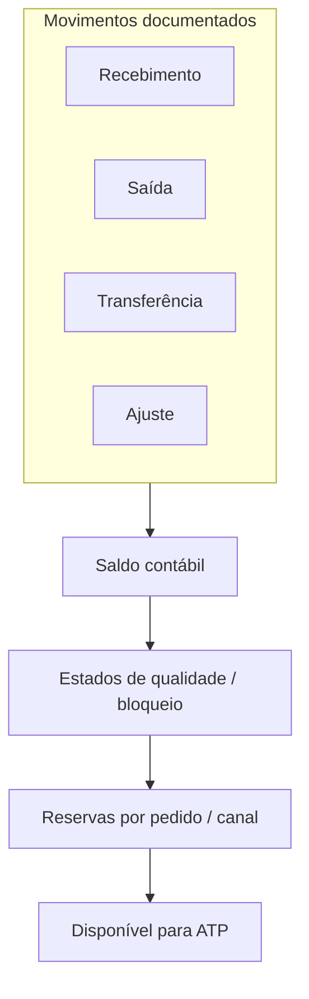

# Estoque e movimentos — quando o saldo «bate» mas o disponível não entrega

**Estoque** no ERP é **conta** regulada por **movimentos** (recebimento, saída por venda, transferência, ajuste, desmontagem). O saldo «contábil» pode **bater** com o inventário anual e, ainda assim, o **disponível para ATP** falhar — porque **reservas**, **bloqueios**, **qualidade** e **transitório** mudam o que é **promissível**.

Para logística, a pergunta certa não é «qual o saldo?», e sim «**qual saldo para qual decisão?**».

---

## Objetivos e resultado de aprendizagem

**Ao final desta aula**, você será capaz de:

- Explicar diferença entre **saldo contábil**, **disponível**, **reservado** e **bloqueado**.
- Mapear **tipos de movimento** típicos e o efeito no disponível.
- Relacionar **valorização** (custo) com decisões de obsolescência e **write-off** — sem ser contador, mas sem ser ingênuo.
- Calcular disponível em um cenário com reserva e bloqueio e apontar risco WMS–ERP.

**Duração sugerida:** 60–90 minutos.

---

## Gancho — lote em quarentena visível para o comercial

Lote chegou **fisicamente**; QC ainda não liberou. O **ATP** vendeu o mesmo lote para outro canal B2C com promessa agressiva. A **TechLar** aprendeu caro que **estado de qualidade** precisa nascer **antes** da promessa — senão o sistema transforma **não conformidade** em **não cumprimento** com cliente.

**Analogia do hospital:** o exame chegou ao laboratório, mas **não está liberado**; o médico não pode dizer «curado» só porque o envelope está na mesa.

---

## Tipos de movimento (lógica genérica)

| Tipo | Efeito típico no disponível | Comentário logístico |
|------|-----------------------------|----------------------|
| Recebimento de compra | + | Pode cair em quarentena |
| Saída para entrega de vendas | − | Momento do GI depende da política |
| Transferência entre locais | ± por local | **Em trânsito** não é disponível no destino |
| Ajuste de inventário | ± conforme motivo | Sem motivo, vira «lixo forense» |
| Devolução de cliente | + | Recondicionamento muda disponibilidade |
| Consumo para ordem industrial | − | Interface com produção |

**Legenda:** cada caixa é um **filtro** que transforma número em **decisão**.

---

## Estados de qualidade e segregação

Mesmo sem entrar em *screens* de um ERP específico, a lógica pedagógica é:

- **Irrestrito** (livre para venda conforme política).
- **Bloqueado qualidade** (aguardando inspeção, retenção regulatória).
- **Bloqueado financeiro** (disputa, penhora, *hold* de auditoria).
- **Consignado / terceiros** (não é «seu» disponível da mesma forma).

**Hipótese pedagógica:** se o WMS enxerga **endereço** e o ERP enxerga **valor agregado**, a reconciliação precisa de **cadastro** e de **motivo** — não só contagem.

---

## Valorização — o que logística precisa saber

Custo médio *vs.* FIFO *vs.* custo padrão — cada modelo muda **timing** do impacto no resultado quando há **ajuste** ou **obsolescência**. Logística sente **custo** de **write-off** quando SKU morre na prateleira, mas a **forma** do lanço depende da política contábil.

**Mensagem útil:** movimento **sempre** deixa rastro; **ajuste** não é «apagar número» — é **declaração** com consequência.

---

## Aplicação — exercício

Cenário: estoque **100** unidades; **30** reservadas para pedido A; **10** bloqueadas por lote; **5** em transferência para outro CD ainda **não recebidas** no destino.

1. Qual o **disponível para novo ATP** na origem (conceitualmente)?
2. Se o WMS mostrar **105** no endereço, qual **hipótese** você investigaria primeiro?

**Gabarito:** disponível ≈ \(100 - 30 - 10 = 60\) (as **5** em trânsito dependem de como o ERP trata **estoque em transferência** — conceitualmente **não** devem aparecer como disponíveis no destino até recebimento); risco **dessincronia** WMS–ERP, **dupla contagem** de palete parcial ou **movimento pendente** de confirmação.

---

## Erros comuns e armadilhas

- Movimento **sem tipo de motivo** → auditoria impossível.
- Transferência «pendente» no meio do **mês fechado** — estoque em limbo.
- Confundir **estoque em trânsito** com **disponível** no CD destino.
- Tratar **consignação** como estoque próprio no mesmo painel sem legenda.
- Resolver divergência **só** no WMS sem corrigir **documento** no ERP.

---

## KPIs e decisão

- **Acurácia de inventário** por classe ABC (não só global).
- **% de linhas** com reserva que expira ou é recriada manualmente.
- **Volume de ajustes** por motivo (top 5 causas raiz).

---

## Fechamento — três takeaways

1. Movimento bem desenhado é **rastreabilidade**; mal desenhado é **advogado** no fecho.
2. Saldo bonito com ATP mentiroso é **risco de reputação**.
3. WMS e ERP precisam concordar **o que significa** «disponível» — senão, o motorista paga a conta emocional.

**Pergunta de reflexão:** qual motivo de ajuste hoje está **abusado** porque não tem dono?

---

## Referências

1. SILVER, E. A.; PYKE, D. F.; PETERSON, R. *Inventory Management and Production Planning and Scheduling*. Wiley.  
2. CHOPRA, S.; MEINDL, P. *Supply Chain Management*. Pearson.  
3. Trilha Fundamentos — [gestão de estoques](../../trilha-fundamentos-e-estrategia/modulo-03-planejamento-demanda-sop/) (contexto de políticas).  
4. Trilha Dados — [giro e cobertura](../../trilha-dados-analytics-logistica/modulo-04-indicadores-logisticos-kpis/aula-03-giro-cobertura-estoque-capital.md).
