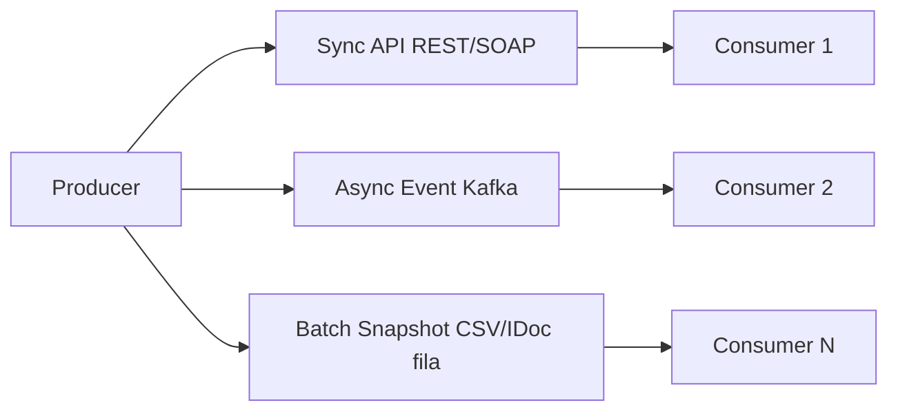
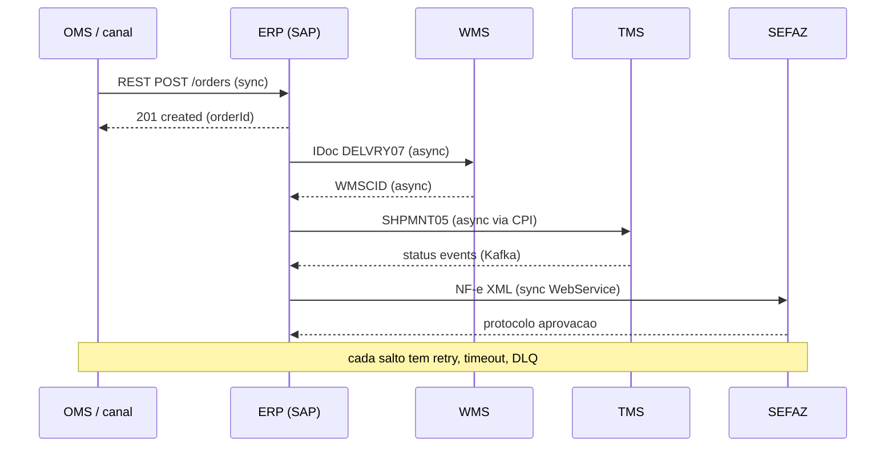
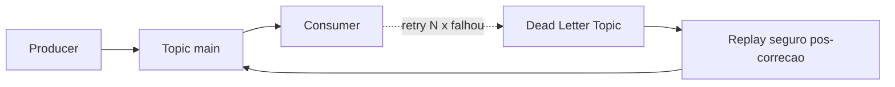
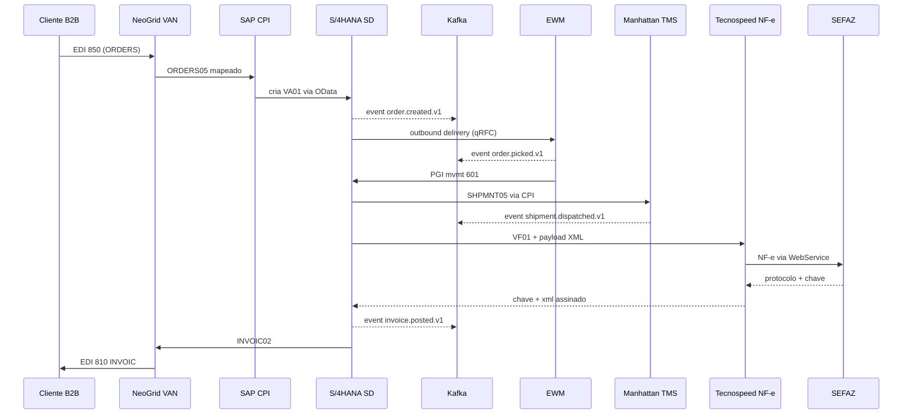

# Integrações em fila (*batch*) e em tempo quase real — quando o «sistema atrasou» é na verdade a fila

ERP raramente vive sozinho: **WMS**, **TMS**, **OMS**, **marketplace**, **PDV**, **EDI** e **portais governamentais** (SEFAZ no BR) trocam mensagens. **Batch** (fila noturna), **API síncrona** e **eventos** (Kafka, SAP Event Mesh) têm **trade-offs** de consistência, custo, observabilidade e **idempotência**. Falha clássica: a mesma mensagem processada **duas vezes** → pedido duplicado, recebimento duplicado, pagamento duplicado.

Esta aula é sobre **confiar, mas verificar** — com **correlation id**, **janelas**, **DLQ** e **replay** seguro. Vamos descer ao nível de **IDoc segments**, **Kafka topic schemas** e **canônicos** para que o coordenador possa **conversar** com TI sem se perder em jargão.

---

## Objetivos e resultado de aprendizagem

- Explicar **latência** *vs.* **consistência** em integrações logísticas.
- Listar **oito** falhas típicas e a mitigação correspondente (processo ou técnica).
- Descrever **idempotência** com exemplo ASN duplicado e *Idempotency-Key*.
- Argumentar quando **batch** ainda é saudável (e quando vira desculpa).
- Conhecer **IDocs SAP** mais relevantes para logística (`ORDERS05`, `DELVRY07`, `DESADV01`, `INVOIC02`, `SHPMNT05`, `WMSCID`, `MATMAS`).
- Posicionar **Apache Kafka**, **SAP Event Mesh**, **Mulesoft**, **CPI** e iPaaS modernos.

**Duração sugerida:** 60–90 minutos.  
**Pré-requisitos:** aulas 01–02 deste módulo.

---

## Mapa do conteúdo

1. Gancho — o mesmo ASN duas vezes.
2. Conceito — latência × consistência (CAP, eventual consistency).
3. Modelo de mensagem — IDocs SAP, EDI X12/EDIFACT, eventos canônicos.
4. Padrões de integração — sync, async, streaming, batch.
5. Idempotência, ordenação, replay, DLQ.
6. Aprofundamentos — middleware (CPI, Mulesoft, Boomi, Kafka, NeoGrid no BR).
7. Caso prático — pipeline pedido→entrega→fatura.
8. Erros, KPIs, glossário, exercícios.

---

## Gancho — o mesmo ASN duas vezes

Fornecedor reenviou o **ASN** (`DESADV01` por EDI) por erro; o integrador da **TechLar** não tinha **chave idempotente** (`E1EDL20-VBELN` somado ao `BELNR` da PO); nasceram **duas** recepções lógicas (mvmt 103 duplicado). O físico tinha **uma** carga. A reconciliação custou **horas** — e a confiança no dado, **semanas**. **Idempotência** não é frescura de arquiteto; é **anti-duplicidade** de dinheiro e estoque.

**Analogia da fila do banco:** duas fichas para o mesmo cliente não significam que ele tem **duas contas** — a menos que o sistema seja mal desenhado.

**Analogia do PIX:** o PIX exige `EndToEndId` único; mesmo que você dê *retry* 5 vezes, a transferência acontece **uma**. Logística precisa do mesmo princípio.

---

## Conceito-núcleo — latência × consistência

Inspirado no teorema **CAP** (Brewer): em sistema distribuído, escolher **2 de 3** entre Consistência, Disponibilidade, Tolerância a Partição. Em logística, geralmente **AP** (alta disponibilidade + tolerância) com **eventual consistency** — o estoque do site B2C pode ficar 30 segundos defasado e tudo bem; o estoque que alimenta NF-e **não pode**.

**Camadas de consistência:**

- **Forte (synchronous):** API REST com transação ACID — pedido confirmado **só** se reservou estoque.
- **Eventual (asynchronous):** evento Kafka «pedido criado» → consumidores reconciliam.
- **Periódica (batch):** snapshot noturno entre ERP e BI.



---

## Modelo de mensagem — IDocs, EDI, eventos canônicos

### IDocs SAP relevantes para logística

| IDoc | Direção típica | Para quê | Segmentos-chave |
|------|----------------|----------|-----------------|
| `ORDERS05` | Inbound (cliente→nós) | Ordem de venda via EDI | `E1EDK01` (controle), `E1EDP01` (item), `E1EDP19` (qualifier), `E1EDPA1` (partner) |
| `ORDRSP05` | Outbound | Confirmação de ordem ao cliente | — |
| `DELFOR02` | Inbound | *Delivery schedule* (forecast) — automotivo JIT | — |
| `DELINS02` | Inbound | *Delivery instruction* JIS | — |
| `DESADV01` | Outbound (nós→cliente) | ASN — aviso prévio embarque | `E1EDL20`, `E1EDL24`, `E1EDL37` (handling unit/SSCC) |
| `DELVRY07` | Inbound (WMS→ERP) | Atualização de delivery | Status picking, GI |
| `SHPMNT05` | Outbound (ERP→TMS externo) | Pedido de transporte | `E1TPHTH`, `E1TPSTH` |
| `INVOIC02` | Outbound (nós→cliente) ou inbound (vendor→nós) | Fatura | `E1EDK01`, `E1EDP01`, `E1EDS01` (totais) |
| `WMSCID` / `WMTOID` | WMS (terceiro) → SAP | Confirmação de TO/picking | — |
| `MATMAS05/06` | Bidirecional | Material master | — |
| `DEBMAS` / `CREMAS` | Bidirecional | Cliente / Fornecedor master | — |
| `WPDWGR` | Outbound | Preço varejo | Retail |

**Operação SAP:** `WE02` (lista IDoc), `WE05` (visão), `BD87` (reprocessar), `BD88` (lista status), `WE19` (testar). Campos canônicos: `EDIDC-DOCNUM`, `STATUS` (51 erro, 53 ok, 64 pronto para enviar).

### EDI X12 (predominante EUA) e EDIFACT (Europa/internacional)

| Mensagem | X12 | EDIFACT | Uso |
|----------|-----|---------|-----|
| Ordem | 850 | ORDERS | Pedido de compra |
| Confirmação ordem | 855 | ORDRSP | Confirmação |
| ASN | 856 | DESADV | Aviso embarque |
| Fatura | 810 | INVOIC | Fatura |
| Rec. mercadoria | 861 | RECADV | Confirmação recebimento |
| Status frete | 214 | IFTSTA | Tracking |
| Booking | 204 | IFTMBC | Pedido transporte |

**No Brasil:** **EDI Proceda** (.txt posicional, ainda muito usado), **EDI VDA** em automotivo, e crescentemente **EDI Web/API** com middleware **NeoGrid**, **Tradecloud**, **Mercado Eletrônico**, **Conexa**, **Linkforce**.

### Documentos fiscais BR (especificidade)

Não são EDI clássico, mas integrações críticas:

- **NF-e** (modelo 55 — mercadoria), **NFC-e** (65 — consumidor), **CT-e** (57 — transporte), **MDF-e** (58 — manifesto), **NFS-e** (serviço, municipal), **BP-e** (63 — passageiro), **Reinf**, **eSocial**.
- Padrão: XML assinado digitalmente (A1/A3), envio via **WebService SEFAZ** (síncrono ou assíncrono), retorno com **chave de acesso** (44 dígitos) e **protocolo**.
- Middleware: Tecnospeed, Migrate, NDD, eFatura, Sankhya MGE, ou módulo SAP **GRC NF-e** / **NF-e Brazil add-on**.

### Eventos canônicos modernos (Kafka / Event Mesh)

```json
{
  "eventId": "uuid-v4",
  "eventType": "logistics.order.shipped.v1",
  "occurredAt": "2026-04-19T18:30:00-03:00",
  "correlationId": "ord-2026-00012345",
  "source": "wms.manhattan.cd-sp",
  "data": {
    "orderId": "VBAK-0000123456",
    "deliveryId": "LIKP-0080001234",
    "asnNumber": "ASN-2026-9876",
    "carrier": "CARRIER001",
    "weightKg": 1245.6,
    "volumeM3": 4.2,
    "items": [
      { "sku": "TL-7842", "qty": 576, "uom": "EA", "batch": "L20260415" }
    ]
  },
  "metadata": {
    "schemaVersion": "1.0",
    "idempotencyKey": "ord-2026-00012345#shipped"
  }
}
```

**Princípios canônicos:** schema versionado (`v1`, `v2`), `eventId` único (idempotência), `correlationId` para rastreio ponta a ponta, `occurredAt` em ISO-8601 com fuso, `source` declarado, dados estáveis (não mistura `null`/`undefined`/`""`).

---

## Padrões de integração — quando usar cada um

| Padrão | Latência | Consistência | Custo | Bom para |
|--------|----------|--------------|-------|----------|
| **Sync REST/gRPC** | < 1s | Forte | Alto se tráfego grande | Pedido único, ATP, autorização |
| **Async (queue)** | seg–min | Eventual | Médio | ASN, atualização status, fatura |
| **Streaming (Kafka)** | ms–s | Eventual ordenada | Alto setup, baixo runtime | Eventos de alto volume (POS, IoT, telemetria) |
| **Batch (file/SFTP)** | min–hora | Snapshot | Baixo | Master data raro, conciliação contábil, BI |
| **Mensagem garantida (IBM MQ, RabbitMQ)** | seg–min | Forte com persistência | Médio | Transações financeiras, IDocs SAP |



---

## Idempotência, ordenação, replay e DLQ

### Idempotência

**Definição:** chamar a mesma operação N vezes produz o **mesmo efeito** que chamá-la uma vez.

**Como garantir:**
- API REST: header `Idempotency-Key` (UUID) — backend guarda hash `key→response` por janela (ex.: 24h).
- Eventos: `eventId` único; consumer mantém *outbox* visto.
- IDoc: `EDIDC-DOCNUM` é único; processador valida antes de criar documento de negócio.

### Ordenação

Em Kafka: ordenação **dentro da partição**. Use **partition key** estável (ex.: `orderId`) para garantir que eventos do mesmo pedido cheguem em ordem.

### Replay seguro

Após corrigir bug em consumer, reprocessar mensagens da DLQ (*Dead Letter Queue*) **sem efeito colateral** — depende de idempotência feita certo.

### DLQ

Mensagens que falham N vezes vão para DLQ; humano (ou alerta) analisa, corrige, reenvia. **Sem DLQ**, mensagem ruim entope a fila e bloqueia mensagens boas.



---

## Contrato de mensagem — o mínimo decente

1. **Chave de negócio** (pedido, linha, remessa, ASN).
2. **Idempotency key** (evita duplicidade em *retry*).
3. **Versão** do payload (`v1`, `v2` com coexistência por ≥ 2 ciclos).
4. **Timezone** e formato de data explícitos (ISO-8601).
5. **Correlation id** para rastrear ponta a ponta.
6. **Source** declarado (qual sistema produziu).
7. **Schema registry** (Avro, JSON Schema, Protobuf) — schema validado em produção.

---

## Aprofundamentos — middleware e ferramentas

| Categoria | Ferramentas | Quando usar |
|-----------|-------------|-------------|
| **iPaaS clássico** | SAP CPI / Integration Suite, Mulesoft Anypoint, Boomi, Workato | Stack SAP → CPI; multi-cloud → Mulesoft/Boomi |
| **Streaming** | Apache Kafka (Confluent, MSK), SAP Event Mesh, Azure Event Hubs, AWS Kinesis | Alto volume, eventos real-time |
| **EDI BR** | NeoGrid, Tradecloud, Conexa, Mercado Eletrônico, Linkforce | Conexão com transportadoras, varejo, indústria |
| **Mensageria garantida** | IBM MQ, RabbitMQ, Azure Service Bus, AWS SQS | IDoc-like, transações com persistência |
| **API Gateway** | Apigee, Kong, AWS API Gateway, Azure APIM | Expor APIs com rate limit, auth, observability |
| **Schema registry** | Confluent Schema Registry, Apicurio | Validação de contrato em CI/CD |
| **Observabilidade** | Datadog, New Relic, Splunk, ELK, Dynatrace | Traces, logs, métricas distribuídas |
| **NF-e BR** | Tecnospeed, Migrate, NDD, eFatura | Emissão e contingência |

**Padrão moderno:** **Outbox + CDC** — gravar evento na mesma transação do registro, capturar via Debezium e publicar em Kafka — garante atomicidade.

---

## Caso prático — pipeline pedido→entrega→fatura na TechLar

**Stack:** SAP S/4HANA + EWM + TMS Manhattan + Kafka + NeoGrid (EDI clientes) + Tecnospeed (NF-e).



**Pontos de monitoração:**
- `WE05` (status IDoc) com alerta para 51/52.
- Kafka consumer lag por tópico.
- Latência p95 SEFAZ (contingência se > 10s).
- NeoGrid: dashboard de mensagens enviadas/falhadas por cliente.
- DLQ Kafka com alerta após N mensagens.

---

## Aplicação — exercício

Liste **oito** falhas típicas de integração e, para cada uma, **uma** mitigação de processo ou técnica:

1. **Timeout** → `Idempotency-Key` + retry exponencial.
2. **Schema alterado sem aviso** → schema registry + CI/CD com *contract tests*.
3. **Relógio errado / fuso** → ISO-8601 com offset; NTP em todos os servidores.
4. **Duplicidade** → chave idempotente + dedup em consumer.
5. **Encoding (UTF-8 vs. ISO-8859-1)** → forçar UTF-8 no contrato; teste com caracteres especiais (ç, ã).
6. **Certificado expirado** → monitor de validade + rotação automática (Let's Encrypt, AWS ACM).
7. **Throttling / rate limit** → backoff + circuit breaker (Resilience4j, Polly).
8. **Payload truncado / chunked** → validar tamanho; *streaming* para grandes volumes.

**Bônus exigidos no gabarito:** monitoração de fila, alerta de divergência ERP–WMS, teste de regressão de contrato, replay com idempotência, dashboard de *lag* p95.

---

## Erros comuns e armadilhas

- «Corrigir no destino» sem corrigir **fonte** — o erro volta na próxima sincronização.
- Logs sem **correlation id** — impossível contar a história do pedido.
- Mudança de *payload* sexta à noite **sem** janela — Black Friday do time de integração.
- Assumir que **HTTP 200** significou **negócio processado** (pode ser «aceito para processar»).
- Tratar integração como **projeto** único em vez de **produto** com dono e SLO.
- IDoc em status `64` (pronto para envio) acumulando — ninguém lê `BD87`.
- Kafka sem `min.insync.replicas` correto → mensagem perdida em falha de broker.
- NF-e em contingência **EPEC/SVC** sem playbook — SEFAZ cai e ninguém sabe o que fazer.

---

## KPIs técnicos e de negócio

| KPI | Pergunta | Dono | Fonte | Cadência | Playbook se ruim |
|-----|----------|------|-------|----------|------------------|
| **Lag p50/p95 evento físico → ERP** | WMS↔ERP em sintonia? | TI integração | Timestamp WMS + `MKPF-CPUDT/CPUTM` | Diário | SLO < 5 min p95; alerta acima |
| **Taxa de mensagens em DLQ por causa raiz** | Onde quebra mais? | TI integração + Operação | Kafka DLQ / `WE05` IDoc | Semanal | Pareto + ação na top 3 |
| **% pedidos com divergência canal × ERP pós-cutover** | Reconciliação OK? | Comercial + TI | OMS log + ERP | Diário em janela crítica | Snapshot horário; auto-reconciliação |
| **Disponibilidade SEFAZ por UF (BR)** | Operação NF-e estável? | Fiscal + TI | Tecnospeed/Migrate dashboard | Diário | Acionar contingência EPEC/SVC com playbook |
| **Tempo médio NF-e (envio → autorização)** | Latência fiscal? | Fiscal | NF-e log | Diário | < 5s normal; > 30s investigar |
| **% IDocs com erro 51 não resolvidos em 24h** | Backlog técnico? | TI | `WE05` + script | Diário | Squad on-call; roteiro de retrabalho |

---

## Ferramentas e tecnologias relevantes

| Categoria | Ferramentas | Notas |
|-----------|-------------|-------|
| iPaaS | SAP CPI, Mulesoft, Boomi, Workato | CPI obrigatório em projetos S/4 cloud |
| Streaming | Confluent Kafka, MSK, Event Mesh | Schema registry + Connect |
| EDI BR | NeoGrid, Tradecloud, Conexa, Mercado Eletrônico, Linkforce | Cobertura grandes varejistas |
| NF-e BR | Tecnospeed, Migrate, NDD, eFatura, GRC NFE add-on SAP | Contingência obrigatória |
| API Gateway | Apigee, Kong, AWS APIM, Azure APIM | Auth, rate limit, observability |
| Observabilidade | Datadog, New Relic, Splunk, ELK | Tracing distribuído (OpenTelemetry) |

---

## Glossário rápido

- **IDoc:** *Intermediate Document* SAP, formato estruturado de troca.
- **EDI:** *Electronic Data Interchange* (X12, EDIFACT, Proceda BR).
- **iPaaS:** *Integration Platform as a Service* (CPI, Mulesoft, Boomi).
- **DLQ:** *Dead Letter Queue* — mensagens que falharam N vezes.
- **Idempotência:** mesma operação N vezes = 1 efeito.
- **Outbox pattern:** gravar evento na mesma TX do registro; CDC publica.
- **CDC:** *Change Data Capture* (Debezium, GoldenGate).
- **Schema registry:** repositório de contratos versionados.
- **`WE02`/`WE05`/`BD87`:** transações SAP de monitoramento e reprocessamento de IDocs.
- **NeoGrid:** middleware EDI brasileiro líder.
- **SEFAZ:** Secretaria da Fazenda (BR) — autoriza NF-e/CT-e/MDF-e.

---

## Pergunta de reflexão

Qual fila hoje **ninguém** monitora até o cliente reclamar — e qual seria o **custo da próxima** Black Friday se ela atrasar 4 horas?

---

## Fechamento — três takeaways

1. Integração boa é **chata**: repetível, observável e reversível.
2. Idempotência protege **estoque** e **caixa** — não só «banco de dados».
3. Batch sem painel é **caixa-preta**; API sem contrato é **caos em câmera lenta**.

---

## Referências

1. **HOHPE & WOOLF** — *Enterprise Integration Patterns*. Addison-Wesley.
2. **NEWMAN, Sam** — *Building Microservices*. O'Reilly.
3. **Confluent** — *Kafka: The Definitive Guide*: https://www.confluent.io/resources/kafka-the-definitive-guide-v2/
4. **SAP Help Portal** — *IDoc Interface / ALE*: https://help.sap.com/
5. **GS1** — padrões EDI EANCOM: https://www.gs1.org/standards/edi
6. **Receita Federal BR** — Manual NF-e/CT-e/MDF-e: https://www.nfe.fazenda.gov.br/
7. **NeoGrid** — documentação técnica: https://www.neogrid.com/
8. CHOPRA & MEINDL — *Supply Chain Management*. Pearson.

---

## Pontes para outras trilhas

- **Dados** → [qualidade e viés](../../trilha-dados-analytics-logistica/modulo-01-data-analytics-para-logistica/aula-02-qualidade-vies-demanda-fantasma.md): contrato técnico vira viés analítico.
- **Fundamentos** → [nível de serviço](../../trilha-fundamentos-e-estrategia/modulo-04-custos-logisticos-performance/aula-03-nivel-servico-kpis-logisticos.md).
- Próximo módulo → [WMS — sinal físico e evento](../modulo-03-wms/aula-01-sinal-fisico-evento-wms.md).
