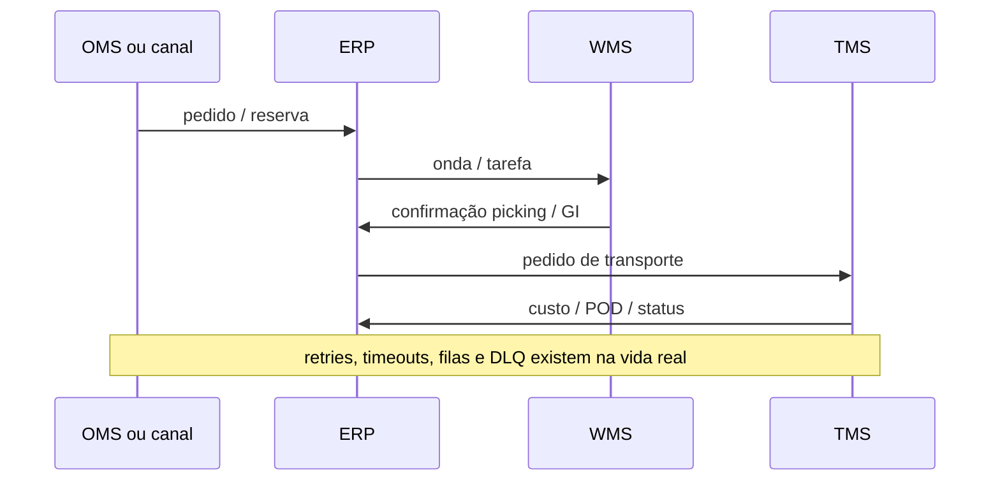
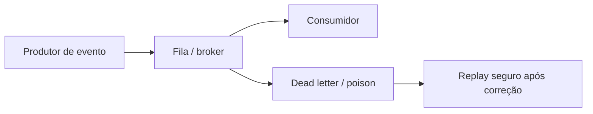

# Integrações em fila (*batch*) e em tempo quase real — quando o «sistema atrasou» é na verdade a fila

ERP raramente vive sozinho: **WMS**, **TMS**, **OMS**, **marketplace**, **PDV** e **EDI** trocam mensagens. **Batch** (fila noturna) e **API** (*near real-time*) têm **trade-offs** de consistência, custo, observabilidade e **idempotência**. Falha clássica: a mesma mensagem processada **duas vezes** → pedido duplicado, recebimento duplicado, pagamento duplicado.

Esta aula é sobre **confiar, mas verificar** — com **correlation id**, **janelas** e **replay** seguro.

---

## Objetivos e resultado de aprendizagem

**Ao final desta aula**, você será capaz de:

- Explicar **latência** *vs.* **consistência** em integrações logísticas.
- Listar **oito** falhas típicas e a mitigação correspondente (processo ou técnica).
- Descrever **idempotência** com exemplo ASN duplicado.
- Argumentar quando **batch** ainda é saudável (e quando vira desculpa).

**Duração sugerida:** 60–90 minutos.

---

## Gancho — o mesmo ASN duas vezes

Fornecedor reenviou o **ASN** por erro; o integrador da **TechLar** não tinha **chave idempotente**; nasceram **duas** recepções lógicas. O físico tinha **uma** carga. A reconciliação custou **horas** — e a confiança no dado, **semanas**. **Idempotência** não é frescura de arquiteto; é **anti-duplicidade** de dinheiro e estoque.

**Analogia da fila do banco:** duas fichas para o mesmo cliente não significam que ele tem **duas contas** — a menos que o sistema seja mal desenhado.

---

## Mapa mental — quem chama quem

**Legenda:** cada seta precisa de **contrato** (schema), **versão** e **política de erro**.

---

## Batch *vs.* API / eventos

| Aspecto | Batch / fila | API / eventos |
|---------|----------------|----------------|
| Latência | Minutos a horas | Segundos |
| Custo operacional de falha | Atraso acumulado | Incidente imediato em canal |
| Consistência | «Foto» periódica | «Vídeo» contínuo |
| Complexidade | Reconciliação grande | *Circuit breaker*, *rate limit* |
| Teste | Janela noturna | *Canary* / sombra |

**Hipótese pedagógica:** batch não morreu — **muitas** reconciliações financeiras ainda são saudáveis em fila; o problema é batch **sem** monitoração e sem **dead letter queue** clara.

---

## Contrato de mensagem — o mínimo decente

Um contrato maduro define:

1. **Chave de negócio** (pedido, linha, remessa, ASN).
2. **Idempotency key** (evita duplicidade em *retry*).
3. **Versão** do payload (`v1`, `v2` com coexistência).
4. **Timezone** e formato de data explícitos.
5. **Correlation id** para rastrear ponta a ponta.

---

## Aplicação — exercício

Liste **oito** falhas típicas de integração (*timeout*, *schema* alterado, relógio errado, duplicidade, *encoding*, certificado expirado, *throttling*, payload truncado) e, para cada uma, **uma** mitigação de processo ou técnica.

**Gabarito pedagógico:** deve incluir **monitoração de fila**, **alerta de divergência ERP–WMS**, **teste de regressão** de contrato, **replay** com idempotência, **dashboard** de *lag* p95.

---

## Erros comuns e armadilhas

- «Corrigir no destino» sem corrigir **fonte** — o erro volta na próxima sincronização.
- Logs sem **correlation id** — impossível contar a história do pedido.
- Mudança de *payload* sexta à noite **sem** janela — Black Friday do time de integração.
- Assumir que **HTTP 200** significou **negócio processado** (pode ser «aceito para processar»).
- Tratar integração como **projeto** único em vez de **produto** com dono e SLO.

---

## KPIs e decisão

- **Lag p50/p95** entre evento físico e registro ERP (especialmente GI e POD).
- **Taxa de mensagens** na DLQ por causa raiz.
- **% pedidos** com divergência de quantidade entre canais após *cut-over*.

---

## Fechamento — três takeaways

1. Integração boa é **chata**: repetível, observável e reversível.
2. Idempotência protege **estoque** e **caixa** — não só «banco de dados».
3. Batch sem painel é **caixa-preta**; API sem contrato é **caos em câmera lenta**.

**Pergunta de reflexão:** qual fila hoje **ninguém** monitora até o cliente reclamar?

---

## Referências

1. BOWERSOX, D. J.; et al. *Supply Chain Logistics Management*. McGraw-Hill.  
2. NIST / boas práticas de engenharia de software para APIs (tipo de fonte: literatura técnica geral).  
3. GS1 / setores — padrões EDI e identificação (consultar norma do seu setor).  
4. Trilha Dados — [qualidade e viés](../../trilha-dados-analytics-logistica/modulo-01-data-analytics-para-logistica/aula-02-qualidade-vies-demanda-fantasma.md).
