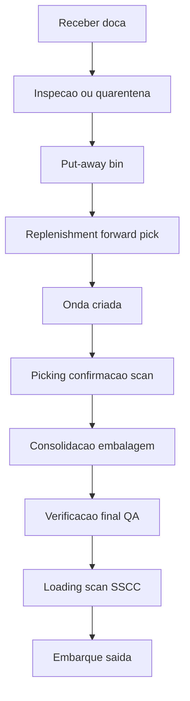
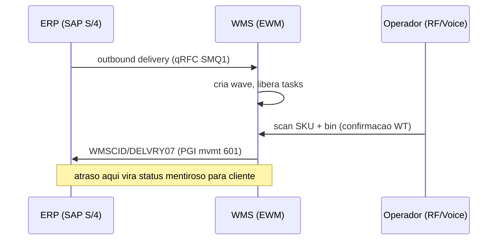

# Do sinal físico ao evento WMS — scan honesto, estoque honesto

**WMS** (*Warehouse Management System*) registra **tarefas** e **confirmações** no espaço: endereço (bin), zona, doca, equipamento, operador. Cada **scan** (RF gun, voice, smartphone, RFID) idealmente gera um **evento** que alimenta saldo, rastreabilidade, **onda** seguinte e, por reflexo, **ATP** no ERP. Quando o scan é «facultativo» ou quando o sistema permite **confirmar em lote** sem validação física, o WMS vira **teatro** — e o inventário, **loteria** com custo de capital.

Este capítulo posiciona o WMS como **sistema de evento espacial**, mapeia os principais fornecedores (Manhattan Active WM, Blue Yonder Luminate Warehouse, SAP EWM, Oracle WMS Cloud, Mecalux Easy WMS, Infor SCE, WiseTech CargoWise), e desenha a **fronteira** ERP↔WMS de forma explícita.

---

## Objetivos e resultado de aprendizagem

- Explicar a cadeia **sinal físico → evento → saldo → promessa** ao cliente.
- Posicionar a **fronteira ERP ↔ WMS** e listar decisões de desenho inevitáveis (onde nasce ATP, quem dona o endereço).
- Definir **seis** eventos mínimos entre chegada e saída do caminhão com *timestamp* pedagógico.
- Relacionar **KPI de produtividade** com risco de **evento falso**.
- Conhecer os principais **objetos WMS** (bin, HU, wave, task, LPN/SSCC) e como mapeiam em SAP EWM e equivalentes.

**Duração sugerida:** 60–90 minutos.  
**Pré-requisitos:** módulo 2 (ERP, integrações).

---

## Mapa do conteúdo

1. Gancho — operador confirmou sem olhar.
2. Conceito — WMS como GPS interno.
3. Modelo de dados — bin, HU, task, wave (com tabelas EWM).
4. Fronteira ERP↔WMS — decisões de desenho.
5. Aprofundamentos — fornecedores comparados.
6. Integrações — IDoc/qRFC/API entre EWM e ERP; eventos.
7. Erros, KPIs, glossário, exercícios.

---

## Gancho — o operador confirmou sem olhar

Na **TechLar**, meta de **linhas/hora** pressionou confirmações **em bruto** (confirmar caixa inteira sem conferência de mix). O estoque «andou» sem movimento físico coerente até o inventário cíclico **explodir** em SKU de alta rotação. **KPI** sem **qualidade de evento** corrompe o sistema — porque **o que medimos é o que otimizamos**, inclusive mentiras.

**Analogia do *check-in* em hotel:** se o recepcionista marca «entregue chave» sem o hóspede subir, o hotel parece **cheio** e **vazio** ao mesmo tempo — até alguém tentar dormir na cama.

**Analogia do correios rastreio:** «entregue» sem assinatura válida no PDA do carteiro não é entrega — é ficção operacional que vira reclamação no Procon.

---

## Conceito-núcleo — WMS como «GPS interno»

O WMS responde perguntas espaciais:

- **Onde** está cada unidade (endereço/bin)?
- **Como** chegar lá (tarefa, rota de picking otimizada)?
- **Quem** fez o quê (audit trail por operador, equipamento, turno)?
- **Em qual estado** está (quarentena, bloqueado, liberado, em pick, em embarque)?

**Legenda:** exceções (devolução, *recount*, *replenishment*, *cross-dock*, *kitting*) são ramificações reais — o fluxograma linear é propósito **didático**, não completo.

---

## Modelo de dados — objetos centrais do WMS

| Objeto | Definição | SAP EWM (tabela / objeto) | Equivalente outros |
|--------|-----------|---------------------------|---------------------|
| **Storage Bin** | Posição física endereçável | `/SCWM/T331` (bin), `/SCWM/AQUA` (saldo por bin) | Manhattan: Location; BY: Slot |
| **Handling Unit (HU)** | Embalagem que contém produto + identificador | `/SCWM/HU_HDR` | Manhattan: LPN (License Plate Number); BY: Container |
| **SSCC** | Identificador serial GS1 da HU/palete | `EAN11` na HU, padrão GS1 (00) | Universal — todos suportam |
| **Storage Type** | Categoria de área (palete, picking, quarentena) | `/SCWM/T301` | Manhattan: Area Type |
| **Storage Section** | Subdivisão dentro do tipo | `/SCWM/T303` | — |
| **Activity Area** | Agrupamento operacional para tarefas | `/SCWM/T338` | Manhattan: Work Zone |
| **Warehouse Order (WO)** | Conjunto de tarefas para um operador | `/SCWM/WHO` | Manhattan: Pick List; BY: Pick Wave |
| **Warehouse Task (WT)** | Instrução atômica (mover de A para B) | `/SCWM/ORDIM_C` (confirmadas) | Universal — *task* |
| **Wave** | Agrupamento de pedidos para release | `/SCWM/WAVEHDR` | Universal — *wave* |
| **Inbound/Outbound Delivery (EWM)** | Documento de chegada/saída | `/SCDL/DB_PROCH_O` | — |
| **Resource (RF gun, voice headset)** | Recurso operacional autenticado | `/SCWM/RSRC` | Manhattan: User Device |
| **Storage Process** | Fluxo configurável (1-step, 2-step put-away) | `/SCWM/T332` | — |

---

## Fronteira ERP ↔ WMS — decisões que não podem ficar implícitas

Documente em **blueprint** ou **runbook**:

1. **Onde nasce o saldo definitivo** para ATP — na confirmação de picking (`PICK confirm`), no embarque (`LOAD`), no GI (`PGI` mvmt 601 no ERP)?
2. **Quem é dono do endereço** — WMS (com `/SCWM/T331`), mestre compartilhado, governança conjunta?
3. **Como** tratar **diferença** (mais/menos) entre ASN e físico? Tolerância? Bloqueio? Posting de variance?
4. **Como** reconciliar **lote** e **serial** quando o canal exige rastreio fino (recall, regulatório)?
5. **Que evento** dispara movimento no ERP? `WMSCID` por confirmação, ou batch noturno?
6. **Como** tratar **partial pick** (parcialidade no picking) — segue ou retorna?
7. **Quem** define **estratégia de slotting** — WMS (algoritmo) ou planejamento (manual com input WMS)?

**Legenda:** quando ERP e WMS discordam, o cliente sente **antes** do financeiro. Lag p95 deve ser SLO < 5 min em operação saudável.

---

## Aprofundamentos — fornecedores de WMS

| Fornecedor / produto | Pontos fortes | Limitações | Quando faz sentido |
|----------------------|----------------|------------|---------------------|
| **Manhattan Active WM (MAWM)** | Líder Gartner; cloud nativo; APIs modernas; *omnichannel* | Custo alto; implantação complexa | Grande varejo, 3PL, e-commerce intensivo |
| **Blue Yonder Luminate Warehouse** | Forte em CPG e varejo; otimização ML | Migração de versões legadas (RedPrairie); custo | Multinacional consolidada |
| **SAP EWM (S/4HANA)** | Nativo SAP; integração profunda; embedded ou decentralized | Curva de aprendizagem; foco SAP-first | Operação SAP-cêntrica |
| **SAP WM clássico** | Maduro, simples | **Descontinuado** (manutenção SAP termina); migrar para EWM | Apenas legado |
| **Oracle WMS Cloud (NetSuite WMS)** | Boa para Oracle EBS/Cloud; SaaS | Menos *deep* que Manhattan | Operação Oracle |
| **Mecalux Easy WMS** | Bom custo-benefício; integração com automação Mecalux | Menos features avançadas | Mid-market BR/EU; armazéns automatizados Mecalux |
| **Infor SCE / Infor WMS** | Forte em distribuição, alimentos | Roadmap incerto após aquisições | Operação Infor existente |
| **WiseTech CargoWise** | Forte em logística internacional, *forwarding* | Não é WMS de primeiro estoque típico | 3PL/4PL com foco internacional |
| **Senior WMS (BR)** | Nacional; integração ERP Senior | Funcionalidade menor que líderes | PME BR |
| **Totvs WMS / Datasul WMS** | Integração nativa Protheus | Limitado para operação avançada | PME BR Totvs |
| **Locus, MSL, Selbetti, Voicelog (BR)** | Soluções nacionais especializadas | Coberturas variáveis | Operações específicas BR |

**Tendências 2026:**
- **Composable / cloud-native** (Manhattan Active arquitetura serverless).
- **WES** (*Warehouse Execution System*) acima do WMS para orquestrar automação (AS/RS, AGV, robôs Geek+/Locus/AutoStore).
- **AI/ML** para slotting dinâmico, previsão de tarefas, anomalia.
- **Voice + Vision** combinados (Honeywell Vocollect, Lucas WorkAttended).

---

## Integrações — EWM ↔ S/4 e WMS terceiros

### EWM **embedded** em S/4 (mesma instância)

- Comunicação via **chamadas internas** (synchronous), sem IDoc.
- Replicação master via **CIF** (*Core Interface*).
- Vantagem: latência mínima.

### EWM **decentralized** (sistema separado)

- Comunicação via **qRFC** (queued RFC) em filas `SMQ1`/`SMQ2`.
- Documentos: `DELVRY07` (delivery), `WMSCID` (confirmation), `MATMAS` (master).
- Vantagem: isolamento; útil para 3PL multi-cliente.

### WMS de terceiros (Manhattan, BY) ↔ SAP

Mensagens típicas:
- **Outbound:** `DELVRY07` (delivery) → JSON/XML para WMS.
- **Inbound:** confirmação picking + GI → `WMSCID` → SAP cria mvmt 601.
- **Master:** `MATMAS`, `DEBMAS`, `LOIPRO` (UoM), `LOIWHS` (warehouse master).
- **Status:** eventos Kafka (`shipment.picked`, `wave.released`).

---

## Aplicação — exercício

Liste **seis** eventos WMS mínimos entre «caminhão chegou» e «caminhão saiu», com **timestamp** sugerido para cada um.

**Gabarito pedagógico:**

1. `gate.arrival` (chegada na portaria) — `T0`.
2. `dock.assigned` (doca atribuída) — `T0+5min`.
3. `unload.start` / `unload.end` (descarga) — janela típica 20–60 min.
4. `asn.match.complete` (conferência ASN — qty, lote) — fim da descarga.
5. `putaway.complete` (estoque endereçado) — pode ser horas após.
6. `wave.released` (onda atribuída a operador) — em ciclo de planejamento.
7. `pick.confirmed` (último scan da onda) — fim de turno em pico.
8. `consolidation.done` + `pack.done` (consolidação/embalagem) — antes do *cut-off*.
9. `qa.passed` (verificação final, opcional) — antes do load.
10. `load.start` / `load.end` (loading com scan SSCC) — janela 15–45 min.
11. `gate.departure` (saída) — `Tn`.

Aceitar variações com **motivo** e **foto** de divergência.

---

## Erros comuns e armadilhas

- **Motivo** de diferença inexistente ou genérico «outros» — impossível melhorar causa raiz.
- Endereço **fantasma** (cadastrado, fisicamente inacessível) — algoritmo de picking «sonha».
- Misturar **SKU consignado** com **próprio** sem marcação — risco fiscal e operacional.
- **Meta de velocidade** sem amostragem de qualidade de scan — incentiva fraude operacional leve.
- Não ter **política** de *recount* quando variância > limiar (ex.: > 1% do valor da onda).
- RF gun com **scan facultativo** ou *override* sem aprovação — vira teatro.
- Voice picking sem treino → erro de SKU homófono («um cinco» × «quinze»).
- Bin sem dimensão cadastrada → algoritmo de put-away aloca palete em prateleira de eaches.
- WMS sem **synchronization** de master master após mudança de embalagem.

---

## KPIs técnicos e de negócio

| KPI | Pergunta | Dono | Fonte | Cadência | Playbook se ruim |
|-----|----------|------|-------|----------|------------------|
| **Inventory accuracy** (cíclico) | Estoque é confiável? | Operação | Inventário cíclico WMS | Mensal por zona | Ciclo mais frequente em zonas A; RCA |
| **First-time-right recebimento** | Quem entrega bem? | Recebimento | WMS exception log | Semanal | Pareto fornecedor; QBR |
| **Lag p95 evento WMS → ERP** | Integração saudável? | TI + Op | Timestamps | Diário | SLO < 5 min |
| **Linhas/hora × erro de picking** | Velocidade vs. qualidade | Op + RH | WMS productivity | Diário | Nunca um sem o outro; ajustar incentivo |
| **% bins com discrepância** (cíclico) | Endereçamento OK? | Op | Inventory cycle | Mensal | Recount focado em zona |
| **Idade de tarefa pendente (P90)** | Backlog operacional? | Supervisor | WMS task list | Diário | Realocação de equipe; mais ondas menores |
| **% ondas liberadas sem capacidade de embalagem** | Planejamento × execução | Planejamento | WMS + dock plan | Diário | Limite hard de WIP no pack |

---

## Ferramentas e tecnologias relevantes

| Categoria | Ferramentas | Uso |
|-----------|-------------|-----|
| WMS | Manhattan Active, BY Luminate, SAP EWM, Oracle WMS, Mecalux | Núcleo |
| RF / Voice | Zebra, Honeywell, Datalogic; Vocollect, Lucas, Lydia | Captura de evento |
| RFID | Impinj, Zebra | Visibilidade alta densidade (apparel, asset tracking) |
| WES | Manhattan WES, Körber, Honeywell Momentum | Orquestração de automação |
| Automação | Dematic, SSI Schäfer, Mecalux, Geek+, AutoStore, Locus, 6 River | AS/RS, AGV, AMR |
| Visualização | Power BI, Tableau, dashboards nativos WMS | Operação e gestão |
| Andon / sinalização | Painéis físicos + alertas Slack/Teams | Comunicação chão de fábrica |

---

## Glossário rápido

- **WMS:** *Warehouse Management System*.
- **WES:** *Warehouse Execution System* (orquestra automação).
- **WCS:** *Warehouse Control System* (camada mais baixa, talk to PLCs).
- **HU:** *Handling Unit* — embalagem identificável.
- **LPN:** *License Plate Number* (Manhattan; equivalente a HU).
- **SSCC:** *Serial Shipping Container Code* (GS1, 18 dígitos).
- **Bin:** localização endereçável.
- **Wave:** onda de pedidos liberada para picking.
- **WT:** *Warehouse Task*.
- **WO:** *Warehouse Order* (pacote de tasks).
- **Slotting:** decisão de onde colocar cada SKU.
- **EWM:** *Extended Warehouse Management* (SAP).
- **`/SCWM/*`:** namespace de tabelas EWM em SAP.

---

## Pergunta de reflexão

Qual zona hoje é **gargalo** mas **não aparece** no WMS como tal — e qual evento faltante esconde isso?

---

## Fechamento — três takeaways

1. WMS é **disciplina espacial** digitalizada; sem endereço verdadeiro, o algoritmo alucina.
2. Evento sem física é **dívida** que explode no inventário ou no cliente.
3. A fronteira com ERP precisa de **dicionário** compartilhado — não de «acordo verbal na cantina».

---

## Referências

1. **Gartner** — *Magic Quadrant for Warehouse Management Systems* (anual): https://www.gartner.com/
2. **Manhattan Associates** — Active Warehouse Management: https://www.manh.com/
3. **SAP Help Portal** — *Extended Warehouse Management*: https://help.sap.com/docs/SAP_EWM
4. **Blue Yonder** — Luminate Warehouse: https://blueyonder.com/
5. **GS1** — *Logistics Label Standard* (SSCC): https://www.gs1.org/standards/logistic-label
6. BOWERSOX et al. — *Supply Chain Logistics Management*. McGraw-Hill.
7. **WERC** — *Warehousing Education and Research Council*: https://www.werc.org/
8. **ABRALOG / ILOS BR** — benchmarks WMS Brasil.

---

## Pontes para outras trilhas

- **Fundamentos** → [estrutura de custos logísticos](../../trilha-fundamentos-e-estrategia/modulo-04-custos-logisticos-performance/aula-01-estrutura-custos-logisticos.md): capital e estoque no P&L.
- **Dados** → [OTIF interno](../../trilha-dados-analytics-logistica/modulo-04-indicadores-logisticos-kpis/aula-01-otif-fill-rate-contrato-interno.md).
- Próxima aula → [recebimento e put-away](aula-02-recebimento-putaway.md).
