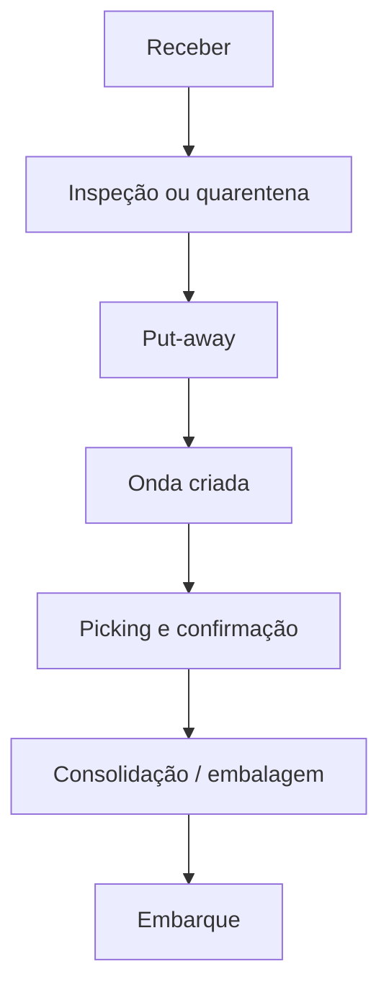
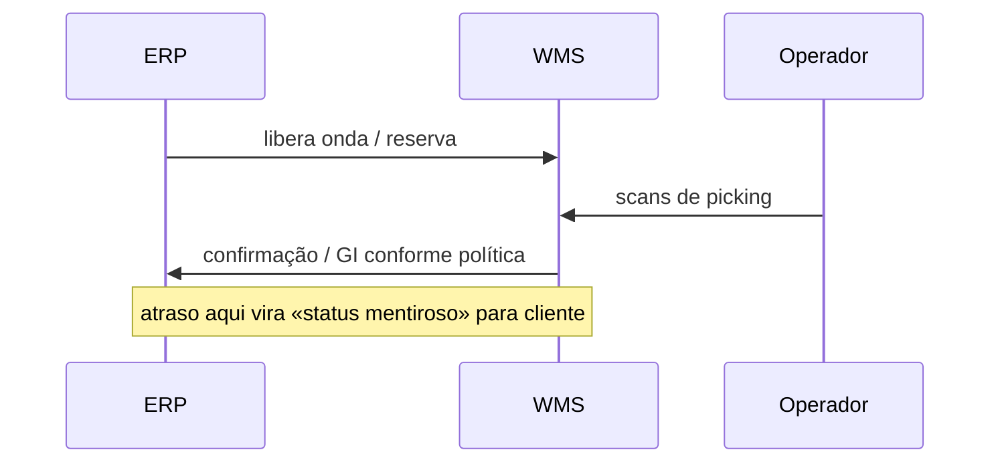

# Do sinal físico ao evento WMS — scan honesto, estoque honesto

**WMS** (*Warehouse Management System*) registra **tarefas** e **confirmações** no espaço: endereço, zona, doca, equipamento, operador. Cada **scan** (ou confirmação equivalente) idealmente gera um **evento** que alimenta saldo, rastreabilidade, **onda** seguinte e, por reflexo, **ATP** no ERP. Quando o scan é «facultativo» ou quando o sistema permite **confirmar em lote** sem validação física, o WMS vira **teatro** — e o inventário, **loteria** com custo de capital.

---

## Objetivos e resultado de aprendizagem

**Ao final desta aula**, você será capaz de:

- Explicar a cadeia **sinal físico → evento → saldo → promessa** ao cliente.
- Posicionar a **fronteira ERP ↔ WMS** e listar decisões de desenho inevitáveis.
- Definir **seis** eventos mínimos entre chegada e saída do caminhão com *timestamp* pedagógico.
- Relacionar **KPI de produtividade** com risco de **evento falso**.

**Duração sugerida:** 60–90 minutos.

---

## Gancho — o operador confirmou sem olhar

Na **TechLar**, meta de **linhas/hora** pressionou confirmações **em bruto** (confirmar caixa inteira sem conferência de mix). O estoque «andou» sem movimento físico coerente até o inventário cíclico **explodir** em SKU de alta rotação. **KPI** sem **qualidade de evento** corrompe o sistema — porque **o que medimos é o que otimizamos**, inclusive mentiras.

**Analogia do *check-in* em hotel:** se o recepcionista marca «entregue chave» sem o hóspede subir, o hotel parece **cheio** e **vazio** ao mesmo tempo — até alguém tentar dormir na cama.

---

## Mapa mental — WMS como «GPS interno»

O WMS responde perguntas espaciais:

- **Onde** está cada unidade (endereço)?
- **Como** chegar lá (tarefa, rota de picking)?
- **Quem** fez o quê (audit trail)?
- **Em qual estado** está (quarentena, bloqueado, liberado)?

**Legenda:** exceções (devolução, *recount*, *replenishment*) são ramificações reais — um fluxograma linear é propósito **didático**, não completo.

---

## Fronteira ERP ↔ WMS — decisões que não podem ficar implícitas

Decisões de desenho (sempre documente em **blueprint** ou **runbook**):

1. **Onde nasce o saldo definitivo** para ATP — na confirmação de picking, no embarque, no GI (*goods issue*)?
2. **Quem é dono do endereço** — WMS, mestre compartilhado, governança conjunta?
3. **Como** tratar **diferença** (mais/menos) entre ASN e físico?
4. **Como** reconciliar **lote** e **serial** quando o canal exige rastre fino?

**Legenda:** quando ERP e WMS discordam, o cliente sente **antes** do financeiro.

---

## Aplicação — exercício

Liste **seis** eventos WMS mínimos entre «caminhão chegou» e «caminhão saiu», com **timestamp** sugerido para cada um.

**Gabarito pedagógico:** chegada doca; início/ fim conferência ASN; put-away completo; onda atribuída; picking confirmado; expedição fechada/peso capturado. Aceitar variações com **motivo** e **foto** de divergência.

---

## Erros comuns e armadilhas

- **Motivo** de diferença inexistente ou genérico «outros» — impossível melhorar causa raiz.
- Endereço **fantasma** (cadastrado, fisicamente inacessível) — algoritmo de picking «sonha».
- Misturar **SKU consignado** com **próprio** sem marcação — risco fiscal e operacional.
- **Meta de velocidade** sem amostragem de qualidade de scan — incentiva fraude operacional leve.
- Não ter **política** de *recount* quando variância > limiar.

---

## KPIs e decisão

- **Primeira passagem certa** (*first time right*) na recepção — reduz custo oculto de retrabalho.
- **Divergência** ASN *vs.* físico por fornecedor (Pareto).
- **Acurácia de endereço** (inventário cíclico por zona).

---

## Fechamento — três takeaways

1. WMS é **disciplina espacial** digitalizada; sem endereço verdadeiro, o algoritmo alucina.
2. Evento sem física é **dívida** que explode no inventário ou no cliente.
3. A fronteira com ERP precisa de **dicionário** compartilhado — não de «acordo verbal na cantina».

**Pergunta de reflexão:** qual zona hoje é **gargalo** mas não aparece no WMS como tal?

---

## Referências

1. BOWERSOX, D. J.; et al. *Supply Chain Logistics Management*. McGraw-Hill.  
2. GS1 — identificação logística: https://www.gs1.org/standards  
3. Trilha Fundamentos — [estrutura de custos logísticos](../../trilha-fundamentos-e-estrategia/modulo-04-custos-logisticos-performance/aula-01-estrutura-custos-logisticos.md) (capital e estoque no P&L).  
4. CHOPRA, S.; MEINDL, P. *Supply Chain Management*. Pearson.
