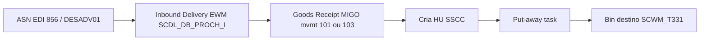
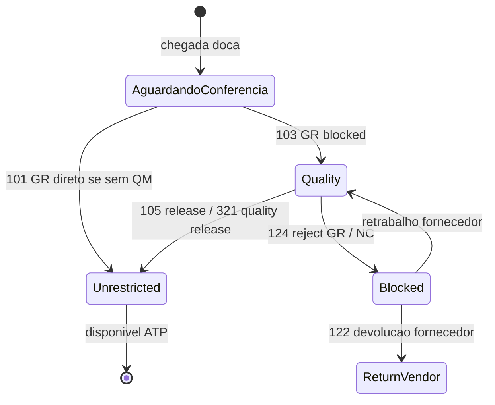
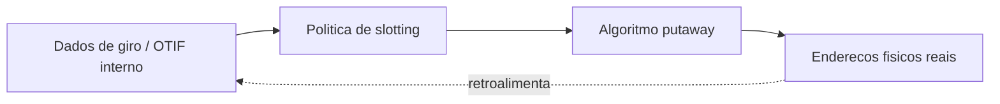
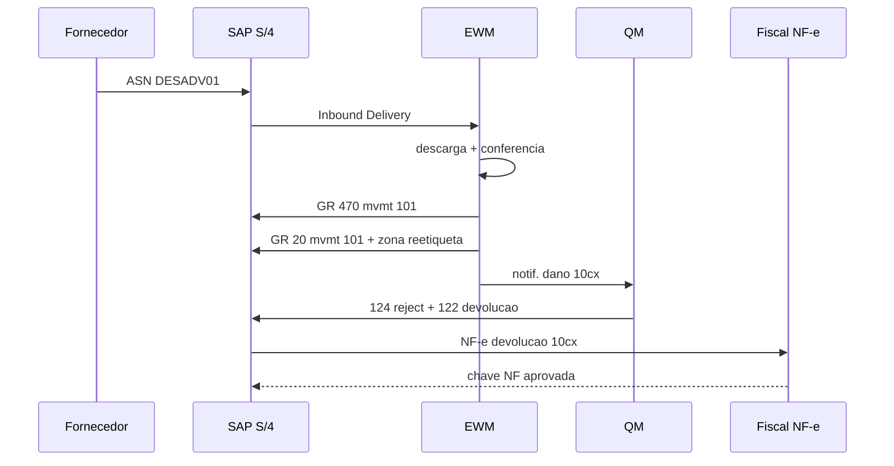

# Recebimento e put-away — a doca onde nasce a rastreabilidade

**Recebimento** converte **ASN** (*Advance Ship Notice*, EDI 856 / IDoc `DESADV01`), nota fiscal eletrônica (NF-e no BR) ou ordem de compra em **estoque disponível**, **quarentena** ou **devolução ao fornecedor**. **Put-away** posiciona o estoque no **endereço/bin** certo com **estratégia** (FIFO, FEFO, proximidade de picking, separação de classes de perigo, *velocity slotting*). Erros aqui **propagam** para **100%** das saídas seguintes — porque o WMS aprende «onde está» errado e o picking **treina** o erro mil vezes por dia.

Em SAP EWM, esse fluxo materializa-se em **Inbound Delivery** (`/SCDL/DB_PROCH_I`), **HU** (`/SCWM/HU_HDR`), e tarefas (`/SCWM/ORDIM`) com **storage process** configurável (1-step, 2-step, com QI intermediário).

---

## Objetivos e resultado de aprendizagem

- Descrever o fluxo **ASN → conferência → decisão de destino** com rastreabilidade.
- Explicar **quarentena** e liberação de qualidade como máquina de estados (mvmt 103/105/124/321/322 no IM).
- Relacionar **slotting** com curva ABC, dados de giro real e algoritmos de put-away (random, fixed, velocity-based).
- Planejar registro de **parcial**, **dano** e **etiqueta ilegível** com motivo e foto.
- Conhecer estratégias de put-away em EWM (`PUTWAY` strategies) e equivalentes Manhattan/BY.

**Duração sugerida:** 60–90 minutos.  
**Pré-requisitos:** [aula 01 — sinal físico e evento WMS](aula-01-sinal-fisico-evento-wms.md).

---

## Mapa do conteúdo

1. Gancho — lote misturado na mesma localização.
2. Conceito — ASN → recepção → decisão.
3. Modelo de dados — Inbound Delivery, HU, lote.
4. Quarentena e liberação — máquina de estados.
5. Put-away e slotting — estratégias.
6. Aprofundamentos — estratégias EWM, Manhattan, BY.
7. Caso prático — recebimento parcial com discrepância.
8. Erros, KPIs, glossário, exercícios.

---

## Gancho — lote misturado na mesma localização

Dois lotes do mesmo SKU foram **colocados** no mesmo endereço sem **mixed batch policy** permitida. O WMS **forçou** *pick* errado em pedido regulatório; o recall **duplicou** custo e tempo de doca. A regra de **mistura** é **master + WMS** (`MARC-XCHPF` + EWM bin attribute), não só «cabe na prateleira».

**Analogia da geladeira:** misturar **leite vencendo hoje** com **leite novo** na mesma gaveta sem etiqueta é decisão de **risco**, não de espaço.

**Analogia da farmácia:** comprimidos do mesmo princípio ativo de lotes diferentes na mesma caixa = recall vira pesadelo. ANVISA não aceita «foi sem querer».

---

## Conceito-núcleo — ASN → recepção → decisão

**Pontos de decisão:**
- ASN diverge de PO? → tolerância (`PO over/under delivery`).
- Lote bloqueado por QC? → mvmt 103 (*blocked GR*) → put-away em quarentena bin type.
- Falta etiqueta SSCC? → gerar em recebimento (com sequencial GS1).
- Material *batch-managed*? → criar `MCHA` com `VFDAT`.

---

## Modelo de dados — recebimento

| Objeto | EWM | Manhattan | BY |
|--------|-----|-----------|----|
| Inbound Delivery | `/SCDL/DB_PROCH_I` | ASN/Receipt | Inbound Order |
| HU / LPN | `/SCWM/HU_HDR` | LPN | Container |
| Bin | `/SCWM/T331` | Location | Slot |
| Lote | `MCHA` (ERP) + `/SCWM/AQUA` (saldo bin/lote) | Batch attribute em LPN | Batch |
| Storage Process | `/SCWM/T332` | Receipt Pattern | Inbound Strategy |
| Putaway Strategy | `/SCWM/T331C` (regras) | Putaway Algorithm | Slot Recommendation |

---

## Quarentena e liberação de qualidade

**Em SAP QM (Quality Management):**
- Inspection Lot criado automático em GR (mvmt 103).
- T-codes: `QA32` (lista lots), `QA11` (Usage Decision — liberar/rejeitar).
- Configurações em `MM01` vista *Quality Management* (`MARC-QMATA`).

**Mensagem essencial:** **ATP** não pode ler **Liberado** antes da **transição** correta. Comercial vendendo lote `Q` é incidente, não normalidade.

---

## Put-away e slotting — da curva ao caminho

**Slotting** liga **ABC** de giro a **distância** de expedição e à **altura** de picking (ergonomia, *golden zone* em 0.7–1.4m). Slotting **estático** (fixed location) vs. **dinâmico** (random com algoritmo).

### Estratégias de put-away (EWM `PUTWAY`)

| Estratégia | Como funciona | Quando usar |
|------------|---------------|-------------|
| **Manual** | Operador escolhe bin | Operação simples; fallback |
| **Empty bin (random)** | Próximo bin vazio compatível | Padrão para alta variedade |
| **Fixed bin** | Cada SKU tem bin fixo | SKU baixa rotação ou *forward pick* |
| **Addition to existing stock** | Consolidar com mesmo SKU já presente | Otimizar densidade |
| **Bulk storage** | Áreas de palete inteiro | Reserva |
| **Pallet putaway** | Por tipo de palete | Quando capacidade varia |
| **Storage type search sequence** | Tenta tipos em ordem (forward → reserve) | Multi-zona |
| **Cross-docking** | Pula putaway, vai direto ao outbound | Pedidos casados com chegada |

### Trade-off slotting

- **Proximidade de expedição** ↔ **separação de classes** (pesado vs. leve, limpo vs. sujo, frio vs. ambiente, ASIN-Y2 químicos perigosos).
- **Densidade** ↔ **acessibilidade** (palete duplo profundo economiza espaço, atrasa picking).
- **Estático** ↔ **dinâmico** (estático é simples para operador, dinâmico é eficiente para algoritmo).

---

## Aprofundamentos — estratégias por fornecedor

| Aspecto | EWM | Manhattan Active WM | Blue Yonder | Mecalux Easy WMS |
|---------|-----|---------------------|-------------|------------------|
| Putaway algorithm | `T331C` regras + storage type | Putaway Configuration (rule-based + ML) | Slot Recommendation engine | Configurável |
| Slotting dinâmico | Add-on `SAP Slotting` | Manhattan Slotting Optimization (MSO) | Slot Optimization | Manual / regras simples |
| Cross-dock | Suportado nativo | Forte (varejo) | Forte | Limitado |
| Voice / RF | Integração com Vocollect | Nativo + voice opcional | Nativo | RF nativo, voice via parceiro |
| Wave management | Wave / 2-step | Manhattan WaveLink | BY Wave | Wave simples |

---

## Caso prático — recebimento com discrepância

**Cenário:** ASN do fornecedor **`F-12345`** anuncia **500 caixas** do SKU `TL-7842`, lote `L20260415`, validade `2028-04-15`. Conferência física:

- 470 caixas OK → put-away normal (mvmt 101).
- 20 caixas com etiqueta ilegível → reetiqueta + put-away em zona separada (motivo: `LBL_ILEG`).
- 10 caixas com dano externo → 124 (reject GR) → devolução ao fornecedor (mvmt 122) com NF-e de devolução.

**Eventos esperados:**

**Pegadinha BR — NF-e de entrada:** se a NF-e do fornecedor declarava 500 e o físico foi 470 + 20 + 10 (devolução), o lançamento fiscal precisa **bater com o XML**. Recebimento sem alinhamento fiscal vira **EFD/SPED** divergente em fechamento.

---

## Aplicação — exercício

**Cenário:** **500** caixas chegam; **20** com etiqueta ilegível; **10** com dano.

Descreva **como** o WMS e o ERP devem registrar **três destinos** diferentes (aceite, retorno, quarentena) sem perder **rastreio** do ASN.

**Gabarito pedagógico:** linhas de recebimento **parciais** com motivos distintos (`LBL_ILEG`, `DAMAGED_EXT`); fotos/anexos se política; bloqueio de lote (`MCHA-CLEAR=S` quando aplicável); não «absorver» tudo num ajuste genérico; comunicação ao fornecedor com evidência (e-mail estruturado + relatório). Movimento SAP esperado: 101 (470), 101 com zone bin de reetiqueta (20), 124 + 122 + NF-e devolução (10).

---

## Erros comuns e armadilhas

- Receber **antes** de ASN quando a política exige **três vias** (PO + ASN + NF-e BR) — perde-se prova de contagem.
- Put-away **noturno** sem confirmação de **segurança** e sem regra de **travas** de porta.
- Devolução ao fornecedor sem **atrelar** ao lote original — quebra de **rastreabilidade**.
- Conferência **só** por volume (contar caixas) em SKU de **mix** interno heterogêneo.
- Endereços de **quarentena** esgotados — estoque «no corredor» sem estado.
- Slotting estático sem revisão sazonal — Black Friday com SKU campeão no fundo do CD.
- Misturar lotes em bin sem permissão (`MIXEDBATCH=N`) → recall vira drama.
- ASN sem SSCC → cada palete vira contagem manual; produtividade despenca.

---

## KPIs técnicos e de negócio

| KPI | Pergunta | Dono | Fonte | Cadência | Playbook se ruim |
|-----|----------|------|-------|----------|------------------|
| **ASN accuracy (qty + mix)** por fornecedor | Quem entrega o que prometeu? | Recebimento | WMS exception log | Semanal | Pareto fornecedor; QBR; SLA com penalidade |
| **Tempo médio em quality (P50/P90)** | QC é gargalo? | Qualidade | `MARD-INSME` × idade | Semanal | SLA inspeção; auto-release condicional |
| **% put-away concluído no mesmo turno** | Doca esvazia? | Op recebimento | WMS task log | Diário | Mais operadores; estratégia 1-step |
| **Densidade de armazenagem (% bins ocupados)** | Espaço bem usado? | Op | WMS bin status | Mensal | Slotting revisão; cross-docking |
| **% recebimentos com discrepância** | Processo é robusto? | Recebimento + Compras | WMS exception | Semanal | Foto obrigatória; lock fornecedor recorrente |
| **Lead time GR → put-away completo** | Doca → bin em quanto tempo? | Op | WMS timestamps | Diário | Reduzir distância média; mais empilhadeiras |
| **NF-e de devolução / NF-e entrada (taxa)** | Qualidade fornecedor BR | Compras + Fiscal | NF-e log | Mensal | RCA fornecedor top 5 |

---

## Ferramentas e tecnologias relevantes

| Categoria | Ferramentas | Uso |
|-----------|-------------|-----|
| WMS recebimento | EWM, Manhattan, BY, Mecalux, Locus | Núcleo |
| Slotting | Manhattan MSO, BY Slotting, SAP Slotting add-on, ProvisionAi | Otimização |
| RF/Voice | Zebra, Honeywell, Datalogic; Vocollect, Lucas | Captura |
| Cross-dock | Funcionalidade nativa WMS + sinalização física | Throughput |
| QM | SAP QM, LIMS (LabWare, STARLIMS) | Inspeção formal |
| BR fiscal | NF-e validators, Manifesto entrada SEFAZ | Conformidade |

---

## Glossário rápido

- **ASN:** *Advance Ship Notice* (EDI 856, IDoc DESADV01).
- **GR:** *Goods Receipt* (movimento de entrada).
- **HU:** *Handling Unit*.
- **SSCC:** *Serial Shipping Container Code*.
- **Put-away:** posicionamento de estoque em bin.
- **Slotting:** decisão de onde colocar cada SKU.
- **FIFO/FEFO/LIFO:** *First In First Out* / *First Expired First Out* / *Last In First Out*.
- **Cross-docking:** chegada → expedição direta sem armazenagem.
- **`/SCDL/DB_PROCH_I`:** Inbound Delivery EWM.
- **`/SCWM/HU_HDR`:** Handling Unit EWM.
- **QM:** *Quality Management* (SAP).
- **Inspection Lot:** documento de inspeção em SAP QM.

---

## Pergunta de reflexão

Qual exceção de recebimento hoje **não** tem código de motivo — e quanto custa ano por não saber a causa-raiz?

---

## Fechamento — três takeaways

1. Recebimento bem feito **paga** o WMS inteiro; mal feito, **taxa** todas as saídas.
2. Quarentena mal desenhada vende **não conformidade** como se fosse **disponível**.
3. Slotting sem dados é **decorar** armazém — bonito, caro, errado.

---

## Referências

1. **CHOPRA & MEINDL** — *Supply Chain Management*. Pearson.
2. **SAP Help** — *EWM Inbound Processing*: https://help.sap.com/docs/SAP_EWM
3. **Manhattan Associates** — *Putaway and Slotting*: https://www.manh.com/
4. **WERC** — *Warehousing Education and Research Council*: https://www.werc.org/
5. **GS1** — *Logistics Label* (SSCC): https://www.gs1.org/standards/logistic-label
6. **NR-11** (BR — Movimentação de materiais) — Ministério do Trabalho.
7. **ANVISA** (BR — boas práticas armazenagem) — quando aplicável a farma/alimentos.

---

## Pontes para outras trilhas

- **Dados** → [OTIF e fill rate](../../trilha-dados-analytics-logistica/modulo-04-indicadores-logisticos-kpis/aula-01-otif-fill-rate-contrato-interno.md).
- **Fundamentos** → [estrutura de custos](../../trilha-fundamentos-e-estrategia/modulo-04-custos-logisticos-performance/aula-01-estrutura-custos-logisticos.md).
- Próxima aula → [onda, picking e expedição](aula-03-onda-picking-expedicao.md).
