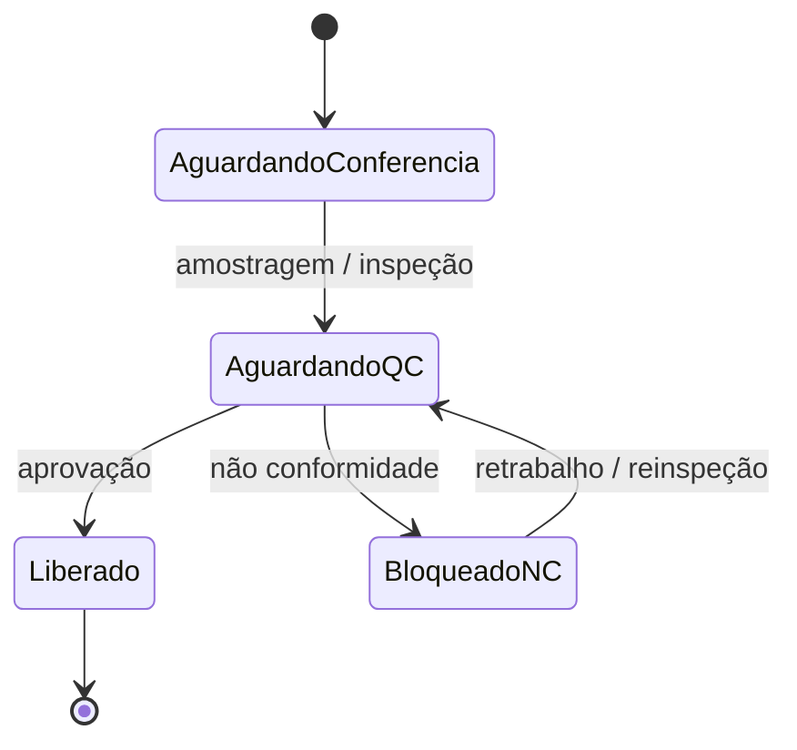
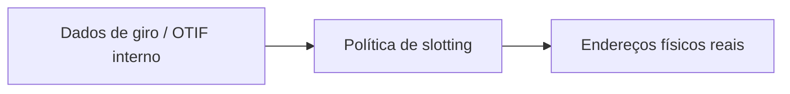

# Recebimento e put-away — a doca onde nasce a rastreabilidade

**Recebimento** converte **ASN** (*advance ship notice*), nota fiscal ou ordem de compra em **estoque disponível**, **quarentena** ou **devolução ao fornecedor**. **Put-away** posiciona o estoque no **endereço** certo com regra de **estratégia** (FIFO, FEFO, proximidade de picking, separação de classes de perigo). Erros aqui **propagam** para **100%** das saídas seguintes — porque o WMS aprende «onde está» errado e o picking **treina** o erro mil vezes por dia.

---

## Objetivos e resultado de aprendizagem

**Ao final desta aula**, você será capaz de:

- Descrever o fluxo **ASN → conferência → decisão de destino** com rastreabilidade.
- Explicar **quarentena** e liberação de qualidade como máquina de estados.
- Relacionar **slotting** com curva ABC e dados de giro real.
- Planejar como registrar **parcial**, **dano** e **etiqueta ilegível** sem «absorver» tudo num ajuste.

**Duração sugerida:** 60–90 minutos.

---

## Gancho — lote misturado na mesma localização

Dois lotes do mesmo SKU foram **colocados** no mesmo endereço sem **compatibilidade** permitida. O WMS **forçou** *pick* errado em pedido regulatório; o recall **duplicou** custo e tempo de doca. A regra de **mistura** é **master + WMS**, não só «cabe na prateleira».

**Analogia da geladeira:** misturar **leite vencendo hoje** com **leite novo** na mesma gaveta sem etiqueta é decisão de **risco**, não de espaço.

---

## Quarentena e liberação de qualidade

**Legenda:** nomes reais variam; o essencial é que **ATP** não leia **Liberado** antes da **transição** correta.

---

## Put-away e slotting — da curva ao caminho

**Slotting** liga **ABC** de giro a **distância** de expedição e à **altura** de picking (ergonomia). **Hipótese pedagógica:** slotting sem dados de **giro real** (não só «achismo de categoria comercial») vira **arte** e gera caminhada absurda — o pior dos dois mundos: WMS «otimizado» para o mundo errado.

**Trade-off:** proximidade de expedição *vs.* separação de classes (pesado/leve, limpo/sujo, frio/ambiente).

---

## Aplicação — exercício

Caso: **500** caixas chegam; **20** com etiqueta ilegível; **10** com dano. Descreva **como** o WMS e o ERP devem registrar **três destinos** diferentes (aceite, retorno, quarentena) sem perder **rastreio** do ASN.

**Gabarito pedagógico:** linhas de recebimento **parciais**; **motivos** distintos; **fotos/anexos** se política; bloqueio de lote; não «absorver» tudo num ajuste genérico; comunicação ao fornecedor com evidência.

---

## Erros comuns e armadilhas

- Receber **antes** de ASN quando a política exige **três vias** — perde-se prova de contagem.
- Put-away **noturno** sem confirmação de **segurança** e sem regra de **travas** de porta.
- Devolução ao fornecedor sem **atrelar** ao lote original — quebra de **rastreabilidade**.
- Conferência **só** por volume (contar caixas) em SKU de **mix** interno heterogêneo.
- Endereços de **quarentena** esgotados — estoque «no corredor» sem estado.

---

## KPIs e decisão

- **ASN accuracy** (quantidade e mix) por fornecedor.
- **Tempo médio** de permanência em quarentena (lead time de qualidade).
- **Taxa de put-away** concluído no mesmo turno da recepção.

---

## Fechamento — três takeaways

1. Recebimento bem feito **paga** o WMS inteiro; mal feito, **taxa** todas as saídas.
2. Quarentena mal desenhada vende **não conformidade** como se fosse **disponível**.
3. Slotting sem dados é **decorar** armazém — bonito, caro, errado.

**Pergunta de reflexão:** qual exceção de recebimento hoje **não** tem código de motivo?

---

## Referências

1. CHOPRA, S.; MEINDL, P. *Supply Chain Management*. Pearson.  
2. Normas de **segurança** e doca (NR e equivalentes locais — tipo de fonte; não é assessoria legal).  
3. GS1 — mensagens de logística e identificação: https://www.gs1.org/  
4. Trilha Dados — [OTIF](../../trilha-dados-analytics-logistica/modulo-04-indicadores-logisticos-kpis/aula-01-otif-fill-rate-contrato-interno.md).
