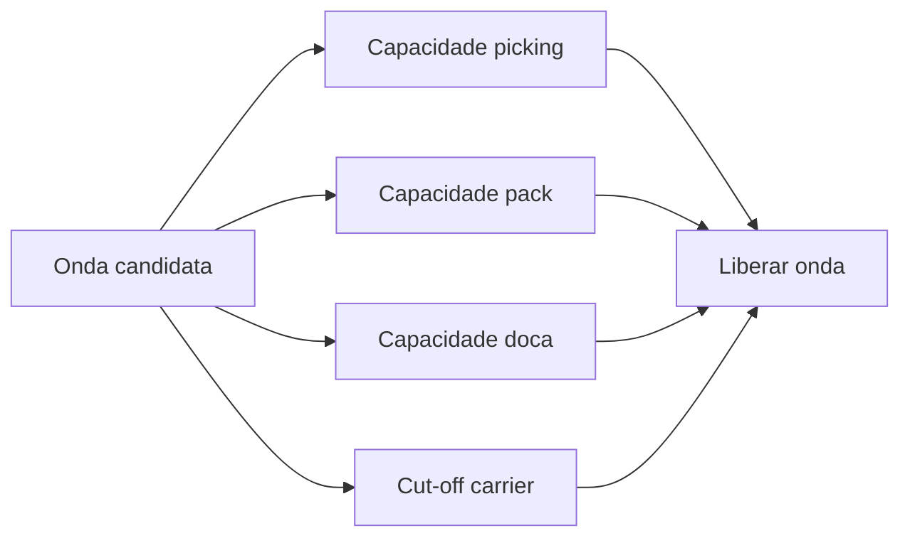
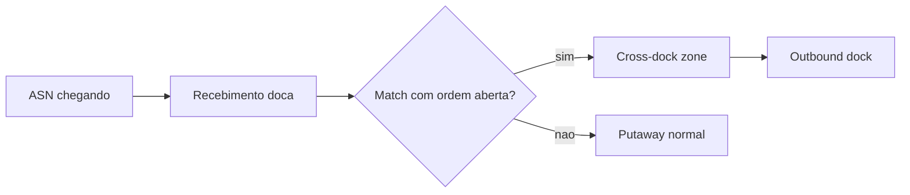
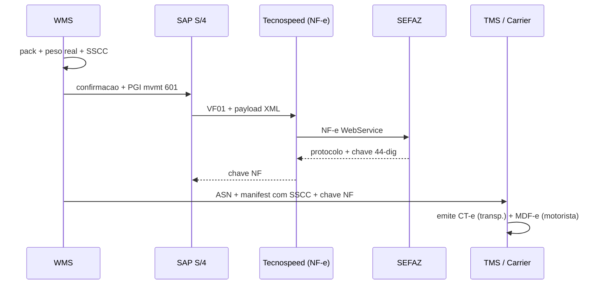

# Onda, picking e expedição — ritmo, prioridade e a doca que não estica

**Onda** (*wave*) agrupa linhas de pedidos para **otimizar** picking (caminhada, equipamento, *cut-off* de transportadora, prioridade de cliente). **Picking** confirma retirada (RF/voice/vision); **expedição** consolida, embala, captura **peso/volume real**, gera etiquetas (SSCC), faz **handoff** ao TMS e dispara **PGI** no ERP. O erro típico é onda **enorme** sem capacidade de **embalagem** e doca — fila vira **atraso**, erro de **mix** e estresse humano.

Este capítulo traz **estratégias de picking** comparadas, padrões de **wave management** em Manhattan/EWM/BY, **cross-dock** e o casamento com **cut-off** de carrier.

---

## Objetivos e resultado de aprendizagem

- Explicar **onda** como decisão de **capacidade** (humana, doca, embalagem), não só algoritmo.
- Comparar estratégias de picking (discrete, batch, zone, cluster, wave-less).
- Definir **três** regras de prioridade e discutir conflito entre elas com transparência.
- Relacionar **cut-off** de carrier com planejamento de onda.
- Mapear **expedição** com SSCC, NF-e, manifesto e PGI.

**Duração sugerida:** 60–90 minutos.  
**Pré-requisitos:** aulas 01–02 deste módulo.

---

## Mapa do conteúdo

1. Gancho — Black Friday na TechLar.
2. Conceito — onda como capacidade.
3. Estratégias de picking — comparação.
4. Wave management — EWM, Manhattan, BY.
5. Cross-dock e flow-through.
6. Expedição — embalagem, SSCC, NF-e, PGI.
7. Caso prático — wave de e-commerce com cut-off.
8. Erros, KPIs, glossário, exercícios.

---

## Gancho — Black Friday na TechLar

O WMS gerou **uma** onda com **dez mil** linhas; o ERP mostrou «pronto»; a doca tinha **três** portas e o time de embalagem **metade** do efetivo necessário. O **OTD** interno colapsou; o SAC recebeu tickets com **status mentiroso**. **Onda** é decisão de **capacidade humana e física** — o algoritmo precisa respeitar **gargalo** real.

**Analogia do restaurante:** o sistema aceitou **200 pratos** na cozinha, mas só há **dois** chefs — a fila não some com otimismo.

**Analogia da imprensa:** redação aceita 500 matérias para fechar a edição; impressão suporta 50/hora; a edição sai com 80% do conteúdo «em produção». Cliente lê o jornal incompleto.

---

## Conceito-núcleo — onda como capacidade

Uma onda saudável respeita **três restrições** simultâneas:

1. **Picking capacity** — operadores × linhas/hora estimadas.
2. **Pack capacity** — postos de embalagem × tempo médio por pedido.
3. **Dock capacity** — número de docas × cut-off do carrier.

A função objetivo é **maximizar** OTD (on-time dispatch) sujeito a essas restrições — não só «otimizar caminhada».

---

## Estratégias de picking — âncoras mentais

| Estratégia | Como funciona | Quando serve | Risco principal |
|------------|---------------|--------------|-----------------|
| **Discrete (por pedido)** | Operador pega 1 pedido completo | B2B, alto valor, compliance lote | Caminhada repetida |
| **Batch (lote SKU)** | Pega N pedidos do mesmo SKU de uma vez | Alto volume homogêneo (e-commerce CPG) | Erro de mix se controle fraco |
| **Zone (por zona)** | Cada operador picka apenas em sua zona | SKU disperso geograficamente | Mistura no consolidado |
| **Cluster (multi-pedido)** | Carrinho com 6–24 cubos, picka N pedidos juntos | E-commerce pedidos pequenos | Complexidade consolidação/QA |
| **Wave-less / continuous** | Sem onda; tasks geradas continuamente | Demanda contínua, automação | Difícil prever doca |
| **Pick-to-light / Put-to-light** | Sinalização luminosa | Alta velocidade, SKU baixo (CPG) | Investimento alto |
| **Voice picking** | Comandos por fone | Mãos livres, ergonomia | Treino + ruído |
| **Vision picking** | Smart glasses (Google Glass EE2, Realwear) | Mãos livres + visual | Custo, conforto |
| **Goods-to-person (GTP)** | Robôs/AS-RS levam estoque ao operador | Alta densidade, SKU médio | CAPEX altíssimo |

---

## Wave management — comparação por fornecedor

| Fornecedor | Configuração wave | Otimização | Real-time |
|------------|-------------------|------------|-----------|
| **SAP EWM** | Wave templates (`/SCWM/WAVETMP`), waves por carrier/cut-off | Forte para SAP integrado | Em S/4 embedded |
| **Manhattan Active WM** | WaveLink + dynamic waving | ML-driven | Cloud nativo |
| **Blue Yonder Luminate** | Wave Optimizer | Heurísticas + ML | Sim |
| **Oracle WMS Cloud** | Wave types configuráveis | Regras | Sim |

### Wave templates (EWM exemplo)

| Atributo | Exemplo |
|----------|---------|
| **Wave Template ID** | `WAVE_BR_VAREJO_AM` |
| **Cut-off rule** | Carrier `CARRIER001` cut-off 14:00 |
| **Capacity** | Max 500 linhas, max 50 pedidos |
| **Priority** | VIP ≥ 9; standard 5; promo 3 |
| **Storage type filter** | Apenas `0010` (forward pick) |
| **Carrier filter** | `CARRIER001`, `CARRIER002` |

---

## Regras de prioridade — exemplo

| Prioridade | Critério | Conflito típico |
|------------|----------|-----------------|
| **9 (VIP / contrato)** | Cliente premium, multa contratual | VIP vs. cut-off carrier |
| **7 (cut-off carrier)** | Pedidos de carrier com cut-off em < 2h | Cut-off vs. promessa data |
| **5 (data prometida hoje)** | Promessa de entrega hoje | Vs. capacidade pack |
| **3 (promo / standard)** | Pedidos promocionais | — |
| **1 (backorder antigo)** | Pedidos > X dias | — |

**Política de exceção:** matriz publicada + escalação documentada (Slack/Teams + e-mail) quando prioridade VIP entra em choque com cut-off de carrier — quem decide, com base em quê, em quanto tempo.

---

## Cross-dock e *flow-through*

**Cross-dock**: produto chega na doca de recebimento e vai **direto** para a doca de expedição, sem put-away/pick. Reduz drasticamente lead time interno.

**Tipos:**
- **Pre-distribution cross-dock**: ordens já alocadas a clientes finais antes do recebimento (varejo).
- **Post-distribution cross-dock**: ordens alocadas após chegada (mais flexível, menos otimizado).
- **Opportunistic cross-dock**: WMS detecta match entre ASN chegando e ordem aberta → desvia.

**Hipótese pedagógica:** cross-dock sem disciplina de **evento** é **pior** que estoque parado — porque o erro viaja em velocidade.

---

## Expedição — embalagem, SSCC, NF-e, PGI

### Etapas

1. **Pack station**: peso real (balança calibrada), volume (cubometro), embalagem (caixa de papelão, palete, contentor).
2. **Etiqueta SSCC** (GS1, 18 dígitos): identificador serial único do pacote.
3. **Manifest carrier**: documento de embarque com todos os SSCCs.
4. **NF-e** (BR): emissão e impressão DANFE / envio XML.
5. **CT-e** (BR): emitido pela transportadora, mas o ASN deve referenciar a chave NF-e.
6. **MDF-e**: manifesto eletrônico de transporte, emitido na partida.
7. **PGI / mvmt 601**: SAP atualiza estoque livre, dispara faturamento.

---

## Caso prático — wave de e-commerce com cut-off

**Cenário:** TechLar B2C, 800 pedidos pequenos, cut-off do carrier `JAD-LOG` às 14h. Hora atual: 11h. Capacidade: 5 pickers (linhas/h), 4 packers (pedidos/h × tempo médio).

**Cálculo:**
- 800 pedidos × 2 linhas/médio = 1.600 linhas.
- 5 pickers × 60 lph × 3h = 900 linhas máx → **gap de 700**.
- Decisão: dividir em 2 ondas? Limitar a 450 pedidos? Realocar 2 packers para pick? Aceitar overflow no carrier do dia seguinte?

**Decisão estruturada:**
1. Wave 1 (cluster picking, 450 pedidos top priority + carrier cut-off hoje) — libera às 11h.
2. Wave 2 (350 pedidos com promessa amanhã ou carrier mais tardio) — libera às 13h.
3. Realocar 1 packer para reforçar pick na Wave 1.
4. Comunicar a 350 clientes da Wave 2 → SLA mantido.

---

## Aplicação — exercício

Defina **três** regras de **prioridade** de onda (ex.: pedido VIP, cut-off de transportadora, data prometida) e **um** conflito entre elas — como decidir com transparência?

**Gabarito pedagógico:** matriz de prioridade **publicada**; escalação quando SLA de carrier entra em choque com promessa VIP; registro de **decisão** (quem aprovou exceção, com timestamp e justificativa). Critério de empate: cliente com **multa contratual ativa** > VIP genérico > carrier cut-off > data prometida hoje. Sempre com log auditável.

---

## Erros comuns e armadilhas

- **Cross-dock** sem marcação física e sem critério de aceite.
- Etiqueta de transporte gerada **antes** de peso real → divergência na auditoria de frete.
- Onda sem **limite** de linhas por equipe — KPI de produtividade destrói qualidade.
- **Consolidação** sem *scan* de validação de pedido — *mix* trocado.
- Ignorar **temperatura** ou **HACCP** em cadeia fria (cosmético, farma, alimento).
- Em SAP EWM, wave template sem `Cut-off`/`Capacity` → onda gigante explode em horário de pico.
- PGI feito **antes** do load real → cliente vê «em trânsito» mas o palete continua na doca.
- NF-e emitida com peso/volume divergente do real → cliente rejeita na portaria, retorna carga.

---

## KPIs técnicos e de negócio

| KPI | Pergunta | Dono | Fonte | Cadência | Playbook se ruim |
|-----|----------|------|-------|----------|------------------|
| **OTD interno (dock cut-off vs. saída real)** | Promessa de cut-off honrada? | Op | WMS load timestamps | Diário | Wave smaller; mais paralelismo |
| **Linhas/hora E erro de picking** | Velocidade vs. qualidade | Op + RH | WMS productivity | Diário | Sempre os dois; ajustar incentivo |
| **Fila média no pack (WIP)** | Gargalo embalagem? | Op | WMS event log | Por turno | Limite WIP + balanceamento |
| **% wave liberada com capacidade insuficiente** | Planejamento × execução? | Planejamento | WMS wave + capacity | Diário | Capacity check obrigatório |
| **Cross-dock hit rate** | Quanto se aproveita? | Op + Compras | WMS cross-dock log | Mensal | Sincronizar ASN com ordens abertas |
| **% etiquetas re-impressas** | Sintoma de retrabalho | Op | WMS reprint log | Diário | RCA por causa |
| **Lag PGI físico → ERP** | Status confiável? | TI + Op | Timestamps | Diário | SLO < 5 min |
| **Custo por pedido expedido** | Eficiência total | Controladoria + Op | ERP custos + WMS pedidos | Mensal | Análise por canal/SKU |

---

## Ferramentas e tecnologias relevantes

| Categoria | Ferramentas | Uso |
|-----------|-------------|-----|
| WMS picking/wave | EWM, Manhattan, BY, Oracle WMS, Mecalux | Núcleo |
| Voice picking | Honeywell Vocollect, Lucas Lydia | Mãos livres |
| Pick-to-light | Lightning Pick, Kardex Remstar | Alta velocidade |
| Vision picking | Picavi, RealWear, Google Glass EE2 | Mãos livres + visual |
| Etiqueta / SSCC | Zebra, Honeywell, Sato | Identificação GS1 |
| Pack | Cubometro CubiScan, balanças Mettler-Toledo | Peso/volume real |
| Goods-to-person | AutoStore, Geek+, Locus, 6 River, AutoStore | Robótica |
| NF-e / CT-e BR | Tecnospeed, Migrate, NDD, eFatura | Fiscal |

---

## Glossário rápido

- **Wave / onda:** agrupamento de pedidos para release operacional.
- **Pick path:** rota otimizada do operador.
- **Cluster pick:** carrinho com múltiplos pedidos pequenos.
- **Cross-dock:** chegada → expedição direta.
- **Cut-off:** horário limite do carrier para coleta do dia.
- **PGI:** *Post Goods Issue* (mvmt 601 SAP).
- **SSCC:** *Serial Shipping Container Code* (GS1).
- **DANFE:** *Documento Auxiliar da NF-e* (papel BR).
- **CT-e:** Conhecimento de Transporte Eletrônico.
- **MDF-e:** Manifesto Eletrônico de Documentos Fiscais.
- **WIP:** *Work In Progress*.
- **GTP:** *Goods-To-Person* (automação).

---

## Pergunta de reflexão

Qual *cut-off* de transportadora hoje **não** está modelado no WMS — e quanto isso custa em coletas perdidas por mês?

---

## Fechamento — três takeaways

1. Onda bonita na tela com fila na doca é **ilusão operacional**.
2. Picking é **coreografia** humana; algoritmo sem capacidade é **violência de planejamento**.
3. *Cut-off* de carrier precisa existir como **restrição dura**, não como «tomara que dê».

---

## Referências

1. **BOWERSOX et al.** — *Supply Chain Logistics Management*. McGraw-Hill.
2. **SAP Help** — *EWM Wave Management*: https://help.sap.com/
3. **Manhattan Associates** — Active WM Wave: https://www.manh.com/
4. **WERC** — *Picking Productivity*: https://www.werc.org/
5. **Gartner** — *Magic Quadrant for WMS* (anual).
6. **GS1** — SSCC e *Logistics Label*: https://www.gs1.org/
7. CHOPRA & MEINDL — *Supply Chain Management*. Pearson.
8. **ABRALOG / ILOS BR** — benchmarks operação CD Brasil.

---

## Pontes para outras trilhas

- **Dados** → [OTIF e definição](../../trilha-dados-analytics-logistica/modulo-04-indicadores-logisticos-kpis/aula-01-otif-fill-rate-contrato-interno.md).
- **Fundamentos** → [nível de serviço e KPIs](../../trilha-fundamentos-e-estrategia/modulo-04-custos-logisticos-performance/aula-03-nivel-servico-kpis-logisticos.md).
- Próximo módulo → [TMS — pedido de transporte e carrier](../modulo-04-tms/aula-01-pedido-transporte-carrier.md).
