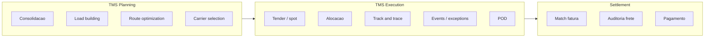
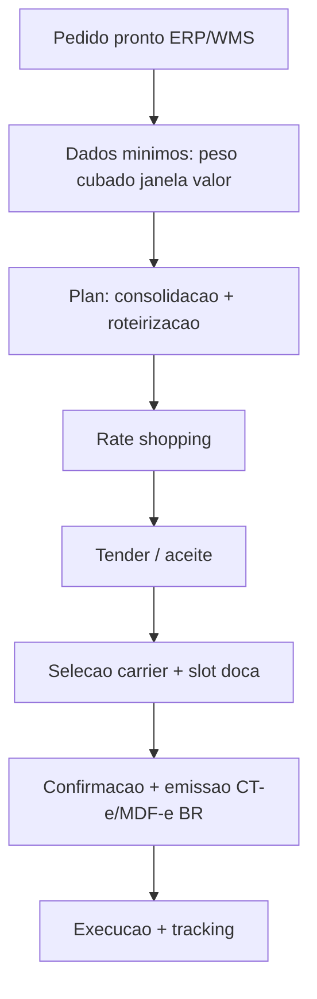
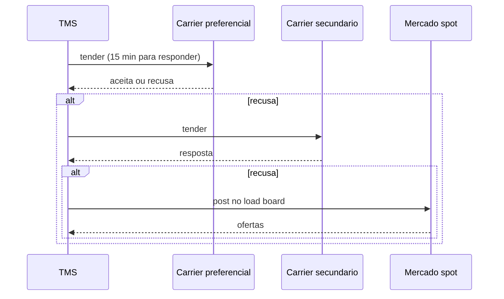
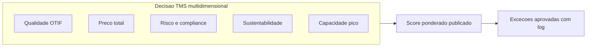

# Pedido de transporte e seleção de transportadora — o triângulo qualidade, preço e risco

**TMS** (*Transportation Management System*) orquestra **pedido de transporte**, **rate shopping**, **tendering** ou seleção por tabela, **consolidação**, **alocação de veículo**, **roteirização** e **custo**. A decisão **não é só preço**: **qualidade** (OTIF histórico do *carrier*), **risco** (sinistro, multas contratuais, capacidade em pico) e **adequação operacional** (tipo de veículo, restrição de cidade, exigência de cliente) entram no mesmo vetor.

Este capítulo posiciona os principais TMS de mercado (Manhattan Active TM, Blue Yonder TMS, MercuryGate, Oracle TMS / OTM, SAP TM, Trimble TMW, Ramco Logistics, Bsoft, MaxiFrota Choice, NeoGrid TMS), mostra a fronteira **planning vs. execution** e desce em **rate shopping**, **multi-leg planning** e **carrier sourcing**.

---

## Objetivos e resultado de aprendizagem

- Montar uma **matriz de decisão** com pelo menos três dimensões além do frete base.
- Explicar **planning** vs. **execution** dentro do TMS.
- Diferenciar **tender spot**, **tender contratual**, **rate shopping** dinâmico.
- Relacionar **dados mestre** (peso, cubagem, janela, rota/lane) com qualidade de cotação.
- Conhecer especificidades **BR** — ANTT/RNTRC, RCTR-C, gestão de risco (GR), SASSMAQ, Operação Carga Cheia.

**Duração sugerida:** 60–90 minutos.  
**Pré-requisitos:** módulo 3 (WMS).

---

## Mapa do conteúdo

1. Gancho — o mais barato que nunca passa na doca.
2. Conceito — TMS planning × execution.
3. Modelo de dados — shipment, carrier, lane, rate.
4. Rate shopping e tender.
5. Aprofundamentos — fornecedores TMS comparados.
6. Especificidades BR — ANTT, gestão de risco, MDF-e, ressuprimento.
7. Caso prático — escolha de carrier para 3 lanes.
8. Erros, KPIs, glossário, exercícios.

---

## Gancho — o mais barato que nunca passa na doca

A **TechLar** trocou para transportadora **12%** mais barata em tabela; o **P90** de coleta subiu; **multas** B2B explodiram; o SAC virou **call center** de status. Economia **linear** ignorou **cauda** — e cauda é onde contratos B2B mordem.

**Analogia da cirurgia:** escolher anestesista pelo **menor preço** sem olhar **taxa de complicação** é decisão de risco, não de compras.

**Analogia do voo:** escolher companhia aérea só pelo preço da passagem sem olhar **on-time performance**, **cancelamentos** e **bagagem perdida** — economia que vira custo emocional + reembolso.

---

## Conceito-núcleo — TMS planning vs. execution

| Camada | Função | Horizonte | Decisões típicas |
|--------|--------|-----------|------------------|
| **Planning** | Otimização antes da execução | Hoje–próximas 72h | Consolidação, *load building*, *route optimization*, *carrier selection* |
| **Execution** | Acompanhar o que está em curso | Tempo real | Tender, alocação, eventos, exceções, POD |
| **Settlement** | Pós-execução | Após entrega | Auditoria de frete, faturamento, contestação |
| **Visibility** | Camada transversal | Real-time | Track & trace para cliente, operação, controle |



---

## Modelo de dados — TMS

| Objeto | Descrição | Exemplos de campo | SAP TM (tabela) |
|--------|-----------|-------------------|-----------------|
| **Freight Order / Shipment** | Documento de transporte unitário | id, modal, origem, destino, carrier, custo | `/SCMTMS/D_TOR_ROOT` |
| **Freight Booking** | Reserva de capacidade (frequente em ocean) | booking ref, container, ETA/ETD | `/SCMTMS/D_TOR_BOOKING` |
| **Stop / Leg** | Cada parada/perna da viagem | seq, location, ETA, ETD, atividade | `/SCMTMS/D_TOR_STOP` |
| **Carrier / Service Provider** | Transportadora | id, ANTT (BR), seguros | BP role `CRM010` |
| **Lane** | Origem-destino-modal | from, to, modal, transit time, distance | `/SCMTMS/D_LANE` |
| **Rate / Tariff** | Tabela de preços | base, faixas, surcharges, fuel | `/SCMTMS/D_RATE` |
| **Charge** | Lançamento de custo no shipment | tipo, valor, moeda | `/SCMTMS/D_CHARGE` |
| **Equipment / Vehicle** | Caminhão/contêiner | placa, tipo, capacidade | `/SCMTMS/D_EQUIPMENT` |
| **Driver** | Motorista | nome, CNH, certificações | `/SCMTMS/D_DRIVER` |
| **Event** | Evento de tracking | tipo, timestamp, location | `/SCMTMS/D_EVENT` |

---

## Fluxo conceitual — do pedido pronto ao slot



**Legenda:** *slot* é janela na doca; sem ele, TMS vira **catálogo** bonito com fila física.

---

## Rate shopping e tender — distinções

### Rate shopping (cotação dinâmica)

TMS consulta **múltiplas tabelas** simultaneamente (próprias e de carriers) e devolve **ranking** por custo total estimado:

```
Carrier A: R$ 1.250 (3 dias, OTIF 92%, risk score 0.8)
Carrier B: R$ 1.180 (4 dias, OTIF 85%, risk score 1.2)
Carrier C: R$ 1.310 (2 dias, OTIF 96%, risk score 0.4)
```

Decisão: regra (peso 70 custo + 20 OTIF + 10 risk), ou humano com matriz publicada.

### Tender contratual

Carrier preferencial recebe oferta dentro de capacidade contratada; se aceitar, segue; se recusar, vai para próximo na sequência (fallback). Comum em **DC → DC** e **B2B routine**.

### Tender spot

Capacidade comprada na hora (load board). Comum em **picos**, **lanes não cobertos por contrato** ou **emergência**. Plataformas BR: **TruckPad**, **Cargo X**, **Frete.com**, **Fretebras**.



---

## Aprofundamentos — fornecedores TMS

| Fornecedor / produto | Pontos fortes | Limitações | Quando faz sentido |
|----------------------|----------------|------------|---------------------|
| **Manhattan Active TM** | Cloud nativo; otimização ML; *unified omnichannel* | Custo alto; implantação | Grande embarcador, varejo, 3PL |
| **Blue Yonder TMS** | Forte em CPG/varejo; otimização robusta | Migração legados | Multinacional consolidada |
| **Oracle Transportation Management (OTM)** | Líder histórico (era G-Log); poderoso | Complexo; UX legada | Embarcador grande multimodal |
| **MercuryGate** | Bom para 3PL e brokers; flexibilidade | Menos otimização ML que líderes | Brokers, médio porte |
| **SAP TM (S/4 nativo)** | Integração SAP profunda; forte em planning | Curva alta | Operação SAP-cêntrica |
| **Trimble TMW (PeopleNet)** | Forte em telematics + TMS para asset-based | Foco frota própria | Carriers, frota dedicada |
| **Ramco Logistics** | SaaS; bom para Ásia/APAC; *digital freight* | Menor presença AM | Transportadoras médias |
| **Descartes** | Suite ampla (compliance, tracking, broker) | Modular complexo | Multimodal internacional |
| **WiseTech CargoWise** | Líder em forwarding internacional | Não é TMS rodoviário típico | NVOCC, freight forwarder |
| **Bsoft (BR)** | Nacional; conexão CT-e/MDF-e nativa | Menor escala internacional | PME/médias BR |
| **MaxiFrota / Choice / TecnoSpeed Frete** | Especialistas BR | Funcionalidade variável | Mercado BR |
| **NeoGrid TMS** | Forte em integração varejo BR | Foco BR | Cadeia varejo BR |
| **Infor Nexus** | Multi-party network (visibility) | Não TMS puro | Visibility internacional |

---

## Regras de seleção — além do «menor frete»

- **Custo total**: tarifa base + **acessoriais** esperadas + custo de **exceção** histórica.
- **Cobertura** geográfica e **tipo** de veículo (truck, van, refrigerado, IBC, granel).
- **Compliance**: seguros (RCTR-C, RCF-DC no BR), certificações (SASSMAQ para químicos, CIOT, ANTT/RNTRC), rastreabilidade exigida pelo cliente.
- **Sustentabilidade**: emissão CO₂ (cálculo via GLEC framework), modal modal-shift quando viável; declarar critério para evitar *greenwashing*.
- **Capacidade em pico**: Black Friday, safra, chuva — o carrier «bom no mês calmo» pode falhar no pico.
- **Risk score**: histórico de roubo de carga por lane, sinistros, processos.



---

## Especificidades BR

### Documentos e órgãos

| Documento / órgão | O que é | Implicação operacional |
|-------------------|---------|------------------------|
| **ANTT (Agência Nacional de Transportes Terrestres)** | Reguladora rodoviária | RNTRC obrigatório para todo transportador remunerado |
| **RNTRC** | Registro Nacional de Transportador Rodoviário | Verificar antes de contratar |
| **CT-e (mod. 57)** | Conhecimento de Transporte Eletrônico | Substitui conhecimento papel; chave 44 dígitos |
| **MDF-e (mod. 58)** | Manifesto Eletrônico de Documentos Fiscais | Emitido pelo motorista/transportadora antes da partida |
| **DACTE** | Documento Auxiliar do CT-e (papel para motorista) | — |
| **CIOT** | Código Identificador da Operação de Transporte | Obrigatório para autônomo, gerenciado por banco/operadora |
| **Vale-pedágio obrigatório** | Lei 10.209/2001 | Embarcador paga pedágio à frente |
| **RCTR-C / RCF-DC** | Seguros de transporte | Obrigatório RCTR-C; RCF-DC para desaparecimento de carga |
| **SASSMAQ** | Certificação de transporte de químicos | Para carga perigosa |
| **ANTAQ** | Reguladora aquaviária | Para cabotagem |
| **ANAC** | Reguladora aérea | Carga aérea doméstica |

### Gerenciamento de risco (GR)

Operadoras especializadas em **roubo de carga** (Buonny, Trakto, Sascar, Onixsat, Autotrac) — TMS deve integrar:
- Lista de motoristas habilitados.
- Plano de viagem aprovado pela GR.
- Pousos obrigatórios (paradas seguras).
- Bloqueio remoto de veículo se desvio de rota.

### Vale-pedágio e taxas

TMS deve calcular automaticamente:
- **Vale-pedágio obrigatório** por rota (CCR, ARTERIS, EcoRodovias).
- **ICMS** sobre frete (algumas operações).
- **Pedágio livre fluxo** (sem cabines).

---

## Caso prático — TechLar escolhendo carrier para 3 lanes

| Lane | Volume mensal | Carga | Critério dominante |
|------|---------------|-------|---------------------|
| SP→RJ (300 km, fracionado) | 200 t | Eletrônico (alto valor) | Risco + OTIF |
| Cajamar→Curitiba (400 km, lotação) | 80 carretas | Eletrônico em palete | Capacidade + custo |
| Recife→Manaus (multimodal RD+CAB) | 30 t | Reposição | Custo + transit time |

**Matriz aplicada (exemplo):**

| Lane | Carrier escolhido | Justificativa |
|------|-------------------|---------------|
| SP→RJ | `JADLOG` (premium) | OTIF 95%, GR Buonny integrada, R$ +8% vs. mais barato |
| Cajamar→Curitiba | `JSL`, `RodoBras` (split 60/40) | Capacidade garantida pico; tarifa contratual |
| Recife→Manaus | `Posthaus` + cabotagem (CMA CGM) | Custo 40% menor; transit 9 dias aceito |

**Pegadinha BR:** lane Recife→Manaus tem CT-e multimodal (`MDF-e` na partida + transbordo em Belém + novo CT-e fluvial). Sem alinhamento, NF-e original «expira» antes da entrega.

---

## Aplicação — exercício

Monte uma **matriz 3×3**: três transportadoras × três critérios (preço, OTIF histórico, risco). Preencha com notas fictícias e **escolha** o *carrier* para **carga crítica** *vs.* **carga commodity** — justifique em **duas frases** cada escolha.

**Gabarito pedagógico:** carga crítica favorece **OTIF** e **risco** (peso 30/30 vs. preço 40); commodity pode aceitar **preço** com teto de risco e monitoração mais frequente (peso 60/20/20). Sempre publicar pesos antes de escolher — evita acusação de favoritismo.

---

## Erros comuns e armadilhas

- **Tender** sem dados mínimos de peso/cubagem — cotação é chute elegante.
- Ignorar **empty backhaul** em frota própria — o custo «escondido» do retorno vazio.
- *Carrier* «preferido» sem **SLA escrito** — disputa vira narrativa.
- Misturar **Incoterm** de compra com responsabilidade de **frete nacional** sem mapa.
- Escolher modal pelo **preço spot** ignorando **variabilidade** (P90).
- BR: contratar autônomo sem **CIOT** ativo → multa para embarcador.
- BR: esquecer **vale-pedágio obrigatório** → multa lei 10.209.
- BR: usar carrier sem RNTRC → carga viaja sem cobertura legal.
- TMS sem integração **GR** em carga de alto valor → roubo sem rastreio.

---

## KPIs técnicos e de negócio

| KPI | Pergunta | Dono | Fonte | Cadência | Playbook se ruim |
|-----|----------|------|-------|----------|------------------|
| **OTIF por carrier × lane** | Quem entrega bem onde? | Logística | TMS + WMS POD | Semanal | QBR; reduzir alocação carrier ruim |
| **Custo por kg / km / pedido** | Custo unitário trend? | Controladoria + Log | TMS + ERP | Mensal | Renegociação; mix modal |
| **% exceção em tender (recusa carrier)** | Capacidade contratual respeitada? | Sourcing | TMS tender log | Semanal | RCA; ajustar volumes contratados |
| **Custo de exceção / fatura** | Acessoriais excedem orçado? | Financeiro + Op | TMS + fatura | Mensal | Tipificar motivos; reduzir top 3 |
| **Fill rate logístico (utilização caminhão)** | Cubo aproveitado? | Planejamento | TMS load planning | Diário | Load building melhor; consolidação |
| **Lead time spot vs. contratual** | Spot vale a pena? | Sourcing | TMS comparativo | Mensal | Aumentar contratual em lanes recorrentes |
| **% cargas com GR ativada** (BR) | Compliance GR? | Logística + Risco | TMS + GR provider | Diário | Política clara por valor de carga |

---

## Ferramentas e tecnologias relevantes

| Categoria | Ferramentas | Uso |
|-----------|-------------|-----|
| TMS | Manhattan Active TM, BY, OTM, MercuryGate, SAP TM, Trimble, Ramco, Bsoft, NeoGrid | Núcleo |
| Roteirização | Routyn (Visma), Ptv Group, Trimble MAPS, Locus IT | Otimização rotas |
| Visibility | FourKites, project44, Shippeo, Cargo Compass | Track multi-carrier |
| Spot freight BR | TruckPad, Cargo X, Frete.com, Fretebras, Buonny | Capacidade ad-hoc |
| GR (BR) | Buonny, Trakto, Sascar, Onixsat, Autotrac | Gestão de risco roubo |
| Telematics | Sascar, Trimble PeopleNet, Geotab | Sensores embarcados |
| CT-e/MDF-e BR | Tecnospeed, Migrate, NDD, eFatura, Bsoft | Emissão |
| Sustentabilidade | GLEC framework, Smart Freight Centre, EcoTransIT | Cálculo CO₂ |

---

## Glossário rápido

- **TMS:** *Transportation Management System*.
- **Tender:** oferta de carga ao carrier.
- **Rate shopping:** consulta multi-tabela.
- **Lane:** par origem-destino-modal.
- **Acessorial:** custo adicional ao frete base.
- **Backhaul:** retorno após entrega.
- **OTIF:** *On-Time In-Full*.
- **POD:** *Proof of Delivery*.
- **RNTRC:** Registro Nacional Transportador Rodoviário (BR).
- **CT-e/MDF-e/DACTE:** documentos fiscais de transporte BR.
- **CIOT:** Código Identificador da Operação de Transporte.
- **GR:** Gerenciamento de Risco (BR — anti-roubo).
- **GLEC:** *Global Logistics Emissions Council* framework para CO₂.

---

## Pergunta de reflexão

Qual critério hoje está **implícito** e nunca entra no RFP — e quem se beneficia desse silêncio na hora de escolher carrier?

---

## Fechamento — três takeaways

1. TMS bem usado **compra serviço**, não só **preço de tabela**.
2. Cauda importa — B2B paga com **multa**, não com «média bonita».
3. Critério implícito vira **favoritismo**; critério explícito vira **governança**.

---

## Referências

1. **CHOPRA & MEINDL** — *Supply Chain Management* — transporte como driver. Pearson.
2. **Gartner** — *Magic Quadrant for Transportation Management Systems* (anual).
3. **ICC** — Incoterms® 2020: https://iccwbo.org/business-solutions/incoterms-rules/
4. **ANTT** (BR): https://www.gov.br/antt/
5. **GLEC Framework** (Smart Freight Centre): https://www.smartfreightcentre.org/
6. **Manhattan Associates** — Active TM: https://www.manh.com/
7. **Oracle** — Transportation Management: https://www.oracle.com/
8. BOWERSOX et al. — *Supply Chain Logistics Management*. McGraw-Hill.
9. **ABRALOG / NTC&Logística** — benchmarks transporte BR: https://www.portalntc.org.br/

---

## Pontes para outras trilhas

- **Fundamentos** → [fretes e contratos](../../trilha-fundamentos-e-estrategia/modulo-04-custos-logisticos-performance/aula-02-fretes-contratos-negociacao.md).
- **Dados** → [lead time e variabilidade](../../trilha-dados-analytics-logistica/modulo-04-indicadores-logisticos-kpis/aula-02-lead-time-variabilidade-logistica.md).
- Próxima aula → [execução, rastreio e POD](aula-02-execucao-rastreio-pod.md).
