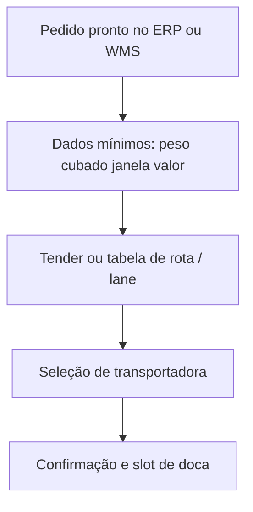
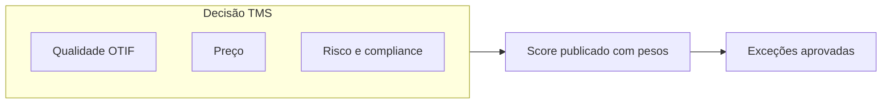

# Pedido de transporte e seleção de transportadora — o triângulo qualidade, preço e risco

**TMS** (*Transportation Management System*) orquestra **pedido de transporte**, **tender** ou seleção por tabela, **consolidação**, **alocação de veículo** e **custo**. A decisão não é só **preço**: **qualidade** (OTIF histórico do *carrier*), **risco** (sinistro, multas contratuais, capacidade em pico) e **adequação operacional** (tipo de veículo, *dock high*, restrição de cidade) entram no mesmo vetor — como nas aulas de fretes da trilha de Fundamentos.

---

## Objetivos e resultado de aprendizagem

**Ao final desta aula**, você será capaz de:

- Montar uma **matriz de decisão** com pelo menos três dimensões além do frete base.
- Explicar **tender** *spot* *vs.* contrato e quando cada um falha.
- Relacionar **dados mestre** (peso, cubagem, janela) com qualidade de cotação.
- Justificar escolha de *carrier* para carga **crítica** *vs.* **commodity**.

**Duração sugerida:** 60–90 minutos.

---

## Gancho — o mais barato que nunca passa na doca

A **TechLar** trocou para transportadora **12%** mais barata em tabela; o **P90** de coleta subiu; **multas** B2B explodiram; o SAC virou **call center** de status. Economia **linear** ignorou **cauda** — e cauda é onde contratos B2B mordem.

**Analogia da cirurgia:** escolher anestesista pelo **menor preço** sem olhar **taxa de complicação** é decisão de risco, não de compras.

---

## Fluxo conceptual — do pedido pronto ao *slot*

**Legenda:** *slot* é janela na doca; sem ele, TMS vira **catálogo** bonito com fila física.

---

## Regras de seleção — além do «menor frete»

- **Custo total**: tarifa base + **acessorias** esperadas + custo de **exceção** histórica.
- **Cobertura** geográfica e **tipo** de veículo (truck, *van*, refrigerado).
- **Compliance**: seguros, certificações, rastreabilidade exigida pelo cliente.
- **Sustentabilidade**: se política da empresa exige — **declare critério** e evite *greenwashing* operacional.
- **Capacidade em pico**: Black Friday, safra, chuva — o *carrier* «bom no mês calmo» pode falhar no pico.

**Legenda:** pesos diferentes para carga crítica *vs.* commodity — **transparência** reduz guerra interna.

---

## Aplicação — exercício

Monte uma **matriz 3×3**: três transportadoras × três critérios (preço, OTIF histórico, risco). Preencha com notas fictícias e **escolha** o *carrier* para **carga crítica** *vs.* **carga commodity** — justifique em **duas frases** cada escolha.

**Gabarito pedagógico:** carga crítica favorece **OTIF** e **risco**; commodity pode aceitar **preço** com teto de risco e monitoração mais frequente.

---

## Erros comuns e armadilhas

- **Tender** sem dados mínimos de peso/cubagem — cotação é chute elegante.
- Ignorar **empty backhaul** em frota própria — o custo «escondido» do retorno vazio.
- *Carrier* «preferido» sem **SLA** escrito — disputa vira narrativa.
- Misturar **Incoterm** de compra com responsabilidade de **frete nacional** sem mapa.
- Escolher modal pelo **preço spot** ignorando **variabilidade** — ver trilha Dados (percentis).

---

## KPIs e decisão

- **OTIF por transportadora** segmentado por região e tipo de carga.
- **Custo de exceção** / fatura (espera, *redelivery*, quebra).
- **Fill rate logístico** do TMS (viagens aceitas *vs.* solicitadas).

---

## Fechamento — três takeaways

1. TMS bem usado **compra serviço**, não só **preço de tabela**.
2. Cauda importa — B2B paga com **multa**, não com «média bonita».
3. Critério implícito vira **favoritismo**; critério explícito vira **governança**.

**Pergunta de reflexão:** qual critério hoje está **implícito** e nunca entra no RFP?

---

## Referências

1. CHOPRA, S.; MEINDL, P. *Supply Chain Management* — transporte como *driver*. Pearson.  
2. Trilha Fundamentos — [fretes e contratos](../../trilha-fundamentos-e-estrategia/modulo-04-custos-logisticos-performance/aula-02-fretes-contratos-negociacao.md).  
3. ICC — Incoterms: https://iccwbo.org/business-solutions/incoterms-rules/  
4. BOWERSOX, D. J.; et al. *Supply Chain Logistics Management*. McGraw-Hill.
