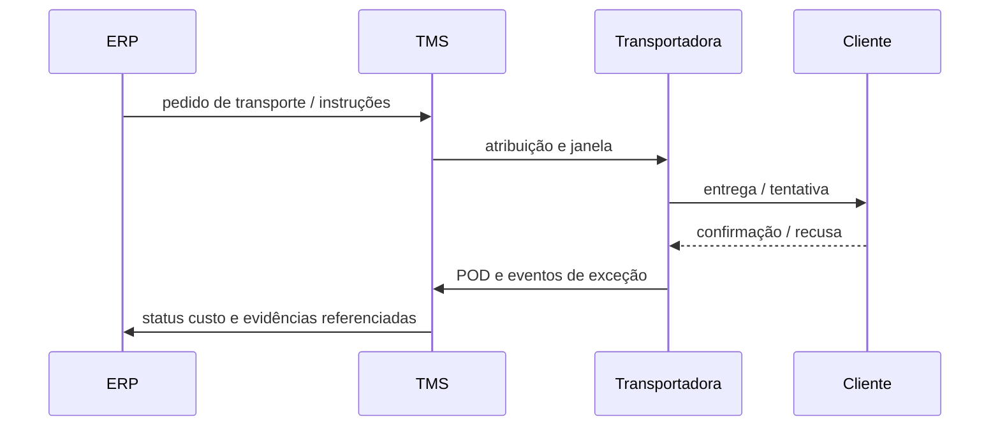

# Execução, rastreio e POD — da saída da doca à prova de que o cliente existiu

Depois da seleção, o TMS governa **execução**: coleta, **eventos** de trânsito, **exceções** (atraso, *redelivery*, espera na doca, temperatura fora da faixa) e **POD** (*proof of delivery*). Sem **POD** válido, faturação, **contestação de multa** e **fechamento** de contas com o transportador ficam no vácuo jurídico-operacional — «alguém disse que entregou» não é processo.

---

## Objetivos e resultado de aprendizagem

**Ao final desta aula**, você será capaz de:

- Listar **sete** eventos mínimos para um painel de exceções entre CD e confirmação do cliente.
- Explicar por que **timestamp** e **fuso** alinhados ao ERP evitam OTIF «mentiroso».
- Relacionar **acessorias** com **tipificação** de motivo no TMS/ERP.
- Discutir captura de evidência (foto, geolocalização) com limites de **privacidade** e **lei** (sem assessoria jurídica).

**Duração sugerida:** 60–90 minutos.

---

## Gancho — assinatura ilegível no PDA

Motorista entregou; o **POD** digital falhou; ficou **papel** com rabisco. O cliente negou recepção; a **TechLar** arcou com **reentrega** e perdeu **argumento** em auditoria. A empresa aprendeu **regra** de captura (foto do documento, identificação do recebedor quando permitido, **geolocalização** quando política e lei permitem) e **treino** de motorista terceiro.

> **Nota:** requisitos legais de prova e privacidade variam por país, setor e tipo de contrato — este material **não** é assessoria jurídica.

**Analogia do comprovante:** PIX sem recibo legível é **ansiedade**; logística B2B sem POD legível é **custo**.

---

## Sequência TMS–ERP — o fio condutor

**Legenda:** o que importa é **referência** canônica ao pedido/remessa — senão o financeiro não consegue **amar** a viagem.

---

## Acessoriais que viram surpresa

Espera, **redelivery**, **refrigeração**, pedágio, **mão de descarga** — devem **tipificar-se** no contrato e no **motivo** de custo extra no TMS/ERP para **auditoria** posterior. **Hipótese pedagógica:** custo sem motivo vira «achismo» na negociação mensal.

---

## Painel de exceções — exercício

Liste **sete** eventos mínimos entre «saiu do CD» e «cliente confirmado» que gostaria de ver num **painel** de exceções.

**Gabarito pedagógico:** atraso na coleta; paragem prolongada; tentativa falhada; *redelivery*; temperatura fora da faixa (se aplicável); assinatura recusada; divergência de volumes; bloqueio de doca; desvio de rota (com política clara de privacidade).

---

## Erros comuns e armadilhas

- **Timestamp** sem fuso alinhado ao ERP — OTIF quebra na planilha, não na estrada.
- POD sem **identificador** canônico de pedido/remessa.
- Exceção tratada só no **WhatsApp** do motorista — não audita, não escala.
- **Geolocalização** sem política — risco legal e de dados pessoais.
- Misturar **status de TMS** com **status fiscal** de entrega.

---

## KPIs e decisão

- **P90** de tempo de entrega por *lane* (ver trilha Dados).
- **Taxa de primeira entrega bem-sucedida** (*first attempt delivery*).
- **Volume de exceções** por tipo (Pareto de causa).

---

## Fechamento — três takeaways

1. Rastreio não é **novela** para o cliente; é **instrumento** de cobrança e melhoria.
2. POD é **prova** — fraco em prova, forte em custo.
3. Evento fora do sistema é **ruído**; ruído vira multa.

**Pergunta de reflexão:** qual evento hoje só existe no **rádio** do motorista?

---

## Referências

1. BOWERSOX, D. J.; et al. *Supply Chain Logistics Management*. McGraw-Hill.  
2. Trilha Dados — [lead time e variabilidade](../../trilha-dados-analytics-logistica/modulo-04-indicadores-logisticos-kpis/aula-02-lead-time-variabilidade-logistica.md).  
3. CSCMP — glossário e melhores práticas de visibilidade: https://cscmp.org/
