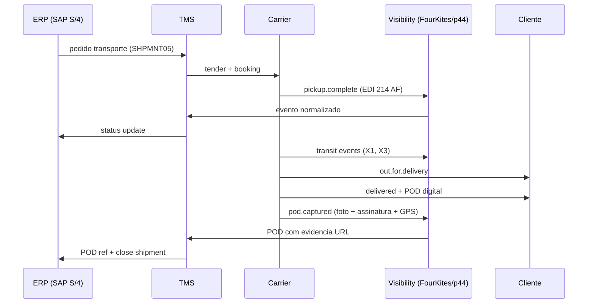
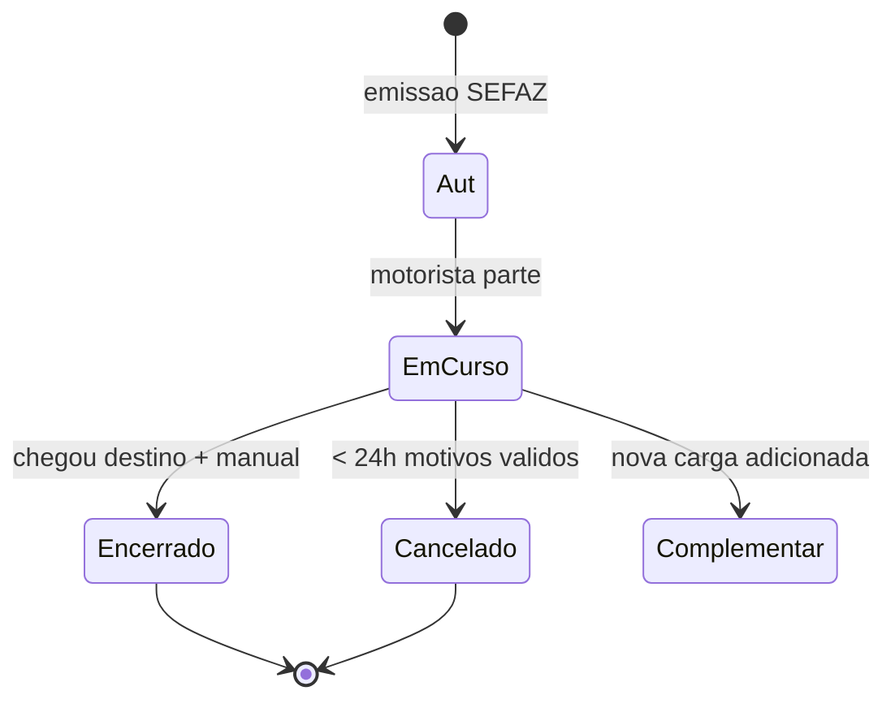

# Execução, rastreio e POD — da saída da doca à prova de que o cliente existiu

Depois da seleção, o TMS governa **execução**: coleta, **eventos** de trânsito, **exceções** (atraso, *redelivery*, espera na doca, temperatura fora da faixa) e **POD** (*Proof of Delivery*). Sem **POD válido**, faturação, **contestação de multa** e **fechamento** de contas com o transportador ficam no vácuo jurídico-operacional — «alguém disse que entregou» não é processo.

Este capítulo vai a fundo em **eventos canônicos** (EDI 214 / EDIFACT IFTSTA), **plataformas de visibility multi-carrier** (FourKites, project44, Shippeo), **POD digital** (assinatura, foto, geofencing) e especificidades **BR** (rastreamento veicular Sascar/Trakto/Onixsat, MDF-e em curso, manifestos eletrônicos).

---

## Objetivos e resultado de aprendizagem

- Listar **sete** eventos mínimos para um painel de exceções entre CD e confirmação do cliente.
- Explicar por que **timestamp** e **fuso** alinhados ao ERP evitam OTIF «mentiroso».
- Relacionar **acessoriais** com **tipificação** de motivo no TMS/ERP.
- Discutir captura de evidência (foto, geolocalização, biometria) com limites de **LGPD**.
- Conhecer **plataformas multi-carrier visibility** e o padrão **EDI 214**.
- Mapear eventos **MDF-e** (encerramento, desvio, complemento) no contexto BR.

**Duração sugerida:** 60–90 minutos.  
**Pré-requisitos:** [aula 01 — pedido de transporte](aula-01-pedido-transporte-carrier.md).

---

## Mapa do conteúdo

1. Gancho — assinatura ilegível no PDA.
2. Conceito — eventos canônicos do trânsito.
3. Modelo de dados — event, status, exception.
4. Sequência TMS-ERP-Carrier-Cliente.
5. Multi-carrier visibility — FourKites, project44, Shippeo.
6. POD digital — formas, prova legal, LGPD.
7. Especificidades BR — Sascar, MDF-e em curso.
8. Caso prático — painel de exceções.
9. Erros, KPIs, glossário.

---

## Gancho — assinatura ilegível no PDA

Motorista entregou; o **POD** digital falhou; ficou **papel** com rabisco. O cliente negou recepção; a **TechLar** arcou com **reentrega** e perdeu **argumento** em auditoria. A empresa aprendeu **regra** de captura: foto da NF-e, foto da carga descarregada, identificação do recebedor (nome legível + RG/funcional), **geolocalização** quando contrato e LGPD permitem, e backup em nuvem por 5+ anos.

> **Nota:** requisitos legais de prova e privacidade variam por país, setor e tipo de contrato — este material **não** é assessoria jurídica. No BR, **LGPD** (Lei 13.709/2018) regula tratamento de dados pessoais; geolocalização e biometria têm regimes próprios.

**Analogia do comprovante:** PIX sem recibo legível é **ansiedade**; logística B2B sem POD legível é **custo**.

**Analogia do delivery de comida:** entregador tirou foto da porta sem campainha → reclamação no app, reembolso, motorista penalizado — mesmo padrão, escala industrial.

---

## Conceito-núcleo — eventos canônicos do trânsito

Cada **evento** tem: tipo (canônico), timestamp (ISO-8601 + offset), location (lat/long ou ID de localização), referência (shipment id, NF-e chave), source (sistema/dispositivo), evidência (URL de foto/anexo opcional).

### Eventos típicos (mapeados ao EDI 214 / IFTSTA)

| Evento canônico | Código X12 214 | EDIFACT IFTSTA status | Significado |
|-----------------|----------------|------------------------|-------------|
| `pickup.complete` | AF | 12 | Coleta concluída na origem |
| `transit.arrived.terminal` | X1 | 14 | Chegou em terminal de carrier |
| `transit.departed.terminal` | X3 | 16 | Saiu de terminal |
| `transit.delay` | AM | 22 | Atraso reportado |
| `out.for.delivery` | X6 | 30 | Saiu para entrega |
| `delivery.attempt.failed` | A7 | 31 | Tentativa frustrada |
| `delivered` | D1 | 36 | Entregue |
| `damage.reported` | NS | 23 | Carga danificada |
| `temperature.deviation` | NV | 50 | Fora da faixa térmica |
| `pod.captured` | (extension) | 38 | POD digital capturado |

---

## Modelo de dados — event store

| Campo | Exemplo | Notas |
|-------|---------|-------|
| `eventId` | `evt-2026-04-19-12345-uuid` | Único, idempotente |
| `eventType` | `transit.arrived.terminal` | Canônico |
| `occurredAt` | `2026-04-19T14:32:00-03:00` | ISO-8601 + fuso |
| `receivedAt` | `2026-04-19T14:35:12-03:00` | Quando o sistema recebeu |
| `shipmentRef` | `SHPMNT-0080001234` | FK para shipment |
| `orderRef` | `VBAK-0000123456` | FK para order |
| `nfeKey` | `35260400000000000000550010000000011000000017` | BR — chave 44 dígitos |
| `mdfeKey` | `35260458000000000001000010000000011000000017` | BR |
| `cteKey` | `35260457000000000001000010000000011000000017` | BR |
| `location` | `{lat: -23.55, lng: -46.63, name: "CD-SP"}` | GPS ou ID |
| `source` | `carrier.JADLOG.api` | Origem |
| `evidenceUrl` | `s3://pods/2026/04/19/uuid.jpg` | Opcional |
| `metadata` | `{driver: "uuid", vehicle: "ABC1D23"}` | LGPD: minimizar PII |

---

## Multi-carrier visibility — plataformas

| Plataforma | Foco | Carriers conectados | Diferencial |
|------------|------|---------------------|-------------|
| **FourKites** | Internacional, multi-modal | 1 milhão+ globais | ETA preditivo ML |
| **project44** | EUA + Europa, todos modais | 200k+ | Ampla cobertura ocean/air |
| **Shippeo** | Europa | 70k+ | Forte EU |
| **Cargo Compass / Cargolaxi** | BR | Regional | Adaptado BR |
| **Loginext (BR)** | Última milha | Carriers BR | Foco urbano |
| **NeoGrid Visibility** | BR varejo | NeoGrid network | Integrado EDI |
| **Cargobase** | Forwarding internacional | Forwarders | Spot tender |

**Padrão:** plataforma agrega eventos de múltiplas fontes (telemetria, EDI, app motorista, API carrier), normaliza e expõe via dashboard + API + webhook.

---

## POD digital — formas e prova legal

| Forma | Vantagens | Limitações | Prova legal (BR) |
|-------|-----------|------------|------------------|
| **Assinatura em tela touch (PDA)** | Comum, simples | Ilegível, fácil contestar | Aceita se backup com timestamp |
| **Foto da carga + NF-e + recebedor** | Forte evidência | Ocupa espaço; LGPD se rosto | Forte em disputa |
| **Geolocalização (GPS)** | Comprova local | Imprecisão urbana | Depende contrato |
| **Biometria (digital, face)** | Identifica pessoa | LGPD sensível; CAPEX | Aceita se base legal LGPD |
| **NF-e eletrônica + carta-frete** | Padrão BR | Sujeito a fraude | Universal aceita |
| **POD via QR code + cliente confirma** | Cliente self-service | Depende cliente engajado | Reforça digitalmente |
| **Webhook do cliente (B2B integrado)** | Automático, rápido | Setup técnico | Forte se contratualizado |

**LGPD (BR):** capturar **rosto** ou **CPF** do recebedor exige **base legal** (consentimento, execução de contrato, legítimo interesse) e **finalidade declarada**. Foto de **placa de veículo** ou **NF-e** geralmente OK; foto com **rosto** identificável requer cuidado.

---

## Acessoriais que viram surpresa

Devem **tipificar-se** no contrato e no **motivo** de custo extra no TMS/ERP para auditoria posterior:

| Acessorial | Quando ocorre | Evidência mínima |
|------------|---------------|------------------|
| **Espera (estadia)** | Tempo > janela contratual | Timestamp chegada + saída na doca |
| **Redelivery (reentrega)** | Tentativa falhada por motivo cliente | POD `delivery.attempt.failed` + foto |
| **TDA (Taxa Descarga Auxiliar)** | Cliente sem paleteira | Foto + relato |
| **Pedágio** | Em rotas com cobrança | Comprovante eletrônico |
| **Vale-pedágio (BR)** | Embarcador antecipado | Comprovante CCR/ARTERIS |
| **GRIS / AdValorem** | Carga alto valor | Cálculo % sobre valor da NF-e |
| **ICMS frete** | Algumas operações | Cálculo conforme CFOP |
| **Despacho aduaneiro** | Importação | Documentação aduaneira |
| **Refrigeração** | Cadeia fria | Log de temperatura |
| **Mão de obra extra** | Descarga/montagem | Acordo com cliente |

**Hipótese pedagógica:** custo sem motivo vira «achismo» na negociação mensal — vira contestação difícil porque não tem evidência tipificada.

---

## Especificidades BR — Sascar, MDF-e em curso

### Telemetria veicular obrigatória

Operação BR de carga de risco depende de **rastreamento ativo** com:
- **GPS** com transmissão minuto a minuto.
- **Botão de pânico** acessível ao motorista.
- **Geofencing** com alerta em desvio de rota.
- **Bloqueio remoto** (combustível) em emergência.
- **Comunicação 24/7** com central de monitoramento.

Provedores: **Sascar (Sotreq)**, **Trakto**, **Onixsat**, **Autotrac**, **Buonny**, **Cargo Tracck**.

### MDF-e em curso

MDF-e (modelo 58) é emitido **antes** da partida e tem ciclo de vida:

**Eventos MDF-e:**
- `Encerramento`: obrigatório no fim da viagem (manual ou via app).
- `Inclusão de DF-e`: adicionar nova NF-e/CT-e ao MDF-e em curso.
- `Cancelamento`: até 24h após autorização, sem trânsito iniciado.
- `Pagamento de operação de transporte`: vinculação ao CIOT.

---

## Caso prático — painel de exceções TechLar

**Setup:** TechLar usa Manhattan TMS + project44 visibility + Sascar GR. Painel diário monitora **9 eventos críticos**:

| # | Evento | Ação se disparado | Responsável |
|---|--------|-------------------|-------------|
| 1 | Atraso de coleta > 30 min | Acionar carrier; notificar cliente | Logística |
| 2 | Parada prolongada > 2h fora rota | Acionar GR; ligar motorista | GR + Logística |
| 3 | Tentativa falhada | Reagendar; comunicar cliente; cobrar acessorial | Customer service |
| 4 | Temperatura fora faixa (cold chain) | Bloquear carga no destino; investigar | Qualidade |
| 5 | Desvio rota > 5km | Alerta GR; possível roubo | GR (Sascar) |
| 6 | MDF-e não encerrado em 48h | Cobrar carrier para encerrar | Fiscal |
| 7 | POD não capturado em 24h após delivered | Cobrar foto/assinatura | Customer service |
| 8 | Divergência peso real vs. cotado > 5% | Auditoria de frete pendente | Financeiro |
| 9 | NF-e cancelada após GI | Estorno + comunicação | Fiscal + Logística |

---

## Aplicação — exercício

Liste **sete** eventos mínimos entre «saiu do CD» e «cliente confirmado» que gostaria de ver num **painel** de exceções para uma operação B2B nacional.

**Gabarito pedagógico:** atraso na coleta; parada prolongada; tentativa falhada; redelivery; temperatura fora da faixa (se cadeia fria); assinatura/POD recusado; divergência de volumes na entrega; bloqueio de doca no cliente; desvio de rota (com política clara de privacidade/LGPD).

---

## Erros comuns e armadilhas

- **Timestamp** sem fuso alinhado ao ERP — OTIF quebra na planilha, não na estrada.
- POD sem **identificador canônico** de pedido/remessa/NF-e.
- Exceção tratada só no **WhatsApp** do motorista — não audita, não escala.
- **Geolocalização** sem política LGPD — risco legal e de dados pessoais.
- Misturar **status de TMS** com **status fiscal** de entrega.
- Visibility sem `correlationId` que liga shipment ↔ ordem ↔ NF-e — impossível auditar.
- POD em PDF apenas — sem campos estruturados, dificulta busca e auditoria.
- BR: MDF-e não encerrado vira **multa SEFAZ** + complica próximas viagens.

---

## KPIs técnicos e de negócio

| KPI | Pergunta | Dono | Fonte | Cadência | Playbook se ruim |
|-----|----------|------|-------|----------|------------------|
| **P90 lead time por lane** | Promessa é factível? | Logística | TMS + visibility | Semanal por lane | Ajustar promessa; trocar carrier |
| **First Attempt Delivery (FAD)** | Cliente recebe na 1ª tentativa? | Customer service | TMS POD events | Semanal | Comunicação prévia ao cliente; janela ajustada |
| **% POD capturado em < 24h** | Evidência sob controle? | Op | TMS POD log | Diário | SLA carrier; cobrança de assinatura |
| **Volume de exceções por tipo** | Onde quebra mais? | Logística | TMS exception log | Semanal | Pareto + ação top 3 |
| **MTTR exceção (mean time to resolve)** | Resposta é rápida? | Customer service | Ticket + TMS event | Diário | Playbook por tipo |
| **Custo de exceção / fatura** | Acessoriais excessivos? | Financeiro | TMS + fatura | Mensal | Tipificar; cobrar cliente quando aplicável |
| **% MDF-e não encerrado em 48h (BR)** | Compliance fiscal? | Fiscal + Op | SEFAZ + TMS | Diário | Cobrar carrier; bloquear próxima viagem |
| **Tempo médio até alerta GR (desvio)** | Reação a roubo é rápida? | Risco + GR | Sascar/Trakto | Por incidente | Reduzir threshold; treino motoristas |

---

## Ferramentas e tecnologias relevantes

| Categoria | Ferramentas | Uso |
|-----------|-------------|-----|
| TMS execution | Manhattan, BY, OTM, MercuryGate, SAP TM | Núcleo |
| Multi-carrier visibility | FourKites, project44, Shippeo, NeoGrid | Eventos normalizados |
| GR / telemetria BR | Sascar, Trakto, Onixsat, Autotrac, Buonny | Anti-roubo + GPS |
| POD digital | App proprietário, Loginext, Routyn, Manhattan Mobile | Captura |
| MDF-e BR | Tecnospeed, Migrate, NDD, Bsoft | Emissão + encerramento |
| Telematics frota | Sascar, Trimble PeopleNet, Geotab, Webfleet | Sensores embarcados |
| Customer notification | Convey (project44), Narvar, NeoGrid Cliente | Self-service |

---

## Glossário rápido

- **POD:** *Proof of Delivery*.
- **EDI 214 / IFTSTA:** mensagens padronizadas de tracking.
- **Visibility:** plataforma multi-carrier de eventos.
- **Geofencing:** cerca virtual com alerta em entrada/saída.
- **MTTR:** *Mean Time to Resolve*.
- **FAD:** *First Attempt Delivery*.
- **GR:** Gerenciamento de Risco (anti-roubo BR).
- **MDF-e:** Manifesto Eletrônico (BR).
- **CT-e:** Conhecimento de Transporte Eletrônico (BR).
- **LGPD:** Lei Geral de Proteção de Dados (BR).
- **CIOT:** Código Identificador da Operação de Transporte.

---

## Pergunta de reflexão

Qual evento hoje só existe no **rádio do motorista** — e qual seria o impacto se a próxima auditoria do cliente cobrasse evidência?

---

## Fechamento — três takeaways

1. Rastreio não é **novela** para o cliente; é **instrumento** de cobrança e melhoria.
2. POD é **prova** — fraco em prova, forte em custo.
3. Evento fora do sistema é **ruído**; ruído vira multa.

---

## Referências

1. **BOWERSOX et al.** — *Supply Chain Logistics Management*. McGraw-Hill.
2. **CSCMP** — *Visibility Best Practices*: https://cscmp.org/
3. **GS1 EPCIS** — eventos de cadeia de suprimentos: https://www.gs1.org/standards/epcis
4. **Smart Freight Centre** — visibility & emissions: https://www.smartfreightcentre.org/
5. **ANTT/SEFAZ BR** — MDF-e/CT-e: https://www.gov.br/antt/ e https://dfe-portal.svrs.rs.gov.br/
6. **Lei 13.709/2018 (LGPD)**: https://www.planalto.gov.br/ccivil_03/_ato2015-2018/2018/lei/l13709.htm
7. **project44 / FourKites** — documentação técnica de eventos.

---

## Pontes para outras trilhas

- **Dados** → [lead time e variabilidade](../../trilha-dados-analytics-logistica/modulo-04-indicadores-logisticos-kpis/aula-02-lead-time-variabilidade-logistica.md).
- **Fundamentos** → [nível de serviço e KPIs](../../trilha-fundamentos-e-estrategia/modulo-04-custos-logisticos-performance/aula-03-nivel-servico-kpis-logisticos.md).
- Próxima aula → [faturação e auditoria de frete](aula-03-faturacao-auditoria-frete.md).
