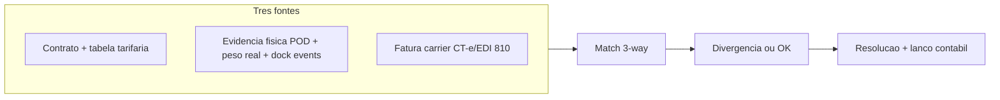
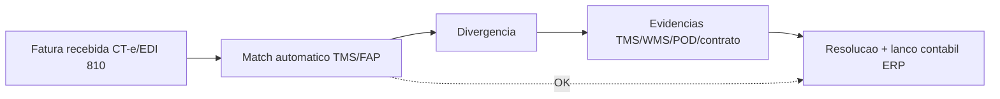

# Faturamento e auditoria de frete — quando a fatura diverge do mundo físico

**Freight audit** compara **fatura do transportador** (CT-e BR / EDI 810 internacional) com **tarifa contratual**, **POD**, peso/cubagem real, **acessoriais** elegíveis e regras de **combustível** (*fuel surcharge*). O TMS costuma ser o **terreno** onde a reconciliação nasce; o ERP **provisiona**, **contesta** e **paga**. Quando isso falha, a margem sangra em **silêncio** — porque ninguém lê fatura linha a linha até o fechamento.

Este capítulo desce em **match 3-way** (PO/contrato + POD + fatura), automação de auditoria com FAP (*Freight Audit & Payment* providers como nVision, A3 Freight Payment, Cass, Trax), e especificidades **BR**: CT-e, conferência de impostos, MDF-e e impacto da Reforma Tributária.

---

## Objetivos e resultado de aprendizagem

- Explicar **match automático**, divergência e ciclo de evidências.
- Usar a lista de **dez discrepâncias** como **checklist** de implantação TMS/FAP.
- Ligar cada discrepância a **um** dado mestre ou **um** evento que prova contestação.
- Argumentar por que **idempotência** também protege **pagamento**.
- Conhecer **FAP providers** e quando terceirizar auditoria.
- Mapear especificidades BR — CT-e match com NF-e, ICMS sobre frete, Reforma Tributária.

**Duração sugerida:** 60–90 minutos.  
**Pré-requisitos:** aulas 01–02 deste módulo.

---

## Mapa do conteúdo

1. Gancho — o mesmo pedido faturado duas vezes.
2. Conceito — match 3-way.
3. Modelo de dados — fatura, contrato, evidência.
4. Dez discrepâncias típicas (checklist).
5. Aprofundamentos — FAP providers; CT-e BR detalhado.
6. Reforma Tributária BR — IBS/CBS no transporte.
7. Caso prático — auditoria mensal de carrier.
8. Erros, KPIs, glossário.

---

## Gancho — o mesmo pedido faturado duas vezes

Transportadora cobrou **viagem dupla** por *redelivery* mal documentada na **TechLar**. Sem **número de viagem canônico** (*shipment ID*) e sem amarração ao POD, a auditoria **duplicou** pagamento. **Idempotência** não é só integração técnica — é **higiene financeira**.

**Analogia do cartão de crédito:** duas cobranças idênticas no mesmo restaurante exigem **recibo** com **número de transação** diferente — aqui, a «transação» é a **viagem** + **shipment ID** + chave CT-e.

**Analogia do plano de saúde:** duas guias para o mesmo procedimento na mesma data → glosa automática se identificador único bate; se não bate, ambas pagam.

---

## Conceito-núcleo — match 3-way

Auditoria de frete saudável compara **três fontes**:



| Cenário | Resultado |
|---------|-----------|
| Contrato = Físico = Fatura | Auto-aprovação, pagamento |
| Contrato = Físico ≠ Fatura | Contestação ao carrier |
| Contrato ≠ Físico (peso real maior que cotado) | Provisão extra ou contrato revisto |
| Físico = Fatura ≠ Contrato | Revisar contrato; renegociar |
| Tudo divergente | Investigação profunda |

---

## Modelo de dados — auditoria de frete

| Objeto | Campos críticos | Origem |
|--------|-----------------|--------|
| **Freight Invoice** | id carrier, shipment ref, valor base, acessoriais, total, moeda, NCMs | Carrier (CT-e BR / EDI 810) |
| **Contract / Tariff** | lane, modal, faixas peso, base, surcharges fórmula | Contrato negociado |
| **Shipment** | id canônico, peso real, volume real, eventos (POD), Acessoriais autorizados | TMS |
| **Match Result** | invoice id, shipment id, status (OK/CONTEST), discrepâncias | FAP system |
| **Dispute** | invoice id, motivo, evidência URL, status, valor recuperado | FAP / financeiro |
| **Provision** | shipment id, custo provisionado, conta razão | ERP (FI) |
| **Payment** | invoice id, valor pago, data, banco | ERP/treasury |

---

## Dez discrepâncias típicas (checklist)

| # | Discrepância | Dado/evento que prova contestação |
|---|--------------|------------------------------------|
| 1 | **Peso taxado > peso real sem cubagem correta** | Cubagem mestre + peso WMS balança + cubometro |
| 2 | **Zona errada na tabela tarifária** | CEP origem/destino correto + lane cadastrada |
| 3 | **Acessorial não contratado** | Lista contratual + log de evento (espera, redelivery) |
| 4 | **Combustível fora da fórmula acordada** | Fórmula contratual + índice ANP/governo no período |
| 5 | **Multa sem evidência de SLA** | Contrato com SLA + timestamp evento (POD, atraso comprovado) |
| 6 | **Moeda e câmbio desalinhados** | Câmbio do dia + contrato (PTAX, comercial) |
| 7 | **Pedágio duplicado** | Comprovante eletrônico (CCR, ARTERIS); vale-pedágio antecipado |
| 8 | **Espera (estadia) sem registro de chegada/janela** | Timestamp `dock.arrived` + janela contratual |
| 9 | **Redelivery sem tentativa comprovada** | POD `delivery.attempt.failed` + foto + GPS |
| 10 | **Número de paletes divergente do WMS** | SSCC scan no embarque + manifesto |
| 11 (BR) | **ICMS sobre frete divergente** | CFOP da operação + alíquota UF correta |
| 12 (BR) | **GRIS/AdValorem sobre valor errado** | Valor declarado NF-e + cálculo % contratual |
| 13 (BR) | **CT-e sem amarração à NF-e correta** | Chave NF-e na CT-e (`refNFe`) |



---

## Aprofundamentos — FAP providers e quando terceirizar

| Provider | Foco | Vantagens | Quando terceirizar |
|----------|------|-----------|---------------------|
| **nVision Global** | Internacional, multi-modal | Cobertura ampla, *self-funding* | Embarcador grande global |
| **A3 Freight Payment** | EUA, parcel + LTL + TL | Forte em parcel (UPS, FedEx) | E-commerce com volume parcel alto |
| **Cass Information Systems** | Pioneiro EUA | Tradicional, robusto | Empresas estabelecidas EUA |
| **Trax Technologies** | Cloud + analytics | BI integrado | Embarcador médio-grande |
| **U.S. Bank Freight Payment** | Banco + auditoria | Treasury integrado | Operação financeira complexa |
| **Loadsmart / Convoy (broker+FAP)** | Broker com auditoria embutida | Spot + auditoria | Operação ad-hoc |
| **TGM Pay (BR)** | BR com CT-e | Conhece BR | Operação BR |
| **Bsoft / NeoGrid TMS-Audit (BR)** | Módulo TMS BR | Integrado ao seu TMS | Quem já usa BR |
| **In-house** | TMS + FI + script | Controle total | Volume baixo, equipe robusta |

**Critério para terceirizar:**
- Volume > 50.000 faturas/ano ou múltiplos carriers/países.
- Falta de equipe especializada interna.
- ROI: FAP cobra 1-3% do valor recuperado; recuperação típica é 2-5% do gasto bruto em frete.

---

## Especificidade BR — CT-e em detalhe

**CT-e** (Conhecimento de Transporte Eletrônico, mod. 57) substitui o conhecimento papel. XML assinado, autorizado pela SEFAZ, com **chave de 44 dígitos**.

### Estrutura essencial

```xml
<CTe>
  <infCte versao="4.00">
    <ide>
      <cUF>35</cUF>           <!-- UF emitente -->
      <CFOP>5353</CFOP>       <!-- Código fiscal -->
      <natOp>Prest. Servico Transp.</natOp>
      <mod>57</mod>           <!-- Modelo CT-e -->
      <serie>1</serie>
      <nCT>123456</nCT>
    </ide>
    <emit>
      <CNPJ>12345678000199</CNPJ>
      <IE>123456789</IE>
    </emit>
    <rem>...</rem>            <!-- Remetente -->
    <dest>...</dest>          <!-- Destinatario -->
    <vPrest>
      <vTPrest>1250.00</vTPrest>   <!-- Valor total -->
      <vRec>1100.00</vRec>          <!-- Valor a receber -->
      <Comp>...</Comp>              <!-- Componentes (frete, GRIS, pedagio) -->
    </vPrest>
    <imp>
      <ICMS>...</ICMS>
    </imp>
    <infCTeNorm>
      <infCarga>
        <vCarga>50000.00</vCarga>     <!-- Valor da carga -->
        <pesoCarga>...</pesoCarga>
      </infCarga>
      <infDoc>
        <infNFe>
          <chave>352604000000...</chave>   <!-- Chave NF-e amarrada -->
        </infNFe>
      </infDoc>
    </infCTeNorm>
  </infCte>
</CTe>
```

### Validação automática para auditoria

1. **CT-e existe e foi autorizado** (consulta SEFAZ).
2. **Chave NF-e** referenciada bate com NF-e emitida pelo embarcador.
3. **Valor da carga** (`vCarga`) bate com valor NF-e.
4. **Tomador do serviço** correto (embarcador, destinatário, ou terceiro).
5. **CFOP** compatível com operação (5353/6353/7353 conforme UF).
6. **ICMS** calculado conforme alíquota UF origem.
7. **Componentes do valor** (`Comp`) bate com contrato (frete + GRIS + pedágio + AdValorem).
8. **Cancelamento** (até 7 dias após autorização) sem trânsito iniciado.

### Tipos de tomador

- **Tomador 0**: Remetente (embarcador paga).
- **Tomador 1**: Expedidor.
- **Tomador 2**: Recebedor.
- **Tomador 3**: Destinatário.
- **Tomador 4**: Outros.

Erro comum: CT-e emitido com tomador errado → embarcador paga frete que era CIF do destinatário.

---

## Reforma Tributária BR — impacto no transporte

A **Reforma Tributária** (LC 214/2025, em vigor faseado 2026-2033) substitui ICMS, ISS, PIS, COFINS, IPI por:
- **IBS** (estados+municípios) e **CBS** (federal) — IVA dual.
- **Imposto Seletivo** (sobre cigarro, álcool, bebida açucarada).

**Impacto esperado em frete:**
- Não-cumulatividade ampla — embarcador pode aproveitar crédito de IBS/CBS sobre frete.
- **CT-e** continua, mas com novos campos (alíquotas IBS/CBS, eventual cashback).
- **Mestres fiscais** (NCM, CEST, CFOP) precisam ser atualizados.
- TMS e ERP precisam suportar **novo regime** em paralelo ao antigo durante transição (2026-2032 com alíquotas progressivas).

**Recomendação prática:** já mapear matriz `produto × UF origem × UF destino × tomador` e simular impacto financeiro mensal antes que a transição comece.

---

## Caso prático — auditoria mensal carrier `JADLOG` na TechLar

**Volume mensal:** 4.500 CT-es, valor bruto R$ 850k.

**Pipeline automatizado:**

1. **Recepção CT-e** (Tecnospeed → SAP via webhook).
2. **Match contratual** no TMS Manhattan: 3.800 CT-es OK (84%).
3. **Divergências (700 CT-es):**
   - 350 com peso > cotado +5% (pedido/embalagem maior) → revisar mestres.
   - 180 com acessorial não contratado → contestar (R$ 22k).
   - 100 com GRIS sobre valor errado → contestar (R$ 8k).
   - 50 com CT-e duplicado (reemissão sem cancelamento anterior) → glosar.
   - 20 com chave NF-e divergente → contestar.
4. **Pacote de evidências**: TMS shipment + WMS peso + POD + contrato vigente + cálculo Excel.
5. **Carrier responde em 15 dias**: aceita 70% (R$ 21k recuperados); contesta 30% → escalação comercial.
6. **Lançamento contábil**: provisão ajustada; nota de débito emitida; pagamento liberado.

**KPI mensal:** % match auto = 84% (target 90%); valor recuperado = R$ 21k (2.5% do bruto); MTTR contestação = 18 dias (target 15).

---

## Aplicação — exercício

Escolha **três** itens da lista de discrepâncias acima e, para cada um, indique **um** dado mestre ou **um** evento que deveria existir para **provar** a contestação.

**Gabarito pedagógico:** item 1 (peso) — cubagem mestre `MARM` + cubagem WMS no recebimento + peso de balança no embarque; item 5 (multa SLA) — contrato com SLA + `timestamp` de chegada na doca cliente (FourKites/Sascar event); item 10 (paletes) — contagem com scan SSCC no embarque + manifesto referenciando todos SSCCs + ASN ao cliente.

---

## Erros comuns e armadilhas

- Auditar só **total mensal**, não **viagem** — some granularidade de causa.
- Aceitar PDF sem **linha** ligada ao pedido/remessa/viagem.
- Ignorar **Incoterm** na alocação de custo entre compras e vendas.
- Não reconciliar **acessorial** com **motivo** operacional — repete erro no mês seguinte.
- **Contrato** desatualizado no TMS — match automático com tabela velha «aprova» erro.
- BR: ignorar amarração CT-e ↔ NF-e (`refNFe`) — pagamento sem evidência fiscal.
- BR: aceitar CT-e com tomador errado → custo absorvido sem direito.
- BR: não revalidar CT-e na SEFAZ (consulta status) → pagar CT-e cancelado pela SEFAZ.
- Pagar fatura **sem** confirmar POD → cliente nega entrega depois.

---

## KPIs técnicos e de negócio

| KPI | Pergunta | Dono | Fonte | Cadência | Playbook se ruim |
|-----|----------|------|-------|----------|------------------|
| **% match automático** | Setup auditoria saudável? | TI + Financeiro | TMS/FAP | Mensal | Atualizar contratos no TMS; corrigir master |
| **Valor recuperado / valor bruto** | Auditoria gera ROI? | Financeiro | FAP report | Mensal | Investir em FAP se < 1.5% |
| **MTTR contestação (dias)** | Resposta carrier rápida? | Financeiro + Op | Dispute log | Mensal | SLA contratual; escalação |
| **% CT-es com discrepância (BR)** | Master fiscal alinhado? | Fiscal + TI | NF-e+CT-e match | Mensal | RCA; revisar tabelas |
| **Provisão vs. realizado** | Custo previsto bate? | Controladoria | ERP FI vs. fatura | Mensal | Revisar fórmula provisão |
| **% pagamentos duplicados detectados** | Idempotência funciona? | Financeiro | Hash invoice | Trimestral | Bloqueio por shipment ID |
| **CT-es não amarrados a NF-e** | Compliance fiscal BR | Fiscal | XML CT-e parser | Diário | Cobrar carrier para emitir certo |

---

## Ferramentas e tecnologias relevantes

| Categoria | Ferramentas | Uso |
|-----------|-------------|-----|
| FAP internacional | nVision, A3, Cass, Trax, U.S. Bank | Auditoria + payment |
| FAP/audit BR | TGM Pay, Bsoft Audit, NeoGrid TMS Audit | BR fiscal |
| TMS com auditoria nativa | Manhattan TM, BY, OTM, MercuryGate | Match contratual |
| ERP (provisão/pagamento) | SAP S/4 (`MIRO`/`F-44`/`ACDOCA`), Oracle EBS, Totvs Protheus | Lançamento |
| CT-e BR | Tecnospeed, Migrate, NDD, eFatura | Recepção XML |
| BI auditoria | Power BI, Tableau, Qlik | Dashboards mensal |
| Treasury | Kyriba, FIS Quantum, ERP TR | Pagamento massivo |

---

## Glossário rápido

- **FAP:** *Freight Audit and Payment* (auditoria + pagamento de frete).
- **Match 3-way:** comparar contrato + físico + fatura.
- **CT-e:** Conhecimento de Transporte Eletrônico (BR).
- **Tomador:** quem paga o frete (CT-e BR).
- **GRIS:** Gerenciamento de Risco (taxa % sobre valor da carga).
- **AdValorem:** taxa % sobre valor da carga.
- **Fuel surcharge:** ajuste de combustível.
- **Glosa:** rejeição parcial/total de fatura.
- **`MIRO` (SAP):** *Logistics Invoice Verification* — entrada de fatura.
- **IBS/CBS:** novos tributos da Reforma Tributária BR.
- **CIOT:** Código Identificador da Operação de Transporte.

---

## Pergunta de reflexão

Qual divergência hoje só aparece no **fechamento mensal**, nunca na operação — e qual seria o impacto financeiro anual se você a detectasse no dia da fatura?

---

## Fechamento — três takeaways

1. Auditoria de frete é **feia** — e evita sangrar **margem em silêncio**.
2. Evidência é **pacote** (mestre + evento + contrato + chave fiscal), não narrativa.
3. Duplicidade mata confiança — **id de viagem** importa tanto quanto id de pedido; no BR, **chave CT-e** é o id final.

---

## Referências

1. **ICC** — Incoterms® 2020: https://iccwbo.org/
2. **CHOPRA & MEINDL** — *Supply Chain Management*. Pearson.
3. **GS1** — SSCC e logística: https://www.gs1.org/
4. **Receita Federal BR** — Manual CT-e: https://dfe-portal.svrs.rs.gov.br/
5. **LC 214/2025** (Reforma Tributária BR): https://www.planalto.gov.br/
6. **Gartner** — *Magic Quadrant for TMS / Freight Audit*.
7. **NTC&Logística** (BR) — manuais de transporte: https://www.portalntc.org.br/
8. **CSCMP** — *Freight Bill Audit & Payment Best Practices*: https://cscmp.org/

---

## Pontes para outras trilhas

- **Fundamentos** → [estrutura de custos](../../trilha-fundamentos-e-estrategia/modulo-04-custos-logisticos-performance/aula-01-estrutura-custos-logisticos.md).
- **Fundamentos** → [fretes e contratos](../../trilha-fundamentos-e-estrategia/modulo-04-custos-logisticos-performance/aula-02-fretes-contratos-negociacao.md).
- Próximo módulo → [SAP MM/SD/WM — mapa](../modulo-05-sap-logistica-mm-sd-wm/aula-01-mapa-mm-sd-wm-cadeia.md).
