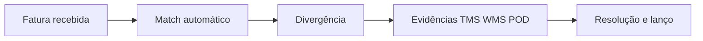

# Faturamento e auditoria de frete — quando a fatura diverge do mundo físico

**Freight audit** compara **fatura do transportador** com **tarifa contratual**, **POD**, peso/cubagem real, **acessorias** elegíveis e regras de **combustível** (*fuel surcharge*). O TMS costuma ser o **terreno** onde a reconciliação nasce; o ERP **provisiona**, **contesta** e **paga**. Quando isso falha, a margem sangra em **silêncio** — porque ninguém lê fatura linha a linha até o fechamento.

---

## Objetivos e resultado de aprendizagem

**Ao final desta aula**, você será capaz de:

- Explicar **match** automático, divergência e ciclo de evidências.
- Usar a lista de **dez discrepâncias** como **checklist** de implantação TMS.
- Ligar cada discrepância a **um** dado mestre ou **um** evento que prova contestação.
- Argumentar por que **idempotência** também protege **pagamento**.

**Duração sugerida:** 60–90 minutos.

---

## Gancho — o mesmo pedido faturado duas vezes

Transportadora cobrou **viagem dupla** por *redelivery* mal documentada na **TechLar**. Sem **número de viagem** canônico e sem amarração ao POD, a auditoria **duplicou** pagamento. **Idempotência** não é só integração técnica — é **higiene financeira**.

**Analogia do cartão de crédito:** duas cobranças idênticas no mesmo restaurante exigem **recibo** com **número de transação** diferente — aqui, a «transação» é a **viagem**.

---

## Dez discrepâncias típicas (*checklist*)

1. Peso taxado **>** peso real sem cubagem correta.  
2. **Zona** errada na tabela tarifária.  
3. **Acessorial** não contratado.  
4. **Combustível** fora da fórmula acordada.  
5. **Multa** sem evidência de SLA.  
6. **Moeda** e câmbio desalinhados.  
7. **Pedágio** duplicado.  
8. **Espera** sem registro de chegada/janela.  
9. **Redelivery** sem tentativa comprovada.  
10. **Número** de paletes divergente do WMS.

**Legenda:** sem **E**, a resolução vira opinião — e opinião perde para fatura.

---

## Aplicação — exercício

Escolha **três** itens da lista acima e, para cada um, indique **um** dado mestre ou **um** evento que deveria existir para **provar** a contestação.

**Gabarito pedagógico:** item 1 — cubagem mestre + cubagem WMS + peso de balança; item 5 — contrato com SLA + *timestamp* de chegada na doca; item 10 — contagem de paletes no embarque com *scan* de SSCC (quando aplicável).

---

## Fluxo financeiro — visão de logística

Mesmo sem ser contador, o coordenador deve saber:

- **Provisionamento** reconhece custo **antes** do pagamento final — surpresa no fechamento muitas vezes é **provisionamento** errado, não só «frete caro».
- **Contestação** precisa de **pacote de evidência** (POD, tabela, print de rastreio **com política**).

---

## Erros comuns e armadilhas

- Auditar só **total mensal**, não **viagem** — some granularidade de causa.
- Aceitar PDF sem **linha** ligada ao pedido/remessa/viagem.
- Ignorar **Incoterm** na alocação de custo entre compras e vendas.
- Não reconciliar **acessorial** com **motivo** operacional — repete erro no mês seguinte.
- **Contrato** desatualizado no TMS — match automático com tabela velha «aprova» erro.

---

## KPIs e decisão

- **% fatura** contestada com sucesso (e valor recuperado).
- **Taxa de match** automático *vs.* manual.
- **Tempo médio** de ciclo de contestação (dinheiro «preso»).

---

## Fechamento — três takeaways

1. Auditoria de frete é **feia** — e evita sangrar **margem** em silêncio.
2. Evidência é **pacote** (mestre + evento + contrato), não narrativa.
3. Duplicidade mata confiança — **id** de viagem importa tanto quanto *id* de pedido.

**Pergunta de reflexão:** qual divergência hoje só aparece no **fecho**, nunca na operação?

---

## Referências

1. ICC — Incoterms® 2020: https://iccwbo.org/business-solutions/incoterms-rules/incoterms-2020/  
2. CHOPRA, S.; MEINDL, P. *Supply Chain Management*. Pearson.  
3. Trilha Fundamentos — [estrutura de custos](../../trilha-fundamentos-e-estrategia/modulo-04-custos-logisticos-performance/aula-01-estrutura-custos-logisticos.md).  
4. GS1 — SSCC e logística: https://www.gs1.org/
