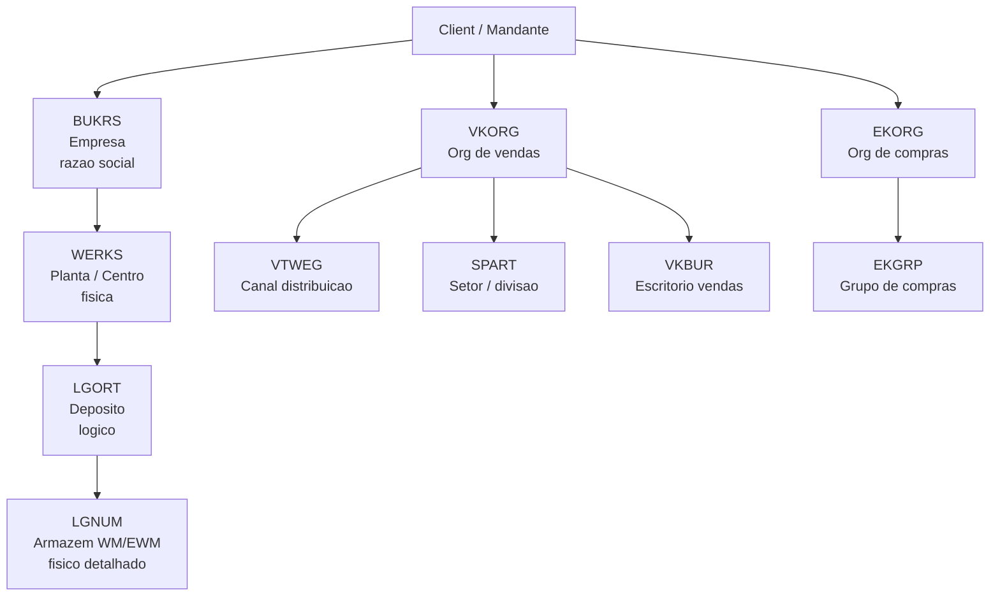
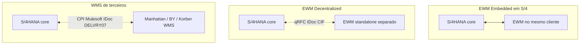

# Mapa MM, SD e WM/EWM/TM — onde o SAP entra sem substituir o seu «ERP mental»

> **Aviso:** **SAP** é marca registrada da SAP SE. Este texto é **pedagógico** e **genérico**; transações, *apps* Fiori, CDS, *BAPIs* e comportamentos variam entre **SAP S/4HANA** (1610, 1709, 1809, 1909, 2020, 2021, 2022, 2023+) e **SAP ECC 6.0**, e entre **EWM**, **WM** clássico e **IM** simples. Valide sempre no **SAP Help Portal** e no sistema da sua empresa. **Não** substitui formação certificada nem acesso a ambiente de exercício licenciado.

Depois dos módulos **agnósticos**, o mapa SAP organiza **MM** (*Materials Management* — compras, recebimento, estoque), **SD** (*Sales and Distribution* — vendas, preço, disponibilidade, entrega ao cliente, faturamento), **WM/EWM** (*Warehouse Management* clássico ou *Extended Warehouse Management*) e **TM** (*Transportation Management*). A ideia é **sobrepor** estes blocos ao fluxo «compras → estoque → venda → expedição → transporte» que você já desenhou — para que a primeira transação não vire **labirinto** sem bússola.

Este capítulo dá o **mapa de t-codes principais**, a **anatomia de organização** (`BUKRS` / `WERKS` / `LGORT` / `VKORG`), e as **diferenças ECC vs. S/4HANA** que mais afetam logística — incluindo BP único, ACDOCA, MATDOC, EWM embedded e o roadmap até 2027 (fim do mainstream support do ECC).

---

## Objetivos e resultado de aprendizagem

- Posicionar **MM**, **SD**, **WM/EWM** e **TM** no percurso «fornecedor → cliente final».
- Conhecer os **t-codes essenciais** por módulo e as **tabelas-chave**.
- Entender a **organização SAP**: empresa, planta, depósito, organização de vendas, área de armazenagem.
- Diferenciar **ECC** vs. **S/4HANA** nos pontos relevantes para logística.
- Saber quando usar **EWM embedded** vs. **decentralized** vs. **WMS de terceiros**.
- Traduzir «travou no SAP» em **módulo + estado + documento + integração**.

**Duração sugerida:** 60–90 minutos.  
**Pré-requisitos:** módulos 01–04 desta trilha (master data, ERP, WMS, TMS).

---

## Mapa do conteúdo

1. Gancho — «foi no SAP» sem dizer qual módulo.
2. Anatomia da organização SAP (`BUKRS`/`WERKS`/`LGORT`/`VKORG`/`VTWEG`/`SPART`).
3. Mapa de t-codes por módulo.
4. Diagrama do fluxo end-to-end com t-codes.
5. ECC vs. S/4HANA — tabela comparativa.
6. EWM embedded vs. decentralized vs. WMS terceiros.
7. Onde SAP **não** é o armazém/transporte.
8. Erros, KPIs, glossário.

---

## Gancho — «foi no SAP» sem dizer qual módulo

Na **TechLar**, o comercial disse «o SAP travou». Investigando: o **bloqueio** era de **crédito** em SD (`VKM3`); o armazém culpou **MM** por saldo (`MMBE` mostrava 0); TI mostrou **fila de IDoc** com TMS (`WE05` cheia de status 51). Vocabulário comum **reduz** guerra de silos — e acelera **post-mortem** honesto.

**Analogia do hospital:** «deu problema no prédio» não ajuda se o incêndio é na **subestação** (TI/integração), na **ala cirúrgica** (módulo de produção) ou no **estoque farmacêutico** (master data + lote). Quem chama o socorro precisa do **CEP da emergência**.

**Analogia do aeroporto:** «o avião atrasou» é informação inútil — se não souber se foi **manutenção**, **tráfego aéreo**, **embarque** ou **alfândega**, não há ação.

---

## Anatomia da organização SAP



| Sigla | Nome | Exemplo TechLar |
|-------|------|------------------|
| `BUKRS` | Empresa (razão social) | TechLar Brasil S.A. |
| `WERKS` | Planta/centro físico | CD Cajamar (1010), Loja SP (1020) |
| `LGORT` | Depósito (lógico) dentro da planta | 0001 Disponível, 0002 Bloqueado QA, 0003 Devolução |
| `LGNUM` | Armazém WM/EWM (físico detalhado, bins) | A01 — bins/área de armazenagem |
| `VKORG` | Organização de vendas | BR01 |
| `VTWEG` | Canal de distribuição | 10 e-commerce, 20 B2B, 30 marketplace |
| `SPART` | Setor (linha de produto) | 01 eletro, 02 móveis |
| `EKORG` | Organização de compras | BR-EKORG |
| `EKGRP` | Grupo de compras (responsáveis) | 100 importação, 200 nacional |

> **Boa prática:** desenhar o «mapa de organização» da sua empresa **antes** de tocar em qualquer transação — dele dependem master, autorização, fechamento e relatório.

---

## Mapa de t-codes essenciais por módulo

### MM — Materials Management

| Atividade | T-code clássico | App Fiori (S/4) | Tabela principal |
|-----------|-----------------|-----------------|-------------------|
| Mestre material | `MM01`/`MM02`/`MM03` | *Manage Product Master Data* | `MARA`, `MARC`, `MARD`, `MARM`, `MBEW` |
| Mestre fornecedor | `XK01`/`XK02`/`XK03` (ECC); `BP` (S/4) | *Maintain Business Partner* | `LFA1`, `LFM1` (ECC); `BUT000` (S/4) |
| Pedido de compra | `ME21N`/`ME22N`/`ME23N` | *Manage Purchase Orders* | `EKKO`, `EKPO`, `EKET` |
| Solicitação compra | `ME51N`/`ME52N`/`ME53N` | *Manage Purchase Requisitions* | `EBAN` |
| Entrada mercadorias | `MIGO` | *Post Goods Movement* | `MKPF`, `MSEG` (ECC); `MATDOC` (S/4) |
| Estoque por material | `MMBE` / `MB52` | *Stock — Single Material* | `MARD`, `MCHB` |
| Lista movimentos | `MB51` | *Material Documents* | `MSEG`/`MATDOC` |
| Consulta IDoc | `WE02`/`WE05`/`BD87` | *Manage IDocs* | `EDIDC`, `EDIDS`, `EDID4` |
| Inventário cíclico | `MI31`/`MI07`/`MI20` | *Physical Inventory* | `IKPF`, `ISEG` |

### SD — Sales and Distribution

| Atividade | T-code | App Fiori | Tabela |
|-----------|--------|-----------|--------|
| Mestre cliente | `XD01`/`XD02`/`XD03` (ECC); `BP` (S/4) | *Maintain BP* | `KNA1`, `KNB1`, `KNVV`, `KNVP` (ECC); `BUT000`+CVI (S/4) |
| Pedido de venda | `VA01`/`VA02`/`VA03` | *Manage Sales Orders* | `VBAK`, `VBAP`, `VBKD` |
| Cotação | `VA21`/`VA22` | *Manage Quotations* | `VBAK` (TQ) |
| Entrega outbound | `VL01N`/`VL02N`/`VL03N` | *Manage Outbound Deliveries* | `LIKP`, `LIPS` |
| Lista entregas pendentes | `VL10A`/`VL10C`/`VL10G` | *Create Delivery from Order* | — |
| Picking (sem WM) | `VL02N` (transferência picking) | *Pick Outbound Delivery* | `LIPS-PIKMG` |
| Goods Issue (saída) | `VL02N` PGI / `VL06G` em massa | *Post Goods Issue* | `MSEG`/`MATDOC` |
| Faturamento | `VF01`/`VF02`/`VF03`/`VF04` | *Manage Billing Documents* | `VBRK`, `VBRP` |
| Bloqueio crédito | `VKM3`/`VKM1` | *Release Credit Blocks* | `VBUK`, `BSAD` |
| Fluxo documento | `VA03` → Fluxo (ou `VBFA`) | *Document Flow* | `VBFA` |
| Status disponibilidade ATP | `CO09` | *Check Material Availability* | `MARC`/`VBBE` |

### WM clássico

| Atividade | T-code | Tabela |
|-----------|--------|--------|
| Cadastro armazém | `LS01`/`LS02` | `LAGP`, `LQUA` |
| Bin/endereço | `LS01N` | `LAGP` |
| Ordem de transferência | `LT01`/`LT03`/`LT12` | `LTAK`, `LTAP` |
| Confirmação TO | `LT12` | `LTAP-VLPLA` |
| Estoque por bin | `LS24`/`LS26` | `LQUA` |
| Posição WM | `LX02`/`LX03` | — |

### EWM (extended)

| Atividade | T-code/App | Tabela `/SCWM/*` |
|-----------|------------|--------------------|
| Documento entrega entrada | `/SCWM/PRDI` | `/SCDL/DB_PROCH_O` |
| Documento entrega saída | `/SCWM/PRDO` | `/SCDL/DB_PROCH_O` |
| Warehouse Order monitor | `/SCWM/MON` | `/SCWM/WHO`, `/SCWM/ORDIM_O` |
| RF logon | `/SCWM/RFUI` | — |
| Bins | `/SCWM/LS01` | `/SCWM/LAGP` |
| Wave | `/SCWM/WAVE` | `/SCWM/WAVEHDR` |

### TM (Transportation Management)

| Atividade | T-code/App | Tabela `/SCMTMS/*` |
|-----------|------------|---------------------|
| Freight Order | `/SCMTMS/TOR` | `/SCMTMS/D_TOR_ROOT` |
| Freight Booking | `/SCMTMS/FB` | `/SCMTMS/D_TOR_ROOT` |
| Lane | configuração | `/SCMTMS/D_LANE` |
| Rate (tarifa) | `/SCMTMS/RATE` | `/SCMTMS/D_RATE` |
| Planning Cockpit | `/SCMTMS/TPLN_TC` | — |

### Transversais

| Atividade | T-code | Comentário |
|-----------|--------|------------|
| IDoc inbound/outbound | `WE02`, `WE05`, `BD87`, `BD88` | Reprocessar IDoc com erro |
| Filas qRFC | `SMQ1` (out), `SMQ2` (in) | Fila SAP↔EWM/CRM |
| Job logs | `SM37` | Batch jobs |
| Locks | `SM12` | Travamentos |
| User exits/BAdI | `SE18`/`SE19` | Customização |

---

## Encadeamento conceitual end-to-end com t-codes

```mermaid
flowchart LR
  subgraph mm["MM - Compras / Recebimento"]
    SC[ME51N<br/>Solicitacao]
    PO[ME21N<br/>Pedido compra]
    GR[MIGO<br/>Recebimento<br/>BWART 101]
  end
  subgraph wm["EWM ou WM - Armazem"]
    PUT[/SCWM/PRDI<br/>Inbound Delivery]
    BIN[/SCWM/MON<br/>WT putaway]
    PICK[/SCWM/MON<br/>WT picking]
  end
  subgraph sd["SD - Vendas / Expedicao"]
    SO[VA01<br/>Pedido venda]
    DEL[VL01N<br/>Entrega outbound]
    PGI[VL02N PGI<br/>BWART 601]
    INV[VF01<br/>Fatura]
  end
  subgraph tm["TM - Transporte"]
    FO[/SCMTMS/TOR<br/>Freight Order]
    POD[Tracking<br/>POD]
  end
  subgraph fi["FI - Financeiro"]
    AR[Contas a receber<br/>VBRK to BSID]
    GL[Razao<br/>ACDOCA S/4]
  end

  SC --> PO --> GR --> PUT --> BIN
  SO --> DEL --> PICK --> PGI --> INV --> AR --> GL
  DEL --> FO --> POD
```

---

## ECC vs. S/4HANA — tabela comparativa para logística

| Tema | ECC 6.0 | S/4HANA | Impacto logística |
|------|---------|---------|--------------------|
| **Mestre cliente/fornecedor** | `KNA1`/`LFA1` separados (XD01/XK01) | **BP único** com roles `FLCU00`/`FLVN00` | Treinamento de master; CVI obrigatório |
| **Documento material** | `MKPF` + `MSEG` | **`MATDOC`** (single-source) | Reportes mais rápidos; queries ABAP refeitas |
| **Razão FI** | `BKPF`/`BSEG` + `COEP` (CO) | **`ACDOCA`** universal journal | Dashboards mais ricos e reais |
| **Estoque** | `MARD`/`MCHB` + acumuladores | `MARD`/`MCHB` + queries CDS sobre `MATDOC` | MMBE_MOD / Fiori app rico |
| **WM** | WM clássico (`LAGP`/`LQUA`) **deprecated** | **EWM embedded** ou decentralized | Migração obrigatória até 2025/2027 |
| **TM** | SAP TM separado (decentralized) | **TM embedded** disponível | Stack mais simples |
| **aATP** | ATP clássico em CO09 | **aATP** com PAL, BoP, RBA | Resposta mais rica em prioridades |
| **Output management** | NAST + SAPscript/Smartforms | **OM via BRF+** + Adobe Forms | NF-e DANFE customização diferente |
| **Produção** | PP-PI / DM | aPP, MRP Live em HANA | MRP em minutos |
| **Receita** | RAR, COPA (account-based vs. costing-based) | CO-PA account-based unificado | Margem por pedido logístico mais clara |
| **Fim mainstream support** | ECC 6.0: 2027 (extendido até 2030) | S/4 contínuo (Cloud/RISE) | Migração obrigatória |
| **GUI** | SAP GUI tradicional | **SAP Fiori** + GUI (legado) | UX mais moderno; mobilidade |
| **NF-e BR** | GRC NF-e standalone | GRC NF-e + integrado mais nativo | Melhor experiência fiscal BR |
| **Material Ledger** | Opcional | **Obrigatório** | Custo médio múltiplo monetário |

---

## EWM embedded vs. decentralized vs. WMS de terceiros



| Critério | EWM Embedded | EWM Decentralized | WMS terceiros |
|----------|--------------|--------------------|----------------|
| **Custo licença** | Incluído (limitado) ou EWM Adv. | Licença EWM separada | Licença WMS |
| **Performance** | Compartilha HANA | Isolado, alta carga | Isolado |
| **Upgrade independente** | Não (acompanha S/4) | Sim | Sim |
| **Operação 24/7 sem downtime S/4** | Não (downtime = parada) | Sim | Sim |
| **Funcionalidades EWM** | Standard ou Advanced | Advanced completo | Conforme vendor |
| **Quando usar** | Operação simples/média; <200 transações/min | Operação complexa, alto volume, MFS | Vendor-lock estratégico em outro WMS, ou MFS especializado |
| **Recomendação 2026+** | Default S/4 simples | Sites grandes EWM | Quando WMS já é Manhattan/BY com investimento |

---

## Onde SAP **não** é o armazém/transporte

Muitas plantas usam **WMS de terceiros** (Manhattan, Blue Yonder, Körber/HighJump, Mecalux, Senior, Totvs WMS) ou **TMS externo** (Manhattan TM, BY TMS, Oracle OTM, MercuryGate, NeoGrid, Bsoft, MaxiFrota). O SAP continua sendo **sistema de registro** de pedido, disponibilidade e faturamento — mas a **verdade física** mora no satélite.

**Padrões de integração:**

- **WMS terceiro** ↔ SAP: IDoc `DELVRY07` (entrega), `WMSCID` (confirmação), `MBGMCR` (movimento), `WPDWGR` (recebimento). Middleware: SAP CPI/Mulesoft/Boomi.
- **TMS terceiro** ↔ SAP: IDoc `SHPMNT05` (shipment), `IFTMIN` (EDI), API REST.
- **OMS e-commerce** ↔ SAP: REST/Kafka eventos `order.created`, `inventory.reserved`, `payment.captured`; tipicamente OMS «proxa» pedido para SD.

A **reconciliação** e o **dicionário de eventos** tornam-se críticos (ver módulos 02–04 desta trilha).

---

## Caso prático — TechLar e seu mapa SAP

A TechLar opera:
- **2 BUKRS:** TechLar Brasil (BR01), TechLar Argentina (AR01).
- **3 plantas/WERKS BR:** 1010 CD Cajamar, 1020 Loja SP, 1030 Loja Rio.
- **EWM decentralized** no CD; lojas operam IM simples + Excel.
- **TMS Manhattan** integrado via IDoc.
- **OMS VTEX** para e-commerce → pedido criado em VTEX vai para SAP via API → cria `VBAK` em VA01.

Em uma reclamação de cliente «meu pedido sumiu», o time deve checar:
1. **VA03** com nº pedido cliente → existe `VBAK`? Status?
2. **VBFA** → fluxo: pedido → entrega? Entrega → fatura?
3. Se entrega bloqueada: `VKM3` (crédito) ou status disponibilidade?
4. **`/SCWM/PRDO`** EWM → onda picking? Confirmada?
5. **`WE05`** → IDocs SAP↔EWM↔TMS sem erro?
6. **TMS** → freight order criado? POD recebido?

---

## Aplicação — exercício

Desenhe **em uma frase** cada papel de **MM**, **SD**, **WM/EWM** e **TM** no percurso «fornecedor → cliente final» para a **sua** empresa — inclua **uma** integração externa se existir (WMS, TMS, OMS, MES) e marque **um** t-code essencial por módulo.

**Gabarito pedagógico:** MM = `ME21N` (PO) + `MIGO` (recebimento); SD = `VA01` (pedido) + `VL01N` (entrega) + `VF01` (fatura); WM/EWM = `/SCWM/PRDI` (entrada) + `/SCWM/PRDO` (saída) **ou** WMS terceiro via IDoc `DELVRY07`; TM = `/SCMTMS/TOR` (freight order) **ou** TMS terceiro via API/IDoc.

---

## Erros comuns e armadilhas

- Estudar **transação** sem entender **processo** — vira coleta de figurinha.
- Copiar **organização** de referência (`BUKRS`/`WERKS`) com **masters** incompatíveis — «funciona na demo, morre na vida».
- Ignorar **integração** com TMS/WMS externo — OTIF quebra na **mensagem**, não no módulo.
- Misturar **conceito ECC** com **S/4** sem validar simplificações (BP único, ACDOCA, MATDOC).
- Tratar **EWM** como «WM com outro nome» — escopo, modelo de dados e integração diferem radicalmente.
- Não diferenciar **EWM embedded** e **decentralized** — impacto em downtime, licença e performance.
- Ignorar **roadmap** do ECC (mainstream support até 2027) — projeto S/4 leva 12-24 meses; planejar agora.

---

## KPIs e decisão

| KPI | Pergunta | Cadência |
|-----|----------|----------|
| % chamados «no SAP» com módulo identificado | Vocabulário comum funciona? | Semanal |
| Tempo médio de diagnóstico (módulo + estado + integração) | Triagem eficiente? | Semanal |
| % IDocs SAP↔WMS/TMS com erro | Integração saudável? | Diário (`WE05`) |
| % usuários treinados em Fiori vs. SAP GUI | Adoção S/4? | Trimestral |
| Cobertura de processo por módulo SAP vs. satélites | Mapa atualizado? | Anual |

---

## Ferramentas e tecnologias relevantes

| Categoria | Ferramentas |
|-----------|-------------|
| ERP | SAP S/4HANA (on-premise / Cloud / RISE), SAP ECC 6.0 |
| WMS SAP | EWM embedded, EWM decentralized, WM clássico (deprecated) |
| TMS SAP | SAP TM (embedded em S/4 ou decentralized) |
| Master | SAP MDG, BP único S/4 |
| Integração | SAP CPI/Integration Suite, SAP Event Mesh, SAP API Management |
| Mobilidade | SAP Fiori, SAP Mobile Services, SAP Asset Manager |
| Analytics | SAP BW/4HANA, SAP Analytics Cloud, Datasphere |
| BR fiscal | SAP GRC NF-e, Synchro, Mastersaf, Tecnospeed |

---

## Glossário rápido

- **`BUKRS`:** empresa (razão social SAP).
- **`WERKS`:** planta/centro físico.
- **`LGORT`:** depósito (lógico).
- **`LGNUM`:** armazém WM/EWM (físico detalhado).
- **`VKORG`:** organização de vendas.
- **`VTWEG`:** canal de distribuição.
- **`SPART`:** setor (linha de produto).
- **BP:** Business Partner (S/4 unificado).
- **CVI:** Customer-Vendor Integration (sincroniza BP↔KNA1/LFA1).
- **MATDOC:** tabela única de movimento em S/4.
- **ACDOCA:** universal journal em S/4.
- **EWM:** Extended Warehouse Management.
- **`/SCWM/*`:** namespace EWM.
- **`/SCMTMS/*`:** namespace SAP TM.
- **CPI:** Cloud Platform Integration (iPaaS SAP).
- **RISE with SAP:** oferta cloud gerenciada.

---

## Fechamento — três takeaways

1. SAP é **grande** porque espelha a **cadeia**; o mapa MM–SD–WM/EWM–TM é **bússola**.
2. «SAP travou» é **sintoma**; **módulo + estado + documento + integração** é **diagnóstico**.
3. Satélites (WMS/TMS/OMS terceiros) são normais — **fronteira** bem desenhada com **IDoc/API/evento canônico** vale mais que «tudo nativo».

**Pergunta de reflexão:** qual elo da cadeia hoje **não** está coberto por nenhum destes blocos na sua planta — e quem é o «proprietário do silêncio»?

---

## Referências

1. **SAP Help Portal** (documentação oficial): https://help.sap.com/
2. **SAP Community** — blogs e perguntas: https://community.sap.com/
3. **SAP Press** — livros oficiais (livro EWM, TM, S/4 Logística).
4. **ASUG** (American SAP User Group) e **ASUG Brazil**: https://www.asug.com/
5. **Roadmap S/4HANA**: https://roadmaps.sap.com/
6. CHOPRA, S.; MEINDL, P. *Supply Chain Management*. Pearson.
7. Módulo 02 desta trilha — [documentos e estados do pedido](../modulo-02-erp-aplicado-supply-chain/aula-01-documentos-estados-pedido.md).

---

## Pontes para outras trilhas

- **Master Data** → módulo 01 desta trilha.
- **WMS** → módulo 03 desta trilha.
- **TMS** → módulo 04 desta trilha.
- Próxima aula → [MM e estoque](aula-02-mm-stock-logistica.md).
