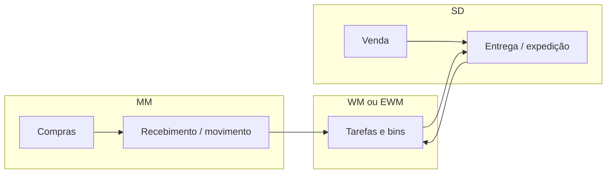

# Mapa MM, SD e WM na cadeia — onde o SAP entra sem substituir o seu «ERP mental»

> **Aviso:** **SAP** é marca registrada da SAP SE. Este texto é **pedagógico** e **genérico**; transações, *apps* Fiori, CDS, *BAPIs* e comportamentos variam entre **SAP S/4HANA**, **SAP ECC** e entre **EWM**, **WM** clássico e **IM** simples. Valide sempre no **SAP Help Portal** e no sistema da sua empresa. **Não** substitui formação certificada nem acesso a ambiente de exercício licenciado.

Depois dos módulos **agnósticos**, o mapa SAP organiza **MM** (*Materials Management* — compras, recebimento e estoque em grande parte), **SD** (*Sales and Distribution* — vendas, preço, disponibilidade, entrega ao cliente, faturamento de cliente) e **WM/EWM** (gestão de armazém **dentro** ou **acoplada** ao ecossistema SAP). A ideia é **sobrepor** estes blocos ao fluxo «compras → estoque → venda → expedição» que você já desenhou — para que a primeira transação não vire **labirinto** sem bússola.

---

## Objetivos e resultado de aprendizagem

**Ao final desta aula**, você será capaz de:

- Posicionar **MM**, **SD** e **WM/EWM** no percurso «fornecedor → cliente final».
- Explicar por que frases como «travou no SAP» precisam ser traduzidas em **módulo + estado + documento**.
- Nomear **três** riscos de estudar transação sem entender processo de negócio.
- Identificar **um** elo da sua planta que **não** está coberto por MM/SD/WM (ex.: OMS próprio, MES, TMS externo).

**Duração sugerida:** 45–75 minutos (leitura + diagrama próprio).

---

## Gancho — «foi no SAP» sem dizer qual módulo

Na **TechLar**, o comercial disse «o SAP travou». Na verdade, o **bloqueio** era **crédito** em SD; o armazém culpou **MM** por saldo; TI mostrou **fila de integração** com TMS. Vocabulário comum **reduz** guerra de silos — e acelera **post-mortem** honesto.

**Analogia do hospital:** «deu problema no prédio» não ajuda se o incêndio é na **subestação** ou na **ala cirúrgica**.

---

## Encadeamento conceptual

**Legenda:** fluxo simplificado; integrações reais podem usar **IDoc**, **API**, *middleware*, CPI, *iFlows*, WMS de terceiros, etc. O mapa é **GPS**, não a estrada.

---

## Documento contabilístico — o que logística precisa saber

Movimentos de estoque **relevantes** frequentemente geram **documento contabilístico** (interface com FI). Logística precisa saber que **ajuste** não é «apagar estoque» sem **consequência** no fechamento — detalhe contábil profundo fica com **controladoria**, mas a **consciência** de interface evita «surpresa» em *town hall*.

---

## Onde SAP **não** é o armazém/transporte

Muitas plantas usam **WMS de terceiros** ou **TMS** externo. O SAP continua sendo **sistema de registro** de pedido, disponibilidade e faturamento — mas a **verdade física** pode morar no satélite. A **reconciliação** e o **dicionário de eventos** tornam-se críticos (ver módulos 2–4 desta trilha).

---

## Aplicação — exercício

Desenhe **em uma frase** cada papel de **MM**, **SD** e **WM/EWM** no percurso «fornecedor → cliente final» para a **sua** empresa — inclua **uma** integração externa se existir.

**Gabarito pedagógico:** MM = compra e recebimento; SD = ordem de venda, entrega e faturamento de cliente; WM/EWM = tarefas, endereços e confirmações físicas **ou** interface para WMS externo.

---

## Erros comuns e armadilhas

- Estudar **transação** sem entender **processo** — vira coleta de figurinha.
- Copiar **organização** de referência com **masters** incompatíveis — «funciona na demo, morre na vida».
- Ignorar **integração** com TMS/WMS externo — OTIF quebra na mensagem, não no módulo.
- Misturar **conceito ECC** com **S/4** sem validar simplificações (ex.: *data model*).
- Tratar **EWM** como «WM com outro nome» — escopo e integração diferem.

---

## Fechamento — três takeaways

1. SAP é **grande** porque espelha a **cadeia**; o mapa MM–SD–WM é **bússola**.
2. «SAP travou» é **sintoma**; processo + estado + integração é **diagnóstico**.
3. Satélites são normais — **fronteira** bem desenhada vale mais que «tudo nativo».

**Pergunta de reflexão:** qual elo da cadeia **não** está coberto por nenhum destes blocos na tua planta?

---

## Referências

1. SAP Help Portal (documentação oficial): https://help.sap.com/  
2. ASCM — CPIM (contexto de planejamento independente de fornecedor): https://www.ascm.org/  
3. Módulo 2 desta trilha — [documentos e estados do pedido](../modulo-02-erp-aplicado-supply-chain/aula-01-documentos-estados-pedido.md).  
4. CHOPRA, S.; MEINDL, P. *Supply Chain Management*. Pearson.
