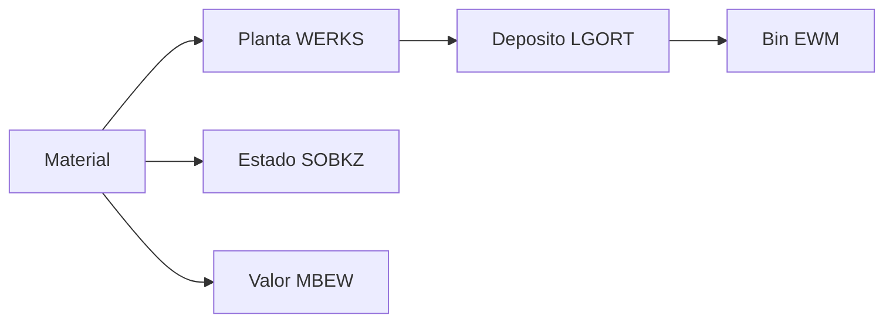
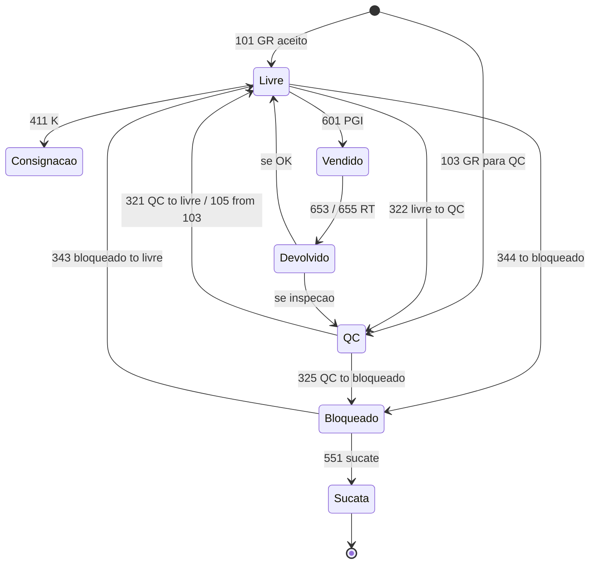
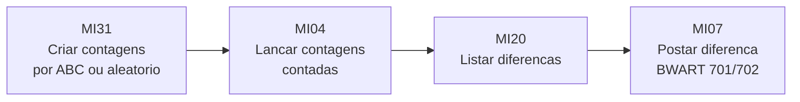
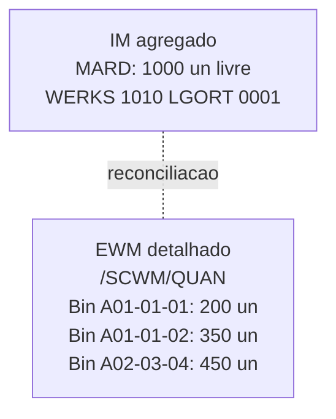

# MM e estoque relevante para logística — recebimento, bloqueio e o que o IM mostra

> **Aviso:** conteúdo **conceitual**; nomes de movimento, tipos de documento, *apps* e telas mudam com **versão** (ECC 6.0 vs. S/4HANA) e **escopo** (IM central *vs.* WM/EWM). **SAP** é marca de terceiros. Consulte documentação oficial e o **blueprint** da sua empresa. **Não** substitui acesso guiado a ambiente de treino licenciado.

**MM** trata, entre outros, **pedido de compra** (`EKKO`/`EKPO`), **entrada de mercadorias** (*goods receipt* via `MIGO`) e **movimentos** que alteram estoque e valorização (em interface com **IM** — *Inventory Management* — e/ou **EWM**). Para logística, o foco é: **receber certo**, **bloquear quando necessário** e **não prometer** o que está **em quarentena** — independentemente de quantos cliques existam.

Este capítulo desce em **`BWART`** (chave de movimento — quem nunca ouviu «movimento 101», «movimento 561», «movimento 311» não falou MM ainda), nos **estados de estoque** (livre, qualidade, bloqueado, devolução, consignação), em **MIGO + reversões** e na **reconciliação** IM↔EWM/WMS — onde **metade dos incidentes** de inventário nascem.

---

## Objetivos e resultado de aprendizagem

- Explicar a diferença entre **saldo agregado IM** (`MARD`/`MCHB`) e **detalhe de bin EWM/WMS** (`/SCWM/QUAN`).
- Decifrar **`BWART`**: quando 101, 102, 103, 105, 122, 123, 124, 311, 561, 601, 602.
- Descrever **estados de estoque** (livre, QC, bloqueado, devolução, consignação) e como cada um aparece nos relatórios.
- Formular **cinco** perguntas antes de aceitar «o estoque está errado no SAP» como conclusão.
- Relacionar **movimento sem texto** com auditoria fraca.
- Identificar **três** t-codes de inventário cíclico e sua sequência (`MI31` → `MI04` → `MI07`).

**Duração sugerida:** 60–90 minutos.

---

## Mapa do conteúdo

1. Gancho — recebimento «verde» com lote não inspecionado.
2. Conceito — estoque é **estado** + **localização** + **valor**.
3. Modelo de dados (tabelas `MARD`, `MCHB`, `MARC`, `MBEW` etc.).
4. Tipos de movimento `BWART` — tabela completa.
5. Estados de estoque — diagrama de transições.
6. MIGO — entradas, devoluções, reversões.
7. Aprofundamento: ECC vs. S/4 (MATDOC, Material Ledger).
8. Inventário cíclico (`MI31`/`MI04`/`MI07`/`MI20`).
9. Caso prático — divergência IM↔EWM.
10. Erros, KPIs, glossário.

---

## Gancho — recebimento «verde» com lote não inspecionado

A **TechLar** recebeu **fisicamente** uma carga de smartphones e o operador postou **MIGO 101** (entrada normal); contudo a política dizia para postar **103** (entrada bloqueada para QC). O **ATP** vendeu 200 unidades em 10 minutos; em seguida QC reprovou o lote por defeito de tela. Resultado: 200 promessas a clientes que **viram cancelamento** + custo logístico reverso.

A sequência correta é **política** + **estado de estoque** + **integração**, não só «clique rápido» para zerar fila.

**Analogia da ponte:** liberar tráfego antes da **inspeção estrutural** — o problema não é o carro; é o **processo**. O painel diz «verde», mas a viga ainda não foi assinada.

**Analogia do hospital:** dar alta antes do **resultado do exame** — fisicamente o paciente está bem; sistemicamente ainda há um pendente que pode mudar tudo.

---

## Conceito-núcleo — estoque é estado + localização + valor

Cada SKU em SAP tem **três facetas** que precisam estar consistentes:

1. **Estado** (`SOBKZ` *Special Stock Indicator* + categorias `STATUS`): livre, qualidade, bloqueado, em trânsito, consignação, projeto, terceiro.
2. **Localização**: `WERKS` (planta) + `LGORT` (depósito) + `LGNUM`/bin (EWM/WMS).
3. **Valor**: `MBEW` (`STPRS` standard ou `VERPR` moving average) + tabela `MBEWH` (histórico).

Saldo «no SAP» pode ser:

- **Soma de todos os estados** → engana ATP.
- **Só livre** → real para venda.
- **Por bin** → só EWM/WMS sabe.

---

## Modelo de dados — tabelas-chave de estoque

| Tabela | Conteúdo | Granularidade |
|--------|----------|---------------|
| **`MARA`** | Mestre material (geral) | Por material |
| **`MARC`** | Mestre material por planta (`MMSTA`, `BWTAR`) | Material × planta |
| **`MARD`** | Estoque IM por depósito | Material × planta × `LGORT` |
| **`MCHB`** | Estoque por **lote** | Material × planta × `LGORT` × `CHARG` |
| **`MARM`** | Unidades alternativas (factor) | Material × UoM |
| **`MBEW`** | Valorização (preço, valor) | Material × `BWKEY` (área valorização) |
| **`MBEWH`** | Histórico mensal de valorização | Material × período |
| **`MKPF`** (ECC) | Cabeçalho documento material | Por documento |
| **`MSEG`** (ECC) | Item documento material | Documento × item |
| **`MATDOC`** (S/4) | Documento material **único** (substitui MKPF+MSEG) | — |
| **`MSKA`** | Estoque alocado a pedido venda | Material × pedido |
| **`MSKU`** | Estoque cliente (consignação cliente) | Material × cliente |
| **`MSLB`** | Estoque em fornecedor (subcontratação) | Material × fornecedor |
| **`MKOL`** | Estoque consignação fornecedor | Material × fornecedor × planta |
| **`MSPR`** | Estoque projeto (PS) | Material × WBS |
| **`VBBE`** | Demanda alocada (ATP) | Material × pedido item |
| **`RESB`** | Reservas | Material × reserva |
| **`/SCWM/QUAN`** (EWM) | Quantidade por bin | Material × bin × HU |

---

## Tipos de movimento `BWART` — referência prática

`BWART` é a **chave** que diz «o que está acontecendo» — e qual conta contábil é debitada/creditada.

### Recebimento (compras MM)

| `BWART` | Descrição | Quando |
|---------|-----------|--------|
| **101** | GR para PO em estoque livre | Recebimento normal aceito |
| **102** | **Reversão** de 101 | Cancelar GR errado |
| **103** | GR para PO em estoque bloqueado (sem valor ainda) | Receber para inspeção sem postar valor |
| **104** | Reversão de 103 | — |
| **105** | Liberar 103 (de bloqueado para livre) | Após QC aprovar |
| **106** | Reversão de 105 | — |
| **107** | GR direto para outro estoque (cancelamento) | — |
| **109** | Liberação para uso de estoque em poder de terceiros | — |
| **122** | Devolução ao **fornecedor** (de livre) | Fornecedor enviou errado |
| **123** | Reversão 122 | — |
| **124** | Devolução ao fornecedor (de bloqueado) | — |

### Saídas (vendas SD, consumo)

| `BWART` | Descrição |
|---------|-----------|
| **261** | Saída para ordem de produção |
| **262** | Reversão 261 |
| **551** | Sucateamento / quebra |
| **552** | Reversão 551 |
| **601** | Goods Issue para entrega de venda (PGI normal) |
| **602** | Reversão 601 (cancela PGI) |
| **603** | GI a outro depósito |
| **641** | Transferência entre plantas (STO) — saída |
| **643** | Transferência one-step entre plantas |
| **645** | Transferência STO inter-company |
| **647** | Transferência one-step inter-company |
| **653** | Devolução de cliente (do GI cancelado) |
| **655** | Devolução de cliente para estoque livre |
| **657** | Devolução de cliente para QC |

### Transferências e ajustes

| `BWART` | Descrição |
|---------|-----------|
| **309** | Mudança de número de material |
| **311** | Transferência **entre depósitos** (`LGORT` → `LGORT`) na mesma planta |
| **312** | Reversão 311 |
| **313**/**315** | Transferência com remoção/colocação (two-step) |
| **321** | De QC para livre (mudança de status) |
| **322** | Reversão 321 (livre → QC) |
| **325** | De QC para bloqueado |
| **343** | De bloqueado para livre |
| **344** | Reversão 343 |
| **411** | Transferência **estoque cliente** ↔ próprio (devolução consignação) |
| **412** | Reversão 411 |
| **501** | Recebimento **sem PO** (entrada gratuita / amostra) |
| **502** | Reversão 501 |
| **521** | Recebimento de produção sem ordem |
| **531** | Recebimento de subprodutos |
| **561** | **Carga inicial** de estoque (saldo inicial — só na implantação ou reset) |
| **562** | Reversão 561 |
| **701** | Diferença de inventário positiva |
| **702** | Diferença de inventário negativa |
| **711** | Diferença em estoque QC positiva |
| **712** | Diferença em estoque QC negativa |

> **Boa prática:** documentar a **matriz `BWART` × cenário** da sua empresa em runbook acessível ao chão de armazém. «Movimento 561 em produção» é red flag — só implantação/reset.

---

## Estados de estoque — diagrama de transições

Em relatórios:
- `MMBE` mostra **agregado por estado** por material/planta.
- `MB52` mostra **lista** com colunas por estado (`LBKUM` livre, `INSME` QC, `SPEME` bloqueado, retornos).
- `MB5T` mostra **estoque em trânsito** (STO).
- `MB58`/`MB54` mostra **estoque em consignação/terceiros**.

---

## MIGO — anatomia da entrada

`MIGO` é o **canivete suíço** do movimento. Configurações importantes:

| Campo | O que significa | Erro comum |
|-------|-----------------|------------|
| **Movimento (`BWART`)** | 101/103/122/etc. | Postar 101 quando deveria 103 (qualidade) |
| **Documento de referência** | PO (`EKPO`), entrega entrada (LIKP), reserva | Sem ref → movimento solto, difícil rastrear |
| **Texto do item** | Justificativa | **Em branco** = pesadelo de auditoria |
| **Lote (`CHARG`)** | Código do lote | Sem lote em material gerenciado por lote → erro `M7-149` |
| **Data validade (`VFDAT`)** | FEFO depende disso | Sem data → FEFO impossível |
| **Quantidade entregue / aberta / pendente** | Atualização parcial | Excesso bloqueia se tolerância não configurada |
| **Local recebimento (`LGORT`)** | Depósito destino | Errado → divergência aparente |
| **Qualidade obrigatória** | Marcado por `MARC-INSMK` | Se sim, força status QC |

---

## Aprofundamentos — ECC vs. S/4HANA, Material Ledger

### S/4HANA simplifica

- **`MATDOC`** substitui `MKPF` + `MSEG` → uma tabela; queries mais rápidas; histórico unificado.
- **Aggregates** (`MARD`, `MCHB`, `MSKU`, etc.) ainda existem mas são **calculados on-the-fly** em S/4 (compatibilidade) — alguns são `OBSOLETE`. Em S/4 puro, query CDS sobre `MATDOC` é o caminho.
- **Material Ledger** obrigatório → custo médio em até **3 moedas** + valorização paralela.
- **`ACDOCA`** universal journal → cada `BWART` gera linhas FI direto, sem `BSEG` separado.

### Stock APIs e CDS Views úteis em S/4

- `I_StockOnHand` (CDS) — saldo atual por material/planta/depósito.
- `I_BatchStock` — por lote.
- `I_MaterialDocument` — documento material (substitui MKPF+MSEG).
- App Fiori «*Stock — Single Material*» substitui `MMBE`.

---

## Inventário cíclico — sequência de t-codes

**Política recomendada:**
- Classe A: contagem mensal.
- Classe B: trimestral.
- Classe C: anual ou por exceção.
- **Cycle counting** contínuo (3-5 SKUs/dia por contador) > inventário anual fechando armazém.

---

## Divergência IM *vs.* bin físico — onde nasce metade dos incidentes

Quando **EWM/WM** gerencia o **bin**, o **IM** mostra estoque **agregado** por `LGORT`; o detalhe mora nos **endereços**. Reconciliação periódica e **motivos** são obrigatórios.

Causas comuns de divergência:
- **IDoc `WMSCID`** (confirmação WMS→IM) **falhou** ou ficou em fila qRFC (`SMQ2` cheia).
- **Diferença de timing**: IM atualiza só quando WMS confirma; entre confirmação e atualização há janela.
- **Movimento manual em IM** sem reflexo no WMS (ex.: ajuste direto via `MB1B` sem `LT01`).
- **Agregação de estados**: `MARD-LABST` é só livre; QC e bloqueado em campos separados.

---

## Caso prático — TechLar, divergência IM↔EWM

**Sintoma:** comercial reclama que `MMBE` mostra 50 un disponíveis, mas EWM (`/SCWM/MON`) mostra 0 disponíveis no único bin de picking.

**Diagnóstico:**
1. `MMBE` mostra:
   - LGORT 0001: 50 un livre (`LABST`).
   - LGORT 0002: 0 un.
2. `MB52` por material confirma 50 un livre.
3. `/SCWM/MON` por material:
   - Bin A01-01-01: 50 un, mas com flag `quality.inspection.in.progress`.
4. Causa: lote em **inspeção** no EWM, mas IDoc `WMSCID` para mover IM (322 livre→QC) **não foi enviado**.
5. `WE05` mostra IDoc na fila, status 64 (esperando processamento).
6. `BD87` reprocessar → IDoc passa → `MB52` agora mostra 0 livre, 50 QC.

**Lição:** ATP «mente gentilmente» quando IM e WMS desalinham. Reconciliação automática **diária** entre `MARD/MCHB` e `/SCWM/QUAN` é **obrigatória**.

---

## Aplicação — exercício

Liste **cinco** perguntas a fazer a TI/funcional antes de aceitar «o estoque está errado no SAP» como conclusão.

**Gabarito pedagógico:**
1. **Qual planta/depósito?** (`WERKS`/`LGORT` corretos?)
2. **Qual estado?** (livre `LABST`, QC `INSME`, bloqueado `SPEME`)
3. **Lote?** (`MCHB` por `CHARG` — *batch split* pode esconder)
4. **Documento em curso?** (transferência STO em trânsito? PO sem GR?)
5. **Integração?** (IDoc IM↔WMS em fila? `WE05`/`SMQ1`/`SMQ2`)
6. **Consignação/projeto?** (`MKOL`/`MSKU`/`MSPR`)
7. **Reserva ATP?** (`VBBE`/`RESB` alocados a pedidos)
8. **UoM?** (`MARM` — confusão base × alternativa)

---

## Erros comuns e armadilhas

- Movimento **sem texto** de item — impossível auditar **por que** mexeu.
- **Devolução** ao fornecedor (`BWART` 122/124) sem encadear **logística reversa** + estado de qualidade.
- Confiar no **saldo** sem **disponível ATP** — promessa errada (ATP considera `VBBE`/`RESB`).
- Tratar **ajuste** (701/702) como rotina sem **Pareto** de causas — vira normal.
- **`BWART` 561** em produção (só vale na implantação) — sintoma de descontrole.
- **Treinamento** só em transação — sem **runbook** de exceções (`MIGO` cancelar, reverter, reabrir).
- **Lote sem `VFDAT`** → FEFO impossível.
- Não rodar **`CKMLCP`** (Material Ledger close) → custo médio descalibra.
- Em S/4: query antiga sobre `MKPF`/`MSEG` quando deveria ser `MATDOC` → lentidão e dados parciais.
- Confiar em `MARD-LABST` sem checar QC e bloqueado.

---

## KPIs técnicos e de negócio

| KPI | Pergunta | Dono | Fonte | Cadência | Playbook se ruim |
|-----|----------|------|-------|----------|------------------|
| **% acurácia inventário (classe A)** | Estoque IM bate com físico? | WMS + Op | `MI20` diferenças | Mensal | Cycle counting; runbook ajustes |
| **Idade média estoque QC (dias)** | QC libera rápido? | QC + Op | `MCHB` × `MKPF`/MATDOC | Semanal | Aumentar capacidade QC; SLA |
| **% movimentos manuais** (vs. integrados) | Automação saudável? | TI + Op | `MSEG`/MATDOC `LGNUM` vazio | Mensal | Mais APIs/IDocs; menos `MB1B` manual |
| **% movimentos sem texto** | Auditoria possível? | Op + Compliance | `MSEG-SGTXT` em branco | Mensal | Tornar obrigatório por config |
| **% IDocs `WMSCID` em erro** | IM↔WMS reconciliado? | TI | `WE05` | Diário | Reprocessar `BD87`; alarme |
| **Divergência IM↔EWM por valor** | Materiais críticos OK? | Inventário | Job comparativo | Diário | Reconciliação + ajuste |
| **% materiais com lote sem `VFDAT`** | FEFO viável? | Master | `MCH1` | Mensal | Forçar `VFDAT` no cadastro |
| **% PO com tolerância excedida** | Recebimento controlado? | Compras | `EKPO`/`MIGO` | Semanal | Negociar tolerância |

---

## Ferramentas e tecnologias relevantes

| Categoria | Ferramentas |
|-----------|-------------|
| Movimento (transação) | `MIGO`, `MB1A`/`MB1B`/`MB1C`, `MB31` (PP) |
| Consulta | `MMBE`, `MB52`, `MB51`, `MB5B`, `MB5T`, `MB58`, `MB54` |
| Inventário cíclico | `MI31`, `MI04`, `MI07`, `MI20`, `MI09` |
| Lote | `MSC1N`/`MSC2N` cadastro lote, `MB56` análise |
| Reserva | `MB21` cria, `MB22` modifica, `MB25` análise |
| STO | `ME21N` PO STO, `VL10B` entrega STO |
| Material Ledger | `CKMLCP` close, `CKM3` análise |
| EWM | `/SCWM/PRDI`, `/SCWM/MON`, `/SCWM/RFUI` |
| BR fiscal | `J1B*` t-codes, GRC NF-e, Synchro |
| Fiori (S/4) | *Manage Material Documents*, *Stock — Single Material*, *Stock — Multiple Materials* |

---

## Glossário rápido

- **`BWART`:** chave de movimento (101, 561, 601, etc.).
- **`SOBKZ`:** Special Stock Indicator (E projeto, K consignação, V devolução, W subcontratação).
- **`MIGO`:** transação universal de movimento de mercadorias.
- **`LABST`:** estoque livre (em `MARD`).
- **`INSME`:** estoque em qualidade.
- **`SPEME`:** estoque bloqueado.
- **`CHARG`:** lote.
- **`VFDAT`:** data de validade.
- **STO:** Stock Transfer Order (transferência entre plantas).
- **PGI:** Post Goods Issue (saída de mercadorias na entrega).
- **Material Ledger:** valorização paralela em múltiplas moedas e custo real.
- **MATDOC:** tabela única de documento material em S/4HANA.
- **CKMLCP:** transação de fechamento do Material Ledger.

---

## Pergunta de reflexão

Qual bloqueio de estoque hoje é **manual no Excel** em vez de estado no sistema (`SOBKZ` ou status QC) — e qual a probabilidade de o ATP prometer o que não devia, neste exato momento?

---

## Fechamento — três takeaways

1. MM bem usado **protege** margem e compliance **antes** da expedição — `BWART` certo na hora certa evita 80% das dores.
2. **IM agregado** mente gentilmente se você ignorar o **bin** EWM/WMS — reconciliação diária é obrigatória.
3. «Estoque errado» é **hipótese** — não conclusão; cinco perguntas antes da acusação.

---

## Referências

1. **SAP Help** — *Inventory Management* / *Goods Movement* (versão correspondente): https://help.sap.com/
2. **SAP Press** — *Inventory Management with SAP S/4HANA*.
3. SILVER, E. A.; PYKE, D. F.; PETERSON, R. *Inventory Management and Production Planning and Scheduling*. Wiley.
4. **Receita Federal BR** — Manual NF-e e movimentação fiscal: https://www.nfe.fazenda.gov.br/
5. Módulo WMS desta trilha — [recebimento e put-away](../modulo-03-wms/aula-02-recebimento-putaway.md).
6. Módulo ERP desta trilha — [estoque e movimentos](../modulo-02-erp-aplicado-supply-chain/aula-02-stock-movimentos.md).

---

## Pontes para outras trilhas

- **Master Data** → [aula material](../modulo-01-master-data-para-logistica/aula-02-material-unidade-embalagem.md).
- **Dados/KPIs** → [acurácia de inventário](../../trilha-dados-analytics-logistica/modulo-04-indicadores-logisticos-kpis/).
- Próxima aula → [SD, expedição e WMS](aula-03-sd-expedicao-wms.md).
