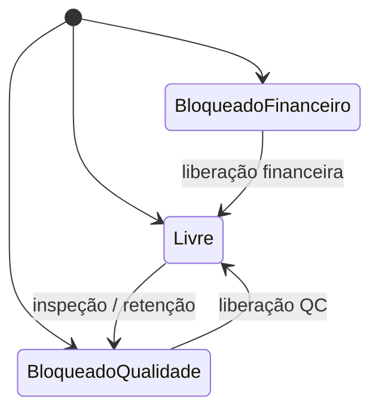
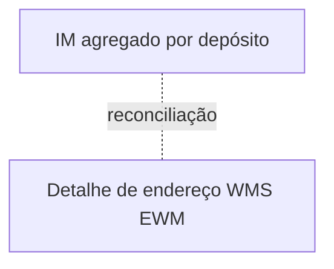

# MM e estoque relevante para logística — recebimento, bloqueio e o que o IM mostra

> **Aviso:** conteúdo **conceitual**; nomes de movimento, tipos de documento, *apps* e telas mudam com **versão** e **escopo** (IM central *vs.* WM/EWM). **SAP** é marca de terceiros. Consulte documentação oficial e o **blueprint** da sua empresa. **Não** substitui acesso guiado a ambiente de treino licenciado.

**MM** trata, entre outros, **pedido de compra**, **entrada de mercadorias** (*goods receipt*) e **movimentos** que alteram estoque e valorização (em interface com **IM** — *Inventory Management* — e/ou **EWM**). Para logística, o foco é: **receber certo**, **bloquear quando necessário** e **não prometer** o que está **em quarentena** — independentemente de quantos cliques existam.

---

## Objetivos e resultado de aprendizagem

**Ao final desta aula**, você será capaz de:

- Explicar a diferença entre **saldo agregado** no IM e **detalhe de bin** no EWM/WMS.
- Descrever **estados** de disponibilidade com lógica de segregação (qualidade/financeiro).
- Formular **cinco** perguntas antes de aceitar «o estoque está errado no SAP» como conclusão.
- Relacionar **movimento sem texto** com auditoria fraca.

**Duração sugerida:** 45–75 minutos.

---

## Gancho — recebimento «verde» com lote não inspecionado

A **TechLar** recebeu **fisicamente** e postou **IM** antes do **lote** ser aprovado por qualidade. O **ATP** vendeu estoque **ainda** não conforme. A sequência correta é **política** + **estado de estoque** + **integração**, não só «clique rápido» para zerar fila.

**Analogia da ponte:** liberar tráfego antes da **inspeção estrutural** — o problema não é o carro; é o **processo**.

---

## Estados de estoque (intuição)

**Legenda:** nomes SAP reais podem diferir; a ideia é **segregação** de disponibilidade para **ATP** e canais.

---

## Divergência IM *vs.* bin físico

Quando **EWM/WM** gerencia o **bin**, o **IM** pode mostrar estoque «no armazém» **agregado**; o detalhe mora nos **endereços**. **Reconciliação** periódica e **motivos** são obrigatórios — senão vira discussão infinita entre **«o SAP»** e **«a prateleira»**.

**Legenda:** a linha pontilhada é onde nasce **metade** dos incidentes de inventário.

---

## Aplicação — exercício

Liste **cinco** perguntas a fazer a TI/funcional antes de aceitar «o estoque está errado no SAP» como conclusão.

**Gabarito pedagógico:** bloqueio de qualidade/financeiro? **Depósito** correto? **Lote** e *batch split*? **UoM** e fator? **Documento** em curso (transferência pendente)? **Integração** atrasada com WMS? **Consignação**?

---

## Erros comuns e armadilhas

- Movimento **sem texto** de item — impossível auditar **por que** mexeu.
- **Devolução** ao fornecedor sem encadear **logística reversa** e estado de qualidade.
- Confiar no **saldo** sem **disponível ATP** — promessa errada.
- Tratar **ajuste** como rotina sem **Pareto** de causas.
- **Treinamento** só em transação — sem **runbook** de exceções.

---

## KPIs e decisão

- **Idade** de estoque em quarentena (WIP de qualidade).
- **Volume** de movimentos manuais *vs.* integrados.
- **Divergência** IM–WMS por valor e por SKU classe A.

---

## Fechamento — três takeaways

1. MM bem usado **protege** margem e compliance **antes** da expedição.
2. IM agregado mente **gentilmente** se você ignorar o bin.
3. «Estoque errado» é **hipótese** — não conclusão.

**Pergunta de reflexão:** qual bloqueio hoje é **manual no Excel** em vez de estado no sistema?

---

## Referências

1. SAP Help — *Inventory Management* / *Goods Movement* (áreas relevantes à sua versão): https://help.sap.com/  
2. SILVER, E. A.; PYKE, D. F.; PETERSON, R. *Inventory Management and Production Planning and Scheduling*. Wiley.  
3. Módulo WMS desta trilha — [recebimento e put-away](../modulo-03-wms/aula-02-recebimento-putaway.md).
