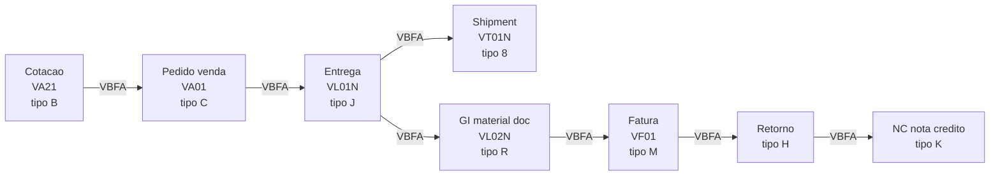
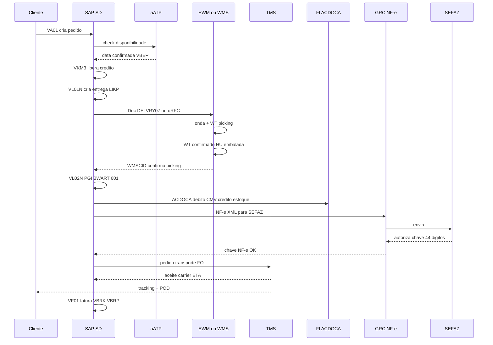
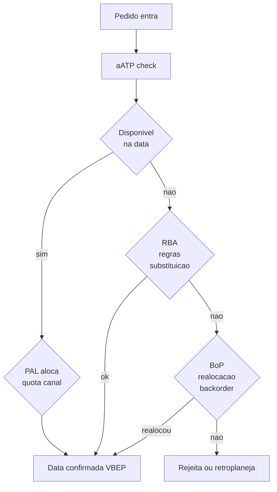
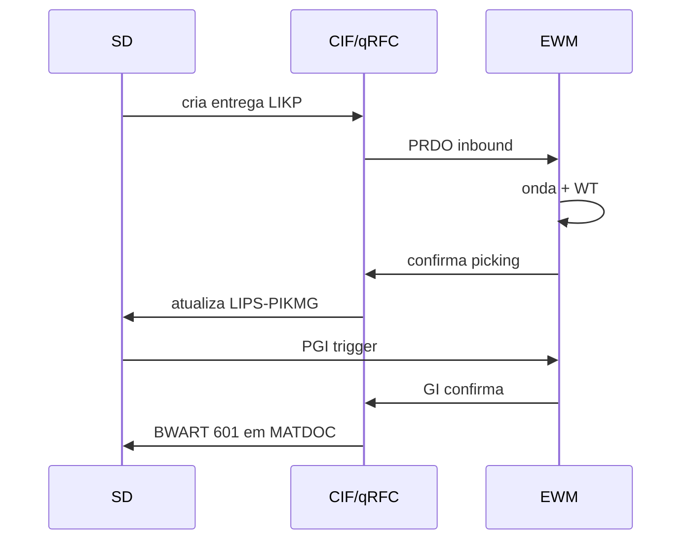
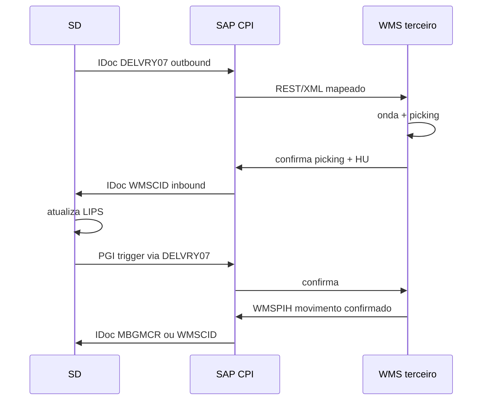
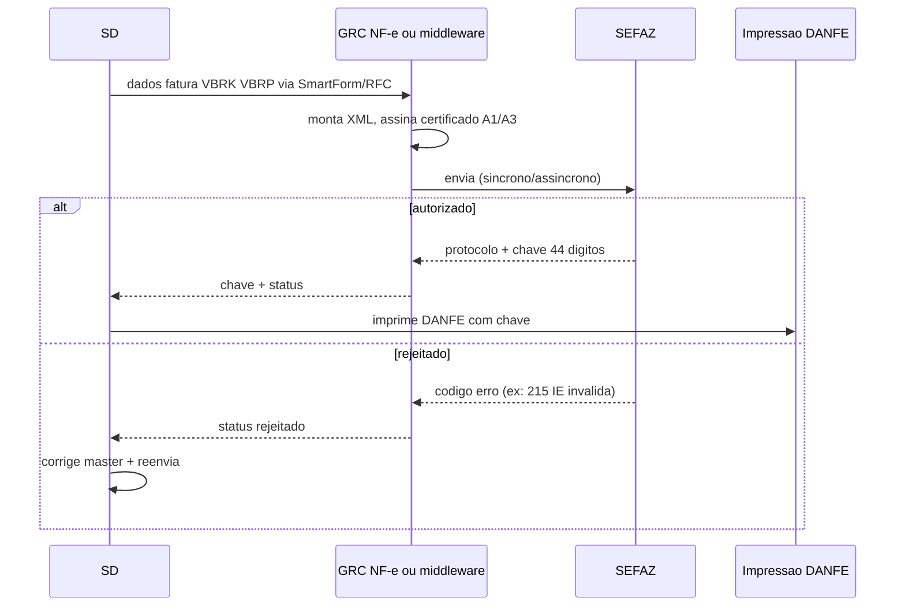

# SD, expedição e integração WMS — entrega, picking, faturamento e onde o OTIF nasce no sistema

> **Aviso:** **SAP SD** e integrações com **WM/EWM** ou WMS de terceiros variam por **versão** (ECC vs. S/4HANA), **indústria** (*industry solution*) e **modelo de atendimento** (DP, *aATP* avançado em S/4, *Advanced Available-to-Promise*, *Backorder Processing*, etc.). Este capítulo foca **handoffs**, **t-codes**, **tabelas-chave** e **pontos de falha** de **OTIF**, não em tutorial de configuração. **SAP** é marca registrada da SAP SE.

**SD** cobre **ordem de venda** (`VA01` → `VBAK`/`VBAP`), **entrega** (*outbound delivery* `VL01N` → `LIKP`/`LIPS`), **transporte** (shipment `VT01N` → `VTTK`/`VTTP`, ou TM moderno), **PGI** (`VL02N`/`VL06G`) e **faturamento** de cliente (`VF01` → `VBRK`/`VBRP`) — com regras de **disponibilidade** (ATP/aATP), **divisão de remessas**, **substituições** e **bloqueios** (crédito, faturamento, fornecimento). O **OTIF** quebra quando **promessa**, **picking** e **registro de entrega** não compartilham a mesma **definição de tempo** e o mesmo **identificador canônico**.

Este capítulo desce em **fluxo de documento SD**, **`VBFA`**, **integração SAP↔EWM via qRFC**, **integração SAP↔WMS terceiro via IDoc `DELVRY07`/`WMSCID`**, **fiscal BR** (NF-e via GRC ou Synchro/Mastersaf, CT-e amarrado), e **causas raiz de OTIF baixo** que são **definição** ou **mensagem**, não asfalto.

---

## Objetivos e resultado de aprendizagem

- Descrever a sequência **SD → WMS → TMS → FI** em linguagem de **eventos** e **t-codes** (`VA01` → `VL01N` → `VL02N` PGI → `VF01`).
- Conhecer as **tabelas SD** críticas: `VBAK`/`VBAP`/`LIKP`/`LIPS`/`VBRK`/`VBRP`/`VBFA`.
- Explicar **falha clássica** de picking confirmado no WMS com entrega aberta no SAP — e como diagnosticar.
- Diferenciar **ATP** clássico, **aATP** (Advanced ATP em S/4), **CTP** e **GATP** (APO).
- Decidir **timing de PGI** (antes/depois carregamento) e **NF-e** (antes/depois PGI).
- Mapear integração **SAP↔EWM** (qRFC) e **SAP↔WMS terceiros** (IDoc `DELVRY07`).
- Aplicar fiscal BR: NF-e modelo 55 via GRC NF-e, DANFE, integração SEFAZ.
- Escrever dicionário interno de «**entrega completa**» (*in full*) alinhado a KPIs.

**Duração sugerida:** 60–90 minutos.

---

## Mapa do conteúdo

1. Gancho — picking confirmado no WMS, entrega aberta no SAP.
2. Modelo de dados SD — fluxo de documento `VBFA`.
3. Sequência detalhada SD↔WMS↔TMS↔FI↔SEFAZ.
4. Bloqueios (crédito `VKM3`, faturamento, fornecimento).
5. ATP / aATP / CTP em S/4HANA.
6. Integração EWM (qRFC) vs. WMS terceiro (IDoc).
7. NF-e BR — GRC NF-e, fluxo de autorização SEFAZ.
8. OTIF e configuração — «baixo» pode ser definição.
9. Caso prático — picking confirmado, entrega aberta.
10. Erros, KPIs, glossário.

---

## Gancho — picking confirmado no WMS, entrega aberta no SAP

Operação **fechou** onda no WMS Manhattan às 17h59 do dia X; o **IDoc `WMSCID`** falhou (status 51, erro de campo `CHARG` vazio); o status SD ficou «**em picking**»; o cliente recebeu **fisicamente no prazo**, mas o **status digital** atrasou faturamento (`VF04` não rodou) e comissão. O dashboard de OTIF mostrou queda de 92% para 78% — que **não foi real** no asfalto.

**Integração** é parte do **serviço** — e parte do **contrato interno** de dados. PGI sem confirmação WMS = NF-e sem motivo = receita não reconhecida = caos de fechamento.

**Analogia da assinatura digital:** o documento existe, foi entregue ao cartório, mas o **carimbo** ainda não chegou — para o sistema, «não aconteceu».

**Analogia da maratona:** corredor cruza a linha de chegada mas o **chip do tornozelo** não captou — fisicamente terminou; sistemicamente nem participou.

---

## Modelo de dados SD — fluxo de documento

### Tabelas-chave

| Tabela | Conteúdo | Chave |
|--------|----------|-------|
| **`VBAK`** | Cabeçalho pedido venda | `VBELN` |
| **`VBAP`** | Item pedido venda | `VBELN` + `POSNR` |
| **`VBKD`** | Dados comerciais (Incoterm, condição pgto) | `VBELN`+`POSNR` |
| **`VBPA`** | Parceiros (`AG` sold-to, `WE` ship-to, `RE` bill-to, `RG` payer) | `VBELN`+role |
| **`VBEP`** | Schedule lines (datas confirmadas ATP) | `VBELN`+`POSNR`+`ETENR` |
| **`VBUK`/`VBUP`** | Status cabeçalho/item | `VBELN`(+`POSNR`) |
| **`LIKP`** | Cabeçalho entrega | `VBELN` (entrega) |
| **`LIPS`** | Item entrega | `VBELN`+`POSNR` |
| **`VTTK`/`VTTP`** | Cabeçalho/item shipment (legado) | `TKNUM` |
| **`VBRK`** | Cabeçalho fatura | `VBELN` (fatura) |
| **`VBRP`** | Item fatura | `VBELN`+`POSNR` |
| **`VBFA`** | **Fluxo de documento** (de→para) | `VBELV`/`VBELN` |
| **`KOMV`/`KONV`** | Condições preço | — |
| **`VBBE`/`VBBS`** | Reserva ATP / saldo planejado | Material+planta |

### `VBFA` — a tabela rainha do troubleshooting

Para diagnosticar «sumiu pedido», consulte **`VBFA`** — segue do pedido até a fatura, mostrando exatamente onde parou.

---

## Sequência detalhada SD↔WMS↔TMS↔FI↔SEFAZ

---

## Bloqueios SD — onde a entrega trava

| Bloqueio | T-code para liberar | Tabela | Causa típica |
|----------|---------------------|--------|--------------|
| **Crédito** (`VBUK-CMGST`) | `VKM3`, `VKM1`, `VKM4` | `KNKK` (gestão crédito) | Limite excedido, pedido em risco |
| **Faturamento** | `VF04` ajuste; `VA02` libera | `LIKP-FKSAA`, `VBRK-FKART` | NF-e pendente, problema fiscal |
| **Fornecimento** | `VL02N` libera | `LIKP-LIFSP` | Material faltante, qualidade |
| **Pedido** (lista bloqueio) | `VA02` libera; `VKM3` | `VBAK-LIFSK`, `VBAK-FAKSK` | Promoção, manual |
| **Entrega** | `VL02N` ajuste schedule | `LIKP-WBSTK` | Data picking, capacidade |

---

## ATP / aATP / CTP — quando prometer, quando recusar

| Engine | Versão SAP | Características | Quando usar |
|--------|------------|-----------------|--------------|
| **ATP clássico** | ECC + S/4 | Estoque atual + entradas/saídas planejadas; primeira chega, primeira atendida | Operações simples |
| **aATP** | S/4HANA | **PAL** (Product Allocation), **BoP** (Backorder Processing), **RBA** (Rule-based ATP), **Substitution**; reservar para clientes prioritários, alocar por canal | E-commerce, B2B com SLA |
| **CTP** | ECC + S/4 + PP | Capable-to-Promise — checa também capacidade de produção | MTO/CTO |
| **GATP** | APO/IBP | Global ATP — múltiplos centros, regras complexas | Operação multi-país |

**PAL exemplo TechLar:** aloca 60% estoque para canal B2B (clientes contrato), 30% e-commerce, 10% marketplace. Sextas com promoção, marketplace pega 25% por 24h.

---

## Integração EWM (qRFC) vs. WMS terceiro (IDoc)

### EWM embedded ou decentralized

`SMQ1`/`SMQ2` monitoram filas qRFC; erro comum é fila travada por bloqueio (`SM12`).

### WMS terceiro (Manhattan, BY, Körber)

**IDocs principais:**
- `DELVRY07`: entrega completa (cabeçalho + itens + parceiros + status).
- `WMSCID`: confirmação WMS para SAP IM.
- `WMSPIH`: PGI confirmado pelo WMS.
- `MBGMCR`: movimento de material genérico.
- `WPDWGR`: recebimento WMS para SAP.
- `SHPMNT05`: shipment (com TMS).

---

## NF-e BR — fluxo de autorização SEFAZ

A maioria das empresas BR usa **GRC NF-e** (SAP) ou **terceiros** (Synchro, Mastersaf, Tecnospeed, Migrate) para emitir NF-e modelo 55.

**Pontos críticos:**
- **NF-e antes ou depois do PGI?** Depende: NF-e CFOP 5101/6101 (venda) precisa ser **antes** do veículo sair (acompanha mercadoria); 5102/6102 também. Algumas empresas postam PGI primeiro (financeiro fecha) e geram NF-e em seguida no mesmo segundo.
- **Contingência SCAN** (modo offline): se SEFAZ cair, emite com chave especial e regulariza depois.
- **Cancelamento NF-e**: até 24h, sem trânsito; depois é **CC-e** (Carta de Correção Eletrônica) ou **devolução**.
- **Manifesto MDF-e**: agrupa NF-es do veículo; obrigatório.
- **CT-e**: emitido pelo carrier; cliente recebe e amarra à NF-e (`refNFe`).

---

## OTIF e configuração — «baixo» pode ser definição

**Hipótese pedagógica:** OTIF «baixo» no dashboard com entrega física **boa** quase sempre é:
1. **Definição** errada de evento (`PGI` vs. `POD`).
2. **Atraso de mensagem** (IDoc/qRFC em fila).
3. **Desalinhamento de fuso** (servidor UTC, dashboard BR-3).
4. **Substituição** não tratada como sucesso.

…não «preguiça do motorista» sozinha.

**Checklist de alinhamento OTIF:**

1. O que é **on time** — confirmação de doca, GI (`BWART` 601), saída do CD (gate-out evento), chegada ao cliente (POD)?
2. O que é **in full** — linhas, unidades, lote permitido, substituição aceita?
3. Qual **timestamp** oficial para canais diferentes (B2B Procurement EDI vs. e-commerce VTEX vs. marketplace ML)?
4. Como tratar **partial delivery** (linha curta) — quebra ou aceitável?
5. Como tratar **substituição** de SKU — equivalente conta como *in full*?

---

## Caso prático — TechLar, OTIF caiu de 92% para 78%

**Sintoma:** dashboard semanal mostra queda OTIF; ops nega problema físico.

**Investigação:**
1. **`VL06O`** (lista entregas) por status: 1.500 entregas com PGI em LIPS, mas `LIKP-WBSTK` ≠ C (não completo).
2. **`WE05`** filtrar IDoc `WMSCID`: 230 IDocs em status 51 (erro), causa `MD-149` (lote vazio).
3. Analisar lote: WMS Manhattan envia lote interno A1B2C3, mas mestre SAP só aceita 10 chars alfanum sem lowercase → caracter inválido.
4. **Causa raiz**: novo material cadastrado sem campo `MARC-XCHAR` ativo + WMS sem regra de normalização.
5. **Ação**: ajuste WMS para sanitizar lote; reprocessar IDocs (`BD87`); cadastro mestre revisto; alarme em CPI para erro recorrente.
6. **Resultado**: OTIF volta a 92% em 48h; dashboard mostrava 78% por **definição/integração**, não por entrega.

**Lição:** sempre auditar **dicionário de OTIF** + **filas de integração** antes de culpar operação.

---

## Aplicação — exercício

Escreva o **dicionário interno** (3 bullets) de «**entrega completa**» para a **TechLar** no ecossistema SAP+WMS+TMS:
1. O que conta como **in full** (linhas? unidades? substituição aceita? lote?).
2. Qual **timestamp** manda para **on time** (PGI? gate-out CD? POD cliente?) por canal.
3. Como tratar **exceção** (partial delivery, substituição, atraso < 4h vs. > 4h).

**Gabarito pedagógico:** alinhar com a trilha Dados — [OTIF e fill rate](../../trilha-dados-analytics-logistica/modulo-04-indicadores-logisticos-kpis/aula-01-otif-fill-rate-contrato-interno.md); escolher **um** timestamp canônico por canal (B2B = POD assinado; e-commerce = first attempt no endereço; marketplace = aceite cliente); documentar exceções com regra binária (in full = 100% itens, substituição equivalente conta, partial = não-OTIF).

---

## Erros comuns e armadilhas

- **Partial delivery** sem regra comercial clara — cliente entende «falta» como **quebra**.
- **Substituição** de SKU sem fluxo de aprovação (e sem texto em `VBAP-AGRUP`) — risco fiscal e de experiência.
- **Faturamento antes de POD** em cliente que exige prova — *working capital* vs. risco contratual.
- **Corte de mensagens** grandes em picos (IDoc com >9999 itens) — fila escondida.
- Misturar **status de transporte** (`VTTK`) com **status de faturamento** (`VBUK-FKSTK`).
- **PGI antes do material sair fisicamente** — se cancelar, estoque «volta» e bagunça custo médio.
- **NF-e rejeitada** sem reprocesso automático — entrega vai sem fiscal, **risco de blitz**.
- **GRC NF-e** com certificado A1 expirado → todas NF-es param.
- **EWM qRFC fila travada** (`SM12` lock) — efeito dominó.
- Em S/4: misturar `aATP` com regras antigas de allocation table.

---

## KPIs técnicos e de negócio

| KPI | Pergunta | Dono | Fonte | Cadência | Playbook se ruim |
|-----|----------|------|-------|----------|------------------|
| **OTIF (definição única)** | Promessa cumprida? | Comercial + Op | `VBFA` + POD + dicionário | Diário | Alinhar dicionário; corrigir mestres |
| **Lag GI físico vs. SD (p95)** | Integração rápida? | TI + Op | timestamp WMS vs. SAP | Semanal | Otimizar qRFC/CPI; alarme |
| **Taxa reprocesso IDoc `WMSCID`/`DELVRY07`** | Mensagens limpas? | TI | `WE05` | Diário | RCA por código erro |
| **% NF-e rejeitada na 1ª** | Master fiscal correto? | Fiscal | GRC NF-e log | Diário | Corrigir CFOP/IE; campos pendentes |
| **% pedidos com partial delivery** | ATP saudável? | Op + Comercial | LIPS vs. VBAP | Semanal | Revisar planejamento; PAL |
| **% bloqueios crédito > 4h** | Comercial responde rápido? | Comercial | `VKM3` log | Diário | SLA `VKM3`; auto-aprovar baixo risco |
| **Lead time pedido→PGI (p50/p90)** | Velocidade fluxo? | Op | `VBAK-AUDAT` vs. PGI ts | Mensal | Priorizar canal; capacity |
| **% faturas com erro CFOP/imposto** | Fiscal alinhado? | Fiscal | NF-e rejeição | Mensal | Treinamento; revisão tabela |
| **Receita não reconhecida (PGI sem fatura)** | Fechamento limpo? | Controladoria | `LIPS` vs. `VBRP` | Mensal | `VF04` ajuste; VF06 batch |

---

## Ferramentas e tecnologias relevantes

| Categoria | Ferramentas |
|-----------|-------------|
| Pedido venda | `VA01`/`VA02`/`VA03`, `VA05` lista, `VA45` cotação |
| Entrega | `VL01N`/`VL02N`/`VL03N`, `VL10A`/`VL10C`, `VL06O` monitor |
| Picking SD | `VL02N` campo `PIKMG`, `LT03` (WM) |
| PGI | `VL02N` botão PGI, `VL06G` em massa |
| Faturamento | `VF01`/`VF02`/`VF03`/`VF04` lista, `VF06` batch |
| Crédito | `VKM3` libera, `VKM1` por cliente, `FD32` master |
| Fluxo doc | `VA03` botão; `VBFA` query |
| ATP | `CO09`, em S/4 *Manage Backorders*, *Manage Product Allocation* |
| Integração | CPI/Mulesoft/Boomi, IDoc `DELVRY07`/`WMSCID`/`SHPMNT05` |
| BR fiscal | GRC NF-e, Synchro, Mastersaf, Tecnospeed, NDD, Migrate, eFatura |
| TMS | SAP TM, Manhattan TM, BY TMS, OTM, MercuryGate, NeoGrid, Bsoft |
| OMS | SAP Order Management Foundation, IBM Sterling OMS, Manhattan Active Omni, VTEX |
| Fiori (S/4) | *Manage Sales Orders*, *Manage Outbound Deliveries*, *Sales Order Fulfillment Issues*, *Manage Billing Documents* |

---

## Glossário rápido

- **`VBELN`:** número documento (pedido, entrega, fatura).
- **`POSNR`:** número item.
- **`ETENR`:** número schedule line.
- **`VBFA`:** fluxo de documento (origem→destino).
- **PGI:** Post Goods Issue (`BWART` 601).
- **`VL01N`:** criar entrega outbound.
- **`VF01`:** criar fatura.
- **`VKM3`:** liberar bloqueio de crédito.
- **`VBUK`/`VBUP`:** status cabeçalho/item.
- **aATP:** Advanced ATP (S/4 com PAL/BoP/RBA).
- **PAL:** Product Allocation.
- **BoP:** Backorder Processing.
- **RBA:** Rule-Based ATP.
- **GRC NF-e:** módulo SAP de Governance Risk Compliance para Nota Fiscal Eletrônica.
- **CFOP:** Código Fiscal de Operações e Prestações.
- **DANFE:** Documento Auxiliar da NF-e.
- **CC-e:** Carta de Correção Eletrônica.
- **MDF-e:** Manifesto Eletrônico de Documentos Fiscais.
- **CIF/qRFC:** integração SAP↔EWM/APO.
- **`SMQ1`/`SMQ2`:** monitor fila qRFC outbound/inbound.

---

## Pergunta de reflexão

Qual **timestamp** hoje **não** está formalmente definido para o OTIF oficial — e quantos pontos de OTIF você está perdendo todo mês por essa ambiguidade?

---

## Fechamento — três takeaways

1. SD é onde a **promessa** encontra o **documento**; WMS/TMS são onde a **promessa** encontra o **asfalto**; **integração** é o cordão umbilical.
2. OTIF «do sistema» sem **dicionário** + **integração saudável** + **fiscal alinhado** é **arte abstrata** — bonita e inútil.
3. Integração com falha **intermitente** é pior que **lenta** — porque esconde causa raiz; alarme em IDoc/qRFC é higiene básica.

---

## Referências

1. **SAP Help** — *Sales* / *Shipping* / *Billing* (versão correspondente): https://help.sap.com/
2. **SAP Press** — *Sales and Distribution with SAP S/4HANA*; *Advanced ATP*.
3. **Receita Federal BR** — Portal NF-e: https://www.nfe.fazenda.gov.br/
4. **Trilha Dados** — [OTIF e fill rate](../../trilha-dados-analytics-logistica/modulo-04-indicadores-logisticos-kpis/aula-01-otif-fill-rate-contrato-interno.md).
5. Módulo ERP desta trilha — [integrações em fila](../modulo-02-erp-aplicado-supply-chain/aula-03-integracoes-batch.md).
6. Módulo WMS — [onda, picking, expedição](../modulo-03-wms/aula-03-onda-picking-expedicao.md).
7. Módulo TMS — [execução e POD](../modulo-04-tms/aula-02-execucao-rastreio-pod.md).

---

## Pontes para outras trilhas

- **Master Data** → [parceiros e localizações](../modulo-01-master-data-para-logistica/aula-03-parceiros-localizacoes-governanca.md).
- **Fundamentos** → [estratégia e nível de serviço](../../trilha-fundamentos-e-estrategia/).
- **Dados/Analytics** → [OTIF e fill rate](../../trilha-dados-analytics-logistica/modulo-04-indicadores-logisticos-kpis/).
