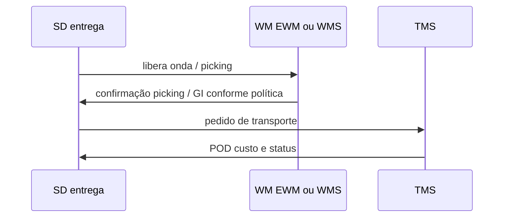

# SD, expedição e integração WMS — entrega, picking e onde o OTIF nasce no sistema

> **Aviso:** **SAP SD** e integrações com **WM/EWM** ou WMS de terceiros variam enormemente por **versão**, **indústria** (*industry solution*) e **modelo de atendimento** (DP, *ATP* avançado, *aATP* em S/4, etc.). Este capítulo foca **handoffs** e **pontos de falha** de **OTIF**, não em tutorial de configuração. **SAP** é marca registrada da SAP SE.

**SD** cobre **ordem de venda**, **entrega** (*outbound delivery*), **transporte** associado (dentro do SAP ou via TMS) e **faturamento** de cliente — com regras de **disponibilidade**, **divisão de remessas**, **substituições** e **bloqueios**. O **OTIF** quebra quando **promessa**, **picking** e **registro de entrega** não compartilham a mesma **definição de tempo** e o mesmo **identificador canônico**.

---

## Objetivos e resultado de aprendizagem

**Ao final desta aula**, você será capaz de:

- Descrever a sequência **SD → WMS → TMS** em linguagem de **eventos**.
- Explicar falha clássica de **picking confirmado** no WMS com entrega **aberta** no SAP.
- Escrever **três bullets** de dicionário interno para «**entrega completa**» (*in full*) alinhados à trilha de KPIs.
- Listar **três** erros comuns de **partial delivery** e substituição.

**Duração sugerida:** 45–75 minutos.

---

## Gancho — picking confirmado no WMS, entrega aberta no SAP

Operação **fechou** onda no WMS às 17h59; o **IDoc** falhou; SD ficou «**em picking**»; o cliente recebeu **no prazo** físico, mas o **status** atrasou **faturamento** e **comissão**. **Integração** é parte do **serviço** — e parte do **contrato interno** de dados.

**Analogia da assinatura digital:** o documento existe, mas o **carimbo** não chegou — para o sistema, «não aconteceu».

---

## Sequência simplificada SD–WMS–TMS

**Legenda:** *timing* de cada seta precisa estar no **dicionário** do OTIF — senão o painel mente com boa intenção.

---

## OTIF e configuração — «baixo» pode ser definição

**Hipótese pedagógica:** OTIF «baixo» no *dashboard* com entrega física **boa** quase sempre é **definição** (evento errado), **atraso de mensagem** ou **desalinhamento de fuso** — não «preguiça do motorista» sozinha.

**Checklist de alinhamento:**

1. O que é **on time** — confirmação de doca, GI, saída do CD, chegada ao cliente, POD?
2. O que é **in full** — linhas, unidades, lote permitido, substituição aceita?
3. Qual **timestamp** oficial para **canais** diferentes (B2B *vs.* marketplace)?

---

## Aplicação — exercício

Escreva o **dicionário interno** (3 bullets) de «**entrega completa**» para a **TechLar** no ecossistema SAP+WMS: o que conta como **in full** e qual **timestamp** manda para **on time**.

**Gabarito pedagógico:** alinhar com a trilha Dados — [OTIF e fill rate](../../trilha-dados-analytics-logistica/modulo-04-indicadores-logisticos-kpis/aula-01-otif-fill-rate-contrato-interno.md); escolher **um** *timestamp* canônico por canal; documentar exceções (substituição, *short ship*).

---

## Erros comuns e armadilhas

- **Partial delivery** sem regra comercial clara — cliente entende «falta» como **quebra**.
- **Substituição** de SKU sem fluxo de aprovação — risco fiscal e de experiência.
- Faturamento **antes** de **POD** em cliente que exige prova — *working capital* *vs.* risco contratual.
- **Corte** de mensagens grandes em picos — fila escondida.
- Misturar **status de transporte** com **status de faturamento**.

---

## KPIs e decisão

- **Lag** entre GI físico (WMS) e atualização SD (p95).
- **Taxa de reprocessamento** de mensagens de expedição.
- **OTIF** segmentado por canal com a **mesma** definição — comparar *apples to apples*.

---

## Fechamento — três takeaways

1. SD é onde a **promessa** encontra o **documento**; WMS/TMS são onde a **promessa** encontra o **asfalto**.
2. OTIF «do sistema» sem **dicionário** é **arte abstrata** — bonito e inútil.
3. Integração com falha intermitente é **pior** que lenta — porque esconde causa raiz.

**Pergunta de reflexão:** qual *timestamp* hoje **não** está definido para o OTIF oficial?

---

## Referências

1. SAP Help — *Sales* / *Shipping* / *Billing* (seções da sua versão): https://help.sap.com/  
2. Trilha Dados — [OTIF e fill rate](../../trilha-dados-analytics-logistica/modulo-04-indicadores-logisticos-kpis/aula-01-otif-fill-rate-contrato-interno.md).  
3. Módulo ERP desta trilha — [integrações em fila](../modulo-02-erp-aplicado-supply-chain/aula-03-integracoes-batch.md).
