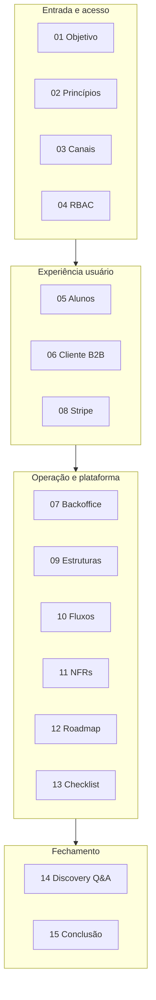
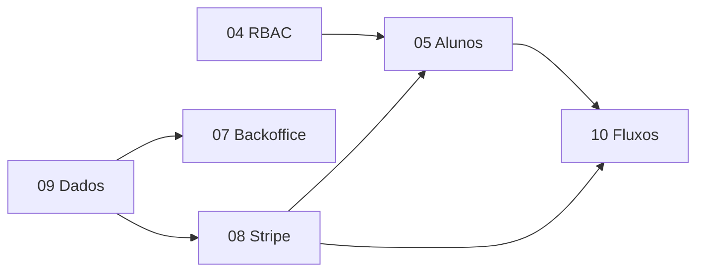

# Especificação técnica v1 — Índice dos tópicos

Documento-mãe: [`../plataforma-logistikon-especificacao-tecnica-v1.md`](../plataforma-logistikon-especificacao-tecnica-v1.md)

Cada arquivo abaixo contém: **especificação original**, **detalhamento de features**, **diagramas Mermaid** e **notas de análise técnica**.

---

## Mapa de leitura por domínio de produto

---

## Legenda do que cada tópico entrega

| Coluna no arquivo | Propósito |
|-------------------|-----------|
| Especificação base | Texto de referência v1 |
| Features detalhadas | Comportamento esperado na UI/API |
| Critérios de aceite | Condições testáveis |
| Diagramas | Fluxo, sequência ou estado |
| Notas de análise | Riscos e corte de MVP |

---

## Índice numerado

| # | Arquivo | Foco em features |
|---|---------|------------------|
| 01 | [01-objetivo-e-escopo.md](01-objetivo-e-escopo.md) | Escopo por ator e fase |
| 02 | [02-principios-produto-mvp.md](02-principios-produto-mvp.md) | Regras de corte e qualidade |
| 03 | [03-canais-de-acesso.md](03-canais-de-acesso.md) | Superfícies e touchpoints |
| 04 | [04-perfis-de-acesso-rbac.md](04-perfis-de-acesso-rbac.md) | Permissões e políticas |
| 05 | [05-funcionalidades-alunos.md](05-funcionalidades-alunos.md) | Jornada do aluno |
| 06 | [06-funcionalidades-cliente-b2b.md](06-funcionalidades-cliente-b2b.md) | Buyer e assentos |
| 07 | [07-funcionalidades-backoffice.md](07-funcionalidades-backoffice.md) | Operação interna |
| 08 | [08-checkout-stripe.md](08-checkout-stripe.md) | Pagamento e pedidos |
| 09 | [09-estruturas-necessarias.md](09-estruturas-necessarias.md) | Módulos e dados |
| 10 | [10-fluxos-e-passos.md](10-fluxos-e-passos.md) | End-to-end |
| 11 | [11-requisitos-nao-funcionais.md](11-requisitos-nao-funcionais.md) | SLO, segurança, LGPD |
| 12 | [12-roadmap-implementacao.md](12-roadmap-implementacao.md) | Entregas por fase |
| 13 | [13-checklist-validacao.md](13-checklist-validacao.md) | Go-live |
| 14 | [14-respostas-discovery.md](14-respostas-discovery.md) | Síntese executiva |
| 15 | [15-conclusao-tecnica.md](15-conclusao-tecnica.md) | Decisões arquiteturais |

---

## Visão de dependência entre tópicos (para implementação)

**Versão:** v1 enriquecida  
**Última organização:** tópicos com diagramas e features expandidas.
