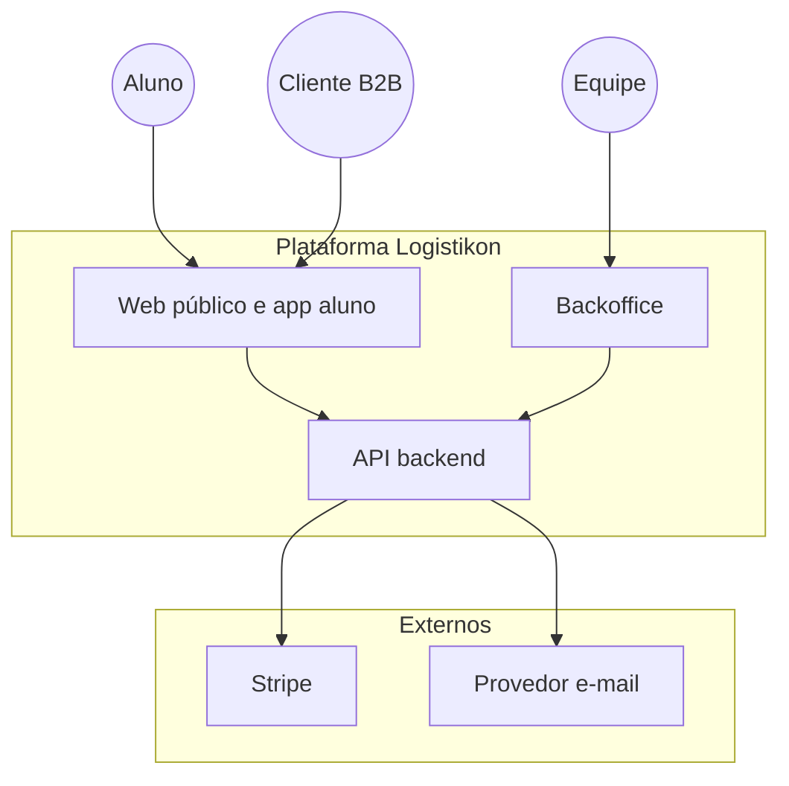
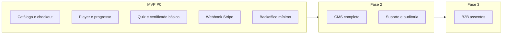

# Tópico 01 — Objetivo e escopo

**Origem:** Seção 1 da especificação técnica v1.  
**Índice:** [00-indice.md](00-indice.md)

---

## 1) Objetivo e escopo

Definir uma plataforma **simples e funcional**, mas completa, para operar:

- Experiência do **Aluno** (descoberta, compra, estudo, certificação).
- Experiência do **Cliente** corporativo (compra para equipe e acompanhamento).
- Operação de **Backoffice** (conteúdo, usuários, pedidos, financeiro, suporte, certificados).
- **Checkout com Stripe** para compra rápida e segura.

Este documento responde:

1. Quais são as funcionalidades para alunos?
2. Quais são as funcionalidades para backoffice?
3. Como ficam os acessos?
4. Como fica o checkout?
5. Quais estruturas são necessárias?

---

## Features por ator (mapa de escopo)

| Ator | Capacidade de produto (alto nível) | Prioridade MVP sugerida |
|------|-------------------------------------|-------------------------|
| **Aluno** | Ver catálogo, comprar, estudar, avaliar, certificar | P0 |
| **Visitante** | Catálogo público, iniciar checkout | P0 |
| **Cliente B2B** | Comprar assentos, convidar, relatórios | P1 / Fase 3 |
| **Instrutor** | CRUD acadêmico, publicar, corrigir | P0 mínimo |
| **Financeiro** | Pedidos, webhook, reembolso, cupom | P0 |
| **Admin** | Usuários, integrações, políticas | P1 |

---

## Detalhamento de escopo por fase de produto

### Fase receita B2C (núcleo)

- **Feature:** jornada “ver trilha → pagar → matricular → consumir → certificar” sem intervenção manual.
- **Feature:** backoffice mínimo para **publicar trilha** e **associar preço Stripe** a um `product` interno.
- **Critério de aceite:** um pedido `paid` gera exatamente uma `enrollment` ativa para o `user_id` e `track_id` corretos.

### Fase B2B (expansão)

- **Feature:** pedido corporativo com N assentos; convites por e-mail; vínculo assento ↔ matrícula.
- **Critério de aceite:** buyer vê lista de convites (pendente/aceito/expirado) e progresso agregado exportável.

### Transversal (sempre)

- **Feature:** trilha como unidade de venda e de progresso (não só “curso solto” sem contexto).
- **Feature:** certificado condicionado a regras configuráveis por trilha.

---

## Diagrama — atores e sistemas

---

## Diagrama — escopo MVP vs. posterior

---

## Notas de análise técnica

1. **Risco:** “Simples, mas completa” com quatro frentes (Aluno, B2B, Backoffice, Stripe) tende a inflar o MVP — sem priorização explícita, o escopo vira quatro produtos em paralelo.
2. **Dependência:** Checkout Stripe e liberação de acesso são eixo crítico; falhas aqui bloqueiam receita e confiança antes de qualquer refinamento de UX.
3. **MVP:** Fixar na v1 apenas **B2C + área do aluno + backoffice mínimo** (conteúdo, pedidos, liberação) e **adiar B2B corporativo** para v1.1, se o prazo for apertado.
4. **Risco:** Documento promete “completo” sem ordem de entrega — risco de integrações (e-mail, suporte, certificados) ficarem todas “meio prontas”.
