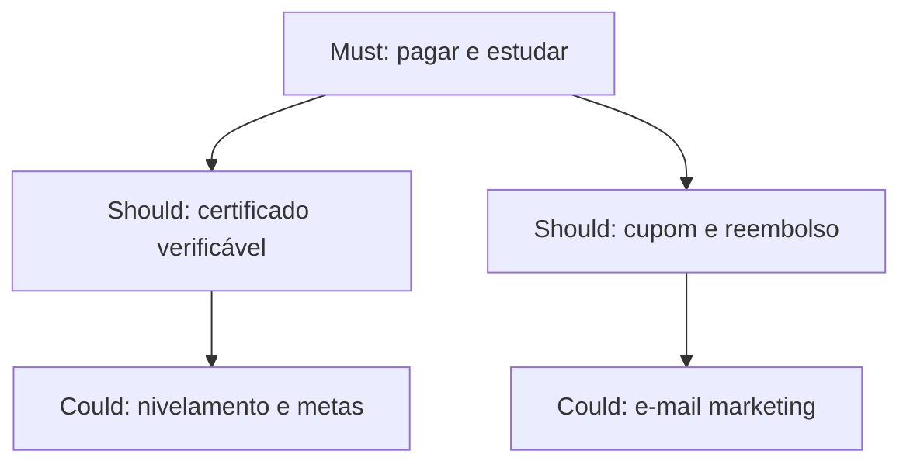
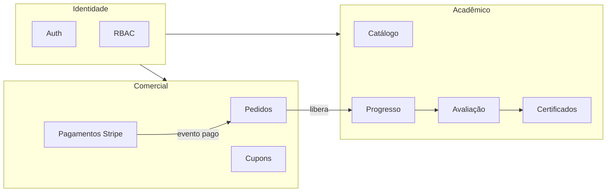

# Tópico 02 — Princípios de produto (MVP robusto)

**Origem:** Seção 2 da especificação técnica v1.  
**Índice:** [00-indice.md](00-indice.md)

---

## 2) Princípios de produto (MVP robusto)

- **Simplicidade operacional:** foco em poucos fluxos críticos com alta confiabilidade.
- **Padrão SaaS educacional:** trilhas, módulos, progresso, avaliação e certificado.
- **Governança mínima obrigatória:** permissões, logs, auditoria básica.
- **Escalável por camadas:** começar pequeno sem bloquear expansão B2B.
- **Integração financeira padrão mercado:** Stripe nativo, webhook idempotente.

---

## Tradução em features (o que o software deve garantir)

| Princípio | Feature concreta | Como validar |
|-----------|------------------|--------------|
| Simplicidade operacional | Fluxos felizes documentados; filas de erro visíveis no backoffice | Runbook + alerta em falha de webhook |
| SaaS educacional | Entidades `track` → `module` → `lesson`; `enrollment` única por usuário+trilha | Teste de integridade de dados |
| Governança | RBAC aplicado em **todas** as rotas de API sensíveis | Testes de autorização negativa |
| Escalável por camadas | `organization_id` opcional em modelos chave desde o início | Migração B2B sem reescrita total |
| Stripe idempotente | Tabela `stripe_events` com unique constraint | Replay de webhook não duplica matrícula |

---

## Regra de priorização: Must / Should / Could (MVP)

- **Must:** autenticação, catálogo, checkout, webhook, matrícula, player, progresso, quiz mínimo, certificado PDF.
- **Should:** cupom, reembolso, página pública de validação, auditoria de ações críticas.
- **Could:** onboarding gamificado, recomendação de trilha, tickets com SLA completo.

---

## Diagrama — bounded contexts sugeridos

Separação lógica (monólito modular ou serviços futuros):

---

## Critérios de aceite globais do MVP

- Nenhuma rota de backoffice sensível responde **200** sem token válido e papel adequado.
- Todo pagamento confirmado por Stripe resulta em **uma** transição `pending_payment` → `paid` idempotente.
- Trilha **rascunho** não aparece no catálogo público; apenas estados `published` (ou equivalente).

---

## Notas de análise técnica

1. **Dependência:** “Governança mínima” (permissões, logs, auditoria) exige modelo de dados e middleware de autorização desde o início; acrescentar depois é caro.
2. **Risco:** Webhook Stripe **idempotente** é requisito não negociável; subestimar testes e reconciliação gera dupla liberação ou pedidos órfãos.
3. **MVP:** “Escalável por camadas” sugere **fronteiras claras** (ex.: domínio de catálogo vs. pedidos vs. progresso) mesmo com monólito modular — evita refatoração quando o B2B crescer.
4. **Risco:** Conflito entre **simplicidade operacional** e **padrão SaaS educacional completo** — precisa de critério explícito do que é “MVP robusto” vs. “fase 2”.
