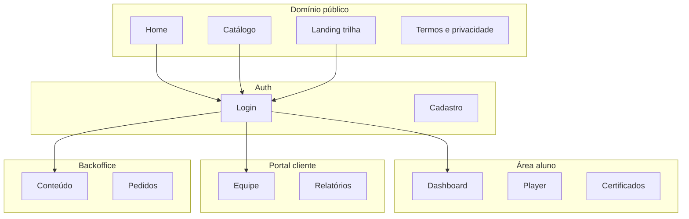
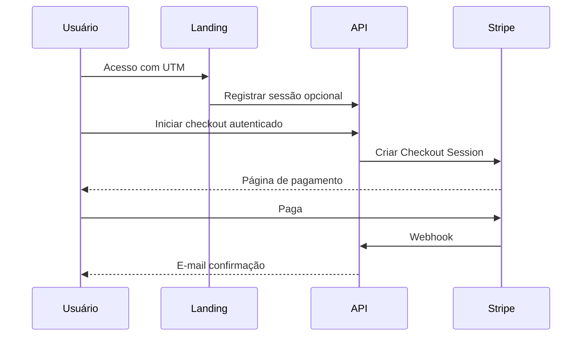

# Tópico 03 — Canais de acesso da plataforma

**Origem:** Seção 3 da especificação técnica v1.  
**Índice:** [00-indice.md](00-indice.md)

---

## 3) Canais de acesso da plataforma

### 3.1 Canais externos (entrada)

- **Site público** (marketing, catálogo, páginas de trilha, FAQ).
- **Landing pages** por trilha/certificação.
- **Link direto de campanha** (LinkedIn, e-mail, parceiros).
- **Portal de login** (aluno e cliente corporativo).

### 3.2 Canais internos (uso contínuo)

- **Área do Aluno** (web responsiva).
- **Portal do Cliente** (empresa/comprador com visão da equipe).
- **Backoffice Admin** (time interno Logistikon).

### 3.3 Canais de comunicação

- E-mail transacional (cadastro, pagamento, acesso, lembrete, certificado).
- E-mail de relacionamento (retenção, trilhas sugeridas).
- Página de suporte (ticket simplificado ou formulário + SLA).

---

## Features por canal (detalhe)

### Site público e landings

| ID | Feature | Comportamento | Aceite mínimo |
|----|---------|---------------|---------------|
| PUB-01 | Catálogo de trilhas | Lista só trilhas publicadas; filtros por nível/idioma opcional | Visitante não vê rascunho |
| PUB-02 | Página de trilha | Syllabus, CH, preço, CTA comprar | CTA desabilitado se sem preço ativo |
| PUB-03 | UTM e analytics | Query params preservados até checkout | Pedido armazena `utm_*` opcional |
| PUB-04 | SEO básico | `title`, `meta description`, OG por trilha | Lighthouse SEO sem erro crítico |

### Área logada (Aluno / Cliente)

| ID | Feature | Comportamento | Aceite mínimo |
|----|---------|---------------|---------------|
| APP-01 | Dashboard aluno | Trilhas matriculadas, % progresso, próxima aula | Dados consistentes com servidor |
| APP-02 | Portal cliente | Lista equipe e assentos (Fase B2B) | Escopo só `organization_id` do buyer |
| APP-03 | Perfil e idioma | Preferência PT/EN afeta cópias da UI | Persistido no `user` |

### Backoffice

| ID | Feature | Comportamento | Aceite mínimo |
|----|---------|---------------|---------------|
| BO-01 | Login separado ou rota `/admin` | Mesmo IdP, papéis distintos | 403 para aluno puro |
| BO-02 | Deep links | Abrir pedido/certificado por ID | Permissão financeiro vs. instrutor |

### Comunicação

| ID | Feature | Eventos | Aceite mínimo |
|----|---------|---------|---------------|
| EM-01 | Transacional | `signup`, `purchase_success`, `enrollment_ready`, `certificate_issued` | Retry + log de falha |
| EM-02 | Lembrete estudo | Job diário/semanal opcional | Opt-out no perfil |
| SUP-01 | Suporte MVP | Form → cria `support_ticket` | E-mail ao time + confirmação ao aluno |

---

## Diagrama — superfícies da aplicação

---

## Diagrama — fluxo de campanha até compra

---

## Notas de análise técnica

1. **Dependência:** Site público, landings e campanhas implicam **CMS ou pipeline de deploy de conteúdo estático** + analytics/UTM; sem isso, “link de campanha” não é mensurável nem sustentável.
2. **Risco:** Três experiências web (Aluno, Cliente, Admin) multiplicam **auth, sessão, CORS e deploy** — três apps ou um monorepo com rotas isoladas precisam ser decididos cedo.
3. **MVP:** **E-mail transacional** antes de “relacionamento/retenção”; suporte pode começar como **formulário + fila manual** sem ticket completo na v1.
4. **Dependência:** Portal de login unificado para aluno e cliente corporativo exige **modelo de identidade** (um usuário, vários papéis/tenants) bem definido antes de codar telas.
