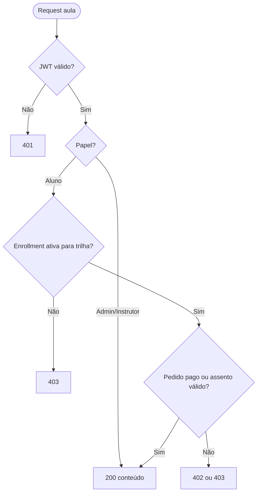
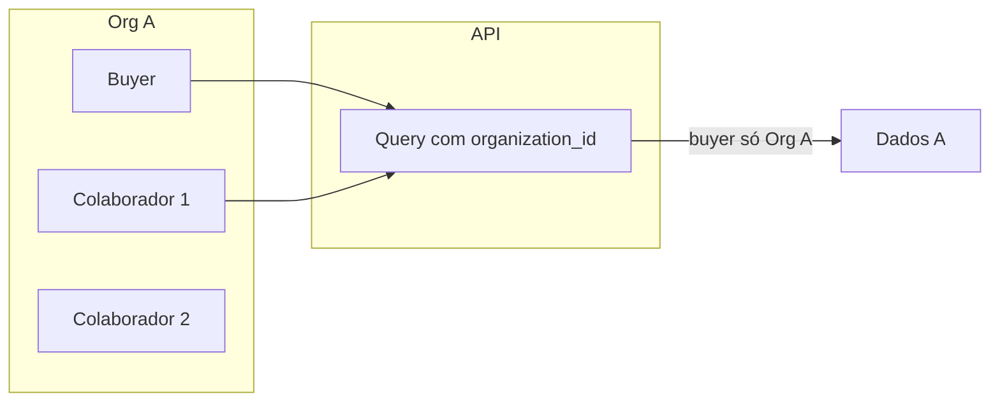

# Tópico 04 — Perfis de acesso (RBAC)

**Origem:** Seção 4 da especificação técnica v1.  
**Índice:** [00-indice.md](00-indice.md)

---

## 4) Perfis de acesso (RBAC)

### 4.1 Papéis

- **Visitante:** navega catálogo, vê preço, inicia checkout.
- **Aluno:** consome cursos, faz avaliações, acompanha progresso, baixa certificado.
- **Cliente corporativo (buyer):** compra vagas/licenças e gerencia equipe.
- **Instrutor/Editor:** cria e atualiza conteúdo, corrige atividades.
- **Operação/Financeiro:** acompanha pedidos, pagamentos, reembolsos, conciliação.
- **Admin:** acesso total de configuração e governança.

### 4.2 Matriz resumida de permissões

- **Aluno:** leitura do catálogo privado, execução de aulas/quizzes, emissão de certificado.
- **Cliente:** gestão de assentos, convites, relatórios de equipe, faturas.
- **Instrutor:** CRUD de cursos/módulos/avaliações e correção de submissões.
- **Financeiro:** pedidos, status Stripe, reembolso, exportação.
- **Admin:** tudo acima + usuários, papéis, integrações, políticas.

### 4.3 Regras de segurança de acesso

- Login por e-mail/senha + opção SSO (fase futura).
- Sessão com expiração e refresh token.
- Controle de escopo por tenant (empresa) no B2B.
- Logs de ação administrativa (quem fez, quando, o quê).

---

## Matriz recurso × papel (features de autorização)

Legenda: **C** criar, **R** ler, **U** atualizar, **D** excluir, **—** sem acesso.

| Recurso / ação | Visitante | Aluno | Cliente B2B | Instrutor | Financeiro | Admin |
|----------------|-----------|-------|-------------|-----------|------------|-------|
| Catálogo público | R | R | R | R | R | R |
| Conteúdo de trilha matriculada | — | R | R* | R | — | R |
| Checkout / meus pedidos | R† | R/U | R | — | R | R |
| Progresso próprio | — | R/U | — | — | — | R |
| CMS trilhas/módulos | — | — | — | C/R/U | — | C/R/U/D |
| Pedidos globais / reembolso | — | — | — | — | R/U | R/U |
| Usuários e papéis | — | — | — | — | — | C/R/U/D |
| Cupons | — | — | — | — | R/U | C/R/U/D |
| Certificados emitidos | — | R‡ | R§ | — | R | R/U |

\*Colaborador convidado pela empresa, mesmo papel “aluno” com `organization_id`.  
†Visitante inicia checkout; concluir exige cadastro.  
‡Só os próprios.  
§Relatório da equipe (Fase B2B).

---

## Features de sessão e token

| ID | Feature | Requisito |
|----|---------|-----------|
| SEC-01 | Access JWT curto + refresh | Access 15–60 min; refresh com rotação opcional |
| SEC-02 | Revogação em troca de senha | Invalidar refresh tokens do usuário |
| SEC-03 | Logout | Cliente descarta tokens; servidor pode blacklist opcional |
| SEC-04 | MFA | Fase futura; reservar campo `mfa_enabled` |

---

## Diagrama — decisão de acesso a uma aula

---

## Diagrama — multi-tenant B2B (escopo)

---

## Critérios de aceite RBAC

- Tentativa de acessar `/admin` com JWT só de **aluno** → **403** (não 404 mascarado, para auditoria clara).
- Instrutor **não** chama API de reembolso Stripe → **403**.
- Colaborador B2B **não** lista pedidos de outra `organization_id` → lista vazia ou **403**.

---

## Notas de análise técnica

1. **Risco:** Seis papéis com sobreposição (Instrutor vs. Admin, Financeiro vs. Admin) sem **matriz formal em código** (policies/resources) geram buracos de segurança e bugs de autorização.
2. **Dependência:** B2B com **escopo por tenant** exige `tenant_id` (ou equivalente) em entidades e queries; omitir no MVP dificulta migração posterior.
3. **MVP:** **SSO “fase futura”** está correto; documentar **fronteira da API** (ex.: claims JWT, roles) já pensando em SAML/OIDC reduz retrabalho.
4. **Risco:** “Logs de ação administrativa” exige **append-only ou imutabilidade** e retenção — sem produto/infra para isso, auditoria vira checkbox vazio.
5. **Dependência:** Sessão + refresh token exige **estratégia de revogação** (logout, roubo de token, troca de papel) — impacta design de API e armazenamento de sessões.
