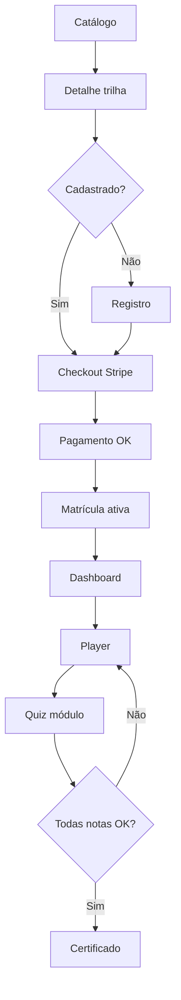
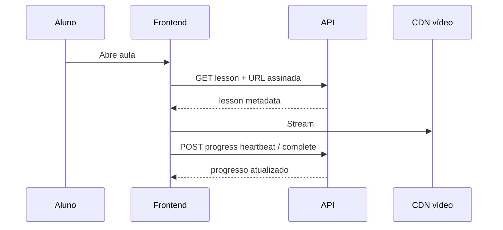
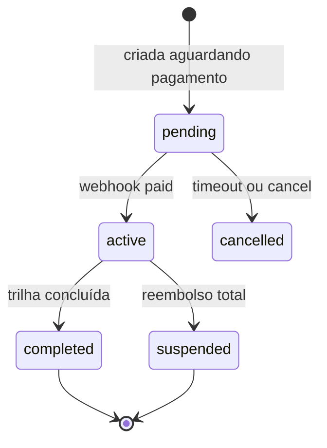

# Tópico 05 — Funcionalidades para alunos

**Origem:** Seção 5 da especificação técnica v1.  
**Índice:** [00-indice.md](00-indice.md)

---

## 5) Funcionalidades para Alunos

### 5.1 Descoberta e escolha

- Listagem de trilhas e certificações.
- Página de detalhe da trilha:
  - conteúdo programático;
  - carga horária;
  - nível (Foundation/Professional/Specialist);
  - pré-requisitos;
  - preço e formas de pagamento.

### 5.2 Conta e onboarding

- Cadastro simples (nome, e-mail, senha, país/idioma).
- Confirmação de e-mail.
- Onboarding inicial:
  - trilha recomendada;
  - nivelamento opcional;
  - metas de estudo.

### 5.3 Compra e ativação

- Compra avulsa de trilha (MVP).
- Cupom promocional.
- Liberação automática de acesso após pagamento aprovado.

### 5.4 Aprendizagem

- Dashboard com:
  - cursos ativos;
  - % progresso;
  - próximas aulas;
  - prazo sugerido.
- Player de aula (vídeo, texto, material para download).
- Marcação de aula concluída (auto/manual).
- Controle de progresso por módulo/trilha.

### 5.5 Avaliação e certificação

- Quiz por módulo (nota mínima configurável).
- Tentativas configuráveis.
- Projeto final (upload de arquivo) para trilhas específicas.
- Certificado emitido ao cumprir critérios:
  - progresso mínimo;
  - nota mínima;
  - aprovação em projeto (quando aplicável).

### 5.6 Pós-conclusão

- Download de certificado.
- Página pública de validação do certificado por código.
- Sugestão de próxima trilha (cross-sell natural).

---

## Catálogo de features (aluno) — IDs e aceite

### Descoberta (DISC)

| ID | Feature | Detalhe | Aceite |
|----|---------|---------|--------|
| DISC-01 | Lista de trilhas | Paginação, imagem, nível, CH | Só `published` |
| DISC-02 | Detalhe trilha | Módulos expansíveis, CTA | Preço sincronizado com `price` ativo |
| DISC-03 | Pré-requisitos | Bloqueio de compra ou aviso | API retorna `can_enroll` + motivo |

### Conta (ACC)

| ID | Feature | Detalhe | Aceite |
|----|---------|---------|--------|
| ACC-01 | Registro | Validação e-mail, força senha | Não expor se e-mail já existe (opcional: mensagem genérica) |
| ACC-02 | Verificação e-mail | Token TTL | Sem verificar: limitar ações sensíveis |
| ACC-03 | Onboarding | Wizard 1–3 passos | Pode pular |
| ACC-04 | Nivelamento | Quiz curto | **Could** MVP |
| ACC-05 | Metas | Lembrete por e-mail | **Could** MVP |

### Compra (PUR)

| ID | Feature | Detalhe | Aceite |
|----|---------|---------|--------|
| PUR-01 | Comprar trilha | Redireciona Stripe Checkout | `order` criado antes com status `pending_payment` |
| PUR-02 | Cupom | % ou valor fixo, data, limite usos | Erro claro se inválido |
| PUR-03 | Já matriculado | Impede compra duplicada | Mensagem “você já possui esta trilha” |

### Aprendizagem (LRN)

| ID | Feature | Detalhe | Aceite |
|----|---------|---------|--------|
| LRN-01 | Dashboard | Cards por trilha, barra % | % = aulas concluídas / total publicadas |
| LRN-02 | Player vídeo | Progresso assistido, velocidade, legendas | Eventos `play/pause/complete` no servidor |
| LRN-03 | Material download | URL assinada temporária | Expira em N minutos |
| LRN-04 | Marcar concluída | Manual só se política da trilha permitir | Auditoria opcional |
| LRN-05 | Retomar | Última aula por trilha | Cookie/session + servidor |

### Avaliação e certificado (ASM)

| ID | Feature | Detalhe | Aceite |
|----|---------|---------|--------|
| ASM-01 | Quiz | Embaralhar perguntas/opções | Nota persistida por tentativa |
| ASM-02 | Tentativas | Máximo N, cooldown opcional | Bloqueio após esgotar |
| ASM-03 | Projeto | Upload PDF/ZIP até X MB | Antivírus/validação MIME **recomendado** |
| ASM-04 | Certificado | PDF + código único | Só emite se regra da trilha satisfeita |
| ASM-05 | Validação pública | `/verify/{code}` | Não expõe PII além do nome exibido no cert |

### Pós-conclusão (POST)

| ID | Feature | Aceite |
|----|---------|--------|
| POST-01 | Download repetido | Sempre disponível se certificado válido |
| POST-02 | Upsell | Lista trilhas relacionadas por tag/nível |

---

## Diagrama — jornada do aluno (happy path)

---

## Diagrama — sequência player → progresso

---

## Diagrama — máquina de estados da matrícula (simplificado)

---

## Notas de análise técnica

1. **MVP:** **Descoberta + compra avulsa + player + progresso + quiz por módulo + certificado** formam o núcleo; **projeto final com upload**, **nivelamento** e **metas de estudo** são bons candidatos a v1.1 para reduzir superfície (storage, correção, lógica pedagógica).
2. **Dependência:** Certificado com **página pública de validação** exige **código/hash único**, anti-adivinhação e possivelmente CDN/cache com cuidado para não vazar dados.
3. **Risco:** Player (vídeo, download, texto) implica **CDN, assinatura de URLs, DRM opcional** e **custos de bandwidth** — decisão de hospedagem (S3, Mux, Vimeo OTT, etc.) afeta arquitetura e custo.
4. **Risco:** “Marcação concluída auto/manual” sem regras claras abre fraude de progresso ou disputas com regra de certificação — precisa de **fonte da verdade** (eventos do player vs. clique manual) e política por tipo de aula.
5. **Dependência:** Cupom + Stripe Checkout exige **sincronização de preço** entre catálogo interno e sessão de checkout e testes de edge cases (cupom expirado, limite de uso).
