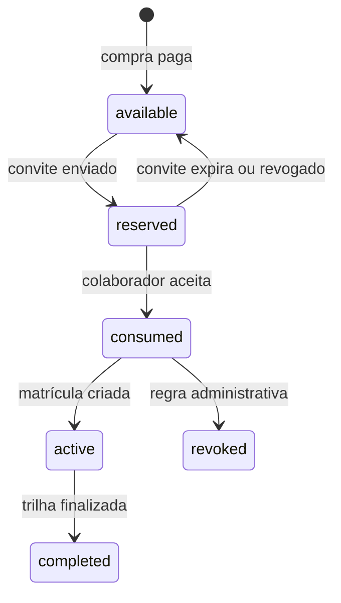
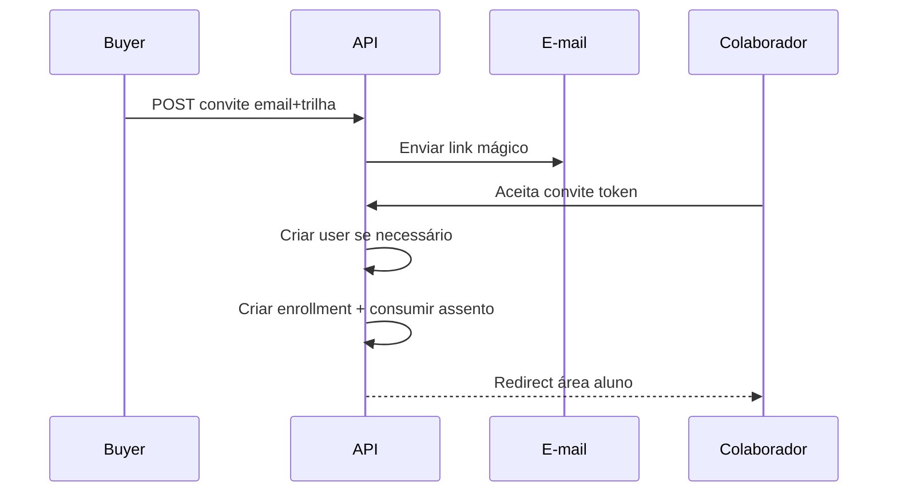

# Tópico 06 — Funcionalidades para cliente (B2B simples)

**Origem:** Seção 6 da especificação técnica v1.  
**Índice:** [00-indice.md](00-indice.md)

---

## 6) Funcionalidades para Cliente (B2B simples)

### 6.1 Compra corporativa

- Compra de pacotes de vagas (assentos) por trilha.
- Fatura e recibo por pedido.
- Histórico de pedidos da empresa.

### 6.2 Gestão de equipe

- Convidar colaboradores por e-mail.
- Atribuir trilha para colaborador.
- Remover/revogar acesso de assento não usado.

### 6.3 Acompanhamento

- Relatório por colaborador:
  - progresso;
  - status (não iniciado / em andamento / concluído);
  - certificado emitido.
- Exportação CSV.

---

## Features B2B detalhadas

### Compra e pedido (B2B-ORD)

| ID | Feature | Comportamento | Aceite |
|----|---------|---------------|--------|
| B2B-01 | SKU pacote | `product` = “N assentos × trilha X” | Preço total = N × unitário ou preço fechado configurável |
| B2B-02 | Checkout Stripe | Mesmo fluxo B2C ou sessão com `metadata` org | Webhook cria `seat_pool` com N licenças |
| B2B-03 | NF/recibo | Link PDF Stripe + número interno | Armazenar `stripe_invoice_id` se aplicável |
| B2B-04 | Histórico | Lista pedidos da org | Filtro por status e data |

### Convites e assentos (B2B-SEAT)

| ID | Feature | Comportamento | Aceite |
|----|---------|---------------|--------|
| B2B-10 | Convidar | E-mail + trilha + assento disponível | Consome 1 licença ao aceitar |
| B2B-11 | Estado convite | `pending`, `accepted`, `expired`, `revoked` | TTL configurável (ex.: 7 dias) |
| B2B-12 | Aceitar | Usuário cria conta ou loga | Vínculo `user` ↔ `organization` |
| B2B-13 | Revogar | Libera assento se ainda não iniciou trilha | Regra explícita se já progrediu |
| B2B-14 | Reatribuir | Mover assento entre e-mails | Opcional Fase 3 |

### Relatórios (B2B-REP)

| ID | Feature | Aceite |
|----|---------|--------|
| B2B-20 | Visão por colaborador | Colunas: nome, e-mail, trilha, %, status, cert |
| B2B-21 | Export CSV | UTF-8, mesmas colunas |
| B2B-22 | Agregados | % concluídos na org | Dashboard simples |

---

## Diagrama — ciclo de vida do assento

---

## Diagrama — sequência convite e matrícula

---

## Regras de negócio recomendadas (documentar no produto)

- **Um assento** = uma matrícula ativa em uma trilha específica (MVP simples).
- **Revogação pós-progresso:** ou bloquear, ou apenas “desativa novas aulas” mantendo histórico — decisão de compliance.
- **Buyer** não pode ver conteúdo das aulas dos colaboradores (privacidade); só **métricas**.

---

## Notas de análise técnica

1. **Risco:** Modelo de “assentos” por trilha exige regras claras (transferência, expiração, trilha trocada no meio do contrato) — ambiguidade vira bugs de cobrança e de acesso.
2. **Risco:** Convites por e-mail cruzam com cadastro B2C, confirmação de e-mail e anti-fraude; sem desenho único de identidade, há duplicidade de usuários ou convites órfãos.
3. **Dependência:** Depende de `organizations`, `organization_members`, `enrollments`, `products`/`prices` e fluxo de pedido alinhado ao Stripe (pacote ≠ compra avulsa).
4. **MVP:** Lançar com um único tipo de pacote (N assentos × uma trilha), sem cenários complexos de “pool” entre trilhas; CSV pode ser exportação mínima (campos fixos) ou postergar para Fase 3 conforme roadmap (§12).
5. **MVP:** Revogação de assento não usado deve ser explícita no domínio (estado do vínculo convite/matricula) para não conflitar com reembolso (§8.5).
