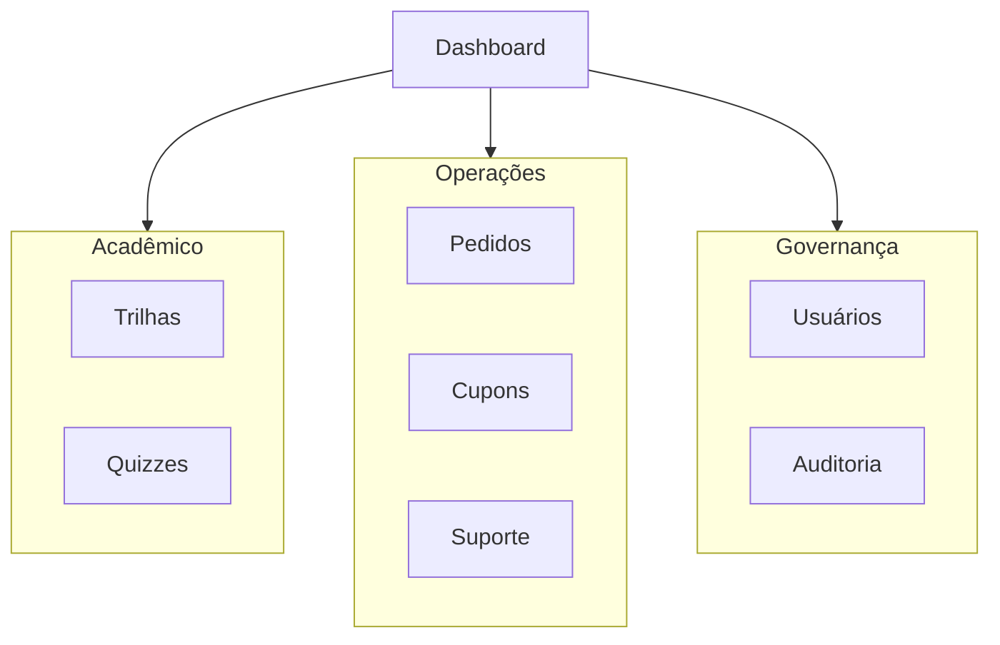
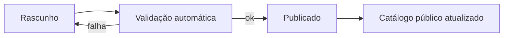

# Tópico 07 — Funcionalidades para backoffice

**Origem:** Seção 7 da especificação técnica v1.  
**Índice:** [00-indice.md](00-indice.md)

---

## 7) Funcionalidades para Backoffice

### 7.1 Gestão acadêmica

- CRUD de trilhas, cursos, módulos e aulas.
- Organização por nível e categoria.
- Gestão de quizzes e banco de questões.
- Rubrica para correção de projetos.
- Publicar/despublicar conteúdo.

### 7.2 Gestão de usuários e acessos

- Consulta de usuários (aluno, cliente, instrutor).
- Alteração de papel (com auditoria).
- Bloqueio/desbloqueio de conta.
- Reset manual de senha (fluxo seguro).

### 7.3 Gestão comercial e financeira

- Lista de pedidos e filtros por status.
- Conciliação de eventos Stripe:
  - pago;
  - recusado;
  - estornado;
  - reembolsado.
- Reembolso parcial/total (com permissão específica).
- Gestão de cupons.

### 7.4 Gestão de certificados

- Template de certificado.
- Emissão manual (caso excepcional).
- Revogação com justificativa.
- Verificação pública por código/hash.

### 7.5 Suporte e operação

- Painel de tickets/solicitações.
- Histórico de interação por aluno.
- SLA e tags (pagamento, acesso, conteúdo).

### 7.6 Observabilidade e auditoria

- Logs de integração (Stripe webhook).
- Logs de ações críticas (admin/financeiro).
- Dashboard operacional:
  - compras por dia;
  - taxa de aprovação;
  - taxa de conclusão;
  - erro de pagamento.

---

## Features por módulo de backoffice

### CMS acadêmico (BO-CMS)

| ID | Feature | Detalhe | Aceite |
|----|---------|---------|--------|
| CMS-01 | CRUD trilha | Slug único, idioma, nível | Publicação só com módulos válidos |
| CMS-02 | Ordenação | Drag-and-drop módulos/aulas | Ordem persistida |
| CMS-03 | Quiz | Perguntas com 1+ corretas, explicação opcional | Preview antes de publicar |
| CMS-04 | Rubrica | Critérios ponderados projeto | Soma 100% |
| CMS-05 | Publicar | Transição `draft` → `published` | Cache/CDN invalidado ou TTL |

### Usuários (BO-USER)

| ID | Feature | Aceite |
|----|---------|--------|
| USR-01 | Busca por e-mail/nome | Paginação |
| USR-02 | Atribuir papel | Log em `audit_logs` |
| USR-03 | Bloquear | Invalida sessões |
| USR-04 | Reset senha | Link expira; não revela se e-mail existe (política produto) |

### Financeiro (BO-FIN)

| ID | Feature | Aceite |
|----|---------|--------|
| FIN-01 | Lista pedidos | Filtros status, Stripe id |
| FIN-02 | Detalhe pedido | Linha items, cupom, usuário |
| FIN-03 | Reembolso | Chama Stripe API; atualiza `order` + `enrollment` |
| FIN-04 | Cupom CRUD | Códigos únicos, limite, validade |

### Certificados (BO-CERT)

| ID | Feature | Aceite |
|----|---------|--------|
| CRT-01 | Template HTML/PDF | Variáveis: nome, trilha, data, código |
| CRT-02 | Emissão manual | Só admin; motivo obrigatório |
| CRT-03 | Revogar | Código passa `revoked` na validação pública |

### Suporte (BO-SUP)

| ID | Feature | Aceite MVP |
|----|---------|------------|
| SUP-01 | Fila tickets | Estados: open, pending, closed |
| SUP-02 | Nota interna | Visível só staff |
| SUP-03 | Vínculo usuário | Abrir perfil do aluno em 1 clique |

### Observabilidade (BO-OBS)

| ID | Feature | Aceite |
|----|---------|--------|
| OBS-01 | Webhook log | Últimos N eventos, erro destacado |
| OBS-02 | KPIs | Cards no dashboard |
| OBS-03 | Export CSV pedidos | Para contabilidade |

---

## Diagrama — navegação do backoffice

---

## Diagrama — fluxo publicar trilha

---

## Notas de análise técnica

1. **Risco:** “Backoffice completo” na Fase 2 (§12) concentra CMS acadêmico, RBAC, financeiro, certificados, suporte e observabilidade — risco de atraso se não houver priorização por valor (publicar trilha vs. tickets vs. BI).
2. **Risco:** Reembolso parcial/total com regras de acesso (§7.3, §8.5) exige transações e eventos bem definidos; erro aqui é incidente de compliance e confiança.
3. **Dependência:** Acoplamento forte a todos os módulos listados em §9.1; sem APIs internas estáveis, o backoffice vira monólito de telas difícil de testar.
4. **MVP:** Entregar primeiro: CRUD mínimo de conteúdo + publicar/despublicar, lista de pedidos + webhook/conciliação, gestão de cupom básica; tickets “painel + histórico” pode começar como formulário + lista simples sem SLA completo.
5. **MVP:** Auditoria (§7.6) — logar só ações críticas acordadas (papel, reembolso, revogação certificado) em vez de auditar tudo desde o dia zero.
