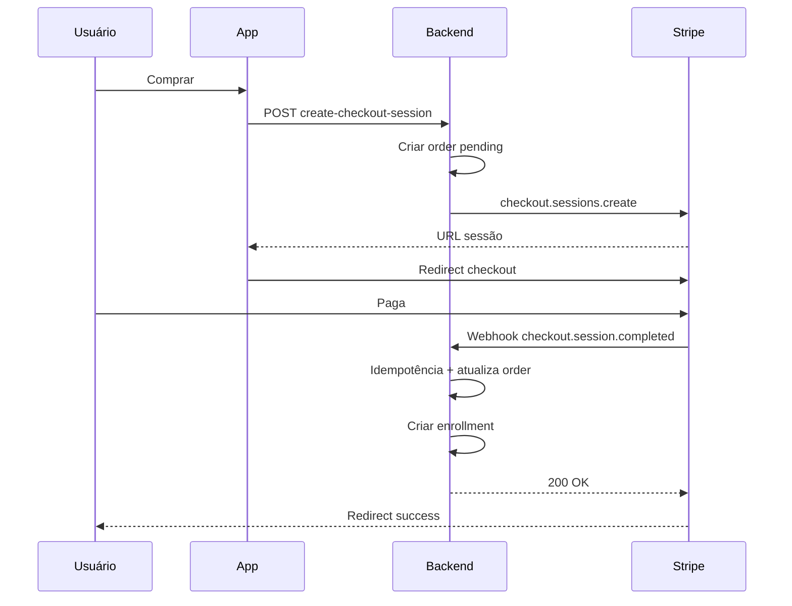
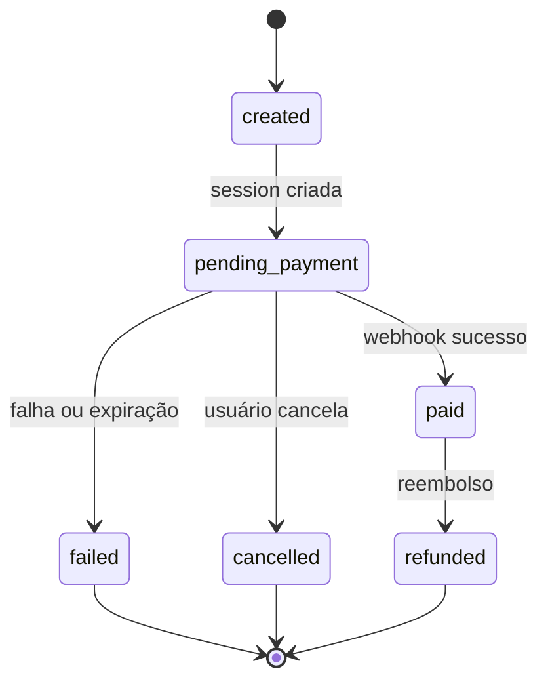
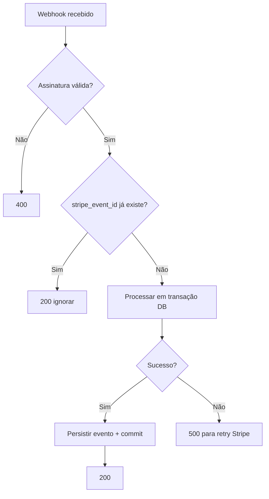

# Tópico 08 — Checkout com Stripe

**Origem:** Seção 8 da especificação técnica v1.  
**Índice:** [00-indice.md](00-indice.md)

---

## 8) Checkout com Stripe (simples e sólido)

### 8.1 Fluxo recomendado

Usar **Stripe Checkout** no MVP para reduzir complexidade e risco.

Fluxo:

1. Usuário clica em “Comprar”.
2. Backend cria `Checkout Session` no Stripe.
3. Frontend redireciona para Stripe hosted checkout.
4. Stripe processa pagamento.
5. Stripe envia webhook `checkout.session.completed`.
6. Backend valida evento, marca pedido como pago e libera acesso.
7. Usuário retorna para página de sucesso com confirmação.

### 8.2 Métodos de pagamento (Brasil)

- Cartão de crédito.
- Carteiras e métodos locais habilitados no Stripe conforme disponibilidade.
- Parcelamento (se habilitado na conta Stripe e estratégia comercial).

### 8.3 Requisitos técnicos obrigatórios

- Webhook idempotente (não processar pagamento duas vezes).
- Assinatura de webhook validada.
- Retry seguro para falhas temporárias.
- Tabela de eventos processados (`stripe_event_id` unique).
- Reconciliação diária automática (job simples).

### 8.4 Estados de pedido

- `created`
- `pending_payment`
- `paid`
- `failed`
- `refunded`
- `cancelled`

### 8.5 Reembolso

- Backoffice dispara reembolso via integração Stripe.
- Atualiza estado do pedido e status de acesso:
  - regra padrão: reembolso total remove acesso.
  - exceção: reembolso parcial mantém acesso com anotação.

---

## Features de checkout (detalhe)

| ID | Feature | Implementação | Aceite |
|----|---------|---------------|--------|
| CHK-01 | Criar sessão | `line_items` com `price` Stripe ou `price_data` | `client_reference_id` = `order_id` interno |
| CHK-02 | Metadata | `user_id`, `track_id`, `organization_id?` | Recuperável no webhook |
| CHK-03 | Success URL | `session_id` query | Página faz polling ou confia no e-mail |
| CHK-04 | Cancel URL | Retorna ao carrinho/trilha | Pedido fica `pending` ou `cancelled` |
| CHK-05 | Cupom Stripe ou interno | `allow_promotion_codes` OU cupom pré-aplicado | Validação duplicada no servidor |
| CHK-06 | Customer | `customer_email` ou Stripe Customer | Facilita reembolso e fatura |

---

## Diagrama — fluxo completo checkout + webhook

---

## Diagrama — máquina de estados do pedido

---

## Diagrama — idempotência do webhook

---

## Payloads Stripe relevantes (referência)

- `checkout.session.completed` — disparar liberação de acesso.
- `charge.refunded` / `payment_intent.payment_failed` — atualizar `order` e política de acesso.
- Modo **test** vs **live** — variáveis de ambiente separadas; webhook endpoints separados.

---

## Critérios de aceite financeiros

- Replay do mesmo `event.id` **não** cria segunda matrícula.
- Pedido `paid` sem `enrollment` dispara **alerta** e job de reconciliação.
- Reembolso total → `enrollment.status` = `suspended` ou removida conforme política.

---

## Notas de análise técnica

1. **Risco:** Falha ou atraso de webhook vs. retorno do usuário à página de sucesso — precisa de reconciliação (§8.3) e UX que não assuma só o redirect como fonte de verdade.
2. **Risco:** Brasil: parcelamento e métodos locais dependem da conta Stripe e de regras comerciais; mudança no Dashboard sem versionamento de produto pode quebrar expectativas de checkout.
3. **Dependência:** Segredo de assinatura de webhook, `stripe_events` com idempotência e mapeamento estável `Checkout Session` → `orders`/`payments`/`enrollments`.
4. **MVP:** Manter **somente** Stripe Checkout hospedado (já recomendado); adiar Payment Intents customizados e lógica de carrinho multi-SKU complexo.
5. **MVP:** Estados de pedido (§8.4) devem ser poucos e com transições documentadas; reembolso parcial como “exceção anotada” pode ser MVP com campo de nota + regra única de acesso para reduzir casos extremos.
