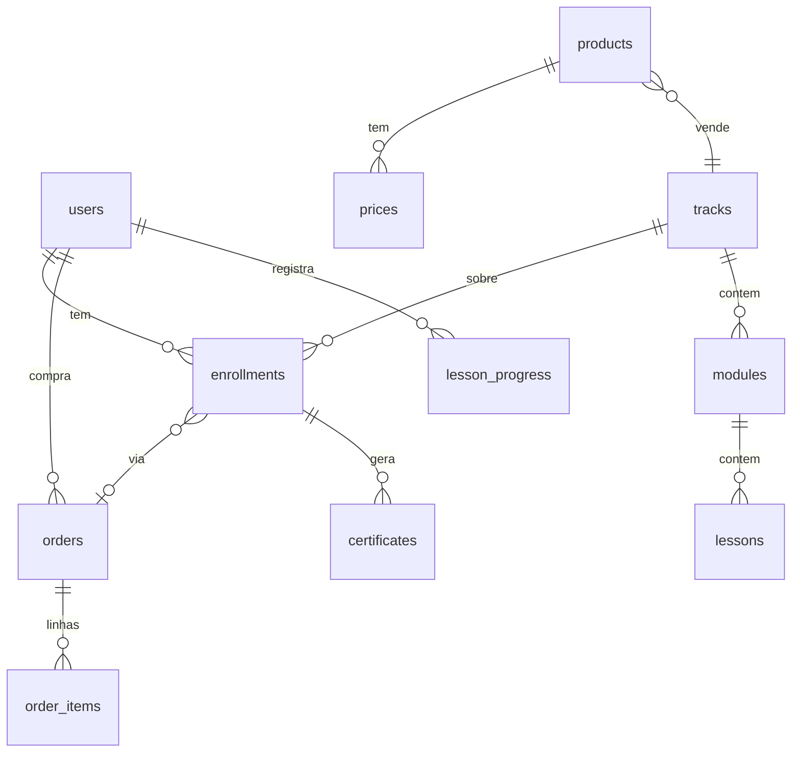
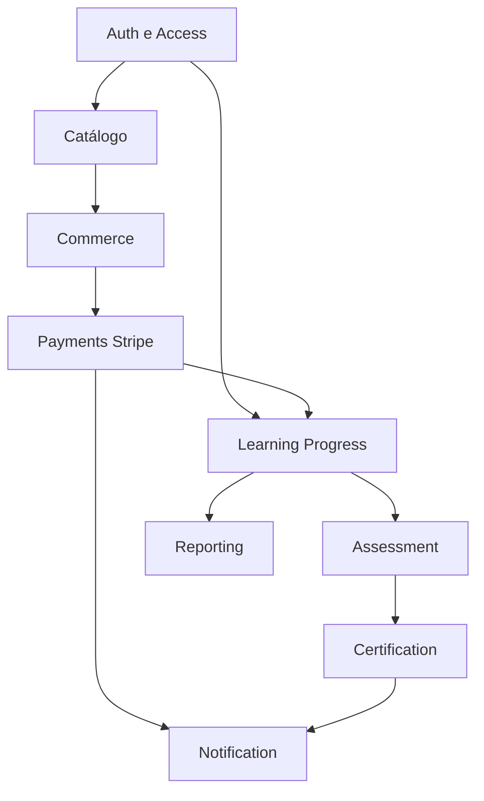

# Tópico 09 — Estruturas necessárias (arquitetura funcional)

**Origem:** Seção 9 da especificação técnica v1.  
**Índice:** [00-indice.md](00-indice.md)

---

## 9) Estruturas necessárias (arquitetura funcional)

### 9.1 Módulos de sistema

1. **Auth & Access**
2. **Catálogo Acadêmico**
3. **Learning Progress**
4. **Assessment**
5. **Certification**
6. **Commerce (orders/coupons)**
7. **Payments (Stripe)**
8. **Backoffice**
9. **Reporting**
10. **Notification**

### 9.2 Estruturas de dados mínimas (entidades)

- `users`
- `organizations`
- `organization_members`
- `roles`
- `tracks` (trilhas)
- `courses`
- `modules`
- `lessons`
- `enrollments`
- `lesson_progress`
- `quizzes`
- `quiz_attempts`
- `assignments`
- `assignment_submissions`
- `certificates`
- `products` (SKU comercial)
- `prices`
- `orders`
- `order_items`
- `payments`
- `coupons`
- `stripe_events`
- `support_tickets`
- `audit_logs`

### 9.3 Estrutura de frontend (áreas)

- **Pública:** home, catálogo, detalhe da trilha, checkout start, login/cadastro.
- **Aluno:** dashboard, curso, progresso, avaliações, certificados, perfil.
- **Cliente B2B:** equipe, assentos, relatórios, pedidos.
- **Backoffice:** conteúdo, usuários, pedidos, financeiro, suporte, relatórios.

---

## Relacionamento acadêmico × comercial (feature-chave)

| Conceito | Entidade | Vínculo obrigatório |
|----------|----------|---------------------|
| O que se estuda | `tracks` | — |
| O que se vende | `products` | `product.track_id` → uma trilha |
| Preço Stripe | `prices` | `price.stripe_price_id` + `product_id` |
| Direito de acesso | `enrollments` | `user_id` + `track_id` + origem `order_id` ou `seat_id` |

**Aceite:** não existe `enrollment` sem origem de compra válida (`order` pago ou assento B2B).

---

## Diagrama ER simplificado (núcleo MVP)

---

## Diagrama — módulos e dependências

---

## Campos mínimos sugeridos (implementação)

### `enrollments`

- `id`, `user_id`, `track_id`, `status`, `source` (`b2c_order` | `b2b_seat`), `source_id`, `created_at`

### `orders`

- `id`, `user_id`, `status`, `stripe_checkout_session_id`, `amount_cents`, `currency`, `coupon_id`, `utm_json`, `created_at`

### `stripe_events`

- `id`, `stripe_event_id` UNIQUE, `type`, `payload_json`, `processed_at`, `error`

---

## Frontend: opções de deploy

| Opção | Prós | Contras |
|-------|------|---------|
| Monorepo 1 app, rotas `/app`, `/admin` | Simples | Risco de vazar bundle admin |
| 2 apps: público+aluno / admin | Isolamento | 2 pipelines |
| Subdomínios | Cookies claros | CORS extra |

**Feature:** flag de build para não incluir rotas admin no bundle público (code splitting).

---

## Notas de análise técnica

1. **Risco:** Dez módulos e ~20+ entidades desde o início aumentam superfície de migração; sem fronteiras (bounded contexts), o mesmo conceito aparece duplicado (ex.: “produto” acadêmico vs. comercial).
2. **Risco:** `products`/`prices` vs. `tracks` precisam de um vínculo explícito (SKU) para B2B, B2C e cupons não divergirem.
3. **Dependência:** `Notification` e `Reporting` dependem de eventos de domínio confiáveis (pagamento, progresso, certificado); sem fila ou outbox, notificação e relatório ficam frágeis.
4. **MVP:** Fase 1 (§12): subset — Auth, Catálogo, Progress, Assessment/Cert básico, Commerce mínimo, Payments + webhook; postergar `support_tickets` rico, partes avançadas de `audit_logs` e reporting agregado.
5. **MVP:** Frontend em quatro áreas (§9.3) valida boundaries de deploy (subdomínio ou rota), mas pode compartilhar design system; não é obrigatório quatro apps no MVP.
