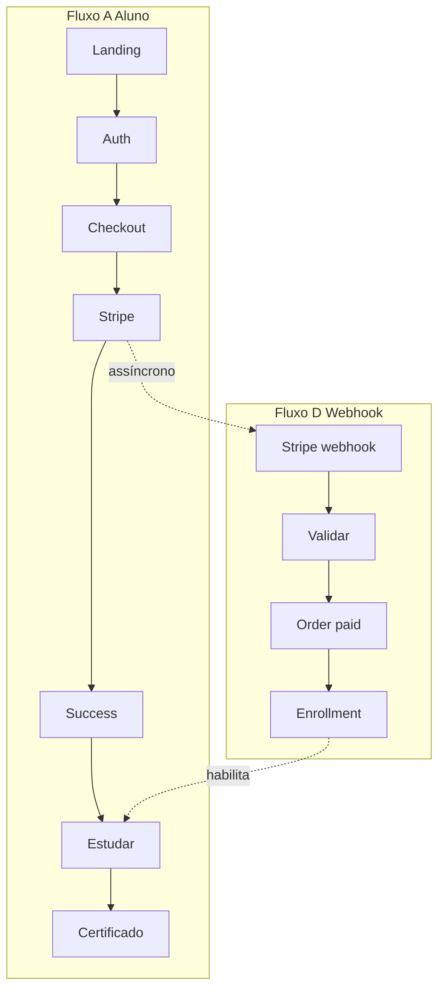
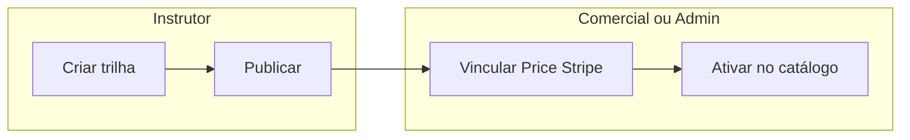
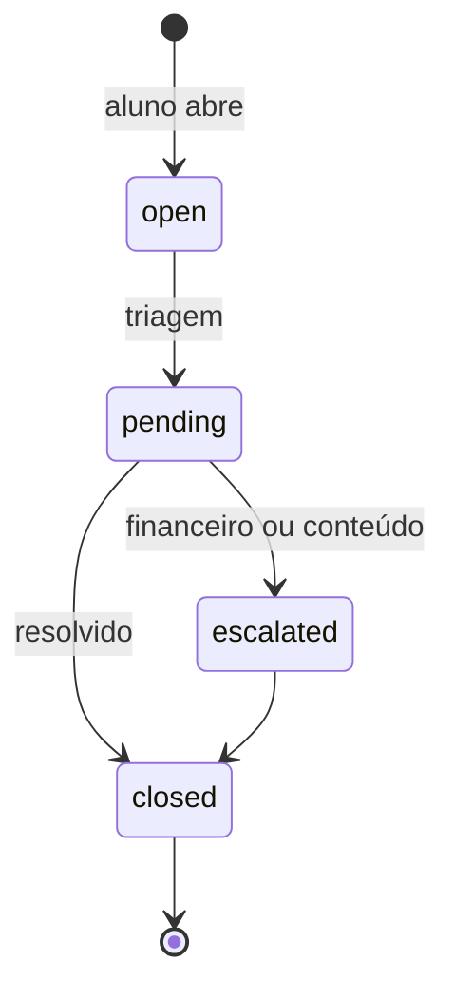

# Tópico 10 — Fluxos e passos possíveis na plataforma

**Origem:** Seção 10 da especificação técnica v1.  
**Índice:** [00-indice.md](00-indice.md)

---

## 10) Fluxos e passos possíveis na plataforma

### 10.1 Fluxo A — Aluno B2C (compra e estudo)

1. Visitante acessa landing.
2. Escolhe trilha e clica comprar.
3. Faz login/cadastro.
4. Vai para Stripe Checkout.
5. Pagamento aprovado.
6. Plataforma cria matrícula automática.
7. Aluno inicia módulo 1.
8. Realiza quiz/projeto.
9. Conclui trilha.
10. Recebe certificado.

### 10.2 Fluxo B — Cliente corporativo

1. Buyer acessa plano corporativo.
2. Compra pacote de assentos.
3. Recebe painel da empresa.
4. Convida colaboradores.
5. Colaboradores aceitam convite e iniciam estudos.
6. Buyer acompanha progresso e certificados.

### 10.3 Fluxo C — Operação backoffice (conteúdo)

1. Instrutor cria trilha e módulos.
2. Define critérios de aprovação.
3. Publica trilha.
4. Operação comercial habilita preço/SKU.
5. Curso fica disponível no catálogo.

### 10.4 Fluxo D — Operação backoffice (pagamento)

1. Stripe envia webhook.
2. Sistema valida assinatura e idempotência.
3. Atualiza pedido/pagamento.
4. Libera ou bloqueia acesso conforme regra.
5. Registra auditoria.

### 10.5 Fluxo E — Suporte

1. Aluno abre solicitação.
2. Backoffice classifica ticket.
3. Resolve ou escala para financeiro/conteúdo.
4. Fecha ticket com histórico.

---

## Mapa de fluxos × features envolvidas

| Fluxo | Entidades / serviços principais | Feature crítica |
|-------|----------------------------------|-----------------|
| A | `orders`, Stripe, `enrollments`, `lessons`, `quizzes`, `certificates` | Idempotência webhook |
| B | `organizations`, `seats`, convites, `enrollments` | Escopo tenant |
| C | `tracks`, `modules`, `products`, `prices` | Publicação + SKU |
| D | `stripe_events`, `orders`, `enrollments`, `audit_logs` | Transação atômica |
| E | `support_tickets`, e-mail | SLA opcional MVP |

---

## Diagrama — visão geral A + D (B2C)

---

## Diagrama — swimlane backoffice conteúdo + comercial (C)

---

## Diagrama — fluxo E suporte (MVP)

---

## Pontos de integração manual (documentar no runbook)

| Passo | Se manual | Risco |
|-------|-----------|-------|
| C.4 Habilitar preço | Planilha + Stripe Dashboard | Catálogo sem preço |
| Reembolso edge | Operação decide exceção | Acesso inconsistente |

**Feature futura:** tela única “Publicar e precificar” que cria/atualiza `price` no Stripe via API.

---

## Notas de análise técnica

1. **Risco:** Fluxos A–E escondem handoffs (ex.: “operação comercial habilita preço/SKU” no C) — se for manual, documentar SLA interno; se for sistema, vira feature extra não listada no detalhe.
2. **Risco:** Fluxo B assume compra corporativa já modelada no checkout; se o MVP for só B2C no Stripe (Fase 1), o B fica bloqueado ou precisa de fluxo alternativo (pedido manual no backoffice).
3. **Dependência:** Fluxo D (webhook) é eixo transversal — falhas impactam A, B e E; testes de contrato com payloads Stripe são obrigatórios.
4. **MVP:** Validar ponta a ponta primeiro **Fluxo A** + **D**; depois **C** mínimo; **B** alinhado à Fase 3 do roadmap; **E** com caminho curto (ticket → estado → fechamento).
5. **MVP:** Matrícula automática após pagamento (A.6) deve ser o mesmo mecanismo usado ao liberar assento B2B após pagamento corporativo, para não duplicar lógica de “liberar acesso”.
