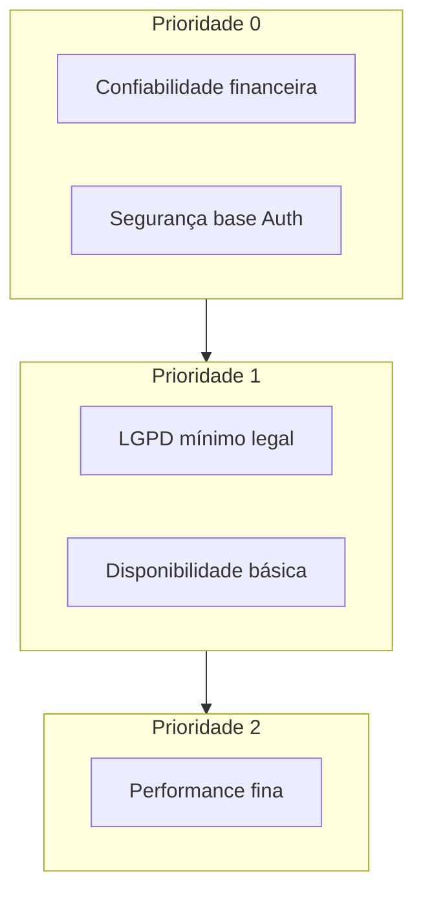

# Tópico 11 — Requisitos não funcionais (MVP)

**Origem:** Seção 11 da especificação técnica v1.  
**Índice:** [00-indice.md](00-indice.md)

---

## 11) Requisitos não funcionais (MVP)

- Performance: páginas principais < 2.5s em rede comum.
- Disponibilidade: alvo 99.5% mensal.
- Segurança:
  - senha com hash forte;
  - TLS obrigatório;
  - logs de auditoria para ações críticas;
  - princípio do menor privilégio.
- Privacidade/LGPD:
  - base legal e consentimento;
  - direito de exclusão;
  - política de retenção.
- Confiabilidade financeira:
  - webhooks idempotentes;
  - reconciliação de pagamentos.

---

## Features transversais de qualidade (derivadas dos NFRs)

| ID | Área | Feature de plataforma | Medição |
|----|------|------------------------|---------|
| NFR-P01 | Performance | SSR/cache catálogo; lazy player | LCP / TTFB no dashboard |
| NFR-P02 | Performance | Paginação API listas | Tempo resposta p95 |
| NFR-A01 | Disponibilidade | Healthcheck `/health` | Monitor externo 1 min |
| NFR-A02 | Disponibilidade | Fila dead-letter webhook | Alerta se fila > 0 |
| NFR-S01 | Segurança | Rate limit login | Bloqueio após N falhas |
| NFR-S02 | Segurança | Headers OWASP baseline | Scan CI |
| NFR-L01 | LGPD | Export dados usuário | JSON/PDF em T dias |
| NFR-L02 | LGPD | Exclusão conta | Anonimizar pedidos legais |
| NFR-F01 | Financeiro | Job reconciliação diária | Relatório divergências |

---

## Diagrama — pilares NFR e prioridade de build

---

## SLO sugeridos (exemplo operacional)

| Serviço | SLO | Janela |
|---------|-----|--------|
| API core | 99.5% < 500ms p95 | 30 dias |
| Webhook endpoint | 99.9% disponível | 30 dias |
| E-mail transacional | 95% entregue em 5 min | 7 dias |

---

## LGPD — checklist de features

- Tela ou fluxo de **consentimento** no cadastro (marketing opcional).
- Política de privacidade versionada (`privacy_version` no `user`).
- **DPO/contato** na política.
- Log de **acesso** a dados sensíveis no backoffice (quem abriu perfil aluno).

---

## Notas de análise técnica

1. **Risco:** Metas de performance (< 2,5 s) e disponibilidade (99,5%) dependem de hospedagem, CDN, cache e observabilidade; sem baseline de medição (“rede comum” indefinida), o MVP pode “cumprir no papel” e falhar na prática.
2. **Risco:** LGPD (base legal, exclusão, retenção) exige processos jurídicos/operacionais além do código; atraso nesses alinhamentos bloqueia go-live seguro.
3. **Dependência:** Segurança (hash de senha, TLS, auditoria, menor privilégio) é pré-requisito transversal — auth, backoffice e integrações precisam ser desenhados juntos, não como “camada final”.
4. **MVP:** Priorizar **confiabilidade financeira** (webhooks idempotentes + reconciliação) e **integridade de acesso** antes de otimizar latência em todas as telas.
5. **Dependência:** 99,5% mensal implica monitoramento, alertas e (idealmente) status page — custo e disciplina de operação desde o início.
