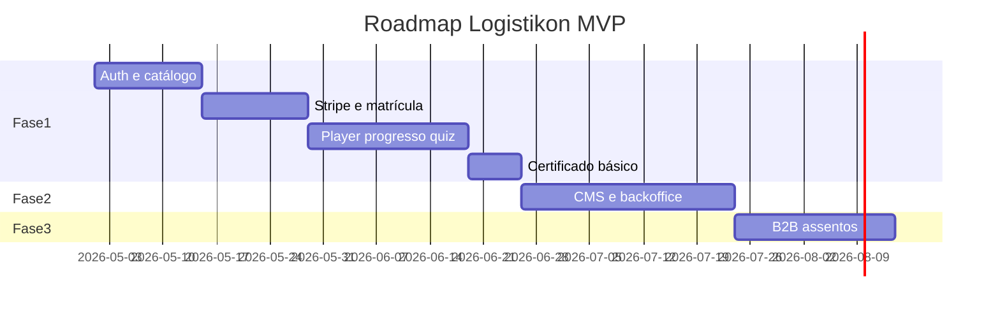
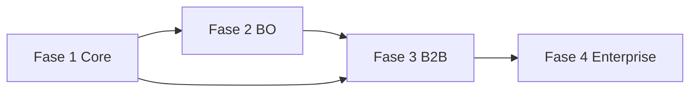

# Tópico 12 — Roadmap de implementação sugerido

**Origem:** Seção 12 da especificação técnica v1.  
**Índice:** [00-indice.md](00-indice.md)

---

## 12) Roadmap de implementação sugerido (simples e funcional)

### Fase 1 — Core Aluno + Checkout

- Auth, catálogo, matrícula, player, progresso.
- Stripe Checkout + webhook + pedido.
- Certificado básico.

### Fase 2 — Backoffice completo

- CMS acadêmico.
- Gestão de usuários/papéis.
- Financeiro operacional (reembolso, cupons, conciliação).
- Suporte e auditoria.

### Fase 3 — B2B simples

- Organização, assentos, convites, relatórios CSV.

### Fase 4 — Evoluções

- SSO corporativo.
- Certificado avançado (hash/badge).
- BI interno e automações de retenção.

---

## Entregáveis por fase (granularidade de features)

### Fase 1 — lista mínima

| Sprint / bloco | Features |
|----------------|----------|
| Auth | Registro, login, JWT, refresh, perfil |
| Catálogo | Lista + detalhe trilha pública |
| Commerce | `product`/`price`, criar order, checkout session |
| Payments | Webhook, idempotência, enrollment |
| Learn | Player, progresso %, quiz simples |
| Cert | PDF + código; regra: 100% aulas + quiz OK |

### Fase 2

| Bloco | Features |
|-------|----------|
| CMS | CRUD completo, publicar, quiz bank |
| Admin | Usuários, papéis, auditoria mínima |
| Fin | Lista pedidos, reembolso, cupom, conciliação |
| Sup | Tickets básicos |

### Fase 3

| Bloco | Features |
|-------|----------|
| Org | CRUD org, buyer role |
| Seats | Pool, convite, aceite, CSV |

### Fase 4

| Bloco | Features |
|-------|----------|
| Enterprise | SAML/OIDC, grupos |
| Cred | Open Badges, verificação reforçada |
| Growth | Automações e-mail, BI |

---

## Diagrama — roadmap em Gantt simplificado

*(Datas ilustrativas — ajustar no planejamento real.)*

---

## Diagrama — dependências entre fases

**Nota:** Fase 3 beneficia-se de `organization_id` já previsto no modelo na Fase 1.

---

## Critérios de “fase concluída”

- **Fase 1:** fluxo A + D (tópico 10) E2E em staging com cartão teste Stripe.
- **Fase 2:** instrutor publica trilha sem deploy de código.
- **Fase 3:** buyer convida 2 usuários teste e vê progresso no painel.

---

## Notas de análise técnica

1. **Risco:** A Fase 1 agrega auth, catálogo, matrícula, player, progresso, Stripe e certificado — escopo amplo; sem definição explícita do que é “certificado básico” e do que fica manual, o prazo estoura.
2. **Dependência:** A Fase 2 (“backoffice completo”) depende do modelo de conteúdo e permissões das seções anteriores; mudanças tardias no RBAC ou no fluxo de publicação geram retrabalho.
3. **MVP:** Avaliar um **backoffice mínimo** na Fase 1 (só o necessário para publicar e precificar) se o objetivo for validar receita B2C cedo; “CMS completo” pode ir incrementando.
4. **Risco / dependência:** B2B na Fase 3 pressupõe entidades e escopo multi-tenant já pensados na Fase 1 (mesmo que desligados na UI) — senão, convites/assentos exigem refatoração de dados.
5. **Dependência:** SSO e “certificado avançado” na Fase 4 são dependentes claros de clientes enterprise e de requisitos legais de verificação — não devem ser prometidos no MVP sem critérios de aceite.
