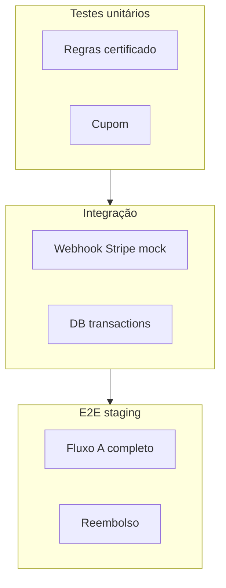
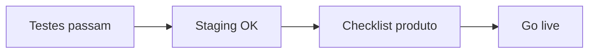

# Tópico 13 — Checklist de validação da solução

**Origem:** Seção 13 da especificação técnica v1.  
**Índice:** [00-indice.md](00-indice.md)

---

## 13) Checklist de validação da solução

- [ ] Aluno consegue comprar e iniciar em menos de 5 minutos.
- [ ] Pedido pago sempre gera matrícula (sem duplicidade).
- [ ] Backoffice consegue publicar trilha sem suporte técnico.
- [ ] Reembolso atualiza financeiro e acesso corretamente.
- [ ] Certificado só sai com critérios cumpridos.
- [ ] Cliente corporativo consegue acompanhar equipe.

---

## Expansão do checklist com casos de teste (features)

### CT-01 — Comprar e iniciar < 5 min

| Passo | Ação esperada |
|-------|----------------|
| 1 | Visitante abre trilha publicada |
| 2 | Cadastro em < 60s |
| 3 | Checkout Stripe test mode |
| 4 | Retorno success + matrícula visível |
| 5 | Primeira aula abre sem erro |

### CT-02 — Matrícula sem duplicidade

| Cenário | Resultado |
|---------|-----------|
| Webhook duplicado (replay) | Uma matrícula |
| Usuário clica comprar 2x rápido | Um `order` pendente ou bloqueio claro |
| Success page + webhook atrasado | Reconciliação cria matrícula em até X min |

### CT-03 — Publicar trilha sem dev

| Verificação | |
|-------------|--|
| Instrutor cria módulos e aulas | OK |
| Define quiz mínimo | OK |
| Botão publicar | Catálogo atualiza |
| Sem preço Stripe | Aviso “não disponível para venda” |

### CT-04 — Reembolso

| Tipo | Pedido | Enrollment | Certificado |
|------|--------|------------|-------------|
| Total | `refunded` | suspenso/removido | revogado se existir |
| Parcial | anotação | conforme política | — |

### CT-05 — Certificado

| Caso | Deve bloquear emissão |
|------|------------------------|
| Aula não concluída | Sim |
| Quiz abaixo da nota | Sim |
| Projeto pendente correção | Sim |

### CT-06 — B2B (quando Fase 3 ativa)

| Verificação | |
|-------------|--|
| Buyer vê só sua org | Sim |
| CSV exporta colaboradores | Sim |
| Colaborador não vê pedidos | Sim |

---

## Diagrama — matriz teste × ambiente

---

## Diagrama — gate de release

---

## Notas de análise técnica

1. **Risco:** Itens misturam jornada B2C, integridade de dados, backoffice, financeiro e **cliente corporativo**; o último só é verificável quando o escopo B2B estiver entregue — risco de “checklist verde” com MVP incompleto.
2. **Risco:** “Pedido pago sempre gera matrícula (sem duplicidade)” exige testes explícitos de concorrência e replay de webhook; é um ponto crítico de bugs em produção.
3. **Dependência:** “Publicar trilha sem suporte técnico” depende de UX do CMS, validações, previews e permissões — não só de existir CRUD.
4. **MVP:** Vale amarrar cada item a **testes automatizados ou E2E** e a um responsável (produto/ops), para não ficar subjetivo.
5. **Risco:** Reembolso + acesso exige matriz de estados e testes de borda (parcial, estorno tardio, usuário já certificado).
