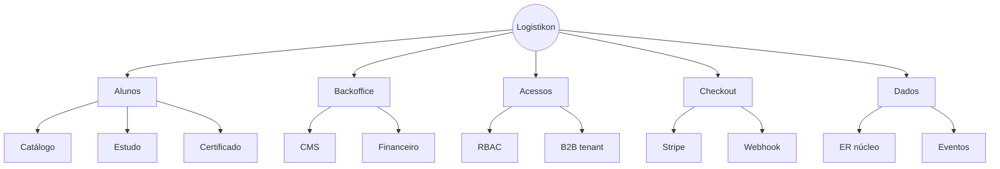
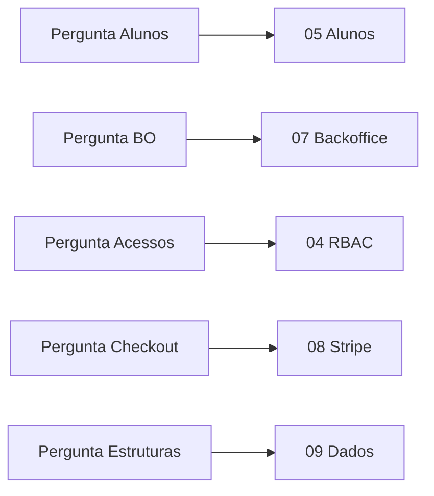

# Tópico 14 — Resposta direta às perguntas do discovery

**Origem:** Seção 14 da especificação técnica v1.  
**Índice:** [00-indice.md](00-indice.md)

---

## 14) Resposta direta às perguntas do discovery

### Quais são as funcionalidades para alunos?

- Catálogo, compra, área de estudo, progresso, avaliações, certificado e suporte.

### Quais são as funcionalidades para backoffice?

- Gestão acadêmica, gestão de usuários/papéis, financeiro/pedidos/reembolso, certificados, suporte e auditoria.

### Como fica acessos?

- RBAC com papéis: visitante, aluno, cliente corporativo, instrutor, financeiro/operação, admin; com escopo por organização no B2B.

### Como fica checkout?

- Stripe Checkout hospedado + webhook idempotente + liberação automática de acesso + reembolso no backoffice.

### Quais são as estruturas necessárias?

- Módulos: Auth, Catálogo, Learning, Assessment, Certification, Commerce, Payments, Backoffice, Reporting e Notification.
- Entidades principais: usuários, trilhas, matrículas, pedidos, pagamentos, certificados, logs e suporte.

---

## Decomposição em features (para backlog)

### Alunos (resposta expandida)

| Grupo | Features |
|-------|----------|
| Descoberta | Catálogo, detalhe trilha, pré-requisitos |
| Conta | Cadastro, verificação e-mail, perfil, idioma |
| Compra | Checkout Stripe, cupom, anti-duplicidade |
| Estudo | Dashboard, player, progresso, downloads |
| Avaliação | Quiz, tentativas, projeto (opcional) |
| Certificação | PDF, código, validação pública |
| Suporte | Ticket ou formulário |

### Backoffice (resposta expandida)

| Grupo | Features |
|-------|----------|
| Acadêmico | CRUD trilha→aula, quiz, rubrica, publicar |
| Pessoas | Busca usuário, papéis, bloqueio, reset senha |
| Financeiro | Pedidos, webhook log, reembolso, cupom |
| Certificados | Template, manual, revogação |
| Operação | Tickets, KPIs, exportações |
| Governança | Auditoria, config integrações |

### Acessos (resposta expandida)

- **Modelo:** `users` + `user_roles` + opcional `organization_members`.
- **Token:** claims `roles[]`, `org_id?`.
- **Policies:** por recurso (ex.: `order:refund` só financeiro+admin).

### Checkout (resposta expandida)

- **Sessão:** `Checkout Session` com metadata.
- **Pós-compra:** webhook → transação DB → `enrollment`.
- **Falhas:** página de status + e-mail + job reconciliação.

### Estruturas (resposta expandida)

- **MVP mínimo de entidades:** `users`, `tracks`, `modules`, `lessons`, `enrollments`, `lesson_progress`, `orders`, `payments`, `stripe_events`, `quizzes`, `quiz_attempts`, `certificates`, `products`, `prices`, `coupons`.
- **Fase 2+:** `organizations`, `support_tickets`, `audit_logs` completos.

---

## Diagrama — mapa discovery → implementação

---

## Diagrama — rastreabilidade pergunta → tópicos

---

## Notas de análise técnica

1. **Risco:** O resumo lista módulos grandes (Reporting, Notification); a tendência é subestimar esforço se forem tratados só como “infraestrutura de segundo plano”.
2. **Dependência:** RBAC com escopo por organização no B2B deve estar refletido no **modelo de dados e nas APIs desde cedo**; adicionar depois é caro.
3. **MVP:** A resposta sobre “estruturas” é abrangente; para o MVP, convém **enumerar o subconjunto de entidades** realmente necessário na Fase 1 (evitar implementar o grafo completo no dia zero).
4. **Risco:** A descrição do checkout não detalha falhas operacionais (atraso de webhook, abandono no 3DS, divergência com reconciliação) — risco de lacunas em runbooks e suporte.
5. **Dependência:** Coerência com LGPD/NFRs da seção 11: o Q&A não repete obrigações de privacidade — na implementação, manter **rastreabilidade** entre requisitos legais e funcionalidades.
