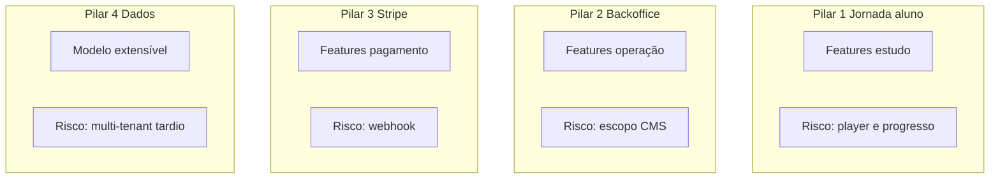
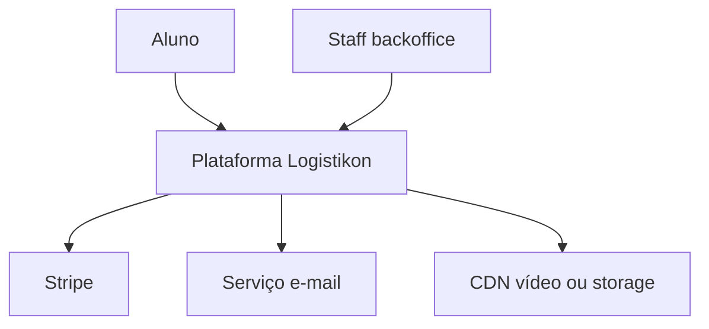

# Tópico 15 — Conclusão técnica

**Origem:** Seção 15 da especificação técnica v1.  
**Índice:** [00-indice.md](00-indice.md)

---

## 15) Conclusão técnica

A plataforma pode nascer **enxuta**, desde que cubra corretamente os 4 blocos críticos:

1. **Jornada completa do aluno** (descobrir → comprar → aprender → certificar).
2. **Backoffice operável** sem dependência constante de time técnico.
3. **Checkout Stripe confiável** com governança de pagamento.
4. **Estrutura de acesso e dados** preparada para expansão B2B.

Com esse desenho, a Logistikon Academy atende o objetivo de ser simples no lançamento e robusta para crescer com segurança.

---

## Síntese de features por bloco crítico

| Bloco | Features indispensáveis | Tópicos de referência |
|-------|-------------------------|------------------------|
| Jornada aluno | Catálogo, auth, checkout, player, quiz, certificado | 05, 08, 10-A |
| Backoffice | Publicar trilha, pedidos, reembolso, usuários | 07, 10-C/D |
| Stripe | Session, webhook idempotente, reconciliação | 08, 11-NFR-F |
| Dados / acesso | ER núcleo, RBAC, `org_id` futuro | 04, 09 |

---

## Diagrama — os 4 pilares e riscos associados

---

## Diagrama — visão alvo da plataforma (contexto)

---

## Decisões recomendadas antes do primeiro sprint

1. **Monólito modular** com módulos do tópico 09 vs. microserviços — default: monólito.
2. **Um ou dois frontends** — default: monorepo com split de rotas.
3. **Certificado MVP:** PDF estático + código UUID; badge Open Badges na Fase 4.
4. **B2B:** modelo de dados com `organization_id` nullable desde Fase 1.

---

## Próximos artefatos sugeridos

- PRD com **user stories** por ID de feature (ex.: LRN-02).
- OpenAPI draft dos endpoints de checkout, webhook e progresso.
- Runbook Stripe (test/live, rotação de secrets, replay).

---

## Notas de análise técnica

1. **Risco:** Os “4 blocos críticos” são ambiciosos para uma plataforma “enxuta”; sem um **corte explícito por fase**, o MVP vira mini-produto completo.
2. **Risco:** “Estrutura preparada para B2B” pode levar a **complexidade multi-tenant prematura**; preferir interfaces e dados extensíveis sem implementar todo o B2B antes da tração B2C.
3. **Dependência:** “Backoffice operável sem time técnico constante” compete com velocidade da jornada do aluno — definir o que é **operável no lançamento** versus pós-MVP.
4. **MVP:** O sucesso do desenho deve ser medido com os critérios do checklist (e SLOs da seção 11), não só com alinhamento arquitetural.
5. **Dependência:** Checkout Stripe como pilar exige **proprietário técnico**, monitoração de webhooks e procedimentos de reconciliação — parte da definição de “pronto para produção”.
