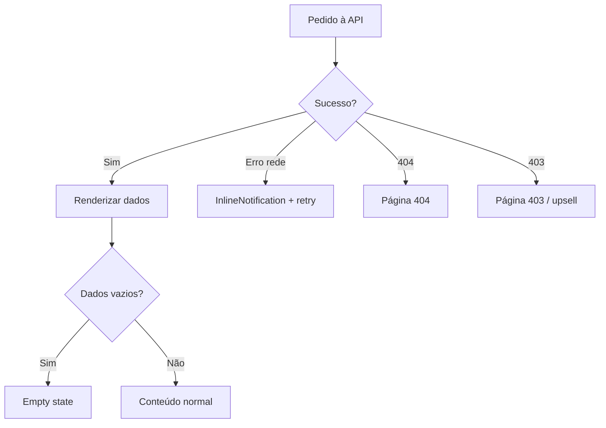

# Estados globais, feedback e copy

## 1. Estados de carregamento

| Padrão | Quando usar | UI |
|--------|-------------|-----|
| **Skeleton** | Primeira carga de lista ou detalhe de trilha | `SkeletonText` + placeholders de cartão |
| **Inline loading** | Submissão de formulário (login, registo, criar pedido) | `InlineLoading` no botão; desativar botão duplo clique |
| **Spinner de página** | Transição de rota lenta (raro) | `Loading` centrado |
| **Pós-checkout “processando”** | Webhook ainda não refletiu; API em `pending` | Mensagem + polling silencioso ou botão “Atualizar estado” |

**Regra:** sempre mostrar **área reservada** para evitar layout shift (CLS).

## 2. Estados vazios

| Contexto | Mensagem (PT) | CTA |
|----------|----------------|-----|
| Catálogo sem trilhas publicadas | “Ainda não há formações disponíveis. Volte em breve.” | — |
| Dashboard sem matrículas | “Ainda não está inscrito em nenhuma formação.” | `Explorar trilhas` → `/trilhas` |
| Outline sem aulas (erro de dados) | “Não foi possível carregar o conteúdo.” | `Tentar novamente` |

## 3. Estados de erro

### 3.1 Erros de formulário

- Associar ao campo (`invalid` + `invalidText` no Carbon).
- Erros genéricos (401, 500): `InlineNotification` **abaixo** do formulário ou no topo do `main`.

### 3.2 Erros de negócio

| Código / situação | Copy sugerida | Ação |
|-------------------|---------------|------|
| E-mail já registado | “Se já tem conta, inicie sessão.” | Link para login |
| Não matriculado (403) | “Não tem acesso a esta formação.” | Voltar ao catálogo ou comprar |
| Esgotou tentativas de quiz | “Esgotou o número de tentativas para este módulo.” | Contactar suporte (link mailto ou página) |
| Pagamento falhou | “O pagamento não foi concluído.” | `Tentar novamente` → novo checkout |

### 3.3 Anti-enumeração (registo)

Não revelar se e-mail existe em mensagens agressivas; alinhar ao backend; mensagem neutra possível: “Se existir conta, enviámos instruções.” (se aplicável ao fluxo).

## 4. Notificações (toast vs inline)

| Tipo | Uso |
|------|-----|
| **InlineNotification** | Erros que afetam a página inteira; sucesso após ação na mesma vista |
| **Toast** | Confirmações rápidas não bloqueantes (ex.: “Código copiado”) |

**Limitação:** não empilhar mais de 2 toasts; tempo ~5s; fechável.

## 5. Tom de voz

- **Profissional, claro, direto** (público B2C e B2B futuro).
- Evitar jargão interno (“webhook”, “endpoint”) na UI.
- **Datas:** formato local (pt-PT ou pt-BR conforme decisão de produto).
- **Valores monetários:** moeda explícita (EUR / BRL conforme Stripe).

## 6. Acessibilidade nos estados

- Erros: **anunciar** via `aria-live="polite"` (Carbon já faz em vários componentes; verificar versão).
- Loading: não usar `aria-busy` na página inteira sem necessidade; para SPA, focar no título da página ao concluir carga.

## 7. Diagrama — decisão de estado na página

