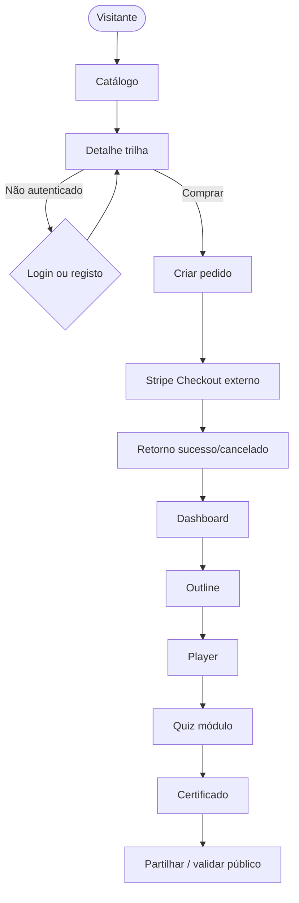

# Fluxos compostos e sequências (MVP)

Documento de **encadeamento** entre telas e **casos limite** que o frontend deve tratar no happy path alargado.

## 1. Diagrama — jornada completa (Mermaid)



## 2. Sequência compra (detalhe → pedido → Stripe)

| Ordem | Ação UI | Chamada API |
|-------|---------|-------------|
| 1 | Utilizador clica “Comprar” | — |
| 2 | Se não autenticado → login/registo com `returnUrl` | — |
| 3 | `POST` pedido | `pending_payment` |
| 4 | `POST` checkout session | `{ url }` |
| 5 | `window.location = url` | Redirect Stripe |
| 6 | Após pagamento | Redirect `/checkout/sucesso?session_id=` |
| 7 | Página consulta estado | até `paid` + enrollment |

**Erros antes do Stripe:** mostrar `InlineNotification`; não abrir Stripe com pedido inválido.

## 3. Casos limite obrigatórios (UI)

| Caso | Comportamento esperado |
|------|------------------------|
| **Já matriculado** | Detalhe: CTA “Ir para formação”; bloquear novo pedido (DEV-017) |
| **Webhook atrasado** | Sucesso: estado `pending` + polling ou refresh |
| **Cancelou no Stripe** | Rota cancelado + CTA voltar à trilha |
| **Sessão expirada** no meio da compra | Após login, `returnUrl` para detalhe ou checkout |
| **403 no outline** | Página 403 ou redirecionamento com mensagem |
| **Quiz sem pré-requisitos** | Navegação desativada ou 403 da API → mensagem |

## 4. Diagrama ASCII — decisão “Comprar”

```
                    [Comprar clicado]
                           |
              +------------+------------+
              |                         |
        Autenticado?              Não -> Login/Registo
              |                         |
              +------------+----------+
                           |
                    Elegível? (API)
                           |
              +------------+------------+
              | Não                     | Sim
        [Já inscrito / msg]       Criar pedido
                                         |
                                   Checkout URL
```

## 5. Alinhamento com documentos

| Tema | Ficheiro |
|------|----------|
| Rotas | `05-mapas-de-rotas-e-deep-links.md` |
| Copy de erro | `04-estados-feedback-e-copy.md` |
| Happy path referência | `../UX/happy-paths-mvp-e-criterios-acessibilidade.md` |
