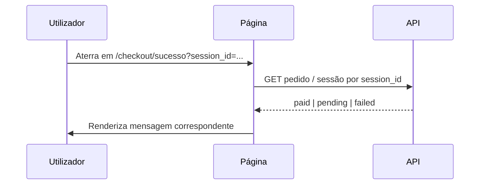

# Tela — Retorno pós-Stripe Checkout

## Identificação

| Campo | Valor |
|-------|--------|
| **ID de tela** | `SCR-PAY-001` (sucesso) · `SCR-PAY-002` (cancelado) |
| **Rotas** | `/checkout/sucesso` · `/checkout/cancelado` |
| **Shell** | Mínimo ou público |
| **Auth** | Necessária para interpretar pedido |
| **Happy path** | Passos 8–11 (sessão Stripe + retorno UX) |
| **User stories** | US-E03-001 · US-E03-008 · DEV-012 |

## Objetivo

Após redirecionamento do **Stripe**, apresentar estado **alinhado à API** (não só ao URL) — pagamento confirmado, pendente ou cancelado.

## Parâmetros Stripe típicos

| Query | Uso |
|-------|-----|
| `session_id` | Correlacionar com `Checkout Session` no backend |

## Fluxo de UI recomendado



## Tela A — Sucesso (`/checkout/sucesso`)

### Layout

```text
+----------------------------------------------------------+
| [Logo]                                                    |
| h1: Pagamento recebido                                    |
| Texto: A sua matrícula está a ser ativada.               |
|                                                           |
| [ Estado: loading ]  ->  [ paid ]                        |
|                                                           |
| Quando paid:                                              |
|   "Já pode começar a estudar."                           |
|   [ Ir para a formação - primary ]  -> /learn/...        |
|                                                           |
| Quando pending (webhook atrasado):                        |
|   InlineNotification: "A confirmar pagamento..."         |
|   [ Atualizar estado ] (refetch)                         |
+----------------------------------------------------------+
```

### Componentes

- `InlineNotification` (info / success)
- `Button` primary
- `Loading` ou skeleton inline

### Estados

| Estado API | Mensagem |
|------------|----------|
| `paid` + enrollment ativo | Sucesso pleno |
| `pending_payment` | Aguardar; polling a cada 3–5s com timeout máximo |
| `failed` | Erro com link para suporte ou tentar novamente |

## Tela B — Cancelado (`/checkout/cancelado`)

### Layout

```text
+----------------------------------------------------------+
| h1: Pagamento cancelado                                   |
| Não foi cobrado qualquer valor.                          |
| [ Voltar à formação ]  -> /trilhas/:slug                 |
| [ Ver as minhas formações ] -> /learn                    |
+----------------------------------------------------------+
```

### Tom

Neutro, sem culpa; não usar linguagem alarmista.

## US-E03-008 — Requisito crítico

A UI **deve** consultar a API para o estado real do pedido; o utilizador pode **forçar** URL de sucesso sem pagamento — backend já valida; frontend não deve assumir sucesso só pela rota.

## Acessibilidade

- Anunciar mudança de estado quando polling passa a `paid` (`aria-live`).
- Foco no `h1` ao entrar na página.

## Stripe (externo)

- Não há UI Logistikon dentro do Stripe; apenas marca e cores do Stripe Checkout configurados no dashboard Stripe.
