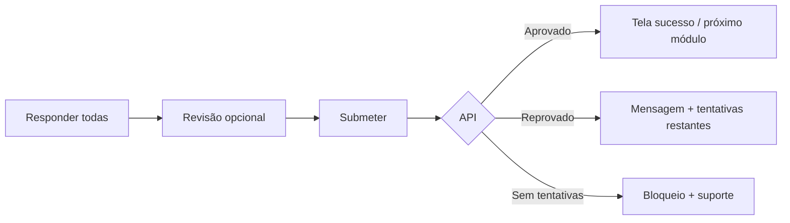

# Tela — Quiz do módulo

## Identificação

| Campo | Valor |
|-------|--------|
| **ID de tela** | `SCR-QUIZ-001` |
| **Rota** | `/learn/trilhas/:trailId/modulos/:moduleId/quiz` |
| **Shell** | Área autenticada |
| **Auth** | Obrigatória + matrícula |
| **Happy path** | Passos 15–16 |
| **User stories** | US-E05-001 · US-E05-002 · DEV-022 · DEV-023 |

## Objetivo

Responder a **questões embaralhadas**; respeitar **tentativas máximas** e **nota mínima**; **não** expor gabarito no cliente.

## Princípios de UI

1. **Uma pergunta por ecrã** (recomendado mobile) ou lista curta com scroll controlado.
2. **Barra de progresso** do quiz: “Pergunta 3 de 10”.
3. **Contador de tentativas** visível: “Tentativa 2 de 3”.
4. **Tempo** (se existir limite): mostrar **texto** + opcional `ProgressBar` linear.

## Layout (exemplo uma pergunta)

```text
+------------------------------------------------------------------+
| [ X Sair ] (abre Modal de confirmação)                           |
| Tentativa 2 de 3    |    Pergunta 4 de 12                       |
+------------------------------------------------------------------+
| h2 (pergunta): Texto da pergunta (único h2 por ecrã)            |
|                                                                  |
| o Opção A                                                        |
| o Opção B                                                        |
| o Opção C                                                        |
| o Opção D                                                        |
|                                                                  |
| [ Anterior ] (disabled na 1ª)    [ Seguinte / Submeter ]        |
+------------------------------------------------------------------+
```

## Componentes Carbon

| Peça | Componente |
|------|------------|
| Escolha única | `RadioButtonGroup` |
| Múltipla escolha (se suportado) | `Checkbox` |
| Navegação | `Button` |
| Confirmação saída | `Modal` danger ou warning |
| Resultado | Ver secção abaixo |

## Fluxo de submissão



## Tela de resultado — aprovado

- `InlineNotification` success
- “Continuar formação” → outline ou próximo módulo

## Tela de resultado — reprovado (ainda há tentativas)

- Mostrar **nota** se política permitir (alinhar produto)
- **Não** listar respostas corretas
- CTA “Tentar novamente”

## Tela de resultado — tentativas esgotadas

- Mensagem fixa conforme `04-estados-feedback-e-copy.md`
- Link suporte

## Estados especiais

| Estado | UI |
|--------|-----|
| Quiz já aprovado | Informação + botão voltar (não permitir refazer se negócio disser) |
| Carregamento | Skeleton da pergunta |

## Acessibilidade

- `fieldset` + `legend` para grupo de opções.
- Anúncio de resultado com `aria-live="polite"`.
- Modal de sair: foco preso até confirmar.

## Segurança

- Embaralhamento e ordem vêm da API; nunca incluir campo `correctAnswer` no JSON enviado ao cliente.
