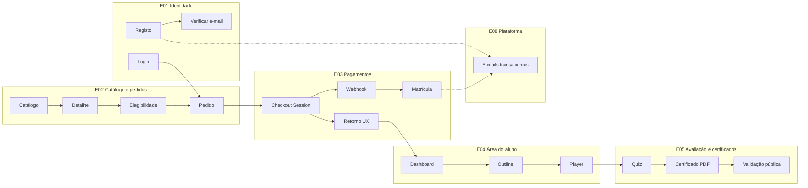
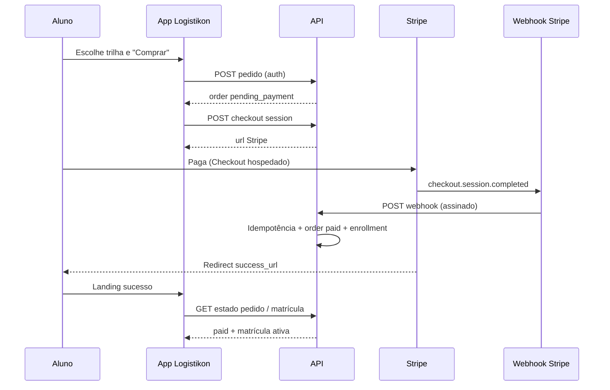
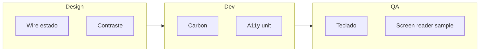

# Happy paths do MVP e critérios de acessibilidade

**Objetivo:** documentar os **fluxos felizes** (happy paths) da aplicação no **âmbito do MVP B2C** descrito em `plan/specs/SPEC-00-visao-geral-mvp.md`, com **rastreabilidade** às user stories **E01–E05** (e transversal **E08** onde o fluxo depende de e-mail). Inclui **critérios de acessibilidade** acionáveis (alinhamento ao ponto 3 dos “Próximos passos” do inventário UX).

**Nota sobre o ponto 1 (catálogo pedagógico):** a matriz trilha × nível × idioma **continua em avaliação com stakeholders**; este documento assume **trilhas já publicadas** com produto/preço Stripe configurado, sem fixar quais módulos entram no primeiro catálogo.

**Fontes canónicas:** `plan/user-stories/`, `plan/features/registro-de-features.md`, `plan/architecture/stack-e-padroes.md`, `apresentacao/07-jornadas-ponta-a-ponta.md`.

---

## 1. O que é “MVP” neste documento


| Incluído no núcleo happy path                                                        | Motivo                |
| ------------------------------------------------------------------------------------ | --------------------- |
| Identidade: registo, login, verificação de e-mail quando for pré-requisito de compra | P0 — E01              |
| Catálogo público, detalhe, elegibilidade, pedido, checkout Stripe, matrícula         | P0 — E02, E03         |
| Área do aluno: dashboard, outline, player, progresso                                 | P0 — E04              |
| Quiz, tentativas/nota mínima, certificado PDF, verificação pública                   | P0 — E05              |
| E-mails transacionais nos marcos críticos                                            | P0 — E08 (US-E08-001) |


| Fora do núcleo (ramos ou fases)                    | IDs / prioridade              |
| -------------------------------------------------- | ----------------------------- |
| Download de materiais (URL assinada)               | US-E04-004 · DEV-020 · **P1** |
| “Continuar de onde parei”                          | US-E04-005 · **P1**           |
| Política de conclusão de aula manual vs automática | US-E05-007 · DEV-021 · **P1** |
| Lista/descarga de certificados na área do aluno    | US-E05-006 · DEV-027 · **P1** |
| Projeto com upload                                 | US-E05-003 · DEV-024 · **P2** |
| Backoffice (CMS, utilizadores, etc.)               | E06 — **fase 2** no roadmap   |
| B2B                                                | E07 — **fase 3**              |


---

## 2. Actores e superfícies


| Actor                        | Descrição                                                           |
| ---------------------------- | ------------------------------------------------------------------- |
| **Visitante**                | Explora catálogo sem sessão; pode validar certificado publicamente. |
| **Utilizador autenticado**   | Sessão com JWT; claims com papéis (US-E01-002).                     |
| **Aluno**                    | Utilizador com matrícula ativa numa trilha.                         |
| **Empregador / verificador** | Sem conta; só fluxo público de validação de código (US-E05-005).    |
| **Sistema**                  | Webhooks Stripe, jobs de e-mail, motor de certificado.              |


**Superfícies lógicas (UI):** site público (catálogo + detalhe + auth), Stripe Checkout (hospedado), área do aluno (pós-login), página pública de verificação de certificado.

---

## 3. Mapa mental ASCII — fluxo B2C (visão única)

```
                    ┌─────────────────┐
                    │   Visitante     │
                    └────────┬────────┘
                             │
              ┌──────────────┼──────────────┐
              ▼              ▼              ▼
       ┌──────────┐  ┌──────────┐  ┌──────────────┐
       │ Catálogo │  │ Registo  │  │ Login        │
       │ (lista)  │  │ (conta)  │  │ (sessão)     │
       └────┬─────┘  └────┬─────┘  └──────┬───────┘
            │             │               │
            │             └───────┬───────┘
            │                     ▼
            │              ┌──────────────┐
            │              │ Verificar    │
            │              │ e-mail (se   │
            │              │ exigido)     │
            │              └──────┬───────┘
            │                     │
            ├────────────────────►├──────────────────┐
            ▼                     ▼                  ▼
     ┌────────────┐        ┌───────────┐     ┌─────────────┐
     │ Detalhe    │        │ Elegibil. │     │ Criar pedido│
     │ trilha     │───────►│ compra    │────►│ pending     │
     └────────────┘        └───────────┘     └──────┬──────┘
                                                    │
                                                    ▼
                                              ┌─────────────┐
                                              │ Stripe      │
                                              │ Checkout    │
                                              └──────┬──────┘
                                                     │
                        ┌────────────────────────────┼────────────────────────────┐
                        ▼                            ▼                            ▼
                 ┌────────────┐              ┌──────────────┐                ┌──────────┐
                 │ Webhook    │              │ Retorno UX   │                │ E-mail   │
                 │ matrícula  │              │ sucesso/     │                │ (E08)    │
                 │ ativa      │              │ cancelamento │                │          │
                 └─────┬──────┘              └──────┬───────┘                └──────────┘
                       │                            │
                       └────────────┬───────────────┘
                                    ▼
                             ┌─────────────┐
                             │ Dashboard   │
                             │ aluno       │
                             └──────┬──────┘
                                    ▼
                             ┌─────────────┐
                             │ Outline →   │
                             │ Player      │
                             └──────┬──────┘
                                    ▼
                             ┌─────────────┐
                             │ Quiz módulo │
                             └──────┬──────┘
                                    ▼
                             ┌─────────────┐
                             │ Certificado │
                             │ + código    │
                             └──────┬──────┘
                                    ▼
                             ┌─────────────┐
                             │ Validação   │
                             │ pública     │
                             └─────────────┘
```

---

## 4. Diagrama Mermaid — dependências entre épicos (MVP)




---

## 5. Happy path principal — B2C do primeiro acesso ao certificado

**Narrativa:** um visitante descobre uma trilha, cria conta, confirma e-mail se a política exigir, compra via Stripe, recebe matrícula, estuda, faz quizzes, obtém certificado e (opcionalmente) um terceiro valida o código.

### 5.1 Passos numerados (com referências)


| #   | Passo                                                        | Actor                   | Resultado esperado                                                                               | User stories / DEV                          |
| --- | ------------------------------------------------------------ | ----------------------- | ------------------------------------------------------------------------------------------------ | ------------------------------------------- |
| 1   | Abre o **catálogo** de trilhas publicadas                    | Visitante               | Lista paginada; sem rascunhos                                                                    | US-E02-001 · DEV-008                        |
| 2   | Abre **detalhe** da trilha (slug)                            | Visitante / interessado | Syllabus, carga horária, nível, preço ativo; CTA coerente                                        | US-E02-002 · DEV-009                        |
| 3   | **Regista-se** (e-mail + palavra-passe)                      | Visitante               | Conta criada; mensagem para verificar e-mail (se aplicável); anti-enumeração em e-mail duplicado | US-E01-001 · DEV-001                        |
| 4   | **Verifica e-mail** (token)                                  | Utilizador novo         | `email_verified_at` preenchido; token inválido → erro e reenvio                                  | US-E01-004 · DEV-004                        |
| 5   | **Inicia sessão**                                            | Utilizador              | JWT com claims de roles                                                                          | US-E01-002 · DEV-002                        |
| 6   | Consulta **elegibilidade** de compra                         | Autenticado             | Se já matriculado: `can_enroll=false` + motivo; caso contrário pode comprar                      | US-E02-003 · DEV-009                        |
| 7   | **Cria pedido** `pending_payment`                            | Aluno autenticado       | `order` + `order_items` persistidos                                                              | US-E02-005 · DEV-011                        |
| 8   | **Solicita sessão** Stripe Checkout                          | Aluno                   | `URL` de redirecionamento para Stripe; sem auth → 401                                            | US-E03-001 · DEV-012                        |
| 9   | Completa pagamento no **Stripe** (UI externa)                | Aluno                   | Stripe confirma pagamento                                                                        | Stripe                                      |
| 10  | **Webhook** processa `checkout.session.completed`            | Sistema                 | Pedido `paid`; **matrícula** `active`; idempotência por `event.id`                               | US-E03-002 · US-E03-003 · DEV-013 · DEV-014 |
| 11  | **Redireciona** para success/cancel                          | Aluno                   | UI alinhada ao estado real consultado na API (não só ao URL)                                     | US-E03-008 · DEV-012                        |
| 12  | Vê **dashboard** com matrículas e progresso %                | Aluno                   | Cards por trilha                                                                                 | US-E04-001 · DEV-018                        |
| 13  | Abre **outline** (módulos/aulas)                             | Aluno                   | Outline completo; sem matrícula → 403                                                            | US-E04-002 · DEV-019                        |
| 14  | Usa **player**; progresso gravado no servidor                | Aluno                   | Ao concluir vídeo (ou critério definido), progresso persistido                                   | US-E04-003 · DEV-019                        |
| 15  | **Inicia quiz** do módulo                                    | Aluno                   | Questões embaralhadas; sem gabarito exposto no cliente                                           | US-E05-001 · DEV-022                        |
| 16  | Respeita **tentativas** e **nota mínima**                    | Aluno                   | Ao esgotar tentativas ou ficar abaixo do mínimo, módulo não aprovado                             | US-E05-002 · DEV-023                        |
| 17  | Ao cumprir **regras da trilha**, motor **emite certificado** | Sistema / Aluno         | PDF + código único; se requisitos pendentes, não emite                                           | US-E05-004 · DEV-025                        |
| 18  | **Partilha** ou **valida** código em página pública          | Verificador             | Estado válido sem PII extra; revogado explícito                                                  | US-E05-005 · DEV-026                        |


**Critérios transversais:**

- **RBAC:** aluno não acede a rotas admin (US-E01-006 · DEV-006).
- **Estados do pedido:** transições coerentes (`paid`, `failed`, etc.) (US-E03-004 · DEV-015).
- **E-mails (E08):** marcos como pagamento e matrícula disparam e-mail; falha do provedor não reverte transação; retries/outbox (US-E08-001 · DEV-047).

### 5.2 Fluxo resumido (para testes de aceite)

**Dado** uma trilha publicada com preço Stripe ativo **e** utilizador sem matrícula nessa trilha, **quando** completa registo (e verificação de e-mail se obrigatória), login, pedido, pagamento e webhook com sucesso, **então** o aluno vê a trilha no dashboard, acede ao outline/player, consegue concluir aulas e quizzes, e recebe certificado com código verificável publicamente.

---

## 6. Diagrama de sequência — compra e matrícula




---

## 7. Sub-fluxos detalhados

### 7.1 Visitante — descoberta e decisão

1. **Entrada:** SEO, campanha, LinkedIn (referência de negócio em `apresentacao/07` — não fixa URL).
2. **Catálogo** (US-E02-001): só entradas `published`; paginação para escalabilidade percebida.
3. **Detalhe** (US-E02-002): se não houver preço ativo, **CTA de compra indisponível** com mensagem clara (evita frustração no passo seguinte).

**Estados de interface sugeridos:**


| Estado     | Comportamento                            |
| ---------- | ---------------------------------------- |
| Carregando | Lista/esqueleto (evitar layout jump)     |
| Vazio      | “Nenhuma trilha publicada” (operacional) |
| Erro       | Mensagem genérica + retry                |


---

### 7.2 Conta e sessão


| Fluxo           | Passos felizes                                                   | Referência |
| --------------- | ---------------------------------------------------------------- | ---------- |
| **Registo**     | Formulário válido → conta criada → indicar verificação de e-mail | US-E01-001 |
| **Verificação** | Link com token → `email_verified_at`                             | US-E01-004 |
| **Login**       | Credenciais corretas → tokens + roles                            | US-E01-002 |


**Decisão de produto (documentar no backlog se ainda não estiver em SPEC):** se **compra** exige e-mail verificado, o passo 4 é **obrigatório** antes do pedido; caso contrário, o happy path pode ir de registo a pedido sem verificação, mas ações sensíveis devem alinhar ao SPEC-01.

---

### 7.3 Elegibilidade e anti-duplicado

- **Elegibilidade** (US-E02-003): se já matriculado, o detalhe ou o endpoint de elegibilidade devolve `can_enroll=false` com motivo — UI deve mostrar **“Já inscrito”** ou equivalente, não repetir checkout.
- **Bloqueio de compra duplicada** (DEV-017, P0 no registo): reforço no backend; UI alinha mensagem ao motivo.

---

### 7.4 Pedido e checkout

1. **Pedido** `pending_payment` (US-E02-005).
2. **Checkout Session** (US-E03-001): requer autenticação; devolve URL.
3. **Retorno** (US-E03-008): páginas de sucesso/cancelamento **consultam API** para estado real (evita mismatch se o webhook atrasar segundos).

**ASCII — estados do pedido (visão aluno):**

```
  [pending_payment] ----pagamento OK----> [paid]
         |                    |
         |                    +----> enrollment active
         |
         +---- abandono / falha ----> [failed ou equivalente]
```

*(Detalhe de `failed` vs `cancelled` conforme SPEC-03 e US-E03-004.)*

---

### 7.5 Aprendizagem (outline + player)

1. **Dashboard** (US-E04-001): visão de matrículas e percentagem — ponto de entrada após compra.
2. **Outline** (US-E04-002): navegação módulos → aulas; **403** sem matrícula.
3. **Player** (US-E04-003): progresso **no servidor** ao concluir (anti-fraude básico); política manual/automática é **P1** (US-E05-007).

**Ramo P1 — “Continuar”** (US-E04-005): se existir progresso, mostrar **“Continuar aula X”** no dashboard ou na trilha.

---

### 7.6 Avaliação e certificação

1. **Quiz** (US-E05-001): embaralhamento; respostas processadas sem exposição de gabarito no cliente.
2. **Tentativas e nota** (US-E05-002): bloqueio ao esgotar tentativas; reprovação se abaixo do mínimo.
3. **Certificado** (US-E05-004): motor corre quando regras satisfeitas; PDF + código único.
4. **Validação pública** (US-E05-005): página sem login; **sem PII extra**; estado **revogado** explícito.

**Ramo P2 — projeto** (US-E05-003): fora do happy path núcleo; incluir apenas se a trilha MVP tiver projeto configurado.

---

### 7.7 Verificador externo (sem conta)

**Happy path:** recebe código → abre URL pública → vê **válido** ou **revogado** / inválido.

---

### 7.8 E-mails transacionais (E08)

**Eventos típicos (não exaustivo — alinhar ao template map):** registo/verificação, confirmação de pagamento, matrícula ativa, certificado disponível.

**Regra de negócio (US-E08-001):** falha de e-mail **não** reverte pagamento; processamento assíncrono/outbox e retries.

---

## 8. Matriz de telas lógicas × épicos (para implementação Carbon)


| Área        | Telas / vistas lógicas                           | Componentes Carbon (orientação)                                |
| ----------- | ------------------------------------------------ | -------------------------------------------------------------- |
| Público     | Lista trilhas, detalhe trilha                    | Grid, Card, Tag, Button, Modal                                 |
| Auth        | Registo, login, verificação e-mail               | Form, Text input, Inline notification                          |
| Checkout    | Redirecionamento externo; retorno success/cancel | Inline notification, Structured list (estado)                  |
| Aluno       | Dashboard, outline, player                       | Tile, Progress bar, Accordion, Tabs, Video (wrapper acessível) |
| Avaliação   | Quiz                                             | Modal ou página dedicada, Radio / Checkbox                     |
| Certificado | Download PDF, mostrar código                     | Link, Code snippet                                             |
| Público     | Validação código                                 | Form, Inline notification                                      |


*Lista não substitui decisão de design; segue `plan/architecture/stack-e-padroes.md` (Angular + Carbon).*

---

# Parte II — Critérios de acessibilidade (ponto 3)

## 9. Decisão proposta

**Alvo:** **WCAG 2.2 nível AA** nos **fluxos críticos** do MVP, com foco em **perceptível**, **operável** e **compreensível**. **AAA** apenas onde for de baixo custo (ex.: contraste de texto específico).

**Justificativa:** produto educativo e pagamentos envolvem **obrigações legais** (LGPD referenciada no plano) e **confiança** no checkout; Carbon já incorpora padrões, mas **não dispensa** testes de fluxo.

**O que mudaria a decisão:** exigência legal explícita de AAA; ou canal exclusivamente mobile com regras específicas.

---

## 10. Fluxos críticos para auditoria


| ID  | Fluxo                                                     | Porquê crítico                          |
| --- | --------------------------------------------------------- | --------------------------------------- |
| F-A | Registo, login, recuperação de palavra-passe (se existir) | Barreira de entrada; erros afetam todos |
| F-B | Catálogo e detalhe trilha                                 | Decisão de compra; leitura longa        |
| F-C | Checkout Stripe (retorno e mensagens)                     | Dinheiro e ansiedade do utilizador      |
| F-D | Dashboard e outline                                       | Navegação da aprendizagem               |
| F-E | Player de vídeo                                           | Tempo, teclado, legendas                |
| F-F | Quiz                                                      | Tempo, foco, erros                      |
| F-G | Certificado e validação pública                           | Credibilidade e partilha                |


---

## 11. Mapa WCAG 2.2 AA → práticas por fluxo

Legenda: **✓** aplicar sempre; **(c)** condicional ao componente.


| Critério (resumo)                           | WCAG          | F-A | F-B | F-C | F-D | F-E | F-F | F-G |
| ------------------------------------------- | ------------- | --- | --- | --- | --- | --- | --- | --- |
| Texto alternativo em imagens significativas | 1.1.1         | ✓   | ✓   | ✓   | ✓   | ✓   | ✓   | ✓   |
| Contraste mínimo texto/interface            | 1.4.3         | ✓   | ✓   | ✓   | ✓   | ✓   | ✓   | ✓   |
| Redimensionar até 200% sem perda            | 1.4.4         | ✓   | ✓   | ✓   | ✓   | ✓   | ✓   | ✓   |
| Foco visível                                | 2.4.7         | ✓   | ✓   | ✓   | ✓   | (c) | ✓   | ✓   |
| Ordem de foco lógica                        | 2.4.3         | ✓   | ✓   | ✓   | ✓   | ✓   | ✓   | ✓   |
| Etiquetas em formulários                    | 3.3.2         | ✓   | —   | —   | —   | —   | ✓   | ✓   |
| Erros identificados e sugestões             | 3.3.1 / 3.3.3 | ✓   | —   | ✓   | —   | —   | ✓   | ✓   |
| Navegação por teclado                       | 2.1.1         | ✓   | ✓   | ✓   | ✓   | ✓   | ✓   | ✓   |
| Sem armadilha de teclado                    | 2.1.2         | —   | —   | —   | —   | ✓   | —   | —   |
| Nome, função, valor (componentes)           | 4.1.2         | ✓   | ✓   | ✓   | ✓   | ✓   | ✓   | ✓   |
| **Alvo mínimo (touch)**                     | **2.5.5**     | ✓   | ✓   | ✓   | ✓   | ✓   | ✓   | ✓   |
| **Ajuda consistente**                       | **3.2.6**     | —   | —   | —   | ✓   | ✓   | ✓   | —   |


**Nota:** vídeo (F-E) deve alinhar **1.2.x** (legendas/captions quando existir faixa de áudio; alternativa para vídeo só imagem; se aplicável).

---

## 12. Checklist testável por rota (amostra)


| Rota lógica       | Teste rápido                                                                             |
| ----------------- | ---------------------------------------------------------------------------------------- |
| Login             | Tabular por todos os controlos; Enter submete; erro legível por leitor de ecrã           |
| Detalhe trilha    | Hierarquia de cabeçalhos (h1 → h2); preço e CTA com nome acessível                       |
| Pós-checkout      | Estado comunicado em texto, não só cor; foco no resumo                                   |
| Outline           | Lista expansível acessível (teclado e `aria-expanded`)                                   |
| Player            | Play/pausa com teclado; sem armadilha de foco no fullscreen                              |
| Quiz              | Tempo restante (se houver) com alternativa textual; revisão de respostas com foco gerido |
| Validação pública | Resultado anunciado; código legível em `code` ou `pre`                                   |


---

## 13. Responsabilidades (equipa)


| Área                         | Entregável                                                                                          |
| ---------------------------- | --------------------------------------------------------------------------------------------------- |
| **Design / UX**              | Inventário de estados (vazio, erro, carregamento); foco visível em modais                           |
| **Front (Angular + Carbon)** | Usar componentes Carbon; evitar `div` clicável sem `role`/`tabindex`; testes com axe ou equivalente |
| **Conteúdo**                 | Textos de erro sem jargão só visual; vídeos com legendas quando disponíveis                         |
| **QA**                       | Smoke acessível em cada release nos fluxos F-A–F-G                                                  |


---

## 14. Diagrama — inclusão no fluxo de desenvolvimento




---

## 15. Referências e rastreabilidade


| Tema                    | Documento                                   |
| ----------------------- | ------------------------------------------- |
| User stories E01–E08    | `plan/user-stories/README.md`               |
| Features DEV            | `plan/features/registro-de-features.md`     |
| Stack e Carbon          | `plan/architecture/stack-e-padroes.md`      |
| Jornadas e riscos de UX | `apresentacao/07-jornadas-ponta-a-ponta.md` |
| MVP e fases             | `plan/specs/SPEC-00-visao-geral-mvp.md`     |


---

*Documento de UX/UI. Ajustar quando SPEC-01 ou SPEC-03 fixarem políticas de verificação de e-mail ou estados de pedido com mais detalhe.*